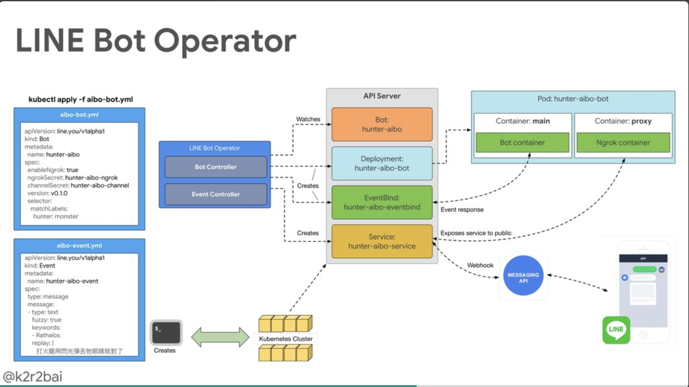

# 前提

三月第一場社群活動邀請到 [CNTUG (Cloud Native Taiwan User Group) 社群](https://cntug.kktix.cc)到 LINE 來舉辦。也請到遠從東京的維運開發團隊 Verda Team 來台灣分享，除了讓更多人能夠了解這樣的架構之外，也希望能夠引發一些討論甚至可以互相交流。

## How We build Kubernetes service by Rancher in LINE **/ LINE 東京 Verda Team, 李飛翔**

#### **[投影片](https://speakerdeck.com/line_developers/how-we-build-kubernetes-service-by-rancher-in-line)**

來自東京 Verda Team 的李飛翔也跟大家分享 LINE 是如何透過 Rancher 來打造 LINE 自己的 KaaS (Kubernetes As A Service) 。本文一開始先介紹了 [Rancher](https://rancher.com/) 的一些功能與 [Rancher](https://rancher.com/)[ 2.0](https://rancher.com/docs/rancher/v2.x/en/) 的目前狀況，也會介紹我們如何使用 Rancher 來打造 KaaS 。

###  LINE 如何透過 Rancher 打造 KaaS

- API Server:
  - 首先左方可以看到，有一個 API Server 負責收發使用者的指令。 除了作為 Proxy 之外，也可以限制使用者使用有限的 Rancher 功能之外也可以整合一次對於多個 Rancher 的操作。
- Kubernetes Provider:
  - 透過 Kubernetes Provider 是一個 Kubernetes 集群來管理多個使用者的集群（ User Kubernetes Cluster)
- User Kubrernetes Cluster:
  - 每一個服務或是產品會使用一個或是多個 User Kubernetes Cluster 。裡面都是透過 OpenStack 來建立 VM ，並且透過 Rancher 來部署。

如果今天一個開發者需要一個新的集群來部署一個新的服務。他透過 API Server  下指令部署新集群，這時候會透過 Kubernetes Provider 來運行 Rancher 來開啟新的 VM 並且來部署 Kubernetes 設定到該集群。

### 如此的輕鬆容易嗎？ 透過一個問題來講解整個 Kubernetes 的架構與容易出錯的地方

架構雖然清楚又明瞭，但是事實上要運行卻沒有那麼的容易。這邊講者也分享藉由 "Websocket 無法正常建立“的錯誤，來分享如何追蹤這個問題來解決真正的問題。

如同上圖提到 Kubernetes Provider 是透過 WebSocket 與 Kubernertes User Cluster 溝通。有一天忽然發現了 WebSocket 忽然斷線的狀態，回過頭來看 Kubernetes DNS 的設定， Container 網路的架構甚至也解釋了flannel 網路架構。透過這些架構的解析，聽眾會了解在實體機 (Baremetal) 上面架設 Kubernetes 其實遇到的網路問題其實更多更複雜，因為牽扯跨實體機器與跨網路節點。

找到問題之後，試著做出一個 patch 來修正問題。確定成功之後也將這個問題回饋到 Rancher 的 OSS 來貢獻 LINE 研究的結果。

類似的問題就是 Verda team 的人每天所遭遇的問題，不斷睇偵測與測試問題的原因，透過不同層面的觀點來了解與解讀問題。如果最後發現問題可能是出在 Kubernetes 源碼部分， LINE 也不吝嗇貢獻出發現的問題與修正的方式。

## **An operator deploys/manages/configures LINE bot atop Kubernetes / 白凱仁 (Cloud Native Taiwan User Group)**

#### **[投影片](https://speakerdeck.com/kairen/configures-line-bot-atop-kubernetes)**

接下來由 CNTUG 的共同主辦人[白凱仁](<https://github.com/kairen>)所帶來的很有趣的主題，透過 Kuberbetes 來部署一個 LINE chatbot Operator。

原因是打魔物獵人需要查詢許多魔物的弱點跟容易攻略的弱點，但是要用電腦找太慢了，於是就想說寫一個 LINE chatbot 。但是考量到魔物其實會不斷的修改跟增加，如果好不容易把魔物"火龍“的弱點加入之後，隔天又想查詢"角龍"，那這樣不就得要不斷的修改跟更新你的代碼。 

加上最近 Kubernetes Operator 其實是一個熱門的話題，但是一直沒有一個有趣的應用，於是講者就透過 Kubernetes Operator 將 LINE chatbot 部署起來。

(架構圖節錄來自[投影片](https://speakerdeck.com/kairen/configures-line-bot-atop-kubernetes)，獲得作者同意）

透過上圖可以了解 LINE Bot Operator 分成 Bot Controller 跟 Event Controller 兩個部分。Event Controller 透過 EventBinding 的方式可以將不同的 event 一一加入卻又不需要撰寫太多額外的代碼。 以下分享一個講者所提到的例子:

透過部署以上的 EventController 只要使用者在對話匡裡面打入"火龍" 或是 "Rathalos" 就顯示出以下那些文字，而要增加一個魔物也很簡單只要再增加另外一個相似的 YAML 設定然後將這個 EventController 部署上去即可。既可以讓會眾了解 Kubernetes Operator 的強大，也可以讓 LINE Chatbot 的開發上有了另外一種新的思路。

## 總結

很開心邀請到 CNTUG 社群來到 LINE 台灣辦公室舉辦 meetup ，也很榮幸邀請到 LINE 東京 Verda team 的成員來分享 LINE 私有雲打造的方式。並且透過分析問題的方來帶大家走過這個流程，並且能夠分享透過閱讀 Racher 源碼的方式來解決埋在深處的問題，並且貢獻回去。 Kubernetes As A Server (KaaS) 是一個具有龐大願景的系統，這樣的流程需要更多的新血，我們也需要各位 Kubernetes 與網路高手的加入。如果你也想要更深入了解並且參與開發這樣的系統，可以考慮投你我們 Verda team 的相關職缺。