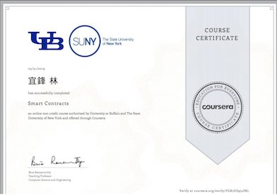

# [Blockchain Specialization](https://www.coursera.org/specializations/blockchain) 系列上課心得

- [Blockchain Basics](http://www.evanlin.com/moocs-bitcoin-basis/)

- [Smart Contract ](http://www.evanlin.com/moocs-smart-contract/)

- Decentralized Applications (Dapps)

## Smart Contract 課程鏈結:  [這裡](https://www.coursera.org/learn/smarter-contracts/home/welcome)

# 文章鏈結:

- [Smart Contract (一）: Week 1 ~ week2](http://www.evanlin.com/moocs-smart-contract/)
- [Smart Contract (二）:Week3  ~ week4](http://www.evanlin.com/moocs-smart-contract2/) 
- [Smart Contract (三) : 期末作業](http://www.evanlin.com/moocs-smart-contract3/)

# 前言：

拖了兩個禮拜，總算把題目看完跟寫完了。今天很開心的將作業繳交上去的時候，卻發生錯誤。只好花了一兩個小時把整段程式碼整個看過，還是找不太到，最後到了論壇看了討論才把問題解決掉。 

這個問題其實也讓我點出來，目前 Smart Contract 由於使用的 Solidity 的版本不同，其實功能的支援上也會有許多的差異。

不知道真正在 Smart Contract 的開發上是否會因為 Solidity 的版本變化造程碎片化 ?  請有實務經驗的朋友再好好分享。 

這篇文章將 Smart Contract 作業裡面稍微整理一下幾個需要注意的地方跟可能會踩到的雷。

# 測驗內容:

透過 Smart Contract 來撰寫一個小型的拍賣決標，它具有以下的一些特性:

- 固定只有四個競標者
- 競標的商品只有三個 (0, 1, 2)
- 每個競標者有五個 token 來競標他的商品

透過這些規矩底下，要完成這樣的 Smart Contract 需要了解以下的部分：

- 要初始化所有的競標商品
- 需要初始化所有的競標者資料
- 完成最後結標的規則與算法
- 透過 [Modifier](https://coursetro.com/posts/code/101/Solidity-Modifier-Tutorial---Control-Functions-with-Modifiers) 來做一些檢查。

### 小訣竅：

- `Require()` 跟 `Revert()` 會使用到要了解他的[差異與使用方法](https://medium.com/taipei-ethereum-meetup/%E6%AF%94%E8%BC%83-require-assert-%E5%92%8C-revert-%E5%8F%8A%E5%85%B6%E9%81%8B%E4%BD%9C%E6%96%B9%E5%BC%8F-30c24d534ce4)。
- 一開始寫題沒有想到使用 `revert()`造成最後計算的測試一直無法順利完成。

# 總結:

雖然課程作業繳交花了一點時間，但是整體還是相當推薦這台課程。 下一次的課程也來到了 [Decentralized Applications (Dapps)](https://www.coursera.org/learn/decentralized-apps-on-blockchain/home/welcome) 的內容，希望會更有趣。

# Reference:

- [https://www.coursera.org/learn/smarter-contracts/home/welcome](https://www.coursera.org/learn/smarter-contracts/home/welcome?fbclid=IwAR2flGrZ9Pq4yYEr0c9G9UctobIS2qw0hh4pdqZ3aVxngMYH_A5FjtmeQjw)

- [6 test cases passed.3 test cases failed.](https://www.coursera.org/learn/smarter-contracts/discussions/weeks/4/threads/AjiN5JZUEeir3xJNYGdMZA)

- [Technical Introduction to Events and Logs in Ethereum](https://media.consensys.net/technical-introduction-to-events-and-logs-in-ethereum-a074d65dd61e)

- https://solidity.readthedocs.io/en/v0.5.2/solidity-by-example.html?highlight=require

- [Coursera: Decentralized Applications (Dapps)](<https://www.coursera.org/learn/decentralized-apps-on-blockchain/home/welcome>)

- [比較 require(), assert() 和 revert()，及其運作方式。](https://medium.com/taipei-ethereum-meetup/%E6%AF%94%E8%BC%83-require-assert-%E5%92%8C-revert-%E5%8F%8A%E5%85%B6%E9%81%8B%E4%BD%9C%E6%96%B9%E5%BC%8F-30c24d534ce4)
