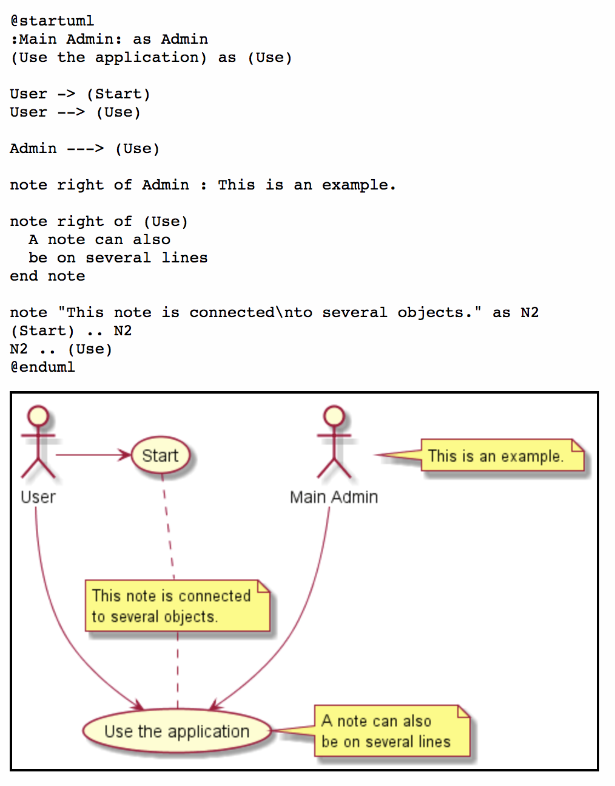
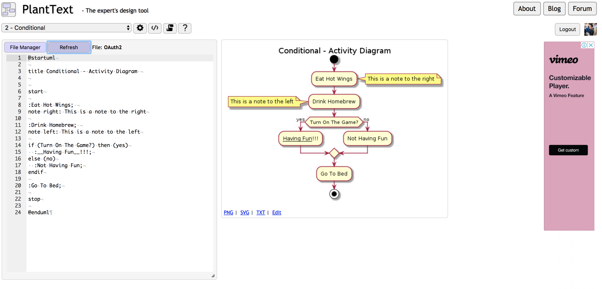

# 前提

寫作技術文章的時候，經常需要各種 UML (Unified Modeling Language)  所繪製出來的圖形。雖然學生時代都會學過這個，但是工作之後其實不容易透過良好的工具來繪製。 

通常在 MacOSX 繪製經常使用 [OmniGraffle](https://www.omnigroup.com/omnigraffle/)（其實我有買）或是 [Lucidchart](https://www.lucidchart.com/) ，但是要安裝這些軟體可能沒有那麼方便，或是拉來拉去本身也是很讓人困擾（美工苦手）。

使用文字敘述來繪圖的工具一直是我最愛 ( LaTex  愛好者)，所以進了公司之後聽說過了 PlantUML 就一直很喜愛。 但是這兩天好奇因素之下研究了一下跟 vscode 整合，並且把可能遇到的問題分析給大家。


# 什麼是 PlantUML

可以快速看一下[什麼是 PlantUML 介紹](<http://blog.javachen.com/2016/02/29/plantuml-install-and-usage.html>) ，或是去 [PlantUML 官方網站](http://plantuml.com/zh/index)了解。

PlantUML 透過簡單的語法可以繪製出 UML ，對於要做系統設計架構圖或是要做系統說明的人其實很方便。

比如說一個  use-case diagram 如下:




而且 PlantUML 支援相當多種 UML Diagram 

- [时序图](http://plantuml.com/zh/sequence-diagram)
- [用例图](http://plantuml.com/zh/use-case-diagram)
- [类图](http://plantuml.com/zh/class-diagram)
- [活动图](http://plantuml.com/zh/activity-diagram-beta) 
- [组件图](http://plantuml.com/zh/component-diagram)
- [状态图](http://plantuml.com/zh/state-diagram)
- [对象图](http://plantuml.com/zh/object-diagram)
- [部署图](http://plantuml.com/zh/deployment-diagram) 
- [定时图](http://plantuml.com/zh/timing-diagram) 

相當的方便。


# 如何在 VSCODE 上面安裝

VSCode 的 PlantUML 具有相當多的特點：

- Preview Diagram
- Export Diagrams
- Format PlantUML code (我很需要)
- All type syntax highlight.
- Auto Include.
- MarkDown integrating support. [View Demo](https://marketplace.visualstudio.com/items?itemName=jebbs.plantuml#markdown-integrating) (有點威)


## 安裝 PlantUML plugin

[套件節點](https://marketplace.visualstudio.com/items?itemName=jebbs.plantuml)


想要試著跑但是會跑出錯誤。

`No Java runtime present, requesting install.`

請看以下方式解決。


## 問題除錯: 1. 解決在 OSX 10.11 之後無法順利更新 Java 的錯誤

- 一開始試著在 vscode 裡面跑 java 相關指令會跑出

```
No Java runtime present, requesting install.
```

- 就算你試著更新 MacOSX 的 Java (參考[這篇官方文件](https://www.java.com/zh_TW/download/help/mac_java_update.xml)) 還是會跑出錯誤，那麼就要[安裝"下載 - Java for OS X 2017-001"這個套件](https://support.apple.com/kb/DL1572?locale=zh_TW)。
- 完整錯誤請查看[這個說明](https://java.com/en/download/faq/yosemite_java.xml)。

## 更新 PlantUML.jar

如果 vscode 套件裡面的版本太舊，可以考慮去[下載](https://sourceforge.net/projects/plantuml/)。


## 問題除錯: 2. 只能繪製出 sequence diagram ，像要畫其他圖卻會失敗？ (更新 2020/02/23)

本來想要繪製範例：

```
@startuml

User -> (Start)
User --> (Use the application) : A small label

:Main Admin: ---> (Use the application) : This is\nyet another\nlabel

@enduml
```


卻失敗，可能是因為 `graphviz` 沒有安裝，可以透過

```
@startuml
testdot
@enduml
```

來測試並且檢查相關問題。

### 解決方式：

安裝 `graphviz` ，可以透過輸入以下的指令來達成。

```
brew install graphviz
```


#  懶得安裝？ 也是有線上版可以用

#### <https://www.planttext.com/>

提供了線上的版本，雖然沒有一些相關功能可以使用，但是臨時要用還是可以使用。




# 總結:

PlantUML 真的是很方便的東西，除了可以透過文字的方式來成為圖片。更可以透過 github 方式來讓你的流程圖可以做版本控管。並且透過 Graphviz 繪製出來的圖形也是相當的精美，作為溝通實在相當的方便。建議大家要討論事情的時候，應該都要使用這個工具才是。


# Reference

- [PlantUML 官方網站](http://plantuml.com/zh/index)
- [用筆記也可以管理專案(一)：PlantUML](https://jonny-huang.github.io/projects/01_plantuml/)
- [PlantUML安装和使用](<http://blog.javachen.com/2016/02/29/plantuml-install-and-usage.html>)