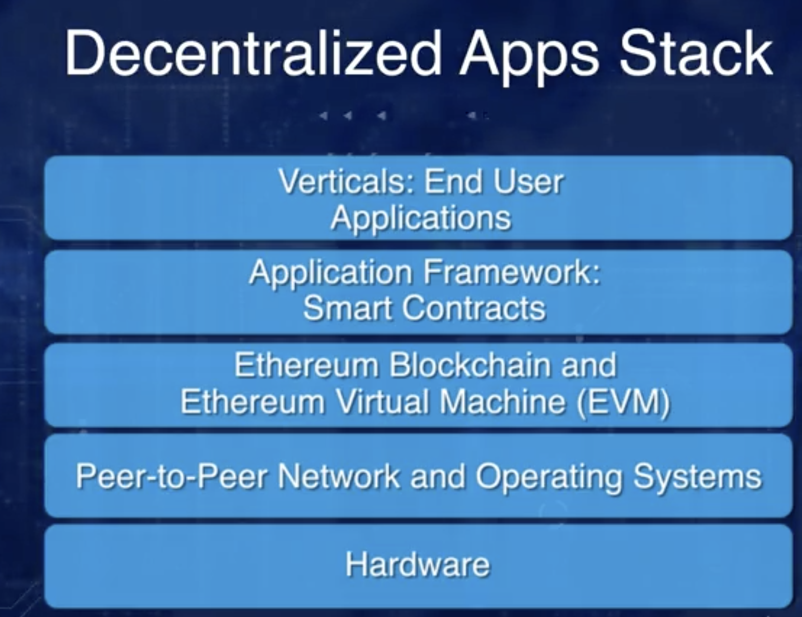
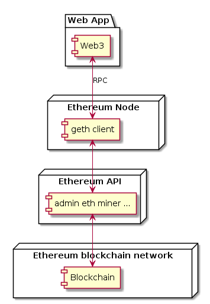

# [Blockchain Specialization](https://www.coursera.org/specializations/blockchain) 系列上課心得

- [Blockchain Basics](http://www.evanlin.com/moocs-bitcoin-basis/)

- [Smart Contract ](http://www.evanlin.com/moocs-smart-contract/)

- [Decentralized Applications (Dapps)](https://www.coursera.org/learn/decentralized-apps-on-blockchain)

- Blockchain Platforms

#### Decentralized Applications (Dapps): 課程鏈結:  [這裡](https://www.coursera.org/learn/decentralized-apps-on-blockchain/home/welcome)


# 文章鏈結:

- [Decentralized Applications (Dapps) (一）: Week 1](http://www.evanlin.com/moocs-smart-contract/)
- [Decentralized Applications (Dapps) (二): Week 2](http://www.evanlin.com/moocs-smart-contract2/)
- Decentralized Applications (Dapps) (三): Week 3
- Decentralized Applications (Dapps) (四): Week 4


# 前言：

剛忙完本年度公司第一次的 Meetup ，其實每天都忙著在寫文章，感覺逐漸邁進量產化技術部落格作家邁進。不過還是得要花點自己的時間好好把該讀的課程讀完，畢竟也已經付錢了。所以回過頭來還是得每天努力地啃， Blockchain Specialization 系列的課程。第三期開始感覺更加多的作業與實作著部分，應該也會變得輕鬆一點吧（咦？）。


# 課程內容:

## Week1:

### Dapp 架構圖



### Ethereum 相關環境安裝

```
sudo apt-get install software-properties-common
sudo add-apt-repository -y ppa:ethereum/ethereum
sudo apt-get update
sudo apt-get install ethereum
```

參考： <https://github.com/ethereum/go-ethereum/wiki/Installation-Instructions-for-Ubuntu>


### GETH 相關初始化指令

- `geth --datadir ../eth_node account new`

- `geth --datadir ../eth_node init genesis.json`

  - `genesis.json` 範例如下:

  ```
  {
      "config": {
          "chainId": 88888,
          "homesteadBlock": 0,
          "eip155Block": 0,
          "eip158Block": 0
      },
      "coinbase" : "0x0000000000000000000000000000000000000000",
      "difficulty" : "0x1",
      "extraData" : "0x00",
      "gasLimit" : "0xfffffffffffffff",
      "nonce" : "0x0000000000000042",
      "timestamp" : "0x00",
      "alloc" :{
          "account-address": {"balance": "0xffffffffffffffffffffffff"}
      }
  }
  ```

參考： <https://medium.com/infrageth/practical-steps-for-go-ethereum-setup-27b8d64903fc>

### 名詞解釋:

#### enode: 

用來給其他節點連接到 bootnode 之後，透過 P2P 方式來跑 blockchain operation。也可以當成是 ethereum 世界裡面的 URI 。

#### Definition of Dapp:

A Dapp, or decentralized application, solves a problem that requires blockchain services and blockchain infrastructure for realizing its purpose.

### 相關實用 CLI command:

- `eth.SendTransaction()`
- `geth —rpc —rpcport8544`

#### 常使用到的 ethereum network ID

- `1`: Frontier, Homestead, Metropolis, the Ethereum public PoW main network
- `4`: Rinkeby, the public Geth-only PoA testnet

Refer <https://ethereum.stackexchange.com/questions/17051/how-to-select-a-network-id-or-is-there-a-list-of-network-ids>

### 相關 Ehteruem API 

- `admin`: 管理相關用途， `admin.addPeer()` `admin.nodeInfo()`
- `debug`: 除錯用的 `debug.dumpBlock(16)`
- `miner`:  挖礦(miner) 相關功能
- `personal`: 用戶資訊相關
- `txpool`: Transaction pool 相關用途 。 `txpool.inspect()` 列出所有還未執行的交易。

#### Dapp 透過 `web3` 來跟 ehtereum client 來溝通 (under RPC)

- `web3.eth.getBalance()`
- `web3.eth.accounts.create()`
- `web3.shh` [whisper](https://github.com/ethereum/go-ethereum/wiki/Whisper-Overview) protocol 相關的功能查詢



# 總結:

第一週主要都是關於 Dapp 概念上的分享，並且透過 `geth` 來做一些實際操作的部分。充分讓人了解 Dapp 與 Ethereum client 溝通與彼此扮演的角色。

# Reference:

-  [What is an Enode ID in Ethereum?](https://ethereum.stackexchange.com/questions/1177/what-is-an-enode-id-in-ethereum)
-  [Ethereum Installation Instructions for Ubuntu](https://github.com/ethereum/go-ethereum/wiki/Installation-Instructions-for-Ubuntu)
