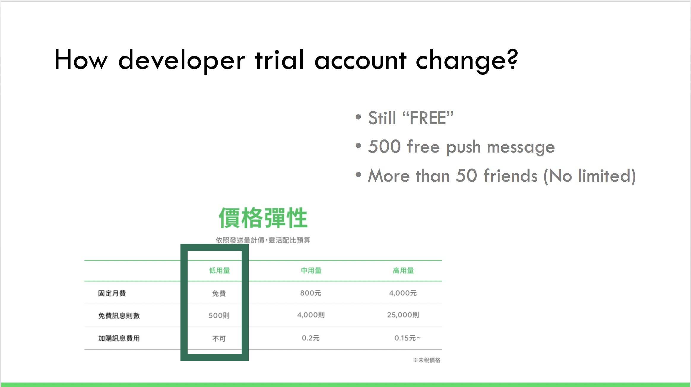
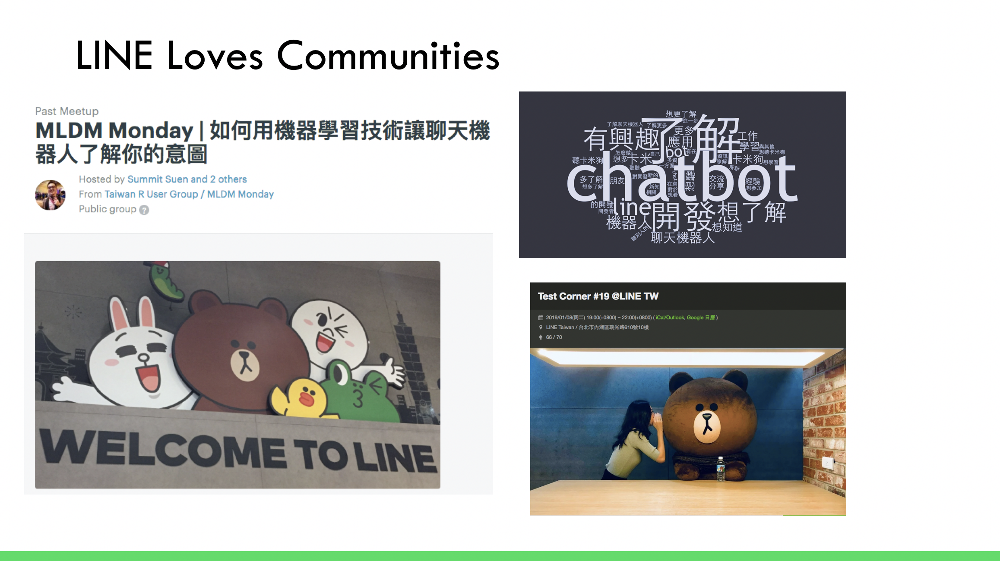
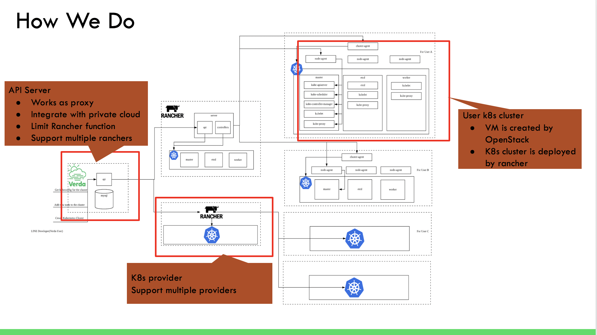
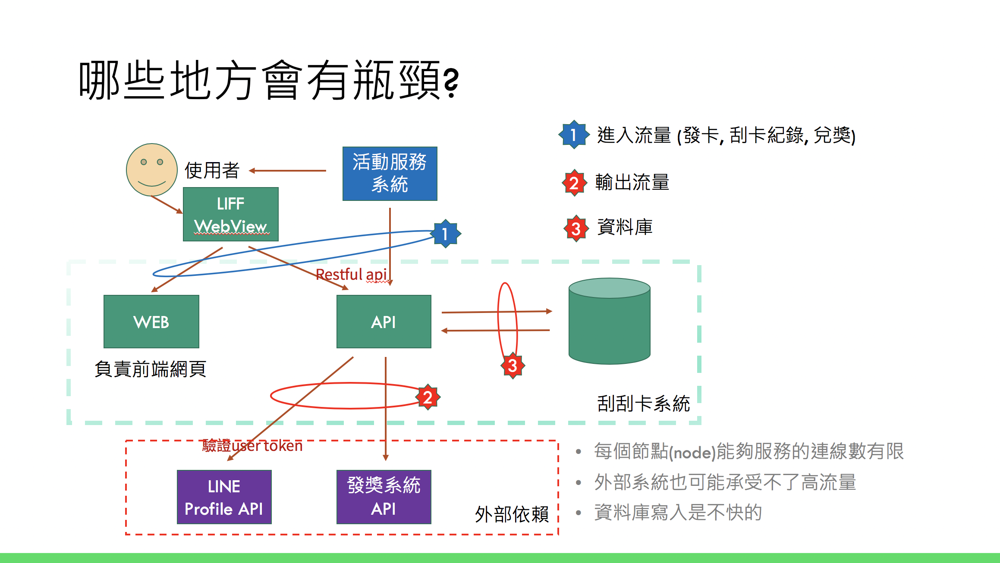
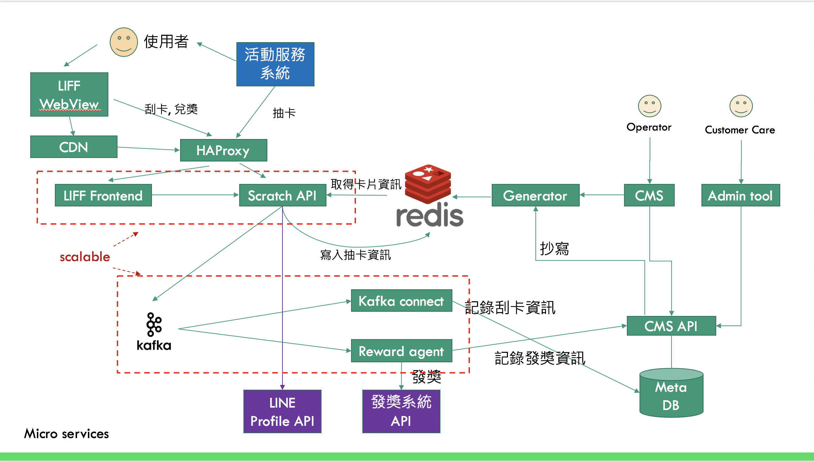
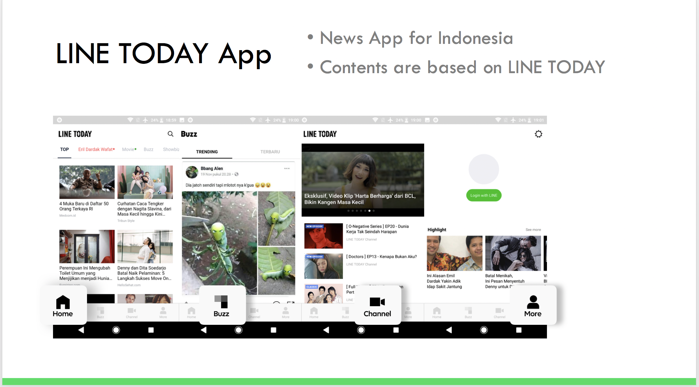
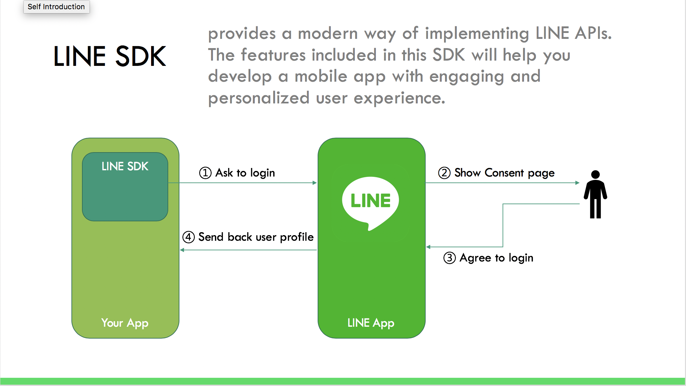
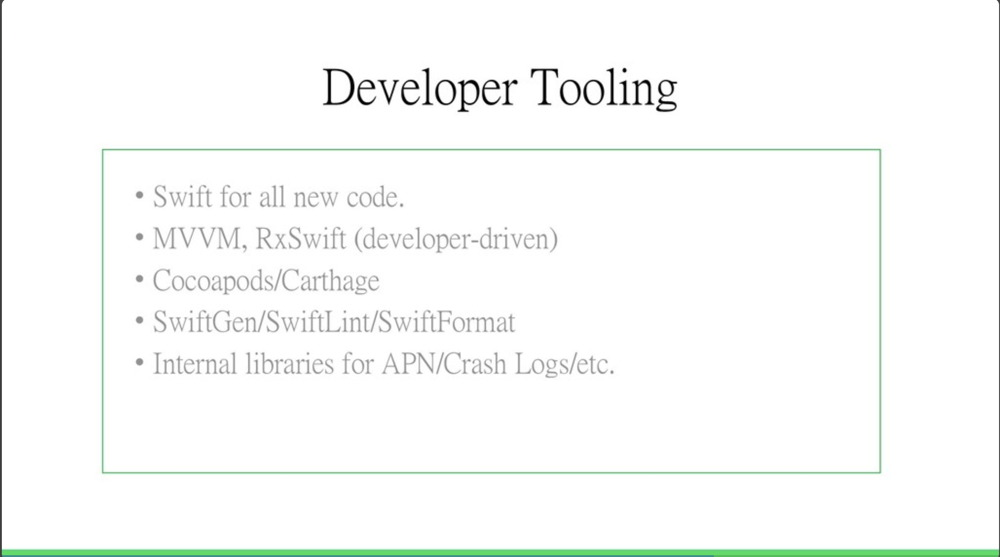

# 前提

嶄新一年的第一場開發者小聚，特地離開大台北地區，將在新竹的清華大學舉辦 ; 更請到 LINE台灣的許多開發團隊來跟開發者們分享在LINE的開發流程與經驗。 不僅僅有 Developer Relations 的本年度的活動規劃分享，更有來自日本的團隊來解釋什麼是 LINE Private Cloud 。當然不會少的有本地產品開發團隊來跟大家見面與分享，除了有 LINE NOW 與 LINE TODAY 的團隊之外，更有 iOS 與 Android 的開發團隊。機會實屬難得，也很開心能夠跟新竹的開發者一起來討論與交流。

## 2019 年開發者關係與技術推廣部年度計畫分享 / 資深開發技術推廣工程師 Evan Lin

#### [**投影片**](https://speakerdeck.com/line_developers/line-taiwan-developer-relations-2019-plan)

首先登場要介紹的部分就是由我所分享的 2019 年度開發者關係與技術推廣部門( Developer Relations )的年度計畫，大家也可以[參考這一篇文章](https://engineering.linecorp.com/zh-hant/blog/line-taiwan-developer-relations-2019-plan/)的介紹。 這一段介紹主要先講解身為開發者對於 OA 2.0 需要知道的部份。自從 OA 2.0 方案公佈之後其實開發者們都很擔心，不知道會不會有任何變革的部分。在這裡首先分享兩個鏈結給各位。([OA 2.0 全面升級](http://at-blog.line.me/tw/archives/LINEOA2.0.html)，[OA 2.0 FAQ](http://at-blog.line.me/tw/archives/LINEOA2.0FAQ.html) )，這兩篇文章其實能解決大多數開發者的疑慮，如果還是有不清處的部分。可以看看投影片內的整理。

**Developer Trial 會如何改變？**

- 會轉移到 "低用量"
- 不限制好友數，發訊超過 500 則會無法發送 (不會收費)。
- 這樣的改變對於只是想測試功能的開發者是相當貼心的，不用擔心不小心寫錯 Push Message 被收費之外。更可以使用到人數更多低用量方案。

再來就是要介紹 Developer Relations 本年度的一些計畫與每個月的行程給開發者們。其中最重要的計畫就是「LINE 開發社群計畫 」，詳情請看新聞稿。我們將在今年一整年中，在台灣舉辦對內的技術交流、教育訓練，對外的社群聚會、校園演講、開發者徵才日與開發者大會等各式各樣超過30場的活動。我們希望創造更多技術分享與跨國串連的機會，同時，持續招募優秀的人才加入LINE台灣的開發工程團隊。

「 LINE 開發社群計畫 」 裡面除了親近開發者社群之外， LINE 也積極在各個開發者盛會中參與，不論是各種大大小小的研討會或是一些社群的 meetup 。都是透過參與社群來使得開發者更能夠了解 LINE 開發的過程與製造更多技術交流的機會。其中也分享 LINE 內部的開發者活動，包括了「技術寫作訓練日」或是內部的其他訓練與 Workshop 。 

這個 Session 的最後要跟大家分享就是 LINE 年度開發者招募大會 ["LINE Developers Recruitment Day"](https://engineering.linecorp.com/zh-hant/blog/2019-line-taiwan-technical-recruitment-day/) 即日起也展開，歡迎各位開發高手來報名，一起打造 WoW 使用者體驗的產品。

#### Developer Relations 相關職缺:

- [Technical Evangelist](https://career.linecorp.com/linecorp/career/detail/20000111/228/3877?classId=&locationCd=TW&page=)
- [Technical Writer](https://career.linecorp.com/linecorp/career/detail/20000111/228/609?classId=&locationCd=TW&page=)

## How We build Kubernetes service by Rancher in LINE **/ LINE 東京 Verda Team, 李飛翔**

#### [**投影片**](https://speakerdeck.com/line_developers/how-we-build-kubernetes-service-by-rancher-in-line)

來自東京 Verda Team 的李飛翔也跟大家分享 LINE 是如何透過 Rancher 來打造 LINE 自己的 KaaS (Kubernetes As A Service) 。本文一開始先介紹了 [Rancher](https://rancher.com/) 的一些功能與 [Rancher](https://rancher.com/)[ 2.0](https://rancher.com/docs/rancher/v2.x/en/) 的目前狀況，也會介紹我們如何使用 Rancher 來打造 KaaS 。

###  LINE 如何透過 Rancher 打造 KaaS

- API Server:

  - 首先左方可以看到，有一個 API Server 負責收發使用者的指令。 除了作為 Proxy 之外，也可以限制使用者使用有限的 Rancher 功能之外也可以整合一次對於多個 Rancher 的操作。

- Kubernetes Provider:

  - Provider 用來創建和管理用戶kubernetes集群，支持多個 Provider。目前使用的是 Rancher。

- **User Kubrernetes Cluster:**

- - 每一個服務或是產品會使用一個或是多個 User Kubernetes Cluster 。裡面都是透過 OpenStack 來建立 VM ，並且透過 Rancher 來部署。

如果今天一個開發者需要一個新的集群來部署一個新的服務。他透過 API Server  下指令部署新集群，這時候會透過 Kubernetes Provider 來運行 Rancher 來開啟新的 VM 並且來部署 Kubernetes 設定到該集群。

### 如此的輕鬆容易嗎？ 透過一個問題來講解整個 Kubernetes 的架構與容易出錯的地方

架構雖然清楚又明瞭，但是事實上要運行卻沒有那麼的容易。這邊講者也分享藉由 "Websocket 無法正常建立“的錯誤，來分享如何追蹤這個問題來解決真正的問題。

如同上圖提到 Kubernetes Provider 是透過 WebSocket 與 Kubernertes User Cluster 溝通。有一天忽然發現了 WebSocket 忽然斷線的狀態，回過頭來看 Kubernetes DNS 的設定， Container 網路的架構甚至也解釋了flannel 網路架構。透過這些架構的解析，聽眾會了解在實體機 (Baremetal) 上面架設 Kubernetes 其實遇到的網路問題其實更多更複雜，因為牽扯跨實體機器與跨網路節點。

找到問題之後，試著做出一個 patch 來修正問題。確定成功之後也將這個問題回饋到 Racher 的 OSS 來貢獻 LINE 研究的結果。

類似的問題就是 Verda team 的人每天所遭遇的問題，不斷睇偵測與測試問題的原因，透過不同層面的觀點來了解與解讀問題。如果最後發現問題可能是出在 Kubernetes 源碼部分， LINE 也不吝嗇貢獻出發現的問題與修正的方式。

這樣的流程需要更多的新血，我們也需要各位 Kubernetes 與網路高手的加入。

#### Verda Team 相關職缺:

- [Software Infrastructure Engineer](https://career.linecorp.com/linecorp/career/detail/20000111/228/3967?classId=&locationCd=TW&page=)

## **從LINE刮刮卡淺談高流量負載的服務架構設計**/ LINE台灣工程師, Julian Shen

#### [**投影片**](https://speakerdeck.com/line_developers/how-to-build-high-load-balance-architect-in-line-now)

這是一篇繼上一次"[LINE NOW刮刮卡開發分享](https://engineering.linecorp.com/zh-hant/blog/line-developer-meetup-6-%e9%96%8b%e7%99%bc%e8%80%85%e5%b0%8f%e8%81%9a-%e6%b4%bb%e5%8b%95%e5%be%8c%e5%88%86%e4%ba%ab/)" 之後更深入的分享。上一次 Julian 提到 LONE NOW 團隊如何在一個月之內快速的開發出「刮刮卡」這個熱門的活動之後，其實在上線期間剛好就是[中秋節的貼圖刮刮卡活動](https://agirls.aotter.net/post/54162)。造成有龐大流量的產生造成了系統的效能瓶頸。 這一次的就是要跟聽眾分享當服務遇到龐大與突然的流量湧入的時候，哪些部分應該要注意？哪些部分可能會造成系統瓶頸？該如何解決？

#### 為什麼會突然有大量流量湧入?

舉凡像是促銷 (像是雙十一)，Banner 推廣或是蓋版廣告。都會因為曝光量大增而造成大量流量的湧入。

#### 會發生什麼事?

- (左上角藍色 1）同時連線數增加, 如超過所能負荷的連線, 會導致前端呼叫API失敗。

- (左下角紅色 2）

  對外部系統呼叫API次數增加。

  - 對外部系統連接的connection pool被用完。
  - 外部系統也可能被打趴。

- (右側紅色 3）同時寫入資料庫次數增加, 大量的同時寫入可能導致資料庫效能低落, 進而影響每個API請求的處理時間。

#### 加開機器是否能解決問題？

針對效能的問題，一開始大家都會簡單的思考透過 scale-out (也就是加開機器）的方式來試著解決問題。但是即便加開了機器，還是會受限於資料庫的存取瓶頸造就系統還是會卡住無法在期限內除理完大量的流量。

#### 新的架構如何解決問題？

- 使用反向代理, CDN可減輕連線壓力
  - 資料來自Redis, 相較於傳統資料庫來的快速
- 抽卡資訊不直接寫入資料庫, 降低IO的影響
- 大部分的資料寫入都是延後及非同步
  - API呼叫的處理時間不受資料庫寫入效能影響
  - 對外部系統的壓力可被控制
- Kafka只要沒掛, 萬一其他系統出問題, 該寫入的資料都還會在
- Redis, Kafka 可以處理大流量資訊

當然這也不是一次就能完全解決問題，還有其他問題跑出來。講者也分享了有趣的解法。有興趣想瞭解更多的讀者歡迎詳細查閱投影片。

#### LINE NOW 相關職缺:

- [Server-Side Developer](https://career.linecorp.com/linecorp/career/detail/20000111/228/2014?classId=&locationCd=TW&page=)

## **What we do and what we use in LINE TW Android team / LINE 台灣工程師 Daniel Kao**

#### [**投影片**](https://speakerdeck.com/line_developers/line-taiwan-client-projects-and-what-we-use-in-android-team)

接下來來自 LINE 台灣 Android 團隊的 Daniel 也跟各位分享了相關的開發專案與產品，目前相關的 Android 開發團隊都在三個產品與專案之中：

### LINE Today App

這是在印尼上市的產品，是一個根據原本 LINE TODAY 內容索引的完全新的產品，當初如何透過快速迭代的方式產生新的產品的過程。可以觀賞去年在 TechPulse 2018 精彩的演講。 "[LINE TODAY高效率的敏捷測試開發技巧](https://www.slideshare.net/linecorp/line-today)" 。

### LINE SDK

LINE SDK 是一個提供給 App (iOS, Android)開發者，透過 LINE 帳號登入的 SDK 套件。

相關 SDK 放在這裡： <https://github.com/line/line-sdk-android>

### 第三部份就是開發 LINE Android App 其中的元件

包含 LINE TODAY tab，LINE Keep，LINE Album 等功能，都是台灣工程師曾經開發和維護過的元件。

聽完了 LINE 台灣 Android 團隊的工作內容是不是很有興趣？ 趕快在下列職缺寄出你的履歷申請。

#### LINE 台灣 Android 相關職缺:

- [Android Developer](https://career.linecorp.com/linecorp/career/detail/20000111/228/2967?classId=&locationCd=TW&page=)

## **LINE Taiwan iOS Projects and Practices. / LINE 台灣工程師 Ray Tsai**

#### [**投影片**](https://speakerdeck.com/line_developers/line-taiwan-ios-projects-and-practices)

再來是 iOS 團隊的 Ray 來介紹 LINE 台灣的 iOS 團隊都負責哪些專案。首先大家會好奇的是，作為科技公司的 LINE iOS SDK 是使用 Objective-C 還是 Swift 來撰寫。答案是 Swift 請參考 <https://github.com/line/line-sdk-ios-swift> 。

台灣 iOS 開發團隊就跟 Android 開發團隊一樣。除了 LINE App 裡面的某些模組之外，就是開發 iOS App 的 SDK 。

這張圖列出了 iOS 開發團隊的相關開發工具，相信也會讓許多有興趣的人能夠了解。

#### LINE 台灣 Android 相關職缺:

- [iOS Developer](https://career.linecorp.com/linecorp/career/detail/20000111/228/2968?classId=228&locationCd=TW&page=)

## **LINE 相關產品與團隊介紹**

最近接著上場就是各個產品團隊與開發團隊分別跟大家自我介紹，希望能夠讓參與者能夠更了解我們的產品團隊與開發團隊。

### [LINE 購物團隊 (投影片）](https://speakerdeck.com/line_developers/line-taiwan-ec-develop-team)

#### 相關職缺

- [Server-Side Developer](https://career.linecorp.com/linecorp/career/detail/20000111/228/2014?classId=228&locationCd=TW&page=)

###  [LINE 旅遊團隊  (投影片）](https://speakerdeck.com/line_developers/introduction-line-travel-develop-team)

#### 相關職缺

- [Server-Side Developer](https://career.linecorp.com/linecorp/career/detail/20000111/228/2014?classId=228&locationCd=TW&page=)

###  [LINE Pay團隊  (投影片）](https://speakerdeck.com/line_developers/introduction-line-pay-develop-team)

#### 相關職缺:

- [LINE Pay – Server-Side Engineer](https://career.linecorp.com/linecorp/career/detail/20000111/228/3910?classId=228&locationCd=TW&page=)

### [LINE Today團隊  (投影片）](https://speakerdeck.com/line_developers/introduction-line-today-develop-team)

#### 相關職缺:

- [Technical Project Manager-LINE TODAY](https://career.linecorp.com/linecorp/career/detail/20000111/228/3882?classId=228&locationCd=TW&page=)
- [Server-Side Developer](https://career.linecorp.com/linecorp/career/detail/20000111/228/2014?classId=228&locationCd=TW&page=)

### [LINE UIT 開發團隊  (投影片）](https://speakerdeck.com/line_developers/introduction-line-uit-develop-team)

#### 相關職缺:

- [Front End Engineer](https://career.linecorp.com/linecorp/career/detail/20000111/228/2013?classId=228&locationCd=TW&page=)

## 活動小結

本場活動是第一次離開台北的開發者小聚，除了讓參與者能夠跟 LINE 內部開發團隊相見歡之外。就是希望讓許多人能夠更了解 LINE 台灣數百人的開發團隊主要在從事哪些專案，也分別具有哪些類型的開發團隊。此外，這樣的平台也需要許多有能力的開發夥伴，也歡迎各位去 LINE Developer Careers ([網址](https://career.linecorp.com/linecorp/career/list))  查看相關職缺，一起來加入我們。

