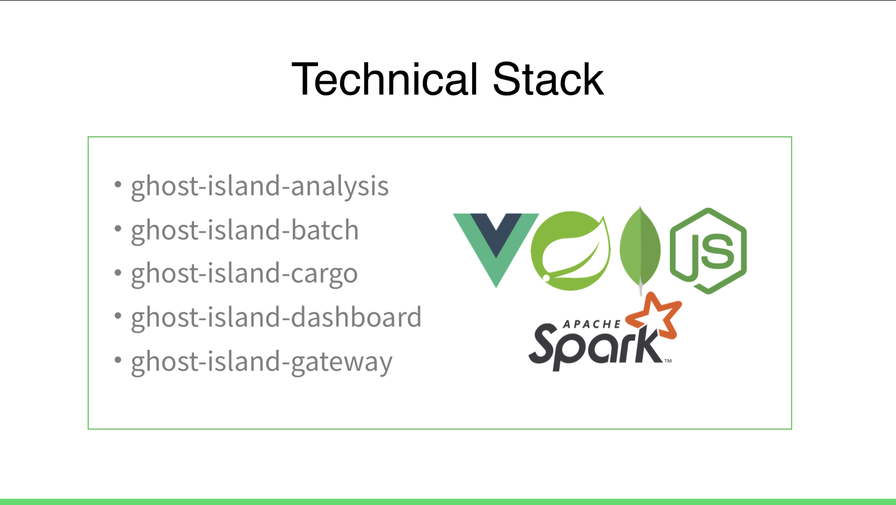
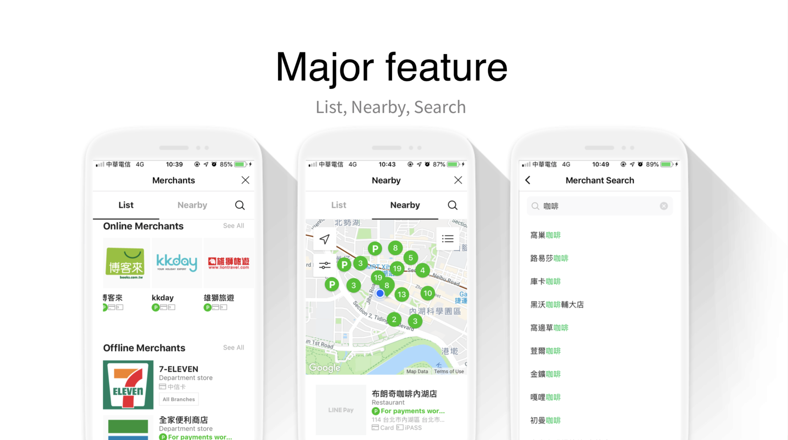
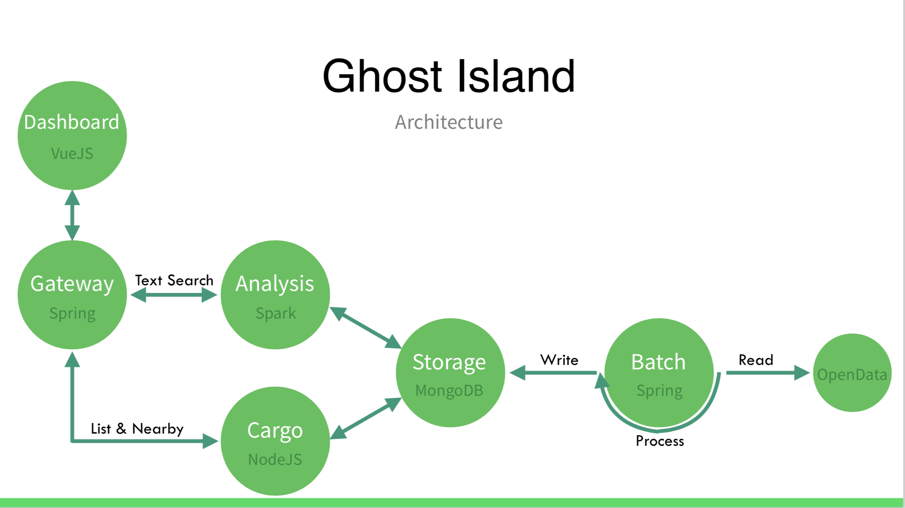

# 前提

大家好我是 LINE 台灣的 Technical Evangelist - Evan Lin 。「開發社群計畫」是今年一個開發者關係與技術推廣部門一個重點，將在今年一整年中，在台灣舉辦對內的技術交流、教育訓練，對外的社群聚會、校園演講、開發者徵才日與開發者大會等各式各樣超過30場的活動。我們希望創造更多技術分享與跨國串連的機會，同時，持續招募優秀的人才加入LINE台灣的開發工程團隊。

四月第一場社群活動邀請到 TWJUG (Taiwan Javsa User Group) 社群到 LINE 來舉辦。也請到 LINE Pay 的 Webber Su 來分享，除了讓更多人能夠了解 LINE Pay 工作經常用到的工具外，也希望能夠引發一些討論甚至可以互相交流。

## Where is the ghost in the ghost island? Explore by Java and Mongo/ LINE Pay - Webber Su

#### [投影片](https://speakerdeck.com/line_developers/where-is-the-ghost-in-the-ghost-island-explore-by-java-and-mongo)

首先上場的是 LINE Pay 的同仁 Webber Su 所帶來的透過開放資料集的一個案例分享。在 LINE Pay 的開發經驗上其實會遇到大量資料的處理與分析，但是由於許多的客戶資料都是屬於機密資料無法公開，所以透過開放資料集的案例來分享 LINE Pay 團隊日常遇到的相關問題。

透過開發資料將全台灣的事故資料匯入資料庫中，並且透過 LINE Pay Merchant Map 的部分的相關技術可以幫我們找出比較容易發生事故的問題區段。

在開始處理資料的之前，講者也分享了他會用到的相關開發工具如下：

以下稍微介紹每個工具的功能與相關作用：

- **資料的分析**: [Spring Web](https://spring.io/) ， [Spark](https://spark.apache.org/) 與 [MongoDB](https://www.mongodb.com/) 。
- **資料批次處理**: [Spring batch](https://spring.io/projects/spring-batch) 與 [MongoDB](https://www.mongodb.com/) 。
- **網站的後台系統**： [Node.js](https://nodejs.org/en/) ， [Loopback](https://loopback.io/) 與 [MongoDB](https://www.mongodb.com/) 。
- **前台顯示部份**: [Vue.js](https://vuejs.org/) 與 [D3.js ](https://d3js.org/)。

這些開發工具也是 LINE Pay 團隊在開發上經常使用。除了開源專案工具之外， LINE Pay 也首次分享了 LINE Pay Merchant Map 的功能：

LINE Pay Merchant Map 提供了地圖話資訊的條列與搜尋。包括了:

- **List**: 條列式的列表。
- **Nearby**: 透過地圖是覺化的列出。
- **Search**: 甚至透過關鍵字的搜尋方式。

在文字資料的搜尋上，究竟要使用 [Elasticsearch](https://www.elastic.co/cn/) 或是 [MongoDB](https://www.mongodb.com/) 作為文字搜尋呢？這裡講者也分享了當初在內部開發系統上，是透過哪些的評量方式來決定的。 由於許多效能的測試與評量上最後決定是 [Elasticsearch](https://www.elastic.co/cn/) 。而在地點鄰近搜尋 (Nearby) 上最後則是決定使用  [MongoDB](https://www.mongodb.com/)。

這個 Ghost Island 的架構其實也將 LINE Pay 開發團隊許多用到的工具分享給大家。裡面包括了資料該如何處理，該如何有效地處理與資料的讀取跟儲存？ 這邊講者也分享了一些經驗談，就像是這個案例一樣，對於資料的處理上要有許多小地方要好好處理。如果是開放資料的時候，對於資料的處理要更加小心。資料可能有誤，資料可能有缺甚至資料可能是空的。所以可能將資料多儲存在其他地方也是一個可以變通的方式。這樣可以避免在資料清洗的時候造成程序的錯誤。後端針對文字搜尋與鄰近地圖搜尋則是透過兩個不同的儲存工具（ Mongo 與  Elasticsearch )來處理資料。

而且講者也分享了在各個階段可能會踩到的雷（指的是遇到的問題）。不論是剛剛 Batch Spring process ，Spark 資料的處理上還是 Cargo 的部分。

整個主題雖然是使用開放資料的事故來做講解，但是不論是整個流程用到的相關開發工具還是可能會遇到的問題。講者也都分享出來 LINE Pay 團隊在每天在面對的問題可能是許多個面向。需要有深厚的技術背景與經驗才能夠快速的了解與推敲出問題的真正原因。

## Containerize and Evolution of Deployment Type / xTeam Studio - Vincent Huang 

#### 投影片(<https://hackmd.io/p/HJCteAazN>)

這個講者的主題相當有趣（我相信在 Java 社群比較少看到），他分享了如何透過 Containerzie 的方式來部署你的應用。並且從 VM 到 Docker Container 到 Docker Compose 最後到了 Kubernetes 的相關部署方式。也介紹了自己在 GKE 上面部署服務的流程範例。

最後展望未來，有更多的工具還能讓你夠有效率的部屬你的服務，不論是透過 Halm ， Terraform 都可以讓整體服務在 Kubernetes 上面變得更加的方便與迅速。

## 總結

很開心邀請到 TWJUG 社群來到 LINE 台灣辦公室舉辦 meetup ， 也很開心第一次能夠請到 LINE Pay 的工程師來跟社群們分享開發上的經驗。透過這次的分享， LINE Pay 的開發團隊再也不是讓人覺得相當的神秘，也讓人了解到其實 LINE Pay 開發團隊其實會遇到相當多類型與多面向的問題，你也是喜好解決困難問題的人嗎？ 其實 LINE Pay 還在徵求相關的工程師。對於相關開發工具熟悉的技術高手，快來挑戰一下吧？

#### LINE Pay 相關職缺:

- [LINE Pay – Server-Side Engineer](https://career.linecorp.com/linecorp/career/detail/20000111/228/3910?classId=228&locationCd=TW&page=)

## 關於「LINE開發社群計畫」

LINE今年年初在台灣啟動「LINE開發社群計畫」，將長期投入人力與資源在台灣舉辦對內對外、線上線下的開發者社群聚會、徵才日、開發者大會等，預計全年將舉辦30場以上的活動。歡迎讀者們能夠持續回來察看最新的狀況。詳情請看 [2019 年LINE 開發社群計畫活動時程表 (持續更新)](https://engineering.linecorp.com/zh-hant/blog/line-taiwan-developer-relations-2019-plan/)