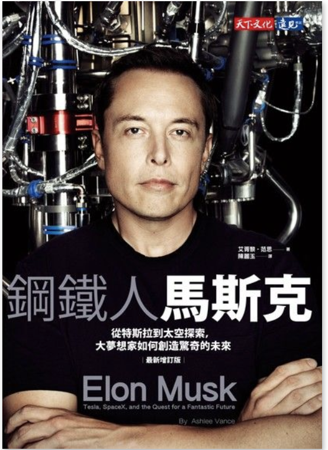

(圖片參考 [讀墨](http://moo.im/a/DHKPQX) )

```
從特斯拉到太空探索，大夢想家如何創造驚奇的未來
Elon Musk : Tesla, SpaceX, and the Quest for a Fantastic Future

原文作者：Ashlee Vance
譯者：陳麗玉
```

#### 買書推薦網址： http://moo.im/a/DHKPQX

# 前言:

現代的鋼鐵人 - 馬斯克，不僅僅被視為是狂人之外。更是讓推動電動車的特斯拉與新創火箭科技 SpaceX 兩個令人驚豔的黑科技公司的執行長與董事。這本書應該蠻久以前就想要買來看。前一段時間一次買了三四本，斷斷續續的下來總算把這本書看完。

最近持續要規定自己減少每天手機的利用時間，除了上班不得不用之外。應該在家裡都是要持續拿著我的 Readmoo 好好的閱讀書籍。


# 內容簡介:

最近的幾篇傳記不論是[貝佐斯傳](http://www.evanlin.com/reading-amazon/)到現在這的本  馬斯克傳記，其實都算是從記者的角度來撰寫的文章，而不是本人或是完整授權的傳記書籍。這類的書籍脈絡都還算容易了解，從一開始的媒體寵兒的角度來切入馬斯克，開始帶入成就他被稱為矽谷鋼鐵人傳奇的起頭。

馬斯克從小出生是在一個南非的富裕家庭，但是從小的馬斯克因為經常陷入深沈的思考模式，也就是無視於周遭的人的聲音整個陷入自我的思考模式，由於這樣的原因讓馬斯克從小經常被欺負。 但是這些都無法掩飾他異於常人的思考邏輯，搭配著他喜好讀書（並且獨得相當快速）的習性。讓馬斯克很容易地了解並且有著良好的基礎。

出社會之後馬斯克更展現了他的才能從第一次創業透過網頁黃頁的 Zip2 ，並且從兩個人的公司打造自己的第一個企業。後來被康柏併購之後，馬斯克也得到了他人生的第一桶金。

接下來就像大家耳熟能詳的創業模式，他們創立了 X.com 並且與 Paypal 競爭了一段時間之後就併購了 Paypal  。但是這個時候馬斯克也被迫交出了執行者的職位。被迫離開執行位子之後， X.Com 將名字改為 Paypal ，之後就像大家熟知的一樣，接下來 ebay 花了十五億美金買了 Paypal 。馬斯克有了他的第二桶金，有點像是賈伯斯離開蘋果一樣，這時候的馬斯克將他的眼光放到了小時候的夢想 — 火星旅遊。

接下來讀故事就是大家較熟悉馬斯克同時兼顧了人類兩個夢想的科技公司，火箭科技的 SpaceX 與電動車產業的 Tesla 。這邊幫作者賣個關子好了，其實這一段轉折還蠻有趣的。

馬斯克之所以被人稱為現在的鋼鐵人，出了有錢之外，就是他驚人的執行力。他可以很快的學習一件事情，然後跟工程師辯論為何不該這麼做。某種程度也是一種缺點就是他很愛跟工程師說，「我來做你的事情跟兩家公司的執行長」但是恐怖的是，他會這麼做而且做得很好。


# 心得:

這本書主要是由記者角度來寫，裡面有許多的歷史事件的紀錄。由於沒有太多本人的資料，可能沒有夾帶著個人情緒的元素。·會覺得馬斯克真的像是機器人一樣，優秀而不帶著個人情感。 但是這本書也提到了，他的家庭生活與他對於第一個孩子夭折所帶來的痛苦。 這本書有許多有趣的歷史，更可以了解這些令人感到傳奇的執行長們的人生。像是賈伯斯，貝佐斯一樣，馬斯克一樣有著高超的學習能力與暴躁挑惕的個性。或許，這些也是這些傳奇執行者們的樣板一樣。

最後，相當推薦大家來看這本書。很多有趣的故事會讓你愛不釋手。