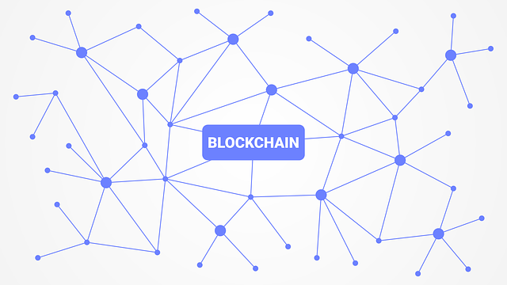

# [Blockchain Specialization](https://www.coursera.org/specializations/blockchain) 系列上課心得

- [Blockchain Basics](http://www.evanlin.com/moocs-bitcoin-basis/)

- [Smart Contract ](http://www.evanlin.com/moocs-smart-contract/)

- [Decentralized Applications (Dapps)](https://www.coursera.org/learn/decentralized-apps-on-blockchain)

- Blockchain Platforms

#### Decentralized Applications (Dapps): 課程鏈結:  [這裡](https://www.coursera.org/learn/decentralized-apps-on-blockchain/home/welcome)

# 文章鏈結:

- [Decentralized Applications (Dapps) (一）: Week 1](http://www.evanlin.com/moocs-smart-contract/)
- [Decentralized Applications (Dapps) (二): Week 2](http://www.evanlin.com/moocs-smart-contract2/)
- Decentralized Applications (Dapps) (三): Week 3
- Decentralized Applications (Dapps) (四): Week 4

# 前言：

這次的第二堂課跑得比較久，並不是因為課程比較難而是因為課程內部提供的 `truffle` 版本跟現階段的差很多，導致其實無法再 Mac OSX 上面順利的執行，需要修改不少的地方。雖然能夠幫助我夠熟悉整個 truffle 的架構，但是也真的得花很多時間解決各種問題。

如果還是一直卡住，真的還是得考慮使用 VirtualBox 來跑 VM 比較快。

# 課程內容:

## Week2:

### Truffle 的介紹 

#### Truffle 與 Remix 的差異

這次主要會用到的工具叫做 [Truffle](https://truffleframework.com/) ，在使用 [Truffle](https://truffleframework.com/)  之前需要分別出跟之前使用 [remix](http://remix.ethereum.org)  的差別：

- 分析問題， Smart Contract 的 prototype 需要使用 [remix](http://remix.ethereum.org) 。
- 開發，測試與部屬 dApps 需要使用 [Truffle](https://truffleframework.com/)。

#### 如何透過 Truffle 部署簡單的專案

接下來透過  [Truffle](https://truffleframework.com/)要來跑一開始最簡單的範例 Ballot 流程如下：

- 安裝  [Truffle](https://truffleframework.com/) : 
  - `npm install -g truffle`
- 初始化專案
  - `mkdir ballot`
  - `cd ballot`
  - `truffle init`

裡面會有幾個已經設定好的 template 包括了:

- `migrations/1_initial_migration.js`: 負責 migration script file
- `truffle-config.js`: 負責 truffle compiler 的設定檔案

增加設定檔案 `truffle.js` (**這檔案是負責 truffle 部署的設定檔案**)

增加 deployment 的相關設定 (建立一個檔案 `migrations/2_deploy_contracts.js`)

關於將舊的 Remix 的檔案 Migrate 到 truffle 這邊的部分就參考這篇文章。[[TIL] Migrate solidity from remix to truffle (1) - Compile](http://www.evanlin.com/til-remix-truffle/)

### Test-Driven Development 

Smart contract 就像 hardware chip 一樣，一但部署了就很難變更（除非有大量問題導致必須修正）。 本小段的內容就是教導如何透過 TDD 的方式來撰寫 smart contract 。

關於 `truffle test` 的流程 (如果有任何 `truffle test` 錯誤需要來做 smart contract 修正)：

- `truffle compile`
- `truffle migrate --reset`
- `truffle test`

### Web Interface & Testing

這一個章節開始要將 Web Interface 的部分導入到我們目前的專案之中，也讓我們更了解 Dapp 如何透過網頁前端的整合來呈現出來。

#### 檔案架構

在這之前，讓我們更了解所有檔案架構：

- `contracts`: 所有的 smart contract 相關代碼。
- `migrations`: 放著 migration 會用到的相關 scripts 。
- `test`: 通常會放入所有相關測試代碼。
- `build`: 放著一些 json 設定檔案。
- `source`: 通常會放著 web 相關的資源。

### 關於 truffle command line 整理

- `truffle init`: 建立範例給你準備開始自己的 truffle 專案。
- `truffle compile`: 將 Solidity code 轉換成 byte code
- `truffle develop`: 部署基本的 truffle 內建的 blockchain 環境。
- `truffle migrate —reset`: 如果有修改 migration script ，需要執行來重置設定。
- `truffle test`: 執行相關測試代碼。

# 總結:

本堂課專注在透過 truffle 的學習來了解使用 truffle 能夠達到的許多工作，從基本的 Ethereum client 到 truffle 與 MetaMask 的工具使用都有學習到。

# Reference:

-   [Truffle](https://truffleframework.com/)
-   [[TIL] Migrate solidity from remix to truffle (1) - Compile](http://www.evanlin.com/til-remix-truffle/)
