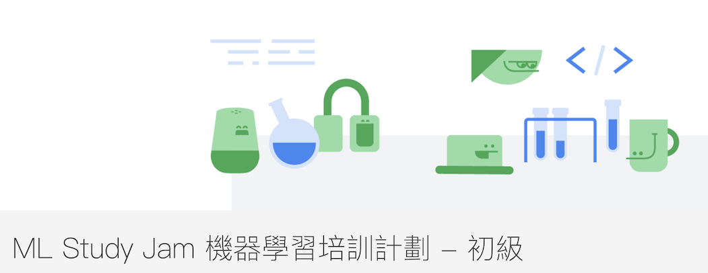
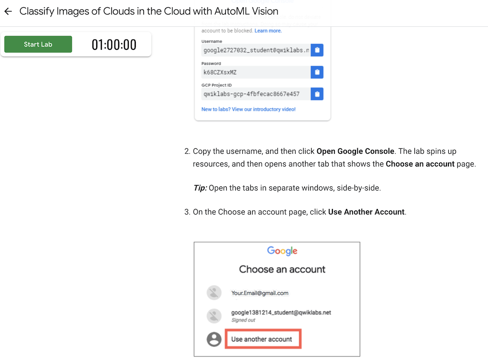

# 前言：

[Google ML Study Jam](https://events.withgoogle.com/ml-study-jam-basic-tw/) 是 Google Developers 所設計的免費機器學習培訓計劃。

在這個初級培訓課程中，參加培訓的學員僅須運用 Qwiklabs 線上學習平台，按照自己的步調及時間，實際動手操作由培訓計劃所指定與機器學習相關的 Hands-on Labs，便能自我學習而擁有基礎開發 AI/ML 應用程式的能力。

只要完成指定課程中的四項，就有機會獲得最新版本的 TensorFlow T-Shirt 。看起來實在相當棒就忍不住把 [Machine Learning APIs](https://google.qwiklabs.com/quests/32) 都上完了。

這邊分享一下相關內容吧！


# 課程內容:

整篇課程其實相當的實用，也由於整個 HANDS-ON LAB 透過 qwiklabs 逐步教學從登入帳號，開啟 cloud console 都很容易可以完整。 而 Lab 重點也在希望能夠讓使用者整個走過一次相關的使用流程。 所以每個步驟力求簡單明白，不需要任何的程式設計基礎。

## 課程特點：

全部的 hand-on lab 在設計上相當友善，只要完整跟著做一次通常可以順利完成。整個課程有以下的優點。


### 完全免費的帳號與清楚登入流程


每個小課程有專屬的帳號，不用擔心你不小心學任何 GCP 的功能因為忘記關掉伺服器而花了大錢。


### 清楚的指令提供複製貼上


由於 GCP 許多功能除了啟動與狀態回報之外，大多數的功能都還是透過 console mode 的指令來溝通（或許說不少是透過 API 呼叫方式）。

這時候最怕就是指令過時或是需要自己摸索，這邊的指令全部都是清楚條列，並且可以一個按鈕複製讓學習上完全沒有障礙。


### 完整了解許多 gloud console 提供的功能

雖然說之前很常使用 GCP 上面的許多功能，必須得說這次的課程讓我清楚更多平時不常使用到的功能。

- 透過 gcloud console 編輯檔案
- 透過 gcloud console 來跑一個 local web server ，並且使用 web preview 來查看 8088 的輸出。


但是學習上也不是沒遇到問題啦～分享一下我遇過的問題。 

## 課程遇到的問題  

### Scanning User-generated Content Using the Cloud Video Intelligence and Cloud Vision APIs

https://google.qwiklabs.com/focuses/1831 Scanning User-generated Content Using the Cloud Video Intelligence and Cloud Vision APIs 課程好像會卡住。


```
> gcloud beta functions deploy GCStoPubsub --stage-bucket gs://${STAGING_BUCKET_NAME} --trigger-topic ${UPLOAD_NOTIFICATION_TOPIC} --entry-point GCStoPubsub


ERROR: (gcloud.beta.functions.deploy) Missing required argument [runtime]: Flag `--runtime` is required for new functions.
```

原因是因為 `gloud beta function deploy` 的時候需要標註 runtime ，這裡的範例是使用 nodejs 只要改成以下即可。

```
gcloud beta functions deploy visionAPI --runtime nodejs --stage-bucket gs://${STAGING_BUCKET_NAME} --trigger-topic visionapiservice --entry-point visionAPI
```
參考相關 stackoverflow: https://stackoverflow.com/questions/51699289/gcloud-functions-deploy-unrecognized-arguments-runtime-did-you-mean-timeo


# Reference:

-   https://siddharam.com.tw/post/20190509/
-   https://darkaries.github.io/2019/05/13/gcpmljam1/
