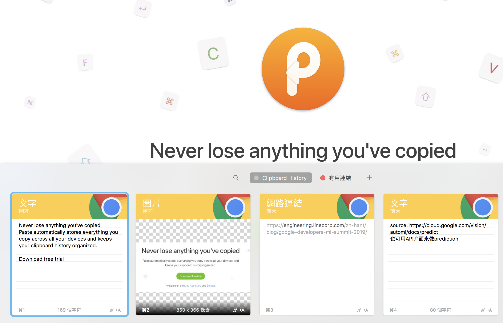
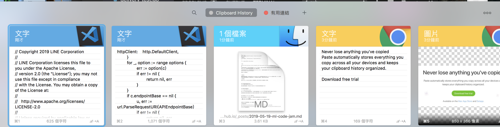
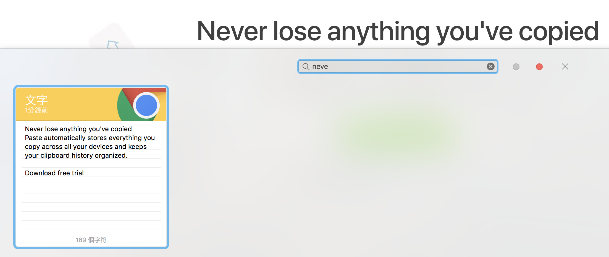

# 前言：

最近有一點久沒有寫技術相關文章，因為大多數的文章都在撰稿中，而且自己在忙碌 LINE Developer Meetup 的相關投影片。 回過頭來自己答應一週要寫一篇文章的，就來專文分享自己近幾年有花費買的好用的軟體吧。首先第一個就是 [PasteApp](https://pasteapp.me/)。

# 為什麼需要一個好用的剪貼簿軟體?

這邊的剪貼簿並不是指實際上的剪貼簿，也不是在隨意貼的軟體。而是專門儲存複製貼上的歷史紀錄的工具軟體。

經常在筆電的操作上，因為有太多資料需要複製與貼上，往往會在視窗間切換花費了太多的時間。比如說在購物得時候，可能需要輸入地址跟電子發票。常常會花費很多時間回去原來的視窗為了複製原來的資料。這個時候，就需要好好思考與尋找一個剪貼簿軟體來協助。

但是其實剪貼簿軟體何其多，之前也經常撰寫個人的剪貼簿功能後台。那該如何挑選一個實用的剪貼簿軟體呢？

"蓋紹哩後又" (介紹你好藥) ，在這裡就跟各位介紹一個個人相當喜愛的剪貼簿軟體 — [PasteApp](https://pasteapp.me/)

# 軟體功能:

在這裡簡單介紹幾個強大的功能：

## Unlimited history

可以有相當長的剪貼紀錄，並且可以看得出來。這個軟體可以清楚地條列出剪貼簿裡面的資料。不論是文字，圖片，檔案，還是圖片。都可以一目了然，清清楚楚。

## Intelligent search

讓我最喜歡的功能（沒有之一）就是可以搜尋剪貼簿的內容。如果想要在剪貼簿裡面尋找三天前的某段內容，使用其他的軟體可能需要不斷的向下拉，向下尋找。但是使用 [PasteApp](https://pasteapp.me/) 就相當的簡單，可以透過某些關鍵字來搜尋，使用上更加的方便與順利。

## iCloud sync

最後一個功能是，就是可以透過 iCloud 同步來讓你的手機與電腦同步相同的剪貼簿。實在是太方便了。在使用上可以讓你的手機馬上貼上你在桌機的鏈結，再也不需要任何 note 來暫存。 XDD

# 買下去！不會後悔

這個軟體是付費軟體，但是採取買斷的方式其實相當的佛心。$14.99  的費用其實真的很超值。筆者自從買了之後，換電腦的第一件事情就是裝 [PasteApp](https://pasteapp.me/)，之前[電腦壞掉要換到測試電腦](http://www.evanlin.com/til-restore-nb/)也是裝這個。真的好用到覺得沒裝好像殘廢一半一樣。 推薦給大家！！

# Reference:

-   [PasteApp](https://pasteapp.me/)
-   [[TIL] 如何快速重置上手習慣的 MacOSX 環境](http://www.evanlin.com/til-restore-nb/)
