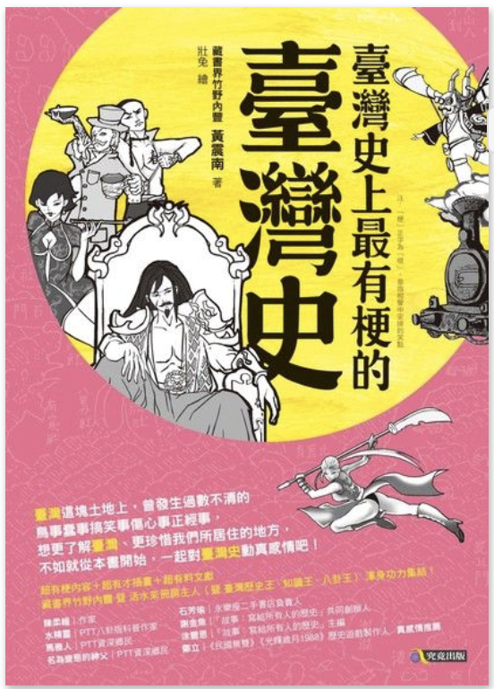

(圖片參考 [讀墨](http://moo.im/a/6eilCT) )

```
臺灣史上最有梗的臺灣史 
作者：黃震南  插畫：壯兔  出版社：究竟出版
出版日期：2016/08/01 語言：繁體中文 ISBN: 9789861372242

《臺灣史上最有梗的臺灣史》電子書 - 臺灣這塊土地上，曾發生過數不清的鳥事蠢事搞笑事傷心事正經事，想更了解臺灣、更珍惜我們所居住的地方，不如就從本書開始，一起對臺灣史動真感情吧！
```

#### 買書推薦網址： http://moo.im/a/6eilCT

# 前言:

當初會買這本書，是因為好像是某一次讀墨的推薦文章裡面有摘錄一篇文章。透過 ptt 鄉民的口語來敘述台灣的歷史，相當的有趣。 在看的過程中由於輕鬆的口吻，很快的就會把整本書當成休閒的書籍來看完。 很推薦喔


# 內容簡介:

```
當真一槍在手希望無窮，只要龍五的手上有槍誰都動不了他[14]。而這些軍警大多來自中國的貧窮省分，對於現代化的臺灣鬧出頗多土包子笑話，例如有人目睹軍官搶了小孩的腳踏車，但因為不會騎只好扛著走，小孩就跟在身邊哭鬧，軍官一急跳上腳踏車硬要逃脫，結果一頭栽進水溝。士兵沒見過自來水，於是買了水龍頭釘在牆上，以為這樣就有水喝（那是哆啦A夢的道具好嗎）。
```

這段文字節錄於這本書的某一個段落，就可以看得出來作者除了相當認真的做歷史書籍之外，也希望透過 ptt 上面時下人們喜愛的口語來敘述台灣的歷史。

這本書敘述台灣歷史相當的早，從第一批的台灣著名（大概是原始人的時代）。慢慢地到了荷蘭人經營台灣的歷史。 除了有敘述相關背景之外，也有相當多有趣的歷史。比如說鄭芝龍曾經是海盜，荷蘭人其實建造了不少的制度與硬體設施。 許多的故事都讓讀者感覺新奇跟引人入勝。

隨著時代的經過，這本書也會到了清朝開始有了鄭成功的故事。也有了許多相關的故事。甚至連清朝為何會來經營台灣都有稍微敘述到。

最後到了國民黨退守台灣的故事也有提到，讓人難過的故事有提到但是儘量地輕描淡寫。有興趣的人作者都有列出相當多的相關文獻跟資料，可以讓讀者去查詢更多的資訊。


# 心得:

想要邊讀 Joke 版面邊學歷史嗎？ 這本書很適合推薦給讀者。在輕鬆的過程中就可以把台灣的歷史整個走過一次，也有許多 ptt 有趣的梗。就等各位去慢慢發現了。