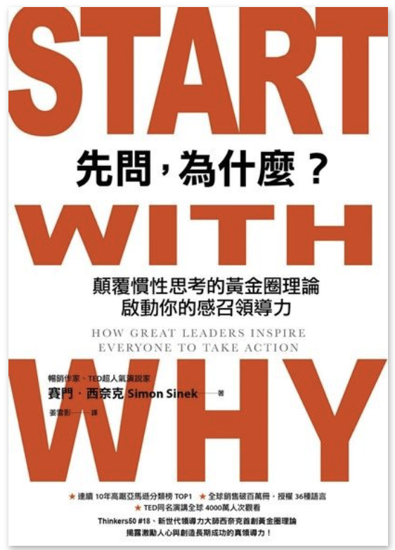

(圖片參考 [讀墨](http://moo.im/a/6cenrE) )

```
先問，為什麼？: 顛覆慣性思考的黃金圈理論，啟動你的感召領導力
Start with Why : How Great Leaders Inspire Everyone to Take Action

作者：賽門．西奈克  
原文作者：Simon Sinek  
譯者：姜雪影 
出版社：天下雜誌出版
出版日期：2018/05/23 語言：繁體中文 ISBN: 9789863983347
```

#### 買書推薦網址： http://moo.im/a/6cenrE

# 前言:

不論是身為開發技術推廣的人，或是跟一些同事在討論相關開發者推廣的活動。很多時候，許多同仁可能不能了解為何需要有那麼多的開發者社群活動？ 為什麼需要一個月忙碌好幾個晚上留下來跟不論是內部的開發者，或是外部的開發者來舉辦社群聚會？ 

經常在各種會議上被問到類似的問題，但是我都會很願意回答這些問題。 因為要讓你的夥伴能夠真正的瞭解你的想法法，「為什麼要做這些」？而不是冷冰冰的，做這些所能帶來的效果是哪些？ 所能帶來的認知度有多少？ 能讓多少工程師更容易被招募？  （當然～這些都是事後要被評量的 (笑) ）

所以買下這本數位版本的書籍，好好的閱讀。除了希望能夠更有決心的鼓舞其他夥伴之外，也希望讓自己的更了解該如何用「為什麼」來說服其他人。


# 內容簡介:

<iframe width="560" height="315" src="https://www.youtube.com/embed/5oxIJNGYmgI" frameborder="0" allow="accelerometer; autoplay; encrypted-media; gyroscope; picture-in-picture" allowfullscreen></iframe>


```
吸引人心、點燃熱情的黃金圈是甚麼？怎麼練習？

黃金圈是三層同心圓，由外到內分別是做什麼、怎麼做，與為什麼。這個架構看似簡單，卻與人腦如何處理資訊與情感的結構完全一致。最核心的「為什麼」，最能撼動人心，產生強大連結，但也正是語言最難清楚表達的部分。

```

身為開發者關係與技術推廣的工作，很多時候除了要將技術理念傳遞給對方（不論是外部開發者，或是內部開發者），都是需要透過點燃熱情的黃金圈理論。 對外需要將技術的本質，也就是該技術「為什麼」需要的原因清楚的解釋之外。對內則是需要跟同事們解釋為何需要做這些活動。

這本書一開始透過探究沒有講解「為什麼」的世界，來讓讀者感受到。當一件事情失去了原本的「意義」與「使命」的時候，很多時候就會讓事情難以推動。

接下來也透過幾個成功的企業，分享者當初創立者的「使命」。一個企業的「使命」也就是這個企業賴以為生的「為什麼」。不論那個使命造就了為什麼消費者會選擇他們，而不選擇其他的競爭對手。

裡面有提到西南航空著名的以客為尊，就是因為當初的創造者希望能夠打造一個以客為尊讓乘客可以很輕鬆以他可以負擔的價格來搭乘，這就是西南航空的「為什麼」。

當然很多人會說西南航空會贏是因為他是便宜的航空，他有簡單的定價策略。但是其他那些都是「做什麼 (What) 」 而不是他們的原因。了解了西南航空的企業價值之後，完全就能夠認同他為什麼會有那些特價促銷與一些服務的準則了。 這就是「為什麼」的重要。


# 心得:

記得曾經看過類似的文章，敘述著關於工作態度的問題。 文章的全文大概是

```
有一位哲學家到一個建築工地分別問三個正在砌築的工人說：

「你在幹什麼？」第一個工人頭也不抬地說：「我在砌磚。」

第二個工人抬了抬頭說：「我在砌一堵牆。」

第三個工人熱情洋溢、滿懷憧憬地說：「我在建一座教堂！」
```

第三個人顯然相當有熱情，因為他對於工作的使命相當的清楚，也就是他對於「為什麼」要做這份工作相當的認同。

這裡也分享給找不到工作目標與使命的夥伴們，你需要找到你的工作裡面最重要的「為什麼」。

