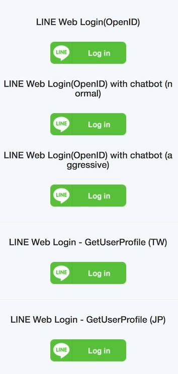

## 前言：

[今天剛剛出了新的參數](https://developers.line.biz/en/news/#line-login-new-parameters-and-properties-added-2019-06-26)，就馬上加到我的開源套件裡面，歡迎大家玩玩看。

[https://login-tester-evan.herokuapp.com/](https://login-tester-evan.herokuapp.com/)

裡面有六個 LINE Login 範例，其中包含 Open ID 方式與透過 Socal API 拿取 User Profile 的方式。

並且加上了新的參數 amr 與 ui_locales 讓你可以設定語言。

## 如何使用:

1. 連線到 [https://login-tester-evan.herokuapp.com/](https://login-tester-evan.herokuapp.com/)
2. 選擇要登入的方式
   1. 如果選擇 OpenID 方式到最後 LINE Login 完成後會出現， amr 相關資訊。 (範例 1)
   2. 如果選擇不同的 Locales 則會修改 LINE Login 相關的語言。 (JP, TW) (範例 2)
3. 相關程式碼，請參考
   1.  [https://github.com/kkdai/line-social-sdk-go](https://github.com/kkdai/line-social-sdk-go)
   2.  [https://github.com/kkdai/line-login-go](https://github.com/kkdai/line-login-go)

### 範例 1: amr:

技術細節: [https://developers.line.biz/en/docs/line-login/web/integrate-line-login/#spy-getting-an-access-token](https://developers.line.biz/en/docs/line-login/web/integrate-line-login/#spy-getting-an-access-token)

- **Property:**
  -  `amr`
- **Type:** 
  - Array of strings
- **Description:**
  - List of authentication methods used by the user. Contains one or more of:  
    - `pwd`：Log in with email and password
    - `lineautologin`：LINE automatic login (including through LINE SDK)
    - `lineqr`： Log in with QR code
    - `linesso`：Log in with single sign-on

懶人包：** 如果透過 JWT 來 decode payload 的話，可以看得到使用者透過哪些方式來做 LINE Login ，比如說

- `pwd`: 密碼登入
- `lineautologin`: LINE 自動登入 ...
- `linesso`：Log in with single sign-on

### 範例 2: ui_locales:

技術細節: [https://developers.line.biz/en/docs/line-login/web/integrate-line-login/#spy-making-an-authorization-request](https://developers.line.biz/en/docs/line-login/web/integrate-line-login/#spy-making-an-authorization-request)

- **Parameter:**
  - `ui_locales`
- **Type:**
  - String
- **Required:**
  - Optional
- **Description:**
  - Display language for LINE Login screens. Specify as one or more [RFC 5646 (BCP 47)](https://tools.ietf.org/html/rfc5646) language tags, separated by spaces, in order of preference. Corresponds to the `ui_locales` parameter defined in the "Authentication Request" section of [OpenID Connect Core 1.0](https://openid.net/specs/openid-connect-core-1_0.html).

**懶人包：** 透過輸入 `ui_locales` 可以變更 LINE Login 顯示語言，比如說

- `ja-JP`: 日文
- `ko-KR`: 韓文
- `zh-CN`: 中文
- `th-TH`: 泰文

### 詳細官方文件: 

[LINE Developer News 2019/06/26](https://developers.line.biz/en/news/#line-login-new-parameters-and-properties-added-2019-06-26)

## **Reference:**

- [https://developers.line.biz/en/news/#line-login-new-parameters-and-properties-added-2019-06-26](https://developers.line.biz/en/news/#line-login-new-parameters-and-properties-added-2019-06-26)
  - [https://developers.line.biz/en/docs/line-login/web/integrate-line-login/#spy-making-an-authorization-request](https://developers.line.biz/en/docs/line-login/web/integrate-line-login/#spy-making-an-authorization-request)
  - [https://developers.line.biz/en/docs/line-login/web/integrate-line-login/#spy-getting-an-access-token](https://developers.line.biz/en/docs/line-login/web/integrate-line-login/#spy-getting-an-access-token)
- [https://github.com/kkdai/line-social-sdk-go](https://github.com/kkdai/line-social-sdk-go)
- [https://github.com/kkdai/line-login-go](https://github.com/kkdai/line-login-go)