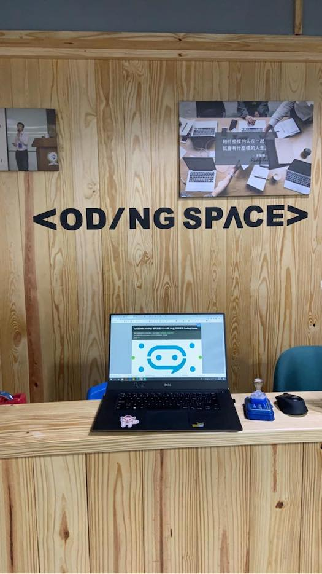

# 前言

大家好，我是 LINE Taiwan 的 Technical Evangelist - Evan Lin。這次很開心受到 chatbot 社群的邀請，參加了 "[Chatb10ts meetup 聊天機器人小小聚 10 @ 天瓏書局 Coding Space](https://chatbots.kktix.cc/events/meetup-010)" 的聚會活動，並且分享 LINE API 更新與個人開發的心得。在此也跟各位分享本次參與的心得，並且也希望透過社群分享的力量能夠讓聊天機器人的開發動能更加的盛大。

- 社群 Chatbots Meetup： https://chatbots.kktix.cc/ 

- 本次活動網頁:  [活動網址](https://chatbots.kktix.cc/events/meetup-010)

由於 Chatbots Meetup 本身屬於社群自主性的活動，裡面也有許多社群朋友所贊助的閃電秀。裡面的所有內容也是相當的難得與有趣。也希望能夠透過本篇文章讓大家稍微了解 Chatbots Meetup 社群閃電秀的魅力。

##  Write image proxy server for LINE Bot in Go / 資深開發技術推廣工程師 Evan Lin

#### [投影片](https://speakerdeck.com/line_developers/write-image-proxy-server-for-line-bot-in-go)

首先先跟所有的來賓分享新的 [LINE Login API 更新](https://developers.line.biz/en/news/#line-login-new-parameters-and-properties-added-2019-06-26) 並且也分享透過更新後的 API 所撰寫的範例網站 [https://login-tester-evan.herokuapp.com/](https://login-tester-evan.herokuapp.com/) 。 透過新的兩個變更，可以讓開發者能夠更有彈性的來開發 LINE Login 的相關應用。 在此列出相關細節：

### 1. ui_locales:

技術細節: https://developers.line.biz/en/docs/line-login/web/integrate-line-login/#spy-making-an-authorization-request

- Parameter:
  - `ui_locales`
- Type:
  - String
- Required:
  - Optional
- Description:
  - Display language for LINE Login screens. Specify as one or more [RFC 5646 (BCP 47)](https://tools.ietf.org/html/rfc5646) language tags, separated by spaces, in order of preference. Corresponds to the `ui_locales` parameter defined in the “Authentication Request” section of [OpenID Connect Core 1.0](https://openid.net/specs/openid-connect-core-1_0.html).

**懶人包：** 透過輸入 `ui_locales` 可以變更 LINE Login 顯示語言，比如說

- `ja-JP`: 日文
- `ko-KR`: 韓文
- `zh-CN`: 中文
- `th-TH`: 泰文

### 2. amr:

技術細節: https://developers.line.biz/en/docs/line-login/web/integrate-line-login/#spy-getting-an-access-token

- Property:
  - `amr`
- Type:
  - Array of strings
- Description:
  - List of authentication methods used by the user. Contains one or more of:
    - `pwd`：Log in with email and password
    - `lineautologin`：LINE automatic login (including through LINE SDK)
    - `lineqr`： Log in with QR code
    - `linesso`：Log in with single sign-on

懶人包：** 如果透過 JWT 來 decode payload 的話，可以看得到使用者透過哪些方式來做 LINE Login ，比如說

- `pwd`: 密碼登入
- `lineautologin`: LINE 自動登入 …
- `linesso`：Log in with single sign-on

第二個部分介紹如何透過 Golang 來開 Image Proxy Server 。當初開發 Image Proxy Server 的契機是由於當初開發寵物領養機器人 - ["流浪動物需要你"](https://github.com/kkdai/LineBotPetNeedMe) 的聊天機器人。由於流浪動物的收容資訊都是透過 Open Data 所提供的，裡面的圖片竟然是 `http` 而不是 `https` 。 在這裡分享了透過 Heroku 的開發方式來建置一個 [Image Proxy Server](https://github.com/kkdai/img-cache-server) 可以不需要任何伺服器的費用就可以讓 `http` 的圖片轉換到 `https`的圖片。

相關的開源程式碼在： [https://github.com/kkdai/img-cache-server]( https://github.com/kkdai/img-cache-server)

#### 更多相關內容:

- [20190626 LINE Login API update](https://developers.line.biz/en/news/#line-login-new-parameters-and-properties-added-2019-06-26)
  - [關於 amr 文件](https://developers.line.biz/en/docs/line-login/web/integrate-line-login/#spy-making-an-authorization-request)
  - [關於 ui_locales 文件](https://developers.line.biz/en/docs/line-login/web/integrate-line-login/#spy-getting-an-access-token)
- [[LINE][Golang] LINE Login v2.1 new parameter and properties 2019/06/26](http://www.evanlin.com/til-line-login/)
- [https://github.com/kkdai/line-social-sdk-go](https://github.com/kkdai/line-social-sdk-go)
- [https://github.com/kkdai/line-login-go](https://github.com/kkdai/line-login-go)
- [流浪動物需要你 LINE Bot](https://github.com/kkdai/LineBotPetNeedMe)
-  [https://github.com/kkdai/img-cache-server]( https://github.com/kkdai/img-cache-server)

## LINE@ 2.0 的 offline to online (LIFF + richmenu + push 機制) / **LINE API Expert -**Caesar Chi

#### [投影片](https://www.slideshare.net/clonncd/line-20-offline-to-online)

<iframe src="//www.slideshare.net/slideshow/embed_code/key/iZAD5eFMHNqxUz" width="595" height="485" frameborder="0" marginwidth="0" marginheight="0" scrolling="no" style="border:1px solid #CCC; border-width:1px; margin-bottom:5px; max-width: 100%;" allowfullscreen> </iframe> 
 <strong> <a href="//www.slideshare.net/clonncd/line-20-offline-to-online" title="LINE@ 2.0 offline to online" target="_blank">LINE@ 2.0 offline to online</a> </strong> from <strong><a href="https://www.slideshare.net/clonncd" target="_blank">Caesar Chi</a></strong> 

第一位 LINE API Expert - Caesar Chi 帶來相當實際的運用案例，由於今年在四月的時候，官方帳號 2.0 正式的上線。許多的客戶希望能夠更有效的運用 LINE @ 的帳號來達到更好的使用者轉換率，而 Caesar 在此就分享了在實務上如何有效地透過 LIFF + RichMenu + Push 機制有效地讓廠商能夠更有效率的轉換，並且也跟開發者們分享了，在官方帳號 2.0 轉換後的一些小技巧。

## LINE Bot on Cloud Run: 使用 line/line-bot-sdk-go  / LINE API Expert - CL Sung

#### [投影片](https://speakerdeck.com/clsung/line-bot-sdk-go)

第二位 LINE API Expert 分享了相當硬底子的開發經驗，透過了 LINE Bot 在 Cloud Run 上來部署 LINE Bot 。

一開始講者分享了當初為什麼會踏入 Golang 的開發過程，並且也分享了 Go 的 Vendor 的機制演變，從 Go 1.5 的 Vendor 到 Go 1.11的 Go Modules 。並且也分享了 [https://github.com/line/line-bot-sdk-go](https://github.com/line/line-bot-sdk-go) 的參與貢獻的開發過程。

接下來透過一個小型 LINE Chatbot 的專案來 （一個回應使用者輸入，並且可以透過 AWS 與 GCP 提供的功能來偵測臉部辨識的聊天機器人）講解如何透過 Google Cloud Run 來開發 LINE Chatbot 。

一開始講者分享兩段透過 GCP 與 AWS 雲端服務來偵測臉的相關範例程式碼，而其他聊天機器人所需要的相關處理程式碼也都帶過一次。完成所有需要的聊天機器人開發上所有需要的部分。

部署上，一開始先講解開發者熟知的透過 ngrok 來部署聊天機器人的方式，接下來透過 docker-compose 的方式來部署起來。並且透過 docker 特有的 [Multiple Stage Build](https://docs.docker.com/develop/develop-images/multistage-build/) 的方式來讓部署的執行檔案大小變小。

最後再來介紹 [Google Cloud Run](https://cloud.google.com/run/) 的部署方式，透過 Container 的方式來實現 Serverless 的技術。透過這樣的方式讓你的 LINE Chatbot 變得更有效率與更經濟。

上線之後，講者也分享了實務上很常使用到的「三寶」- Logging ， Tracing 跟 Metrics 。解釋了在這次提供的案例之中如何加入 Stackdriver 的 Logging 與 Tracing ，可惜時間不夠無法完整討論到 stackdriver 的 monitoring 。

## 閃電秀

講解完了主要三個講者之後，接下來就是介紹這個社群最有魅力的部分就是閃電秀。所有的閃電秀可以參考這篇共筆文章  [https://beta.hackfoldr.org/chatbot/](https://beta.hackfoldr.org/chatbot/)  ，由於都是五分鐘的閃電秀，主要內容快速用條列介紹給各位：

- **Is your bot ALIVE? / petertc**
  - 相關影片與投影片:  
    - https://youtu.be/Ljwwm_8E-uk 
    - https://www.slideshare.net/petertc/is-your-chatbot-still-alive
  - 內容說明：
    - 講者分享如何來有效的監控你的聊天機器人，並且能夠精確的確認 chatbot 是正常運作的。這時候透過的方式是跑自動化測試的好幫手 [http://doc.sikuli.org](http://doc.sikuli.org/) 也就是透過圖片的自動化測試工具來監測你的聊天機器人有沒有正常運作。
- **Chatbot O2O 案例分享 / EJay**
  - 內容說明：
    - 做這透過 LINE Chatbot 與動態網頁互動跟現在參加活動的會眾互動。透過問卷調查的方式來贈送小獎品。蠻有趣的，可惜沒有相關影片與投影片。
- **Chatbot 待辦小精靈 / Jeffrey**
  - 相關影片與投影片：
    - [https://youtu.be/vvnswgYNuvo](https://youtu.be/vvnswgYNuvo)
    - [https://docs.google.com/presentation/d/1p9dgEtPnlbOSLQRVhowTy9NRnk74D4ONcLPpRIkuQxc/edit?usp=sharing](https://docs.google.com/presentation/d/1p9dgEtPnlbOSLQRVhowTy9NRnk74D4ONcLPpRIkuQxc/edit?usp=sharing)
  - 內容說明:
    - 講者分享了自己開發的 chatbot "代辦小精靈" ，透過五項的代辦事項希望讓使用者可以更有效率的處理待辦事項。也分享了未來將有更多相關工具的開發計畫。
- **收藏小幫手 - 金魚腦救星 / Zz Chen**
  - 相關影片與投影片：
    - [https://youtu.be/oVy1bHiw_Bg](https://youtu.be/oVy1bHiw_Bg)
    - [https://docs.google.com/presentation/d/1NnomNF6d2ueeWuZb_H5H9cyAZQ58pzWY_kdc_hu6RHI/edit?usp=sharing](https://docs.google.com/presentation/d/1NnomNF6d2ueeWuZb_H5H9cyAZQ58pzWY_kdc_hu6RHI/edit?usp=sharing)
  - 內容說明:
    - 透過 LINE Chatbot 可以結合 Google drive 幫忙使用者存取與暫存所有工作用的檔案。蠻有趣的小幫手工具。
- **從台幣匯率機器人延伸至團購 LIFF / Melix**
  - 相關影片與投影片：
    - [https://youtu.be/bG--74ueEug](https://youtu.be/bG--74ueEug)
  - 內容說明：
    - 相當有創意的應用，原本是開發一個出國幫忙記錄匯率的小幫手。由於不少人有代購的需求，轉變成代購小幫手的工具，開發成 LIFF 之後，透過鏈結的分享。也搖身一變成為團購使用的小工具。相當建議各位看看影片的介紹。
- **迷你綠洲LINE智慧淨水器 / McGee**
  - 內容說明：
    - 分享透過淨水器產品，如果需要更換濾心可以透過 LINE Chatbot 通知。由於牽扯商業宣傳就不提供，請有興趣的去看共筆。
- **自幹一個 Flex Message Editor / Ding**
  - 內容說明：
    - 很棒的工具， Bot Designer 雖然是很方便的工具，但是使用上有收到不少的建議，於是獎者自行開發了另外一套 FLEX MEssage Editor ，功能相當不錯，可惜是商業作品也不方便宣傳。

## 活動小結

社群分享永遠是讓創意激盪的最佳方式，而 Chatbots Meetup 是一個很熱情與充滿創造力的社群組織。也希望有更多有創意的開發者願意加入 LINE Chatbot 的開發行列，更希望能熱情的參與社群的活動與一起來分享。

立即加入「LINE開發者官方社群」官方帳號，就能收到第一手Meetup活動，或與開發者計畫有關的最新消息的推播通知。▼

「LINE開發者官方社群」官方帳號ID：@line_tw_dev

## 關於「LINE開發社群計畫」

LINE今年年初在台灣啟動「LINE開發社群計畫」，將長期投入人力與資源在台灣舉辦對內對外、線上線下的開發者社群聚會、徵才日、開發者大會等，預計全年將舉辦30場以上的活動。歡迎讀者們能夠持續回來察看最新的狀況。詳情請看 [2019 年LINE 開發社群計畫活動時程表 (持續更新)](https://engineering.linecorp.com/zh-hant/blog/line-taiwan-developer-relations-2019-plan/)https://engineering.linecorp.com/zh-hant/blog/line-taiwan-developer-relations-2019-plan/)