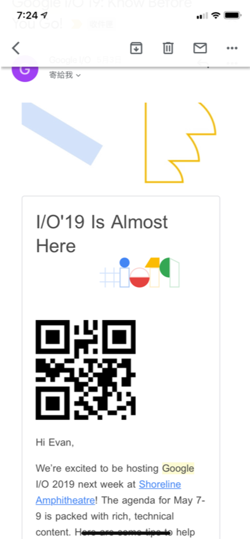
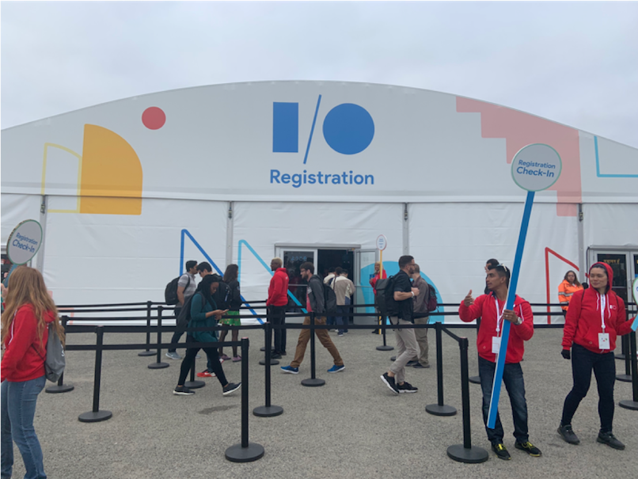
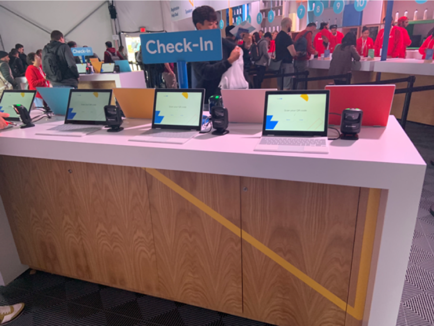
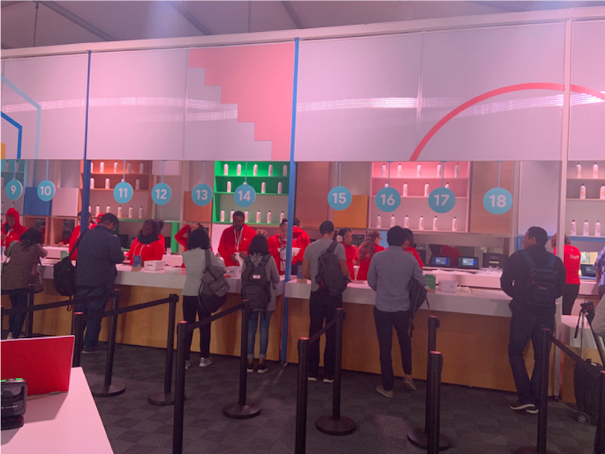
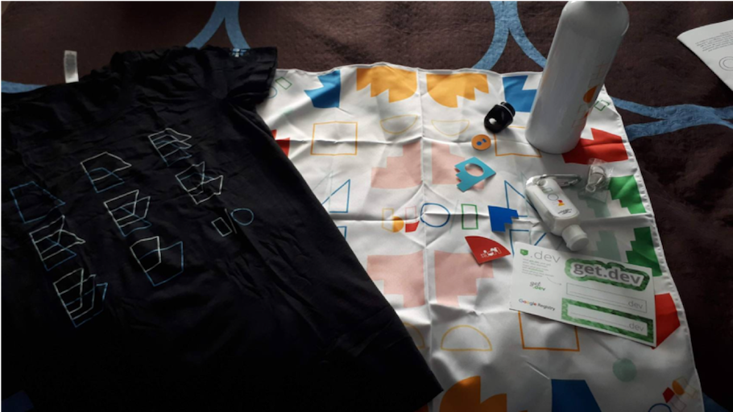
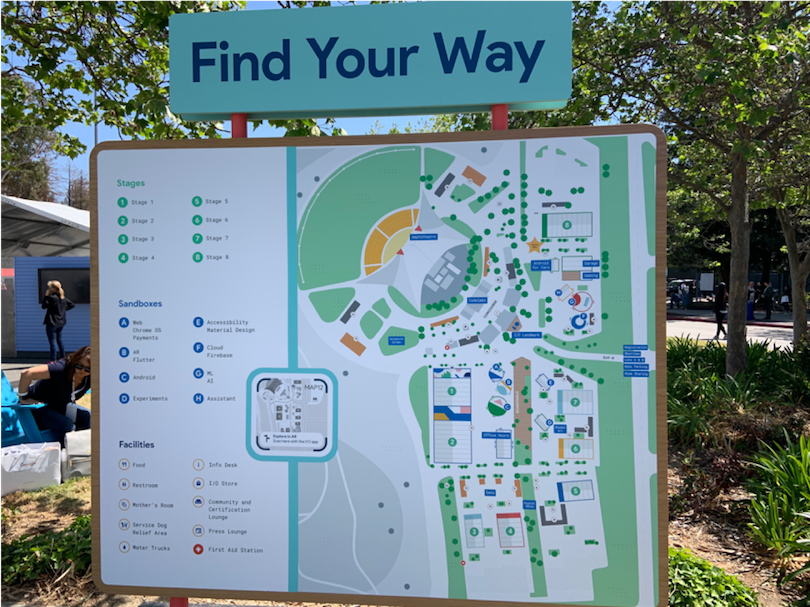
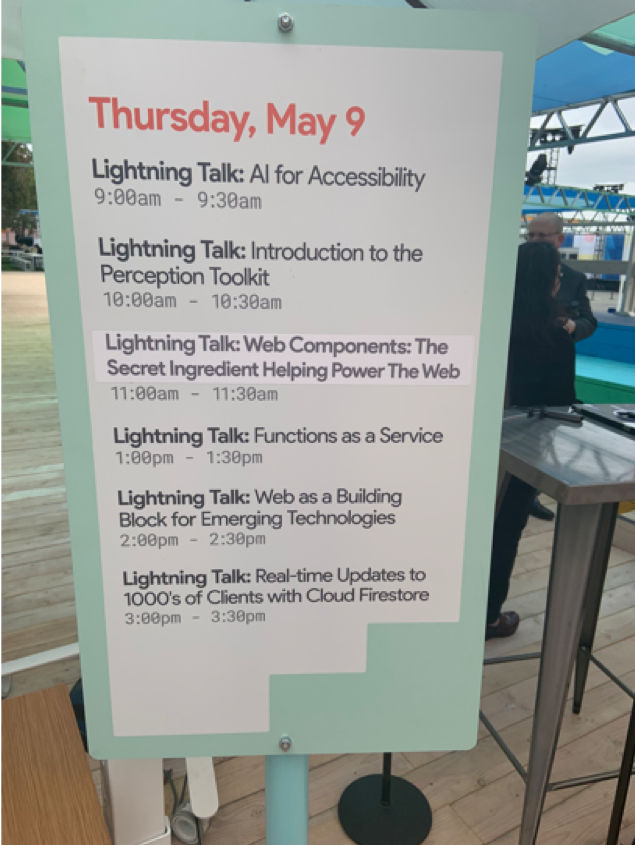
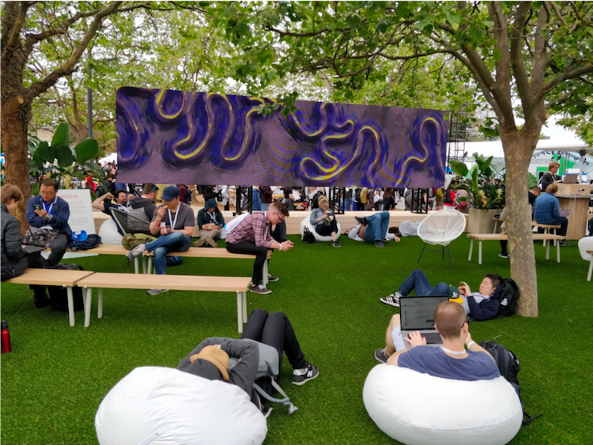
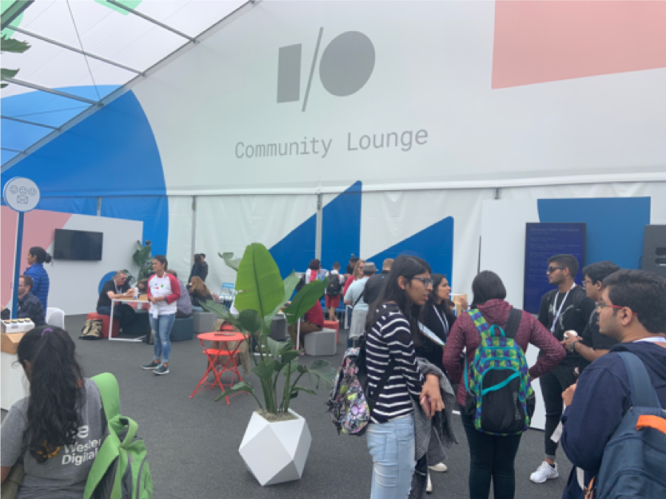
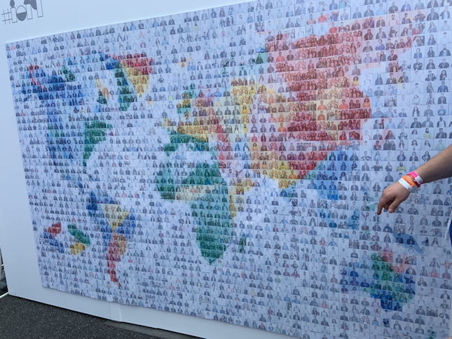

大家好我是 LINE 台灣的 Technical Evangelist – Evan Lin 。LINE內部的企業文化就是鼓勵大家勇於分享與自我學習，對於各大國內外的研討會更是鼓勵員工們去報名參加與分享。 今年很榮幸地能夠申請到在舊金山舉辦的 Google I/O 2019 ，本篇文章透過開發者關係與技術推廣部門的角度來帶著讀者們用不一點的角度來了解 Google I/O。

身為資深推廣技術工程師與開發者年會的主辦者，本篇文章一開始將先透過活動的意義與原因，到會場的周邊設施加以介紹與分享。最後透過一些機器學習的相關議程分享，希望分享給各位讀者參與 Google I/O 所帶來的饗宴。

## 什麼是 Google I/O

(圖片來自: [Wiki](https://en.wikipedia.org/wiki/Google_I/O))

Google I/O 從 2008 開始舉辦後，每年都是 Google 最大的面向全世界開發者的年度開發大會 (類似於 Google Developer Day) 。而 "I/O" 的所代表的縮寫從一開始的"輸入"(Input) 與 "輸出"(Output)到近幾年的"創新"(Innocation)與"開放"(Open)。顯示出整個大會由於參加的人數越來越多，議題也越來越多元與開放。

每一年的 Google I/O 有著來自於全世界的開發者，而在 2019 年根據[官方的數據](https://android-developers.googleblog.com/2019/05/google-io-2019-empowering-developers-to-build-experiences-on-Android-Play.html)參與的人高達了 7200 位，而且來自於各種類型的開發者，從行動裝置的 Android App 開發者，雲端伺服器與服務開發者到機器學習的資料科學家。各式各樣的開發者也是 Google I/O 每一年最令人驚豔的部分，在此身為 Developer Relations 團隊與機器學習愛好者的筆者會針對以下幾個部分來進行分享：

- 機器學習的內容分享
- 報到流程的分享
- 多采多姿的場外花絮分享

此外，同行的同事 Rene 也分享了她在 Google I/O 的一些想法"[2019 Google I/O 初體驗](https://engineering.linecorp.com/zh-hant/blog/google-io-2019/)"，在此筆者就不在多家贅述已經提過的部分。歡迎各位去這篇文章裡面查看關於 Sandbox 的一些記錄，相當的充實喔。

## 機器學習的內容分享

### Federated Learning: Machine Learning on Decentralized Data

<iframe width="560" height="315" src="https://www.youtube.com/embed/89BGjQYA0uE" frameborder="0" allow="accelerometer; autoplay; encrypted-media; gyroscope; picture-in-picture" allowfullscreen></iframe>
Federated Learning 是今年 Google I/O 的一大亮點，更是讓許多使用者與機器學習的資料專家都相當驚豔的部分。

原本在做大數據與機器學習的時候，都是由 Edge（也就是資料的產生端，比如說手機，瀏覽器， App）來傳送資料，由於需要有許多的使用者行為的偵測需求，許多的資料也都帶有敏感的個人資料。而且資料在收集與預測 ( Prediction ) 的時候也需要不中斷的網路連線，對於電池能量的消耗與資料的安全上都是很大的隱憂。

但是隨著手機的處理能力越來越快，機器學習平台 (Tensorflow Lite ) 的所需要耗電量也越來越小的的演進下，開始思考著有沒有可能部分的機器處理都在 Edge 端來處理，如此一來許多的資料不需要另外上傳到雲端整合的來處理，又能夠兼顧個人資訊的隱私與安全。 這就是 Federated Learning 的基本中心思想。  這個議程主要討論如何做到之外，也討論了哪一些方面的資料才適合使用 Federated Learning ，能夠如何透過這樣方式來讓使用者滿意度更提升。 很推薦大家好好了解。

## 報到流程的分享

身為 LINE 台灣 Developer Relations 的一員，也是 LINE 台灣年度開發盛會 TechPulse 的主辦單位之一成員。最令筆者好奇的當然就是報到流程，因為要能夠同時處理七千多人的報到流程設計上需要有許多思考的面相，接下來就讓筆者來分享所觀察到的部分：

首先在線上繳交大會費用之後，就可以獲得註冊的 QR Code  一組，而當初在刷卡填寫個人資料的時候也會一起的填寫個人的衣服尺寸大小。（當然還有參加者的姓名）

當天在經過了層層嚴格的安全檢查之後，就會到了這個註冊的帳篷。裡面其實相當的大，也有 20 ~ 30 位左右的工作人員幫忙指引與分流。

每個人都需要先拿出 QR Code 在這裡刷，這裡的作用主要是作為分流，因為七千多人的東西其實相當的多，這裡的電腦會告訴你該去哪一個櫃檯領取袋子。 在此同時，櫃台前面的工作人員也會收到使用者的袋子號碼。

電腦指引到櫃台前面之後，工作人員就會把參加者專屬的袋子拿出來，整個過程算是相當的順暢跟方便。

當然，最讓許多人好奇的就是這次的袋子裡面有什麼呢？就是一件 Google I/O 的衣服，一個方巾，一個水瓶，一個防曬油，還有一些小貼紙。筆者認為防曬油相當的有用，因為五月的加州真的很曬。

## 多采多姿的場外花絮分享

" Google I/O 是全世界開發者的嘉年華，全部的議程其實在線上都會直播，參加的人應該要花時間在網路不會直播的部分，多跟來自世界的開發者互動，多參與許多的互動活動" ，這些建議來自於同行的來過不少次的友人，相當的受用，在此也跟各位分享一下，這個開發者嘉年華的場外盛典。

首先先讓各位看一下，整個會場的鳥瞰地圖，可以看到除了有八個議程會場之外，還有八個 Sandboxes 裡面有相當有趣的展示與實驗性質的專案展示。在此也相當推薦大家有去的話一定要保留時間來逛逛。同事 Rene 文章 "[2019 Google I/O 初體驗](https://engineering.linecorp.com/zh-hant/blog/google-io-2019/)" 對於 AR Sandbox 有許多深入地描寫，可以去了解一下。

如果說場內議程精彩萬分的話，想想看如果有閃電秀事不是更加的精彩呢？ 在一個露天的陽台區就有專屬的閃電秀場地，這邊的閃電秀也不是讓會眾報名來講的，大多是 Google 員工或是許多知名的大師。而且就在露天的陽台上，享受著陽光來了解技術，其實是一種相當令人享受的事情。而且每一場閃電秀都是沒有錄影可以了解的，相當建議大家千萬別錯過這個機會。

Google I/O 會場到處是休閒的場所，這個地方的螢幕顯示著河川的快速模擬圖，透過機器學習的方式來模擬河川氾濫的過程。搭配著輕鬆的音樂提供給與會人士一個絕佳的休息場所。

最後分享給各位的是社群會館，也是我這幾天持續待的地方。身為開源社群的一份子，最喜歡就是去了解其他國家的人是如何來經營社群，如何來舉辦社群活動的。 Google 在這裡有些不錯的想法，透過 GDG (Google Developer Group) 的幫助下，在社群會館中有一些有趣的活動。比如說主辦單位會給參與人員問卷，上面有十個問題，主辦單位希望參加的人可以去詢問世界各地的 GDG 主辦人員。 裡面的問題可能是，請問社群多久舉辦聚會一次？在哪裡舉辦？ 通常使用什麼樣的場地來舉辦社群活動？ 類似的活動都是希望增加與會人員與開發者社群的互動，除了可以讓與會人員更加的瞭解 GDG 之外，也希望能夠吸引到更多人來加入與一起發展 GDG 。

而且在社群會館有來自全世界的 GDG 社群工作人員，大家都充滿熱情並且樂意分享在裡面其實可以補充滿滿的社群熱情。

## 小結:  I/O: Innovation and Open your mind

（圖片： 在社群會館提供，可以拍照變成相片牆的一份子，也可以跟剛認識的朋友一起拍）

Google I/O 主打的就是創意 (Innovation) 與開放 (Open) ，許多的主要概念在製作物跟相關的場地佈置上都可以感受到。對於開發者們的互動更是構思的很清楚，透過場內的議程討論，許多工作訪的互動。還有場外許多活動的想法中可以感受到來自全世界開發者的熱情。 感謝公司能夠提供給身為開發者我這樣的機會，除了了解全世界最大的開發者年會該如何舉辦之外，也更能了解在往後的活動上該如何提供與會人員更開放想法與激勵更多創意。

## LINE Developer Day 2019 啟動

身為 LINE 台灣 Developer Relations 團隊的一員，也要跟各位宣佈 LINE 全球開發者年會 LINE Developer Day 2019 將在 2019/11/20 ~ 2019/11/21 在日本的日航酒店舉辦。今年將擴大舉辦為兩天的年會，並且希望能提供許多開發者更多資訊，也希望更深入地讓技術分享給參與的人員，希望大家千萬別錯過。 

## LINE台灣持續招募中

你是有能力的開發者嗎？ 想要加入我們嗎？ 快到以下的地方尋找你有興趣的職缺。

- [LINE ](https://career.linecorp.com/linecorp/career/list?classId=228&locationCd=TW)[Taiwan](https://career.linecorp.com/linecorp/career/list?classId=228&locationCd=TW) [Careers](https://career.linecorp.com/linecorp/career/list?classId=228&locationCd=TW)