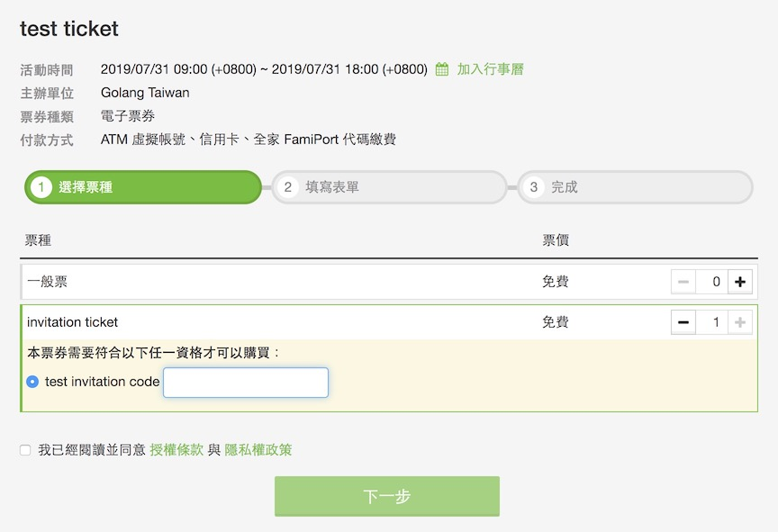
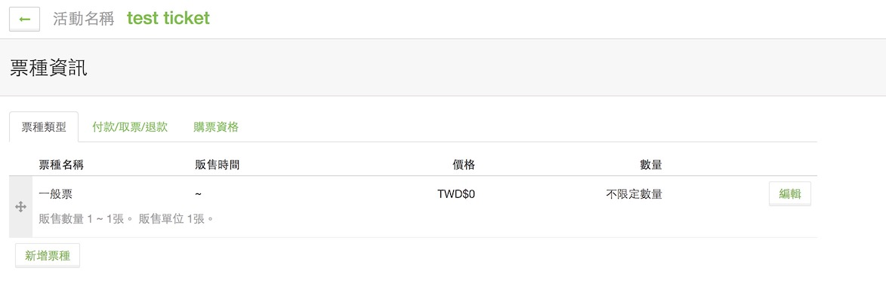
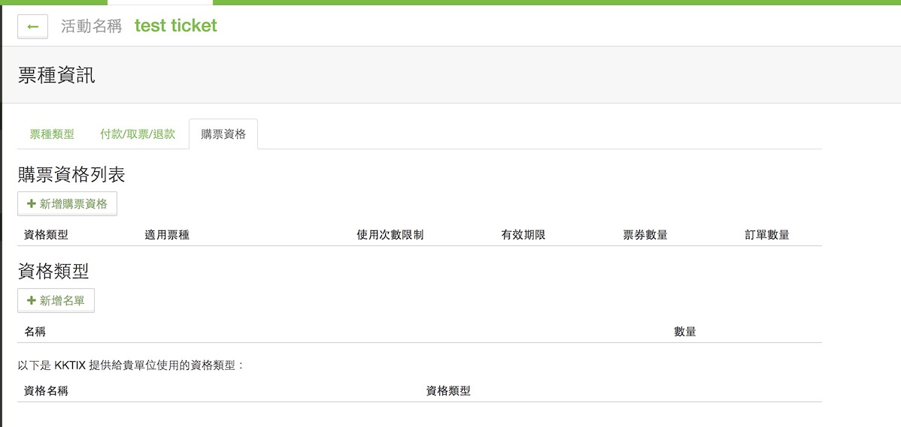
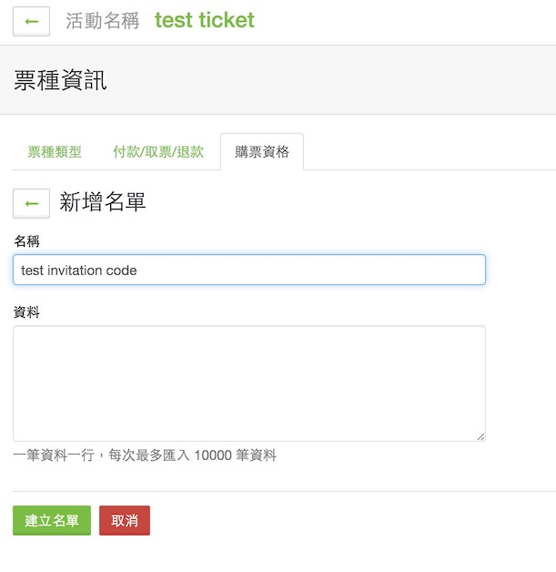
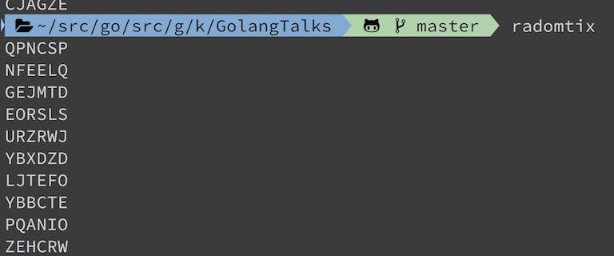
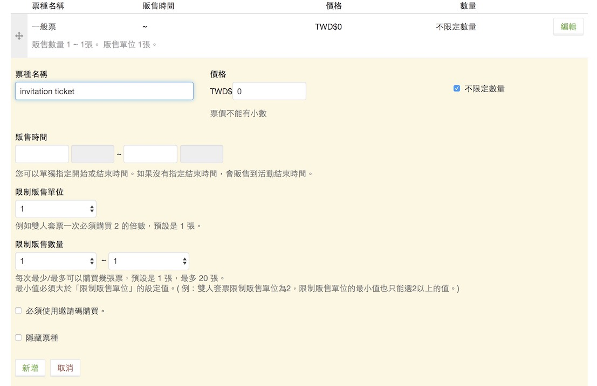
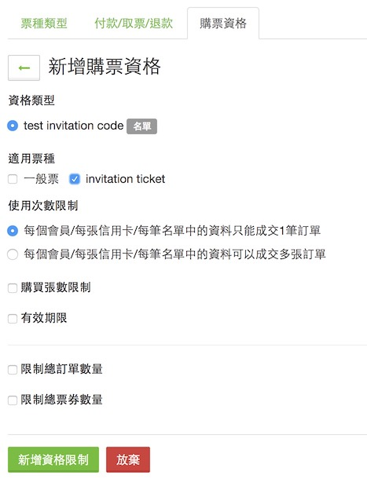
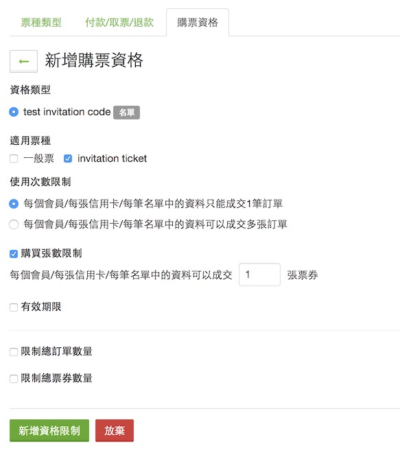

## 前言：

身為社群的共同籌劃人，每個月最基本的工作總是在不斷的開票亭，找講者跟舉辦 Meetup。而在舉辦 Meetup 的時候，總是希望可以開放一些邀請票給某些特定的族群（內定名單，工作人員，講者）不需要透過搶票就可以直接拿到票卷，但是 KKTIX 原本的邀請碼是需要透過付費的方式來達成。

其實不用那麼麻煩，可以透過「購票資格」的方式來達成，本篇文章希望能夠幫助有一些人能夠更快的了解。

最後把以前常用的邀請碼建立小工具也開源出來，大家可以拿來用。 

#### [建立邀請碼小工具 https://github.com/kkdai/radomtix](https://github.com/kkdai/radomtix) 

## 流程:

- 首先先到購票資格去新增一個購票資格，也就是邀請碼的意思。

- 這裡點選「新增名單」

- 所謂的名單可以透過「邀請碼」或是某些特殊文字來讓使用者填寫，這裡開始填寫邀請碼。

- 使用這個小工具 [建立邀請碼小工具 https://github.com/kkdai/radomtix](https://github.com/kkdai/radomtix)
- 隨機是 10 個長度為 6 的邀請碼，全部大寫的原因是因為比較不會誤會。（大小寫混用容易搞錯）

- 這時候回到票種去新增一個新的票種

- 請注意 "必須使用邀請碼購買" 不要打勾

  

- 購票資格這裡，就把"Invitation ticket" 跟 "test Invitation code" 連接在一起。

- 建議可以有購買限制，這樣一個邀請碼只能買一張票。

## **Reference:**

- [建立邀請碼小工具 https://github.com/kkdai/radomtix](https://github.com/kkdai/radomtix)