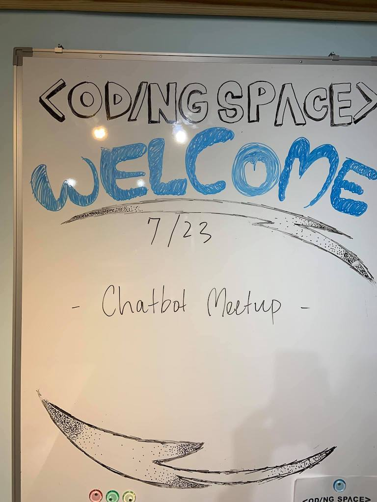
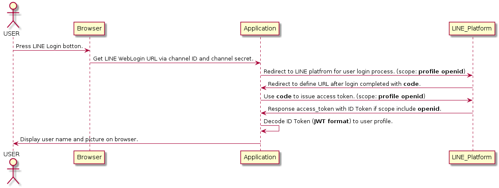

# 前言

大家好，我是 LINE Taiwan 的 Technical Evangelist - Evan Lin。這次很開心受到 chatbot 社群的邀請，參加了 "[Chatb10ts meetup 聊天機器人小小聚 11 @ 天瓏書局 Coding Space](https://chatbots.kktix.cc/events/chatb11ts)" 的聚會活動，並且分享 LINE API 更新與個人開發的心得。在此也跟各位分享本次參與的心得，並且也希望透過社群分享的力量能夠讓聊天機器人的開發動能更加的盛大。

- 社群 Chatbots Meetup： https://chatbots.kktix.cc/ 

- 本次活動網頁:  [活動網址](https://chatbots.kktix.cc/events/chatb11ts)

由於 Chatbots Meetup 本身屬於社群自主性的活動，裡面也有許多社群朋友所贊助的閃電秀。裡面的所有內容也是相當的難得與有趣。也希望能夠透過本篇文章讓大家稍微了解 Chatbots Meetup 社群閃電秀的魅力。

##  LINE Social API in Go / 資深開發技術推廣工程師 Evan Lin

#### [投影片](https://speakerdeck.com/line_developers_tw/line-social-api-in-go)

首先先跟所有的來賓分享新的 [LINE Login API 更新](https://developers.line.biz/en/news/#new-messaging-api-endpoints-for-friend-statistics-2019-07-08) 並且也分享透過更新後的 API 所撰寫的範例網站 [https://login-tester-evan.herokuapp.com/](https://login-tester-evan.herokuapp.com/) 。 透過以下三個新的 API 可以讓你更了解聊天機器人的相關訊息，分別有：

- [Get number of message deliveries](https://developers.line.biz/en/reference/messaging-api/#get-number-of-delivery-messages)
- [Get number of followers](https://developers.line.biz/en/reference/messaging-api/#get-number-of-followers)
- [Get friend demographics](https://developers.line.biz/en/reference/messaging-api/#get-demographic)

由於是新的 API 所以 LINE BOT SDK 相關開源套件還沒有加入這些 API ，如果讀者也是開源貢獻者的話，也歡迎各位直接到各個語言的 SDK 去貢獻。  (參考: [Python](https://github.com/line/line-bot-sdk-python/pull/198), [Go](https://github.com/line/line-bot-sdk-go/pull/172))

第二個部分就是透過 [Social API](https://developers.line.biz/en/reference/social-api/) 來完成 LINE Login 的流程，因為 [Social API](https://developers.line.biz/en/reference/social-api/)  並沒有官方套件提供給大家來使用，在這裡開發了一個 [LINE Social API Go](https://github.com/kkdai/line-social-sdk-go) 套件來方便大家開發使用，並且也有更多的詳細內容在於如何透過 [Social API](https://developers.line.biz/en/reference/social-api/) 來開發一個 LINE Login 的範例文章[在這裡](https://www.evanlin.com/line-login2/)。 

想要直接感受的開發者也可以直接透過 https://login-tester-evan.herokuapp.com/ 這個網站來做一些測試與了解。 首先在這裡分享透過 [Social API](https://developers.line.biz/en/reference/social-api/)  兩種的取得使用者資訊的方式，分別為： 透過 OpenID 的方式與透過 Social API 。

### 使用 OpenID 來取得使用者資訊

以上循序圖是根據 LINE 官方文件中的 ""[Integrating LINE Login with your web app](https://developers.line.biz/en/docs/line-login/web/integrate-line-login/)" 教學文件所繪製的循序圖。透過這個流程可以了解，如果在 scope 之中指定好了 `openid`之後拿到的 access token 之中就會有一個欄位稱為`ID Token` 可以透過這個欄位來解析出使用者的資訊。

### 使用 Access Token 來取得使用者資訊

以上循序圖是透過 Access Token 再去取的使用者資訊的方式。如果是透過 access token 要做，需要再透過 access token 去呼叫 Social API 的 [Get user profile API](https://developers.line.biz/en/reference/social-api/#get-user-profile)(`https://api.line.me/v2/profile`) 的方式來取得使用者的資訊。 跟前一個方式不同的是，雖然還需要多呼叫一次來取得使用者資訊。

這次的分享主要介紹了一個方便各位使用 LINE Social API 的 SDK 套件，並且詳細解釋了 LINE Login 的兩種取得使用者資訊的方式。

#### 更多相關內容:

- [LINE Login 跟 LINE Social API: 學習透過 OpenID 與 access token 來取的使用者資訊的方式](https://www.evanlin.com/line-login2/)

- [https://github.com/kkdai/line-social-sdk-go](https://github.com/kkdai/line-social-sdk-go)

- [https://github.com/kkdai/line-login-go](https://github.com/kkdai/line-login-go)

## Live Coding 使用 dialogflow + Google Cloud Run 實作 LINE Bot - LINE API Expert, Wolke

由 LINE API Expert - Wolke 所帶來的分享，就是現場帶著觀眾透過 DialogFlow 來部署 LINE Bot 。整個內容從對於 DialogFlow 的基本介紹，什麼是 Intent ，什麼又是 Entity ，再介紹如何透過 DialogFlow 串接 LINE Chatbot 的整個流程。

## LIFF 從新手入門到實戰經驗分享, LINE API Expert, iCook CTO, Richard Lee

#### [投影片](https://docs.google.com/presentation/d/16aX1-h-jn7CreexoG-Gb-jvJ2ulh17p-9kMEIU1IcFo/edit?usp=sharing)

接下來同樣身為 LINE API Expert 的 Richard Lee 則帶來了 LIFF 從新手入門到實戰經驗的分享，相當清楚地從 LIFF (LINE Frontend Framework) 的基本介紹，到分享 iCook 當初導入 LIFF 的時候所遇到的一些問題。並且也分享了一篇完整的技術文章，透過 vConsole 來 Debug LIFF 的實作介紹，也歡迎大家可以去了解一下。

## 閃電秀

講解完了主要三個講者之後，接下來就是介紹這個社群最有魅力的部分就是閃電秀。所有的閃電秀可以參考這篇共筆文章  [https://beta.hackfoldr.org/chatbot/](https://beta.hackfoldr.org/chatbot/)  ，由於都是五分鐘的閃電秀，主要內容快速用條列介紹給各位：

- **結合MQTT 以及 LINE API 的快問快答機器人/ NiJia**
  - 身為主辦人之一的 Nijia 首先帶來如何透過 MQTT 一個在 IOT 經常使用的輕薄傳輸協定來讓 Device 可以跟 API server 溝通的方式。
- **CUI：如何做出一個不難聊的機器人 / Estelle（小凹）**
  - 投影片：
    - https://drive.google.com/file/d/17jX0UFMkkSz96RcYtv6egYv30CbDkUyi/view?usp=sharing
  - 內容分享：
    - 這一場演講分享了如何設計一個好的 CUI (Conversational User Interface) 來讓你的使用者能夠喜歡跟你的聊天機器人互動與溝通，不會因為難聊而容易中斷與停止整個互動的過程。
- **小小技巧：開發時使用 ssh 作為免費的 ngrok pro / Patrick Liu**
  - 介紹開發 LINE Bot 經常使用到的 ngrok 的使用心得。
- **kamigo: chatbot MVC framework based on rails / 卡米哥**
  - Github:
    - https://github.com/etrex/kamigo
  - Demo:
    - https://kamigo-demo.herokuapp.com/menu
  - 內容分享：
    - 最後一位閃電秀的講者，同時也是身為 LINE API Expert 的卡米哥，本身也是知名 LINE Bot 「卡米狗」的作者則帶來了一個新的套件 Kamigo 也就是基於 Ruby and Rails 的 LINE Bot framework。透過 Kamigo 這個套件可以很快速地在 Ruby and Rails 上面快速部署出一個 LINE Bot 。

## 活動小結

社群分享永遠是讓創意激盪的最佳方式，而 Chatbots Meetup 是一個很熱情與充滿創造力的社群組織。也希望有更多有創意的開發者願意加入 LINE Chatbot 的開發行列，更希望能熱情的參與社群的活動與一起來分享。

立即加入「LINE開發者官方社群」官方帳號，就能收到第一手Meetup活動，或與開發者計畫有關的最新消息的推播通知。▼

「LINE開發者官方社群」官方帳號ID：@line_tw_dev

## 關於「LINE開發社群計畫」

LINE今年年初在台灣啟動「LINE開發社群計畫」，將長期投入人力與資源在台灣舉辦對內對外、線上線下的開發者社群聚會、徵才日、開發者大會等，預計全年將舉辦30場以上的活動。歡迎讀者們能夠持續回來察看最新的狀況。詳情請看 [2019 年LINE 開發社群計畫活動時程表 (持續更新)](https://engineering.linecorp.com/zh-hant/blog/line-taiwan-developer-relations-2019-plan/)https://engineering.linecorp.com/zh-hant/blog/line-taiwan-developer-relations-2019-plan/)