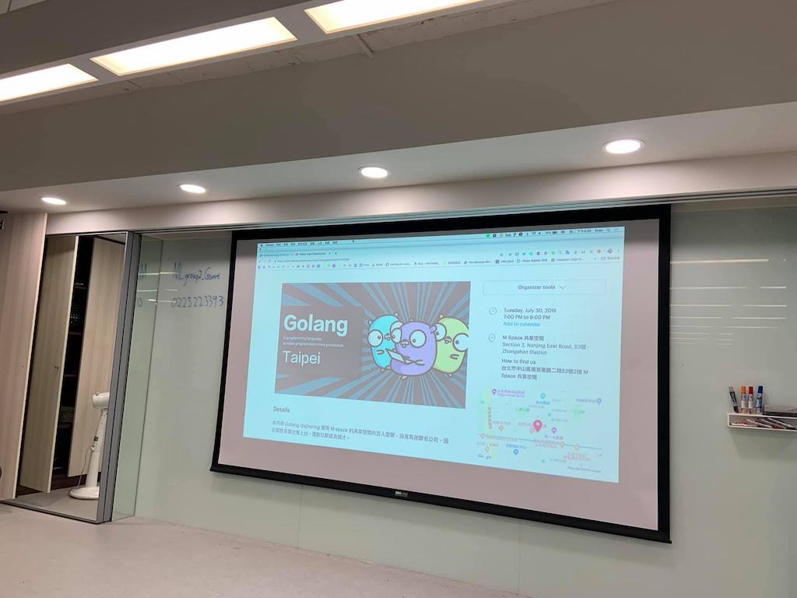
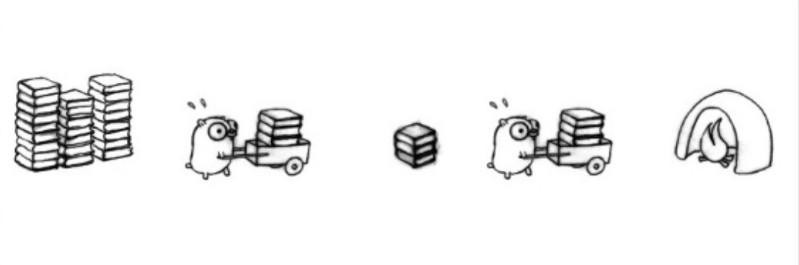

# 前言

大家好，我是 LINE Taiwan 的 Technical Evangelist - Evan Lin。這次很開心回到 Golang 社群參加了 "[GolangTaipeiGathering#423](https://www.meetup.com/golang-taipei-meetup/events/262192288/)" 的聚會活動。

- 社群 GolangTW Meetup： https://www.meetup.com/golang-taipei-meetup/

- 本次活動網頁:  [活動網址](https://www.meetup.com/golang-taipei-meetup/events/262192288/)

這次參與社群的聚會主要是希望透過分享一個資料處理上容易所面臨的問題，來解釋 Go(lang) 裡面一個經常讓人困擾的問題，也就是 Buffered/UnBuffered Channel 的差異，如何應用與如何透過 Channel 來完成 Data Pipeline 。


##  Introducing the go channel and pipeline buffered/unbuffered channel / 資深開發技術推廣工程師 Evan Lin

#### [投影片](https://go-talks.appspot.com/github.com/kkdai/GolangTalks/introduction-channel-2019/gochannel.slide)

以前在做 Machine Learning Platform 的時候，有機會可以開發資料處理的 pipeline 。開發能處理資料處理的相關功能的時候，最重要的就是希望能夠讓資料處理的速度能夠越快越好。假設一張照片要做人臉判斷的話，正常的做法是讀取圖片（假設需要花費時間 `100 ms` ) 然後將圖片做人臉判斷 ( `300 ms` ) ，最後要將資料儲存在資料庫或是中介媒體（檔案）（`10 ms`) 。這樣可能一個圖像檔案需要花費 `100 + 300 +10 = 410 ms` 的時間，如果要處大量的數據的時候，這樣的時間花費就無法計算。 所以這時候就需要透過 goroutine 與 channel 來大量處理這些資料。 接下來就從頭來稍微解釋 Buffered/UnBuffered Channel 的差異與使用方式。


### Buffered/UnBuffered Channel

通常在講解 goroutine 與 channel 的時候，最常與人討論與瞭解的問題就是「什麼是 UnBuffered Channel ，什麼又是 Buffered Channel ? 兩者的差異與應用的地方在哪裡？」。在講解 Buffered 與 UnBuffered 之前，先來了解 Channel 具有的基本特性：

- Channels are goroutine safe
- Channels carry messages between goroutines
- FIFO semantics
- Channels cause blocking and unblocking

接下來讓筆者透過幾個範例來讓讀者能有清楚的了解：

首先先來舉個 UnBuffered Channel :

<script src="https://gist.github.com/kkdai/a8ebc0ddb15e5f8f58b8ff14d1249747.js"></script>
這個範例可以在 [Playground](https://play.golang.org/p/JgviYTojtWS) 直接執行。

這是一個簡單的 UnBuffered Channel 的使用範例，使用的方法就是在 main() 裡面呼叫一個 goroutine 去將一個 channel `ch` 給值 (send) ，而最後就在從 `ch` 接受（receive) 數值。

這邊有一些小地方需要注意：

-  由於是 UnBuffered Channel 所以傳送 (send) 與接受 (Receive) 都會造成 block ，尤其當 UnBuffered Channel 已經在傳送一個數值的時候，傳送第二個數值的話就會造成 goroutine block 必須等待數值被接受( Receive ) 之後才能繼續處理。
-  如果在 `main()` 對於 unbuffered channel 傳送值 (send) 卻沒有接受 ( Receive) ，則會造成 deadlock detector 偵測到而報錯 `fatal error: all goroutines are asleep - deadlock!` ，但是在 goroutine 裡面卻不會產生錯誤，因為只會產生 goroutine leak 。（備註： 如果有呼叫到 `libsystem` 的 function call 也不會，可以參考 [Go issue 33004](https://github.com/golang/go/issues/33004) )
-  如果對於一個已經 closed channel 去給值 (send) 會發生問題，但是拿值只會拿回 empty value 。

接下來，對於 Buffered Channe.l 也舉一個例子：

<script src="https://gist.github.com/kkdai/a5bb1b9eed8df0cd3b154763a7761290.js"></script>
相關的範例可以在 [Playground](https://play.golang.org/p/8g-ZQWoDdmi) 直接執行。

第二個範例就是一個簡單的 Buffered Channel 的範例，比對前一個範例可以了解 Buffered Channel 比起 UnBuffered Channel 可以 send 與 receive 更多數值而不需要 wait （或是說 block) 。 也因為這樣的方式，其實在使用上，通常會建議需要同步處理的資料，建議放在 Buffered Channel 裡面，可以讓數個 goroutine 針對一個 Buffered Channel 來做資料的操作。



### Golang Pipeline pattern

接下來來講解一個經常在資料處理上的方式，就是透過 channel 來做 pipeline 的處理。這裡要舉一個在 Golang Blog: [Go Concurrency Patterns: Pipelines and cancellation](https://blog.golang.org/pipelines) 裡面的範例：

<script src="https://gist.github.com/kkdai/1313cb35a523c0d67bef4b4960ef859a.js"></script>
相關的範例可以在 [Playground](https://play.golang.org/p/Zerr7phrGqn) 直接執行

這是一個簡單的範例來透過 UnBuffered Channel 來將資料逐一的傳遞到各個函式之間。這個範例主要是透過輸入一連串的數字，`gen()` 將其送入 channel 之中，而 `sq()` 將其從 channel 收到後，將數值平方之後再送到另外一個 channel ，而最後就拿這個 `out` channel 來將接受到的數值列印出來。

這個範例可以注意以下幾件事情：

- pipeline 中的每個函式的共通樣式都是，建立一個輸出的 channel ( `out` ) ，透過 goroutine 接受輸入的 channel ( `in` )  。
- 由於是透過 UnBuffered Channel 來傳遞資料，所以每次只有一個會處理。透過以上的範例，會先處理 `2` 然後再處理 `3` 。

透過 Pipeline pattern 在處理資料的時候有以下的好處：

- 每個處理函式可以專心的功能部分。
- 由於是 pipeline 的處理，每一個處理的步驟可以做疊加或是順序調整。


最重要的就是可以透過 goroutine 來讓資料處理的 pipeline 變成多線程（ multiple threading ) ，細節將在接下來講解。


### Advanced Pipeline patterns 

在 Pipeline 的進階 pattern 裡面有以下幾種：

- **Fan-In:**
  - 將多個 channel 併入為單獨一個 channel 。主要用於在 Fan-Out 之後，要將資料統一並且收集回來的處理方式。
- **Fan-Out:**
  - 相反的，就是將單獨 Channel 裡面的資料分散傳送到多個 Channel 裡面，主要用於準備平行處理的前置作業。

主要的應用場景就是，透過 Fan-Out 的方式將資料傳送到多個 Channel 之中，這樣的話可以透過個別 Channel 再來串接相關的 Pipeline （或是平行處理相同的 Pipeline ) ，最後再透過 Fan-In 的方式將平行處理完的資料整理到一個 Channel 之中，作為之後的資料儲存或是相關的處理。

作為舉例上， Fan-In 的相關範例程式碼如下：

<script src="https://gist.github.com/kkdai/6f015023e037faf17a28e51e231489d8.js"></script>
在 [Playground](https://play.golang.org/p/VoZdosxo9AR) 上查看完整可以運行的程式碼。

在 `merge()`的處理上，會使用 `sync.WaitGroup` 來處理 goroutine 裡面需要等待來正確的關閉 `out` ，並且透過多個 `go output(c)` 來透過 goroutine 分別處理資料的整合。 

####  Explicit cancellation 

此外，除了 Fan-In 與 Fan-Out 之外，因為 Pipeline 的資料處理上經常都是需要比較長的時間，也有可能在處理到一半的時候需要將整個流程暫停或是取消的情況。這時候會需要使用 Explicit cancellation 的方式，拿前一段的 `merge()`做一些以下的修改：

<script src="https://gist.github.com/kkdai/5ebd101a40a2472301a6a16f40d36918.js"></script>
完整可執行的程式碼可以在 [Playground](https://play.golang.org/p/Zwy6mZgWvE9) 裡面看到。

透過這段代碼可以了解，傳入的參數 `done chan struct{}` 主要就是透過 UnBuffered channel 來做邏輯的控制，而其中的:

```
for n := range c {
            select {
            case out <- n:
            case <-done:
            }
        }
```

更是主要控制是否要停止的邏輯判斷， `select` 在 Go 裡面的用法相當有彈性，除了可以做情況的判斷之外，更可以有多樣的 Pattern 可以使用，其中這個範例就是最常在 goroutine 裡面會使用到的。有兩種狀況可以判斷，而 `select` 自動會走到不造成 block 的那個判斷式。也就是說，如果當 `done` channel 裡面有數值可以接收的話，那麼就不會等待 `out` channel 數值接收。


### 好用的 pipeline package -  Go-kit

https://github.com/go-kit/kit 是一個很好用的套件工具，裡面提供了許多有用的小工具，包括了 [circuitbreaker](https://github.com/go-kit/kit/tree/master/circuitbreaker) ，[ratelimit](https://github.com/go-kit/kit/tree/master/ratelimit) 等等有用的工具。 但是其實裡面有一個好用的 pipeline 套件稱為 [endpoint](https://github.com/go-kit/kit/tree/master/endpoint) 。

這邊有一段範例程式碼，在 [Playground](https://play.golang.org/p/_WDD1L6RwJT) 展示了如何使用 go-kit 的 [endpoint](https://github.com/go-kit/kit/tree/master/endpoint) 套件，來實做一個簡單的 pipeline 的功能。 這邊可能讀者也會發現： 什麼時候開始也可以在  [Playground](https://play.golang.org/p/_WDD1L6RwJT)  使用 3rd party 的套件呢？

<blockquote class="twitter-tweet"><p lang="en" dir="ltr">The <a href="https://twitter.com/hashtag/golang?src=hash&amp;ref_src=twsrc%5Etfw">#golang</a> playground now supports third-party imports, pulling them in via <a href="https://t.co/IrUZXimjCk">https://t.co/IrUZXimjCk</a> ... <a href="https://t.co/5Ng5JXpggq">https://t.co/5Ng5JXpggq</a> 🎉<br><br>Multi-file support &amp; few other things up next.<br><br>Report bugs at <a href="https://t.co/kZELNa2yzY">https://t.co/kZELNa2yzY</a> or here on the tweeters.</p>&mdash; Brad Fitzpatrick (@bradfitz) <a href="https://twitter.com/bradfitz/status/1128069715455123457?ref_src=twsrc%5Etfw">May 13, 2019</a></blockquote> <script async src="https://platform.twitter.com/widgets.js" charset="utf-8"></script>
根據這個 [tweet](https://twitter.com/bradfitz/status/1128069715455123457) ，原來 2019 的五月之後 [Playgound](https://play.golang.org) 的功能有更新過已經支援 thrid-party import 了。這樣透過 [Playground](https://play.golang.org) 來討論問題也就變得更方便。

### Go-kit endpoint Pipeline + Buffered Channel 

最後讓透過 Go-kit 的 endpoint 的 pipeline 套件與 Buffered Channel 的概念，來實做一個簡單的讀取圖片的 Pipeline 。

<script src="https://gist.github.com/kkdai/73c61f168aede0eced747f6c88485e8c.js"></script>
這個範例程式碼透過輸入的 `numOfImageReaders` 來在判斷需要多少的 goroutine 來處理相關的功能，也就是 `ImageReader(in, out)` 。並且預設 Buffered Channel 的大小是 1000 來讓所有的資料都可以馬上被處理而不需要等 pipeline 後端處理完畢。

### 小結：

本文透過介紹 Buffered/UnBuffered Channel 的介紹來詳細解釋 Pipeline pattern 並且透過一個實務上的案例（照片的資料讀取與處理）來解釋如何應用 Channel 來完成 Pipeline 。


### 更多相關內容:

- Go Concurrency Patterns: Pipelines and cancellation https://blog.golang.org/pipelines

- Advanced Go Concurrency Patterns https://blog.golang.org/advanced-go-concurrency-patterns

- Understanding Channels 
	- https://about.sourcegraph.com/go/understanding-channels-kavya-joshi
	- https://www.youtube.com/watch?v=KBZlN0izeiY
	
- [Go: issue 33004 - Deadlock detector will disable when use Mac OSX (channel with net.http, no deadlock, why)](https://github.com/golang/go/issues/33004) 

  - [Go Issue 29322 runtime: PIEs don't detect deadlocks #29322](https://github.com/golang/go/issues/29322)

  

## Refactoring in Goland for beginner / Julian Chu

本文主要是透過 JetBrains 的產品 Goland 來快速地幫助開發者做重構 (Refactoring) 的相關工作。 相關的影片條列如下：

- https://youtu.be/oCgoxqDS2tM 
  - 利用GoLand重構， 最後面利用move這個重構把struct跟method搬到其他package (move上次沒demo到)
- https://youtu.be/QTgpVx4bVbk 
  - 利用test + auto complete生成struct跟method

整理一下相關問題:

- GoLand怎麼切換tab:
  - GoLand(alt + left/right, 或ctrl+tab)
  - VScode(ctrl + page up/down)
  - vim/VScodeVim/ideavim( g + t/T)
- GoLand可以自動載入vimrc嗎還是一定要source:
  - 可以，不過路徑跟名字有限制，ideavim會自動載入`~/.ideavimrc`　
  - 更多細節在
    https://github.com/JetBrains/ideavim#files

相關貼文可以參考：

- https://www.facebook.com/groups/269001993248363/permalink/1388935217921696/
- https://www.facebook.com/groups/269001993248363/permalink/1384468938368324/


## 活動小結

每次到投影片靈感枯竭的時候，就會回 Go Taipei Community 去取暖。去講一場技術分享會讓我覺得格外的心情開朗，感謝當天的夥伴們熱情的討論，也歡迎大家一起來了解。

身為 Golang.TW 的共同籌辦人，真的很久沒有回到社群來單純的給一場技術的分享。藉由這次機會除了能夠分享之外，也能順便回來社群看看好久不見得夥伴們。 


立即加入「LINE開發者官方社群」官方帳號，就能收到第一手Meetup活動，或與開發者計畫有關的最新消息的推播通知。▼

「LINE開發者官方社群」官方帳號ID：@line_tw_dev

## 關於「LINE開發社群計畫」

LINE今年年初在台灣啟動「LINE開發社群計畫」，將長期投入人力與資源在台灣舉辦對內對外、線上線下的開發者社群聚會、徵才日、開發者大會等，預計全年將舉辦30場以上的活動。歡迎讀者們能夠持續回來察看最新的狀況。詳情請看 [2019 年LINE 開發社群計畫活動時程表 (持續更新)](https://engineering.linecorp.com/zh-hant/blog/line-taiwan-developer-relations-2019-plan/)https://engineering.linecorp.com/zh-hant/blog/line-taiwan-developer-relations-2019-plan/)