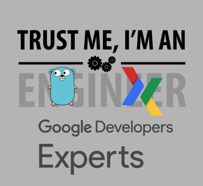
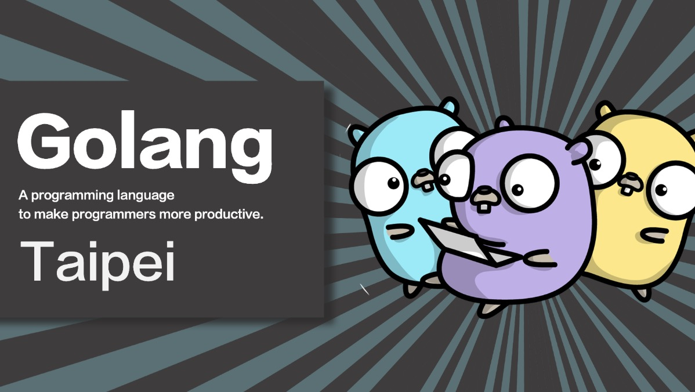

# 前言

三年前（2016/08/21）第一次報名的大型研討會演講，就是在 [COSCUP 講「如何透過 52 個專案來學習 Golang 」](http://coscup.org/2016/schedules.html#H06) 。 之後就是舉辦 [golang.tw](https://golang.tw) 的社群活動，並且在許多地方持續地講解跟 Golang 相關的議題 （參看我投影片整理鏈結 [https://github.com/kkdai/slides](https://github.com/kkdai/slides)）。 終於也在三年後的同一天，就在 Go 在五月之後正式成為 GDE 的項目之一之後，筆者通過了 Google 的相關面試成為 Golang 全球首波的 Google Developer Expert  的一員。 


這篇文章會跟各位分享一下什麼是 GDE (相關的權利跟義務)，並且不免俗的在這篇文章裡面會再介紹一次什麼是 Golang (大多是投影片整理)，最後分享該如何成為 Google Developer Expert 。

# 什麼是 GDE (Google Developer Expert)

 Google 擔任 Developer Relations Program Manager - Eric 這篇文章不能錯過 ( [為什麼你應該申請成為 Google Developers Experts (GDE)](https://medium.com/@ericsk/%E7%82%BA%E4%BB%80%E9%BA%BC%E4%BD%A0%E6%87%89%E8%A9%B2%E7%94%B3%E8%AB%8B%E6%88%90%E7%82%BA-google-developers-experts-gde-58cf7c361f62) ) ，為了保持資料正確性，在此都會節錄一些官方統一宣傳的義務跟權利。

## 成為 GDE 後的福利

GDE 計劃以及背後支持的產品單位會依據當時的資源與活動狀態來安排活動或給予 GDE 福利。平時您可以與您所在地區的 Google Developer Relation Regional Lead 來討論活動的各種資源協助，而以全球活動來說 ：

- GDE 計劃每年都會舉辦至少一次全球峰會（GDE global summit），可以認識其他一樣有熱情的人（興奮）。
- 邀請該領域的 GDEs 參加 beta program / focus group / … 等活動來與 GDEs 們互動，讓 GDEs 有一定的份量能影響產品或技術的發展。（Golang 這邊希望可以參與更多討論跟分享）
- GDEs 可能會優先嚐試或取得 alpha/beta 期的產品或免費使用額度。
- 參加 Cloud Next 或 Google I/O 的機票住宿補助等等。 （我個人是希望有 GopherCon :p )

當然這些福利都是視情況而定。 

以上都是擷取自 Eric 的文章“[為什麼你應該申請成為 Google Developers Experts (GDE)”](https://medium.com/@ericsk/%E7%82%BA%E4%BB%80%E9%BA%BC%E4%BD%A0%E6%87%89%E8%A9%B2%E7%94%B3%E8%AB%8B%E6%88%90%E7%82%BA-google-developers-experts-gde-58cf7c361f62)，但是筆者本身的原因如下：

- **認識其他 GDE** : 就像筆者不喜歡只參加研討會而沒有機會上去講（當初去 Google I/O 其實我也弄了投影片想衝上去 XD ) ，因為想認識講者最好的方式就是當講者。你想認識其他強到爆炸的方式，就是你也要當上 GDE 跟著他們到 GDE Submit 裡面去相認。
- **讓台灣 Go 社群有更多曝光度**:  本次入選很榮幸是在全球第一批，應該也是少數的華人之一。主要當初很積極要爭取的原因，除了筆者超愛這個 Go 這個語言之外，就是也希望讓台灣 [Golang.tw](https://golang.tw) 社群能獲得更多的注意，因為每次要辦活動來找國際級的 Golang 講者都無法被注意到。 身為社群的主辦人之一，這次一些私心 :p 。

主要是這兩個個人因素，在此跟大家分享一下。


## 成為 GDE 伴隨來的義務：

```
因為這是一個鼓勵性質的計劃，計劃希望認可專業開發人員的付出，並不是要找免費的勞務資源，我們知道開發人員都有可能因為忙碌或是工作關係而無法安排太多的活動。
```

雖然沒有特別義務，但是其實 GDE 內部都有貢獻投稿系統  (Activities Submit System) ，並且你所有的活動（貢獻）都是會被所有的 GDE 來檢驗跟查看的。不過平常就有在講的人，真的可以不需要擔心相關的事情。 （像我就是 :p )


#  什麼是 Go (lang)


身為社群的主辦人之一，也是推廣的愛好者在本篇文章還是會讓大家了解一下。 根據官方 [Golang.org](htttps://golang.org) 的主要說明如下：

```
Go is an open source programming language that makes it easy to build simple, reliable, and efficient software.
```

個人主要會學習 Golang 的理由如下：

- **語法簡潔 (Simplicity)** :  讓許多有 C 語言概念的人可以輕易上手並且了解。
- **強大的 built-in standard libraries :** 包括好用的 `goroutine` ， `channels` 跟 `net/http` 都是相當好用的相關內建套件。
- **內建的測試與相關好用延伸開發者工具:**  當初為了讓開發者能夠更喜歡開發，開發團隊在相關 toolchain 上面下了相當多的苦心。 像是內建的測試 `go test` (還包含 benchmark ) ，還有文件小幫手 ( `godoc` ) ，查詢相關定義的 (`gopls` ) 都是相當好用的工具。

這邊有些我之前準備的投影片，歡迎大家取用來了解。

- [Project 52 每週一個小專案來學習 Golang](https://speakerdeck.com/kkdai/coscup-2016-project-52-mei-zhou-ge-xiao-zhuan-an-lai-xue-xi-golang)
- [In Love with Golang](http://go-talks.appspot.com/github.com/kkdai/GolangTalks/gdgfest/gdgfest.slide#1)

有哪些 Golang 相關台灣中文社群資源:



- [Golang 臉書社團討論區](https://www.facebook.com/groups/269001993248363/) （中文可以發問喔）
- [Golang Taipei Meetup](https://meetup.com/golang-taipei-meetup/) （每次活動都會在這裡發布，別忘記加入喔）
- [Golang TW Github](https://github.com/golangtw)  (裡面可以求職，並且有每次投影片紀錄)


# 如何成為 Go(lang) GDE (How to become Go GE)

講了那麼多福利跟好東西，想必各方 Golang 好手都想要一起來當 GDE (Google Developer Expert ）。 大致上的經過流程經過以下幾個過程，詳細的文章相當建議各位看看以下文章:

- [How to Become a Google Developer Expert (GDE) — A Practical Guide](https://medium.com/@jeffdelaney/how-to-become-a-google-developer-expert-gde-a-practical-guide-83621d2c8087)
- [為什麼你應該申請成為 Google Developers Experts (GDE)](https://medium.com/@ericsk/%E7%82%BA%E4%BB%80%E9%BA%BC%E4%BD%A0%E6%87%89%E8%A9%B2%E7%94%B3%E8%AB%8B%E6%88%90%E7%82%BA-google-developers-experts-gde-58cf7c361f62)

幫各位整理以下的一些重點：

- **自我評估:** 
  - 你喜歡分享 Golang 相關的演講嗎？  你喜歡寫相關的 Golang 文章嗎？ 你有常來 Golang.tw 社群來分享嗎？（沒有的話，請來找我分享）身為 GDE 某種程度就是要有在幫忙宣傳與分享相關領域的技術與內容。 如果你平常沒有做類似的事情，建議你應該要開始做。 來 [Golang Taipei Meetup](https://meetup.com/golang-taipei-meetup/)  分享一個小 talk  開始吧？
- **跟 Google  Developer Relations Program Manager 也就是 Eric 談談：** 
  - 他會給你相關建議跟整理相關資料，任何台灣跟香港的人想要申請，千萬別忘記找他討論看看。別忘記！千萬不要問了又不敢投喔！！ 
- **徵選第一關社群面試：**
  - 會挑選一個資深的 GDE 跟你討論相關的貢獻部分，這邊會請你分享你的過往經驗與你如何分享。你必須要能夠有足夠的資料與熱情來表達你自己。
- **徵選第二關產品面試：**
  - 這裡就相當嚴肅了，你會分配到一位 Google 內部相關的產品員工（極大可能是工程師）跟你討論相關的技術部份。該名人員審核你對於你申請項目的了解程度，對於 Golang 也就是對於整個語言的主要概念與內部架構是否能夠熟悉。

過了這兩關就是準備 NDA 跟 T&C 就可以等著宣布。希望每個人都可以來申請喔。 可以找[上官林傑](https://www.facebook.com/ericsk0313)。

# Does your passion match your aspiration?

「你會成為 GDE 不是因為你最近的努力練習，是你已經是具有 GDE 的資格」。

一路面試過來，許多面試官都跟我講，我的印象很深刻。

許多有熱情或是看了文章之後，一股腦想要獲得這樣認證的人，我也建議你們要好好思考。因為 GDE 是一種榮耀，但是與其是一種榮耀，不如說因為你過往許多的貢獻 Google 感激你給你的相關稱號。

你本身並不會因為 GDE 變得更厲害，讓你變得厲害的是： 過往的每一場 talk ，每一個社群的活動，每一篇你努力寫出的文章，每一段你寫出的範例程式碼。 

**Does your passion match your aspiration?**  你的熱情能不能夠匹配你的心願呢？單單有熱情卻沒有辦法踏出那一步去實現，去努力完成，那麼永遠都不會成功的。

有熱情成為 Go GDE 嗎？ 先來社群開始分享吧！  有一天你也會成為一員的！

# 參考文章

- [How to Become a Google Developer Expert (GDE) — A Practical Guide](https://medium.com/@jeffdelaney/how-to-become-a-google-developer-expert-gde-a-practical-guide-83621d2c8087)
- [為什麼你應該申請成為 Google Developers Experts (GDE)](https://medium.com/@ericsk/%E7%82%BA%E4%BB%80%E9%BA%BC%E4%BD%A0%E6%87%89%E8%A9%B2%E7%94%B3%E8%AB%8B%E6%88%90%E7%82%BA-google-developers-experts-gde-58cf7c361f62)
- [Project 52 每週一個小專案來學習 Golang](https://speakerdeck.com/kkdai/coscup-2016-project-52-mei-zhou-ge-xiao-zhuan-an-lai-xue-xi-golang)
- [In Love with Golang](http://go-talks.appspot.com/github.com/kkdai/GolangTalks/gdgfest/gdgfest.slide#1)


