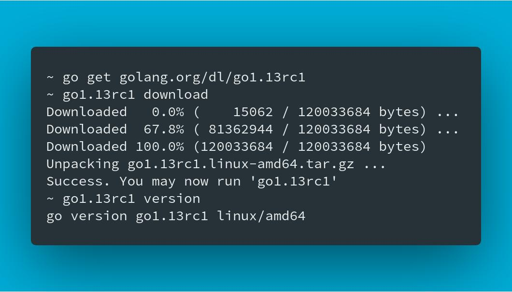

[Go 1.13rc1  在 08/22 推出](https://twitter.com/golang/status/1164276194524762113)，裡面包含了一些新的功能讓人想試試看。但是僅僅想要測試新的語言功能卻不希望更改工作環境的設定。這裡提供一個新的方式，就是直接將最新版本到 Go binary file 下載，而不直接替換你工作環境。

## Download Go binary by using `go get`

透過 `go get golang.org/dl/go1.13rc1` 的指令（後面也可以快速更換成任何你需要的版本），你就可以下載安裝檔案在你的 `$GOBIN` 下，透過執行 `go1.13rc1 download` 就會下載完整的執行檔案。 預設的安裝路徑會是 `/Users/YOUR_NAME/sdk/go1.13rc1/` 。 之後就可以透過 `go1.13rc1` 直接嚐鮮最新版本的功能。

## 安裝多個版本的 Compiler 

透過這樣的方式，你也可以快速的安裝多個版本的 Go(lang) binary 來做相關的 regression testing 或是跑一些 performance benchmark 。以下為一個簡單的範例來安裝舊版本的 Go 1.11 ：

- `go get golang.org/dl/go1.11`
- `$GOBIN/go1.11 download`

希望這些能幫助到大家，一起來嚐鮮吧！！