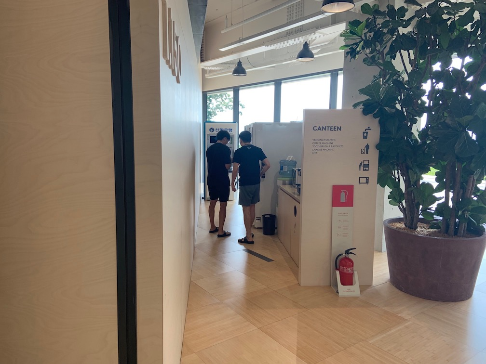

# 什麼是 AI RUSH 

大家好，我是 LINE Taiwan 的 Technical Evangelist – Evan Lin。去年於日本東京舉辦的 LINE DEVELOPER DAY 2018 會中，LINE 技術長朴懿彬以「Next LINE」定調 LINE 在技術上的發展願景，其中人工智慧、區塊鏈，與金融科技三大領域的相關技術，將扮演舉足輕重的角色，並以兩大關鍵字「串連（Connect）」與「互惠生態圈（Mutually Beneficial Ecosystem）」點出實現「Next LINE」所帶來的具體價值，讓 LINE 的服務持續進化。

為了探索 AI 的更多可能，並為 AI 開發社群提供一個切磋交流的平台，LINE 將首次與南韓市占第一的搜尋引擎 NAVER 聯手舉辦以人工智慧為主題的跨國黑客松「AI RUSH 2019」。「AI RUSH 2019」官方網站：https://ai-rush.com/

# 活動過程:

(圖片截至於 AI-Rush 官方網站)

整個 [AI-Rush](https://ai-rush.com/) 活動分成兩個大部分，線上初賽與線下的決賽。 首先線上的初賽題目為「圖像分類 (Image Classification)」的題目，參賽者必須在 08/13 之前送出第一個階段的解法，最後經過挑選出最後的決賽隊伍，前往韓國春川的 NAVER Connect One 進行總決賽。 

經過了第一階段的激烈競爭之後，透過第一階段的結算分數選出了總共三十個隊伍。要出發前往韓國來進行總決賽。 這次很開心台灣有四個隊伍進入了決賽，我也在韓國的仁川機場一路的陪伴他們往總決賽的場地勇敢邁進。

# NAVER Connect One 總決賽:

## 08/26 全員到齊

08/26 當天在仁川機場迎接台灣的四隊代表隊伍後，就直接驅車前往位於韓國北方春川的 NAVER Connect One 的決賽場地。第一天到了當地其實已經是傍晚了，稍作休息後，我們就直接到餐廳來吃晚餐。

NAVER Connect One 的餐廳其實相當的乾淨，並且有專門的人員幫忙打理所有參賽者的餐點。在這邊的餐飲讓比賽的夥伴相當的安心與滿足。 吃完了晚餐過後，不少隊伍回到房間開始討論明後天的工作分配與相關準備，可以看得出來每一個參賽夥伴都躍躍欲試的樣子。

當然活動的特製貼紙與 LINE Developer 貼紙也是不會少。會場四周都有提供滿滿的貼紙讓參賽者可以自由地取用。當然也有不少本次活動特製的 "AI RUSH 2019" 的貼紙。

## 08/27 正式開工

"AI is the new black" 是這一次比賽的 Slogan 也是取自於 [MIT Technology Review 2017 的文章](https://www.technologyreview.com/s/603748/ai-is-the-new-black/)。也就是代表著 AI 就是這個時代中最令人興奮與讓人覺得最跟得上時代的。 這也是 AI-Rush 想要參與的人都能感受到的。

這個會場是這次主要 AI-Rush 總決賽的 Hacking 的場所，在這個光線充足並且舒適的場地討論其實相當的棒，外面並且有供應源源不絕的甜點，飲料跟泡麵，讓每一個參賽的夥伴可以專心的討論與思考該如何尋找出最適合的運算方式。 就算是晚上或是半夜你都可以到這個會場中找到食物與參賽者來討論。 第一天的晚上就聽到有不少的團隊夥伴，因為半夜想吃點宵夜，於是到了會場跟大家一起 Hacking 。除了可以找靈感，也可以跟不少參與的夥伴來相互認識。

## Quiz Game

在兩天一夜的 Hacking 過程中，每一個參加隊伍都相當的緊繃，全部人都相當嚴肅的面對的電腦螢幕。為了讓每一個參與的夥伴可以除了 Hacking 也能夠盡情地參與討論與互動。 主辦單位在 10:00, 14:00, 16:00, 20:00 與 22:00 都有安排小測驗 (Quiz time) ，並且在每一個 Quiz 的獲勝者都有機會可以得到相當珍貴的相關贈品。  這樣的小測驗除了可以讓每一個參賽的隊伍稍微放鬆心情之外，也可以吸引更多的參賽者在會場跟其他隊伍的互動。 讓整個活動相當的生動有趣。

小測驗的形式分為以下數種： 

### Quiz: 小挑戰

"剪刀，石頭，布" 這是一個很有趣的互動遊戲，也是一個讓台下的辛苦參與者可以伸展身體。透過主持人手舉起來玩猜拳遊戲，必須要贏過主持人（如果平手也被視為是淘汰），才能晉級。剩下最後的幾位才有機會來前面領取相關的贈品。

也有其他有趣的小挑戰：

- 看兩張圖片找出不同的點。
- 猜猜圖片是誰的照片。
- 一些關於 LINE 的小歷史。

這些小活動的設計，除了可以讓會場的參與夥伴們有相關的互動之外，也紓解了競賽所產生的緊張氣氛。讓每個參賽者可以更認真的面對問題。

### Treasure hunting

 

除了有趣的小 Quiz 之外也有尋寶遊戲。主辦單位在活動會場周圍與餐廳的四周有隱藏有一些小紙條，只能能夠找到這些小紙條，也可以在每天的結尾前跟主辦單位來兌換相關贈品。 所以可以看到許多的參加隊伍除了在會場 Hacking 之外，也可以看到他們在會場與餐廳的周圍不斷地尋找相關的“寶藏“，畫面相當的有趣。

### 贈品

為了讓參賽者更能夠盡情享受互動的 Quiz 與 Treasure Hunting ，主辦單位的贈品準備的相當豐富。 想必每一位參賽者應該都收穫滿滿的。

##  08/28 名次揭曉與頒獎

激烈的競賽總是有揭曉的一天，最終恭喜來自於日本的團隊獲得了第一名的殊榮，第二名來自於東京大學的同學而第三名則是來自於韓國的同學。 這三個團隊也都樂於分享，也都在台上分享了如何分析資料，並且透過對於資料的了解方式來分享得到高分的技巧。 

## 08/29 放鬆之旅

最後一天為了所有的參賽者安排了輕鬆的行程，工作人員們安排了韓國的鐵道自行車旅遊。整段旅程有接近兩個小時的放鬆行程，除了可以觀賞漂亮的鐵道風景之外，也有一些隧道有獨特的感受。每一個參賽者也都放鬆下盡情的享受韓國美麗的風景。

午餐則是選擇有名的春川雞，在具有風味的韓國餐廳之內享受韓國春川的風味餐點。每一個參加者都告訴我三天的行程下來，除了寫程式 Hacking 之外，大概就是不斷的吃東西。不論是 NAVER Connect One 的美食，小餐點甚至到了最後一天的春川雞。每一個參賽者都感受到主辦單位的用心與韓國的美食。

# 活動小結

一整個月的活動，最終選出了來自全世界的三十對決賽隊伍。三天密集的總決賽除了感受到每一個參賽團隊的熱情，更可以感受到大家對於追求最佳數據模型的專注與不妥協。 每一個團隊都希望到了最後一刻還可以想出更好的數據模型來解決使用者的問題，來尋求資料背後真正代表的意義。  我想這也是 AI-Rush 想要每一個參賽者能夠獲得的，更期待下一次與每一個參賽團隊見面的機會。

立即加入「LINE開發者官方社群」官方帳號，就能收到第一手Meetup活動，或與開發者計畫有關的最新消息的推播通知。▼

「LINE開發者官方社群」官方帳號ID：@line_tw_dev

# 關於「LINE開發社群計畫」

LINE今年年初在台灣啟動「LINE開發社群計畫」，將長期投入人力與資源在台灣舉辦對內對外、線上線下的開發者社群聚會、徵才日、開發者大會等，預計全年將舉辦30場以上的活動。歡迎讀者們能夠持續回來察看最新的狀況。詳情請看 [2019 年LINE 開發社群計畫活動時程表 (持續更新)](https://engineering.linecorp.com/zh-hant/blog/line-taiwan-developer-relations-2019-plan/)https://engineering.linecorp.com/zh-hant/blog/line-taiwan-developer-relations-2019-plan/)****