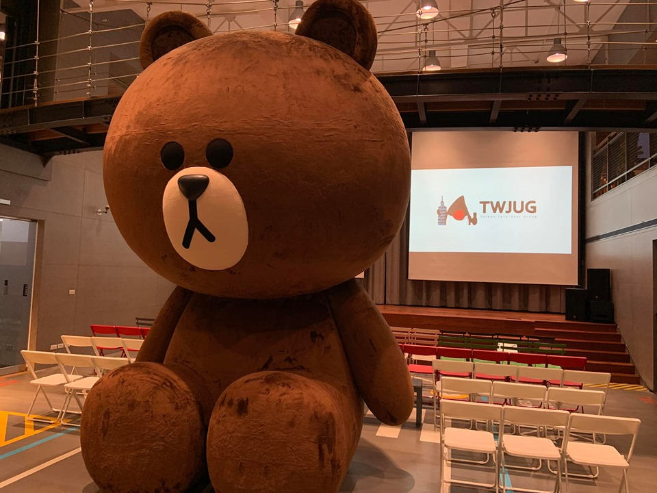

# 前提

大家好，我是 LINE Taiwan 的 Technical Evangelist - Evan Lin。在 2019/09/05 的晚上，很開心能夠再邀請 TWJUG 社群來到 LINE 台北辦公室來舉辦社群聚會。這次的講者是 LINE 東京辦公室的 Yoshida Shinya 和 Kafka Summit 2017 擔任過講者的 Yuto Kawamura，講題分別是 ZGC for Future LINE HBase 和 Kafka Broker performance degradation by mysterious JVM pause 。

**活動網址：** KKTIX: [https://twjug.kktix.cc/events/twjug201909](https://l.facebook.com/l.php?u=https%3A%2F%2Ftwjug.kktix.cc%2Fevents%2Ftwjug201909%3Ffbclid%3DIwAR1oQhZdHT-uc0dAPtwlsFGgh0V1LuEg_AZd9hifunbtABNcsboV082DmBU&h=AT1qKrWy2Ujd35DDuGyYLW2ZcpwxGs3rrC0jstlojWDGUsgpEA-6jRBqw6_5WWckMLJ5CFz_OTxpeXITYsvR3C_n50mQcbJGRPKFE5a8WnlOqBakhVH2q5K_oAg_hsQ-ty-W_mErXiUp78uL3ry8pycHnWtDeAE_C5g)

## ZGC for Future LINE HBase / LINE Shinya Yoshida

#### [投影片](https://speakerdeck.com/line_developers/zgc-for-future-line-base)

首先帶來的是來自於 LINE 的同仁專職在負責 HBase 相關處理的 Shinya Yoshida 來分享關於 HBase 在 LINE 上面的相關應用。HBase 是一個廣為使用在 Java 上的 NoSQL 應用，擁有著快速的反應時間與高可用性 ( High Availability ) 。 由於 JVM 在 GC (Garbage Collection) 的處理上會動用到 STW (Stop The World: 也就是中斷存取的動作來做 GC ) ，這在對於需要大量連線與高效能的處理應用上是相當困擾的。 本篇演講就是分享相關的效能調校與觀察心得， 一開始講者先分享關於 Gargage Collection 的相關類別與種類。

首先講者分享 GC 有兩階段主要的處理:

- **Finding the garbage**: 
  - 解釋：
    - 也就是要先將可以回收的記憶體資源標記成 Garbage 。 
  - 應用演算法：
    - 分為兩種主要方式，一個是透過 Counting Reference 也就是對於變數的使用做計數，做為可以回收的標記。另一種則為標記( Mark ) 也就是針對資料的相關使用方式透過樹狀結構來整理，如果沒有相關連的變數，代表該變數可以被回收的可能性就相對的高。
- **Collect the garbage and defrag** : 
  - 解釋：
    - 接下來就是回收記憶體資源後，整理破碎可用的記憶體空間。
  - 應用演算法：
    - Sweep/Compaction:
      - 先將可以回收的記憶體回收之後，將剩下不連續的記憶體整理過後變成連續可使用的記憶體。
    - Copy:
      - 相較於前一個方式， Copy 則直接使用一整個新的記憶體空間。直接將可以使用的連續性的記憶體複製過去。這樣比較消耗記憶體空間，但是對於效能上相較得比較快速。

這張圖講解了許多近期的 GC 演算法，在對於 DeFragment 的處理上都是使用 Copy 的方式，雖然比較消耗記憶體但是速度相對的快。針對這些方式可以看到有不少的 GC 演算法可以選擇， G1GC, ZGC 跟 Shenandoah 跟以往的 Old GC 。 而在 GC 的選擇方向上講者有以下以些方向可以推薦給大家參考：

- 了解每個 GC 的優缺點。

- 針對你的應用程式（服務）的硬體設施來挑選 GC。

裡面有許多的使用參考值得各位讀者去細看，這裡容我直接分享相關結果給各位。針對效能的比較上，講者最後挑選了 ZGC 跟 G1GC 來做一些比較，結果如下:

針對這樣的結果，可以看出來在不同的硬體設備（記憶體配置上） G1GC 與 ZGC 會有不同的效能呈現。可以看得出來在記憶體比較大的 (128G) 的配置下， ZGC 具有比較好的更新與讀取的效能。這樣的配置也跟 LINE 的服務應用上能夠呼應得上。 但是由於 HBase 在 Java 11 上面的 ZGC 還依舊是實驗階段( Experimental ) 所以在 LINE 的內部僅僅作為效能的測試使用，也將會通過更多的實驗與測試之後正式上線後再分享相關結果給各位。

## **Kafka Broker performance degradation by mysterious JVM pause** / **LINE - Yuto Kawamura**

#### [投影片](https://speakerdeck.com/kawamuray/kafka-broker-performance-degradation-by-mysterious-jvm-pause-at-twjug)

這一段則由 LINE 的資深工程師 Yuto Kawamura  分享一段曾經在正式上線服務所發生問題的除錯過程。 Kafka 在 LINE 的訊息後臺上佔有相當重要的地位 ，超過了六十個以上的服務都有使用 Kafka（可以參考這篇[投影片](https://www.slideshare.net/kawamuray/kafka-meetup-jp-3-engineering-apache-kafka-at-line)) 。 而講者分享一個當初 Kafka 上面發生的問題，並且解釋整個如何除錯的過程。

### 現象/問題

原本每個 Kafka 訊息都是相當的順暢，但是忽然有一段時間發生了以下狀況： Response time degration for 99th %ile produce ，變且造成 zookeeper session timeout 。 

接下來開始分析發生問題的時候，幾個相關的現象：

- 發現每一個運行的 threads 的使用率暴增
- GC Time (STW) 增加，在 JVM 裡面環節來分析發現 Garbage Collection 運作的時候所產生的系統停頓 (STW) 時間區段也變長了。

### 開始縮小範圍

透過這些結果，講者分享了他的偵錯經驗。首先他做了一個假設: 懷疑是 JVM 系統層的某些事件造成系統過慢。並且試著想要 Reproduce 一樣的環境。

這邊要解釋一下，關於 STW 的運作方式，運作 GC 的 STW 會做兩件事情首先是設定 `safepoint	` 也就是告訴 JVM 要開始做 GC 了，這時候系統會等每一個運作的 thread 慢慢暫停，這個叫做 `safepoint sync` 。

而這時候的要來測試看看事不是 JVM  `safepoint sync` 造成太多的時間浪費，使用的方式是寫一段很長的巢狀迴圈來避免系統太早執行  `safepoint sync` 。接下來透過觀測的方式來卻是自己的假設是否正確，同時也觀測是否能夠正確的重現問題。

這邊的內容相當精采，歡迎大家好好的了解投影片的內容。整個過程就是作者不斷透過假設，撰寫測試工具來試著重現問題。最後再透過一些底層觀測工具來確認自己的假設是否正確。

最後的問題是什麼？ 讓筆者賣個關子，歡迎大家好好閱讀投影片來一起了解這個偵錯系統底層的 Kafka 效能問題的真相。

### 參考資料

- [Kafka meetup JP #3 - Engineering Apache Kafka at LINE](https://www.slideshare.net/kawamuray/kafka-meetup-jp-3-engineering-apache-kafka-at-line)

# 活動小結

這一次聚會的內容相當的精彩，而且都是深入 JVM 系統的底層的介紹與除錯經驗。相信帶給每一位參加的人一個精彩的知識饗宴，也歡迎大家多了解投影片的內容一起來討論。

立即加入「LINE開發者官方社群」官方帳號，就能收到第一手Meetup活動，或與開發者計畫有關的最新消息的推播通知。▼

「LINE開發者官方社群」官方帳號ID：@line_tw_dev

# 關於「LINE開發社群計畫」

LINE今年年初在台灣啟動「LINE開發社群計畫」，將長期投入人力與資源在台灣舉辦對內對外、線上線下的開發者社群聚會、徵才日、開發者大會等，預計全年將舉辦30場以上的活動。歡迎讀者們能夠持續回來察看最新的狀況。詳情請看 [2019 年LINE 開發社群計畫活動時程表 (持續更新)](https://engineering.linecorp.com/zh-hant/blog/line-taiwan-developer-relations-2019-plan/)https://engineering.linecorp.com/zh-hant/blog/line-taiwan-developer-relations-2019-plan/