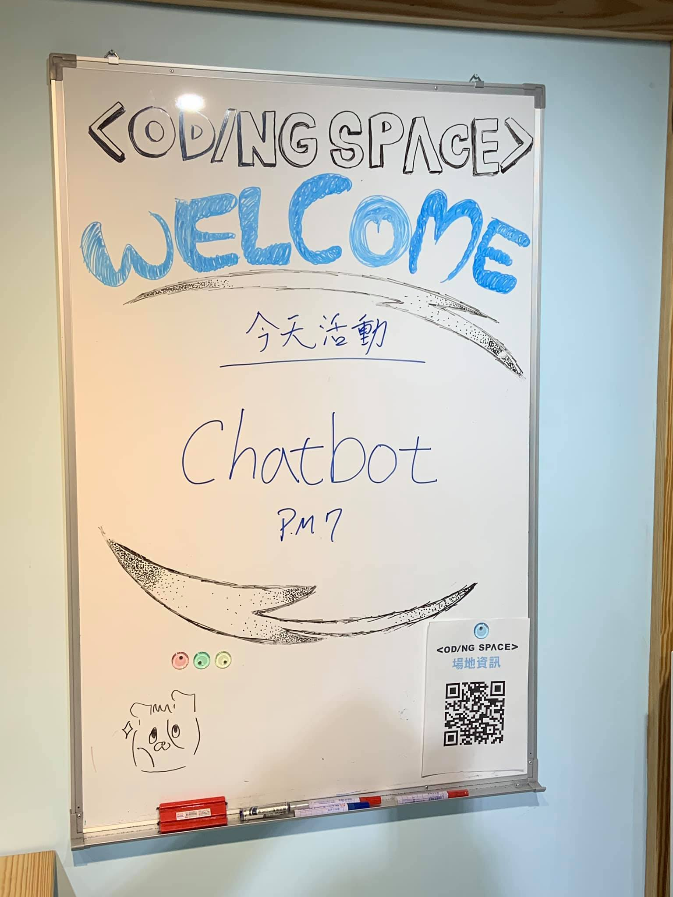
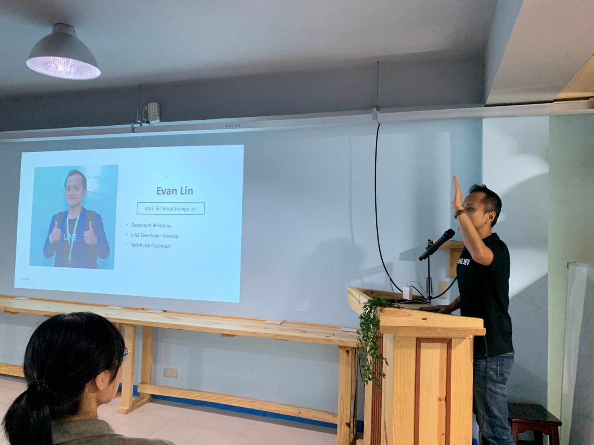
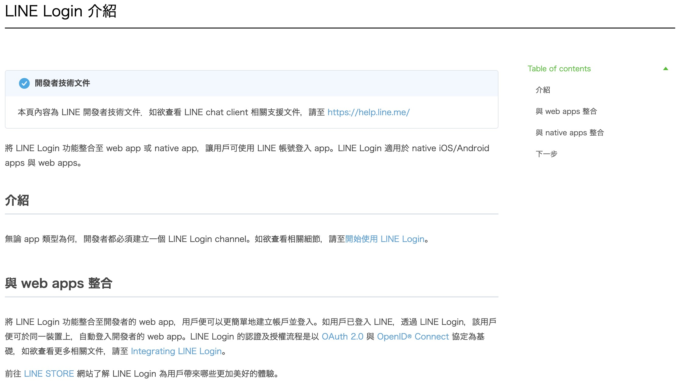
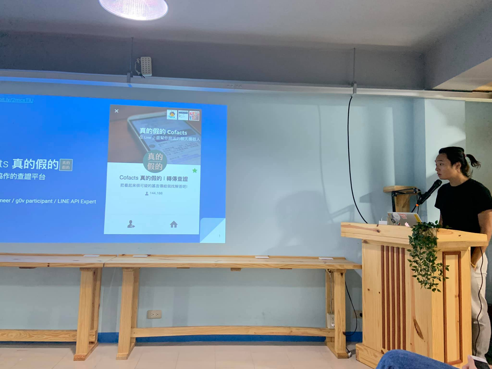
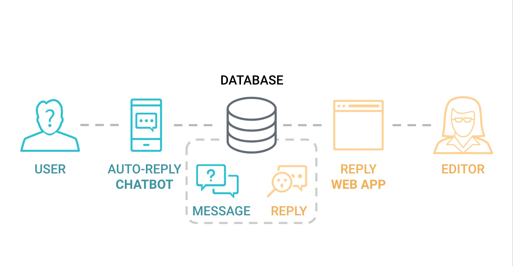
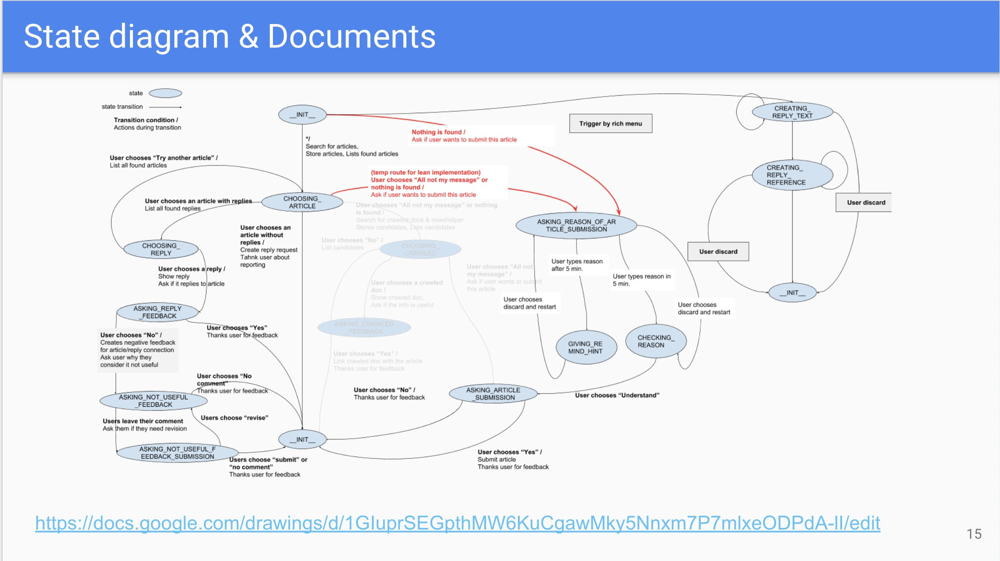

# 前言

大家好，我是 LINE Taiwan 的 Technical Evangelist - Evan Lin。這次很開心受到 chatbot 社群的邀請，參加了 "[Chatb10ts meetup 聊天機器人小小聚 12 @ 天瓏書局 Coding Space](https://chatbots.kktix.cc/events/chatb12ts)" 的聚會活動，並且分享 LINE API 更新與個人開發的心得。在此也跟各位分享本次參與的心得，並且也希望透過社群分享的力量能夠讓聊天機器人的開發動能更加的盛大。

- 社群 Chatbots Meetup： https://chatbots.kktix.cc/ 
- 本次活動網頁:  [活動網址](https://chatbots.kktix.cc/events/chatb12ts)
- 本次活動的共筆紀錄： https://beta.hackfoldr.org/chatbot/

由於 Chatbots Meetup 本身屬於社群自主性的活動，裡面也有許多社群朋友所贊助的閃電秀。裡面的所有內容也是相當的難得與有趣。也希望能夠透過本篇文章讓大家稍微了解 Chatbots Meetup 社群閃電秀的魅力。

##  LINE Platform Update 201909 / 資深開發技術推廣工程師 Evan Lin

#### [投影片](https://speakerdeck.com/line_developers_tw/line-platform-update-201909)

本次的分享主要是跟大家分享一下近期平台的相關更新，希望能讓大家第一時間的到最清楚的相關消息。

###Flex Message 更新

在 LINE Bot 溝通上， Flex Message 給予了許多的相關設計彈性，不僅僅可以設計出許多特殊訊息。想要設計閱讀卡，菜單甚至是小卡片訊息都是可以的。這一次的更新則帶來更多強大的更新，包括了服飾展示卡片，交通行程規劃卡片，甚至是代辦事項跟工作記錄卡片都可以顯示。 [其他部分歡迎了解相關文章](https://engineering.linecorp.com/zh-hant/blog/flex-message-update1/)。

### LINE Developer Document 支援繁體中文

(網頁： [LINE Login overview](https://developers.line.biz/zh-hant/docs/line-login/overview/))

LINE 持續在開發者關係與改善開發者文件持續努力，目前也於近期在 LINE Developer Document 特別提供中文內容，協助開發者更快掌握 LINE 開發相關資訊! 目前涵蓋主題包含：LINE Login, Messaging API, Bot Designer。

- LINE Login 功能：[https://developers.line.biz/zh-hant/services/line-login/](https://developers.line.biz/zh-hant/services/line-login/?fbclid=IwAR3-GVqDrE53M98lxg3GyQRs-p0_DlzUym9ho9zZatioNe04cmmCTu3qjQw)

- LINE Login 操作：[https://developers.line.biz/zh-ha…/docs/line-login/overview/](https://developers.line.biz/zh-hant/docs/line-login/overview/?fbclid=IwAR2w3vkuXsEnvceCpQ_m_y1Qc1FT6Zdp5-GP3dFXi_FuGQqsayFmQILPxI4)

- Messaging 功能：[https://developers.line.biz/zh-hant/services/messaging-api/](https://developers.line.biz/zh-hant/services/messaging-api/?fbclid=IwAR1XH-6g2jRnRlKVbETDcarMifg2tGecUa6pL4JlF5TgP-vlQwWzDaUkvc0)

- Messaging API 操作：[https://developers.line.biz/zh-ha…/…/messaging-api/overview/](https://developers.line.biz/zh-hant/docs/messaging-api/overview/?fbclid=IwAR06KEdWt4ck-xuLLYiIq_0ImO157lbHhNbM5IaQIfucyM_6xA-Zonwdp2s)

- 開始使用 Messaging API: [https://developers.line.biz/…/messaging-api/getting-started/](https://l.facebook.com/l.php?u=https%3A%2F%2Fdevelopers.line.biz%2Fzh-hant%2Fdocs%2Fmessaging-api%2Fgetting-started%2F%3Ffbclid%3DIwAR0UkdAocD0qjmxGiKa9Dzp1EqcpMxdkW84o9y4hyWcSYLxe47YMAoeVjRU&h=AT3r2Nvg2JVziKIbRMiEcmv7OvcGqvgN59n9cHi9WO6qqwLZ7LJTs9lrTSVi_2vnBCMrPTIn1pUokTjKRz_qams5C8G9LxBDqpOZOG0ufs2bLCRdMrA-prgtBE0xZLSknloao9oH6T0n6utL-EICQVXeu0qJxPGbtA)

- Messaging API 權限管理: [https://developers.line.biz/…/docs/messagin…/managing-roles/](https://developers.line.biz/zh-hant/docs/messaging-api/managing-roles/?fbclid=IwAR1GilfALaypKQTzD0YqF2XHtO-habTNOFaCQxBoHBqZl2vv58uTaEtllQ4)

- Bot Designer 功能：[https://developers.line.biz/zh-hant/services/bot-designer/](https://developers.line.biz/zh-hant/services/bot-designer/?fbclid=IwAR2yZvrnFD0pwu9wVOTdCucNvO8M8a4zFekLswHIM8LeJIPZmWxoxSbPzZw)

Stay Tuned! 更多中文化內容，敬請期待！

### LINE SDK 4.x 將在 2019/12/12 End-of-life

LINE 平台功能提供了許多有用的功能，不僅僅可以讓電商網站可以使用，更可以讓 Client App 來作為使用。不論是 LINE Login ，還是一些傳訊給 LINE 好友的相關功能，不論你是使用 iOS 或是 Android 系統的行動裝置開發者都可以使用。 為了提供更安全，確保開發者都能使用最新版本的開發套件，不久前已經聲明 LINE SDK 4.x 即將棄用 (deprecated) 。 現在即將在 2019/12/12 之後就正式停止支援 LINE SDK 4.x ，並且正將相關文件與下載的鏈結都移除。 請開發者們儘早將使用的套件升級。以下的相關文件也會做適當的修改與移除：

- [Download link for LINE SDK v4.0 for Android](https://developers.line.biz/en/docs/downloads/#line-sdk-android)
- [Guides for LINE SDK v4.0 for Android](https://developers.line.biz/en/docs/android-sdk/deprecated/overview/)
- [Reference documentation for LINE SDK v4.0 for Android](https://developers.line.biz/en/reference/android-sdk-v4/)
- [Download link for LINE SDK v4.1 for iOS](https://developers.line.biz/en/docs/downloads/#line-sdk-ios-swift)
- [Guides for LINE SDK v4.1 for iOS](https://developers.line.biz/en/docs/ios-sdk/deprecated/objective-c-v41/overview/)
- [Reference documentation for LINE SDK v4.1 for iOS](https://developers.line.biz/en/reference/ios-sdk-v4/)

### 更多相關內容:

- [Flex Message 的 Update 1 已公開](https://engineering.linecorp.com/zh-hant/blog/flex-message-update1/)

- [LINE SDK v4.x end-of-life on December 12th, 2019](https://developers.line.biz/en/news/#line-sdk-v4-x-end-of-life-on-december-12th-2019-2019-09-13)

## **開放群眾參與的即時訊息查證系統 Cofacts 真的假的 / LAE - 郭冠宏 ggm**

#### [投影片](https://docs.google.com/presentation/d/1QS1Esc-kvPK2x-Ys1oS4ucWVQOOggcEUxbnj3V1vi_I/edit)

第二場則是由 LINE API Expert - ggm 郭冠宏所帶來關於 Cofacts 的架構分享。 Cofacts （真的假的 LINE ID: **@cofacts**）的出發來自於太多的民眾對於不確定的新聞消息的轉傳，造成不必要的過度恐慌或是不實訊息的散佈。 Cofacts 的運作流程如下：

- 在聊天室收到轉傳訊息 (Receive message in chatroom)
- 轉傳給 Cofacts (Forward to Cofacts)
- 取得查證資訊  (Get auto-response)
- 轉傳回原聊天室 (Forward back to source chatroom)

而整個系統有分成兩大塊平台，一個是使用者回報與收到編輯審核結果的回覆。另外一個則是負責協助審核新聞資訊的編輯系統。大致上架構圖如下：

雖然看似單純的回覆流程，但是由於回覆之後還會牽扯到回報的使用者覺得有沒有正確。使得整體設計上需要加上一個 "狀態" (state) 的設計，也使得整個使用者回覆的訊息流程變得需要更多的調整與優化。

這整張系列圖敘述了使用者轉傳新聞後可能出現的相關狀態圖，也很建議讓其他開發者來了解一個希望有使用者回覆與貢獻的互動溝通介面中需要多少的狀態敘述圖。很建議大家好好的閱讀這篇投影片的內容。

## 聊天機器人與社群經營 / 撒景賢		 

講者主要分享透過 Chat Bot 經營生酮飲食社團的經驗談。

## **Chatbot UX 設計經驗法則與案例分享 / 溫明輝**

#### [相關文章](https://medium.com/uxerlab/13-heuristics-for-commercial-chatbot-ux-design-58c1aa191c77)

最後則由國立台北商業大學商業設計與管理系副教授溫教授來幫大分享 Chatbot UX 設計經驗法則與案例分享。身為兩個在 LINE 上面相當成功的 LINE Bot - 微股力與記帳雞產品的幕後指導教授，溫教授分享了許多在 Chatbot 的特性與 Chatbot UX (User Experience) 設計上需要注意的地方。 以下紀錄幾個重點：

### App 成功無法直接複製

- LINE bot 可以主動提醒
- 群組效應

### Chatbot 使用者某些時不是來聊天

- 舉凡記帳機或是微股力使用者重要不是來聊天，可能有某些使用目的性。
- 聊天功能很多時間才是提醒使用者的用處（尤其在群組內，有趣的回覆有效提醒使者）

### 擬人化 / 機器主張

-  TaxiGo 主要就是將功能完整呈現，而不是要擬人化。
-  Chatbot 應該要讓使用者能夠使用為主。

### 讓使用者擁有主導權

- 減少 User 抗拒
- 避免封鎖

### 不需要追求介面簡潔性

需求滿足 -> 友善互動 -> 愉悅的體驗

就算使用介面困難，但是能滿足根本的需求。才是使用者最在意的事情。

### 避免一視同仁的廣播訊息

- 擴展使用者興趣
- 但是推播會引發封鎖率，所以要減少一視同仁的推播。
- 優化視覺呈現的內容（透過使用者的分眾，標記）

### 用 UI 補償 AI

- AI 目前發展雖然迅速，但是還是有限制。
- 但是可以使用

### Chatbot 是無所不在的意識

- Mini App
- 語音輸入

 這些 UX 的設計重點都相當有用，有興趣的讀者也歡迎在文章裡面尋找更多相關資訊。

## 閃電秀

講解完了主要三個講者之後，接下來就是介紹這個社群最有魅力的部分就是閃電秀。所有的閃電秀可以參考這篇共筆文章  [https://beta.hackfoldr.org/chatbot/](https://beta.hackfoldr.org/chatbot/)  ，由於都是五分鐘的閃電秀，主要內容快速用條列介紹給各位：

- **LINE BOT 市容幫手 / 班班**
  - 	[投影片](https://docs.google.com/presentation/d/1PSZQWk5iwkkacefaIzRg06sQA257cBDJwymIuOf67QQ/edit#slide=id.g61008355a5_0_0)
  - 簡介：
    - 	講者分享了一個在台北市行政區內一個透過 LINE 想要幫助里長們在市容上面的小幫手。因為許多里長都習慣透過 LINE 來跟台北市行政區的相關首長直接回報問題，有時候難免有遺漏或是效率不好的問題。這個機器人就是為了解決這個問題而生的，而講者是希望可以找到更多跟他一起想要幫忙解決這個問題的人。
  
- **Modern web 閃電秀 - 肌肉仔 / NiJia**
  
  - [投影片](https://www.slideshare.net/JiaYuLin6/muscle-man-light-talk-20190917-in-chatbottw)
  - 簡介：
    - 透過[Kamigo (chatbot 開發套件)](https://github.com/etrex/kamigo) 所開發出來一個幫忙記錄健身過程的 LINE bot 經過。全部原始碼可以在[這裡找到](https://github.com/louis70109/muscle_man)。
  
- **叉出一個開放的在宅醫療社群 / fly**
  - [投影片](http://i.hsca.me)
  - 簡介:
    - 這也是一個尋求一起來幫忙開發的閃電講，台灣在宅支援診所聯盟 ( http://i.hsca.me/ ) 希望可以透過在宅診所的計畫來尋求許多願意幫忙開發的熱心人士。希望可以讓偏遠地區的民眾可以透過 LINE Bot 來獲得更多的醫生資訊與相關資訊的服務。 歡迎一起來參加！！
  
- **Voice hackathon / Kevin**
  
  - 這一個主要是推薦給大家最近基於 Google Assitant 所舉辦的 Voice Hackathon ，有興趣的可以一起來報名參加。
  - 報名網址： https://www.voicehackathon.org/
  
  

## 活動小結

社群分享永遠是讓創意激盪的最佳方式，而 Chatbots Meetup 是一個很熱情與充滿創造力的社群組織。也希望有更多有創意的開發者願意加入 LINE Chatbot 的開發行列，更希望能熱情的參與社群的活動與一起來分享。

立即加入「LINE開發者官方社群」官方帳號，就能收到第一手Meetup活動，或與開發者計畫有關的最新消息的推播通知。▼

「LINE開發者官方社群」官方帳號ID：@line_tw_dev

## 關於「LINE開發社群計畫」

LINE今年年初在台灣啟動「LINE開發社群計畫」，將長期投入人力與資源在台灣舉辦對內對外、線上線下的開發者社群聚會、徵才日、開發者大會等，預計全年將舉辦30場以上的活動。歡迎讀者們能夠持續回來察看最新的狀況。詳情請看 [2019 年LINE 開發社群計畫活動時程表 (持續更新)](https://engineering.linecorp.com/zh-hant/blog/line-taiwan-developer-relations-2019-plan/)https://engineering.linecorp.com/zh-hant/blog/line-taiwan-developer-relations-2019-plan/)