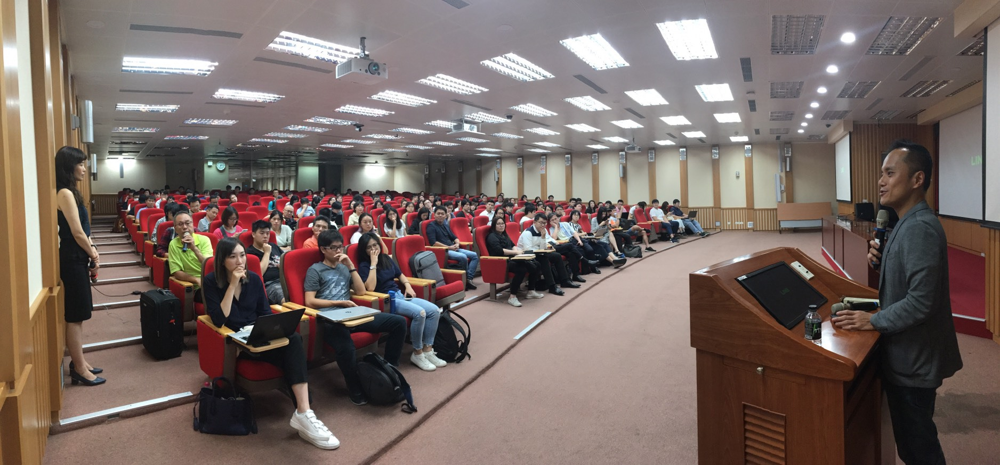

# 前言

大家好，我是 LINE Taiwan 的 Technical Evangelist - Evan Lin。 很開心 2019/10/02 到台北商業大學跟同學與先進們分享 LINE API 的介紹。 主要參與的內容是 「LINE Chatbot 對話機器人 API 與 UX 入門課程」，也是 【2019 LINE Chatbot對話機器人設計大賽】 前導教學課程，歡迎各位了解。

## 關於【2019 LINE Chatbot對話機器人設計大賽】

由 LINE Protostar 新星計畫與國立臺北商業大學合辦的「2019 LINE Chatbot 對話機器人設計大賽」活動正式開跑了！ 
　
無論你是學生、開發者、產品經理或 CUI 設計師，只要有想法、熱情、有創意，都歡迎你報名，一起創造下一個 LINE Chatbot 的酷炫應用！
　
※參賽說明※

- 不限參賽身份
- 每組不限人數
- 決賽以 PPT 簡報，不會寫程式也可參賽
- 本活動提供賽前講座與教學
- 總獎金 20 萬元等你來挑戰！

詳請請參考活動官方網站：
https://chatbot2019.com

##  LINE API Introduction / 資深開發技術推廣工程師 Evan Lin

#### [投影片](https://speakerdeck.com/line_developers_tw/line-api-introduction-20191002)

除了投影片之外，有提到相關內容如下：

- 提到透過流浪動物之家的 Open Data 製作的 LINE Bot 請參考： （完全開源，歡迎複製）
  - https://github.com/kkdai/LineBotPetNeedMe 
- 提到 LINE Things 的部分，歡迎參考這篇文章：
  - https://engineering.linecorp.com/zh-hant/blog/warm-up-20190531/
- 關於 LINE Account Link 的開發文件，請參考:
  - https://engineering.linecorp.com/zh-hant/blog/how-to-use-account-link/

## 活動小結

立即加入「LINE開發者官方社群」官方帳號，就能收到第一手Meetup活動，或與開發者計畫有關的最新消息的推播通知。▼

「LINE開發者官方社群」官方帳號ID：@line_tw_dev

## 關於「LINE開發社群計畫」

LINE今年年初在台灣啟動「LINE開發社群計畫」，將長期投入人力與資源在台灣舉辦對內對外、線上線下的開發者社群聚會、徵才日、開發者大會等，預計全年將舉辦30場以上的活動。歡迎讀者們能夠持續回來察看最新的狀況。詳情請看 [2019 年LINE 開發社群計畫活動時程表 (持續更新)](https://engineering.linecorp.com/zh-hant/blog/line-taiwan-developer-relations-2019-plan/)https://engineering.linecorp.com/zh-hant/blog/line-taiwan-developer-relations-2019-plan/)