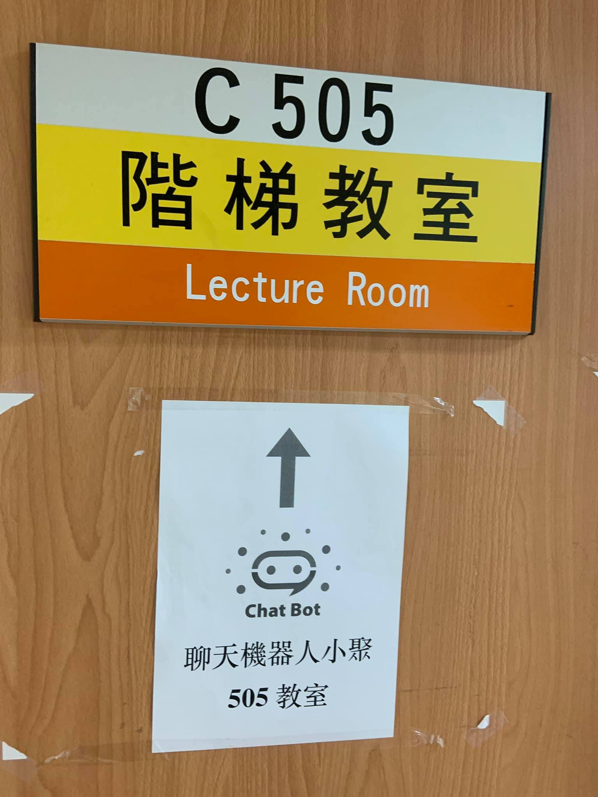
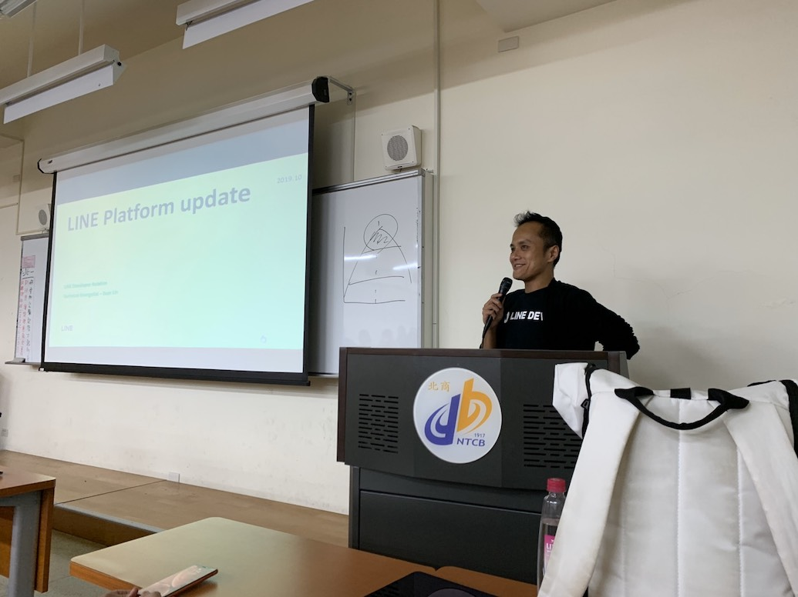
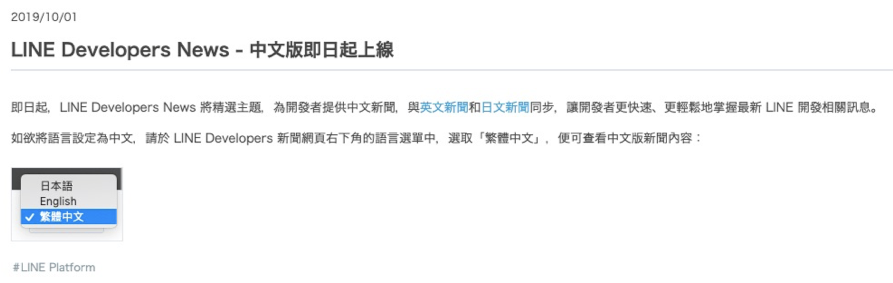
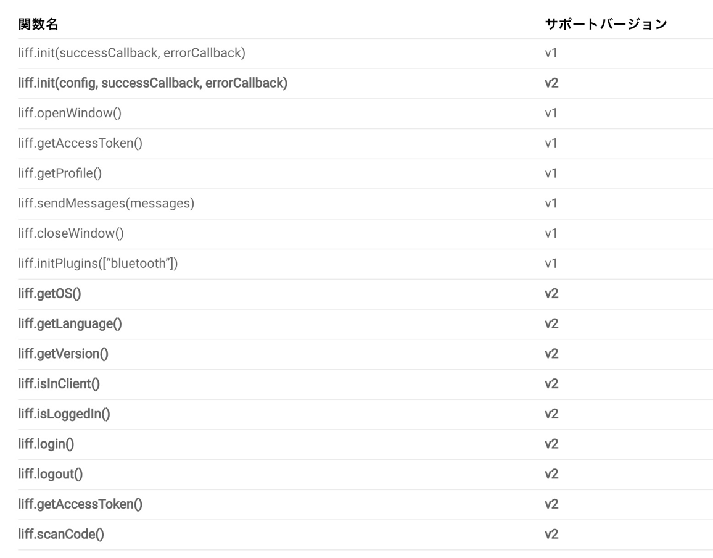

# 前言

大家好，我是 LINE Taiwan 的 Technical Evangelist - Evan Lin。這次很開心受到 chatbot 社群的邀請，參加了 "[Chatb10ts meetup 聊天機器人小小聚 13 @ 天瓏書局 Coding Space](https://chatbots.kktix.cc/events/chatb13ts)" 的聚會活動，並且分享 LINE API 更新與個人開發的心得。在此也跟各位分享本次參與的心得，並且也希望透過社群分享的力量能夠讓聊天機器人的開發動能更加的盛大。  

- 社群 Chatbots Meetup： https://chatbots.kktix.cc/ 
- 本次活動網頁:  [活動網址](https://chatbots.kktix.cc/events/chatb13ts)
- 本次活動的共筆紀錄： https://beta.hackfoldr.org/chatbot/

由於 Chatbots Meetup 本身屬於社群自主性的活動，裡面也有許多社群朋友所贊助的閃電秀。裡面的所有內容也是相當的難得與有趣。也希望能夠透過本篇文章讓大家稍微了解 Chatbots Meetup 社群閃電秀的魅力。

這次活動也很開心地來到了台北商業大學，最近台北商業大學跟 LINE PROTOSTAR 也舉辦了"[LINE Chatbot 對話機器人設計大賽](https://www.chatbot2019.com/)" 也希望大家能夠踴躍報名參賽。


##  LINE Platform Update 201910 / 資深開發技術推廣工程師 Evan Lin



#### [投影片](https://speakerdeck.com/line_developers_tw/line-platform-update-201910)

<script async class="speakerdeck-embed" data-id="36b3e28d2a3f4e489250cbe7d84234a4" data-ratio="1.77777777777778" src="//speakerdeck.com/assets/embed.js"></script>
本次的分享主要是跟大家分享一下近期平台的相關更新，希望能讓大家第一時間的收到最新的相關消息。


### 新聞中文版本即日起上線



每一次有新的平台功能更新，都會透過 [LINE Developer News](https://developers.line.biz/en/news/) 來發布最新的消息，很興奮的告訴大家之後也有[繁體中文的新聞](https://developers.line.biz/zh-hant/news/)消息了。 讓每一個開發者能夠更容易地了解最新平台的訊息。

### 取得使用者互動資訊


以往再透過 Chatbot 廣播訊息的時候，開發者都想要能夠了解訊息是否可以精準地傳遞給使用者。使用者是否有打開訊息？ 是否有點擊鏈結？  是否有播放影片？ 

之前只能透過 LINE OA 平台上面的 Insight 來查看相關資訊，現在透過 [Get Messaging Event API](https://developers.line.biz/en/reference/messaging-api/#get-message-event) 可以取得以上的資訊了。

```
GET https://api.line.me/v2/bot/insight/message/event?requestId={requestId}
```

透過這樣的資訊可以讓你的 Chatbot 去查詢過去的資料，並且學習（或是）判斷之後的訊息該如何精確的哪送。當然這樣的平台也是有一些小筆記如下：

- 只支援透過 Broadcast API 的訊息
- OA 需要有 20 個好友以上
- 僅提供查詢 15 之內的訊息資料。


### LIFF v2 的上線

LIFF 從 2018 Q2 公開之後受到大家的喜愛，讓許多的 Web App 在設計的同時也能夠透過 LIFF 的 API 取得所需要的資訊。到了這個月， LIFF 也迎來了最大的更新 LIFF v2 的更新。主要支援的新功能如下:

- 可在 external browser 使用 LIFF
- 兼容 Login v2.1，可取得 user profile/email 等資訊
- Read QR codes
- 可獲取 user 使用 LIFF 的環境，包含 OS/語言設定/是否以 IAB 開啟等等

而支援的 API 列表部分，大家也可以參考 [Engineering Blog 這篇文章](https://engineering.linecorp.com/ja/blog/liff-v2/)。



最後，也要跟各位開發者分享。 [LINE LIFF Starter 也提供了 v2 的版本](https://github.com/line/line-liff-v2-starter)了。歡迎大家下載新的版本來試用，體驗一下新的功能。


如果只是想要快速的感受一下新功能，也可以直接加入以下的 OA 


### 更多相關內容:

- [繁體中文化的 LINE Developer News](https://developers.line.biz/zh-hant/news/)
-  [Get Messaging Event API](https://developers.line.biz/en/reference/messaging-api/#get-message-event) 
- [LINE Engineering Blog: LIFF v2已發布](https://engineering.linecorp.com/ja/blog/liff-v2/)
- [Github: LIFF Starter v2](https://github.com/line/line-liff-v2-starter)


## **LINE Bot 上的表單驗證、搜尋以及分頁 / LAE - 郭佳甯**

#### [投影片](https://docs.google.com/presentation/d/1MNCbVIsMoLAWtPjg22e1-_3PLA2OpyHKSAIvw53Vdsk/edit#slide=id.g654c56bcd3_0_306)

身為 LINE API Expert 並且是支援 Chatbot [卡米狗](https://www.kamigo.tw/)的開發者的講者，並且也有持續在開發 LINE Bot Rails framework [Kamigo](https://github.com/etrex/kamigo) 。透過展示來教導大家如何透過  [Kamigo](https://github.com/etrex/kamigo)  來製作表單驗證，搜尋跟分頁的功能。

 [Kamigo](https://github.com/etrex/kamigo)  是基於 Rails 的 Bot Framework ，可以快速加入相關的功能，開發 Bot 就像是開發 Web 一樣快。並且整合 LIFF 與 FLEX Message 。

接下來講者透過開發一個「守護寵物聊天機器人」來介紹該如何透過 LIFF 開發一個表單驗證與輸入的聊天機器人。透過讓使用這在 LIFF 表單上面輸入走失的動物資訊，來放在聊天機器人上面讓所有的好友可以一起來幫忙協尋。


**相關鏈結：**

- https://github.com/etrex/kamigo


## **不懂開發也能建立屬於自己的 Chatbot / LAE - 白凱仁**

#### [投影片]()

接下來由 CNTUG 的共同主辦人[白凱仁](<https://github.com/kairen>)所帶來的很有趣的主題，透過 Kuberbetes 來部署一個 LINE chatbot Operator。

原因是打魔物獵人需要查詢許多魔物的弱點跟容易攻略的弱點，但是要用電腦找太慢了，於是就想說寫一個 LINE chatbot 。但是考量到魔物其實會不斷的修改跟增加，如果好不容易把魔物"火龍“的弱點加入之後，隔天又想查詢"角龍"，那這樣不就得要不斷的修改跟更新你的代碼。 


加上最近 Kubernetes Operator 其實是一個熱門的話題，但是一直沒有一個有趣的應用，於是講者就透過 Kubernetes Operator 將 LINE chatbot 部署起來。


(架構圖節錄來自[投影片](https://speakerdeck.com/kairen/configures-line-bot-atop-kubernetes)，獲得作者同意）


透過上圖可以了解 LINE Bot Operator 分成 Bot Controller 跟 Event Controller 兩個部分。Event Controller 透過 EventBinding 的方式可以將不同的 event 一一加入卻又不需要撰寫太多額外的代碼。 以下分享一個講者所提到的例子:  透過部署以上的 EventController 只要使用者在對話匡裡面打入"火龍" 或是 "Rathalos" 就顯示出以下那些文字，而要增加一個魔物也很簡單只要再增加另外一個相似的 YAML 設定然後將這個 EventController 部署上去即可。既可以讓會眾了解 Kubernetes Operator 的強大，也可以讓 LINE Chatbot 的開發上有了另外一種新的思路。


## 閃電秀

三個講者之後，接下來就是介紹這個社群最有魅力的部分就是閃電秀。所有的閃電秀可以參考這篇共筆文章  [https://beta.hackfoldr.org/chatbot/](https://beta.hackfoldr.org/chatbot/)  ，由於都是五分鐘的閃電秀，主要內容快速用條列介紹給各位：

- **如何用Chatbot說921故事 / Afore**
  - 	簡介：
     - 	介紹聯合報如何透過 Chatbot 來讓使用者了解 921 的相關故事，透過與使用者互動的方式來讓使用者閱讀到許多聯合報的深入報導。
  
- **921 故事 Chatbot開發心得 / 謝化挺**
  - 簡介：
    - 開發人員來分享如何開發 921 的 Chatbot ，主要的資料儲存在 Google Sheet ，原因是希望可以讓 PM 可以快速了解 Chatbot 使用者的互動資料，相當直覺而有效的開發經驗。
  
- **介紹即將發佈的 Bottender v1 / C.T Lin**
  
  - [投影片](https://drive.google.com/file/d/1ULoJNCH5J5mORdJ2Wh9NYhoW3JeiiyjA/view)
  - 簡介:
    - 講解 Bottender 正式版本 v1 的發布，也歡迎大家來一起參與使用。
  
- **宣傳DevFest活動 / Kevin**
  - 報名網址： https://sessionize.com/gdg-devfest-in-taiwan-2019/
  
- **FunWater - It’s time to rethink about the “single-use plastic” product. / Demo**
- [投影片](https://docs.google.com/presentation/d/1jgrsaCP0C3lCGNimFA7QWcJJcqHF9OeEtl5-Hlp324k/edit#slide=id.g35f391192_00)
  - 簡介：
    - 一個倡導使用飲水機而減少使用寶特瓶的公益聊天機器人專案，透過飲水機 Open Data 幫你尋找最近的飲水機。


## 活動小結

社群分享永遠是讓創意激盪的最佳方式，而 Chatbots Meetup 是一個很熱情與充滿創造力的社群組織。也希望有更多有創意的開發者願意加入 LINE Chatbot 的開發行列，更希望能熱情的參與社群的活動與一起來分享。

立即加入「LINE開發者官方社群」官方帳號，就能收到第一手Meetup活動，或與開發者計畫有關的最新消息的推播通知。▼

「LINE開發者官方社群」官方帳號ID：@line_tw_dev

## 關於「LINE開發社群計畫」

LINE今年年初在台灣啟動「LINE開發社群計畫」，將長期投入人力與資源在台灣舉辦對內對外、線上線下的開發者社群聚會、徵才日、開發者大會等，預計全年將舉辦30場以上的活動。歡迎讀者們能夠持續回來察看最新的狀況。詳情請看 [2019 年LINE 開發社群計畫活動時程表 (持續更新)](https://engineering.linecorp.com/zh-hant/blog/line-taiwan-developer-relations-2019-plan/)https://engineering.linecorp.com/zh-hant/blog/line-taiwan-developer-relations-2019-plan/)