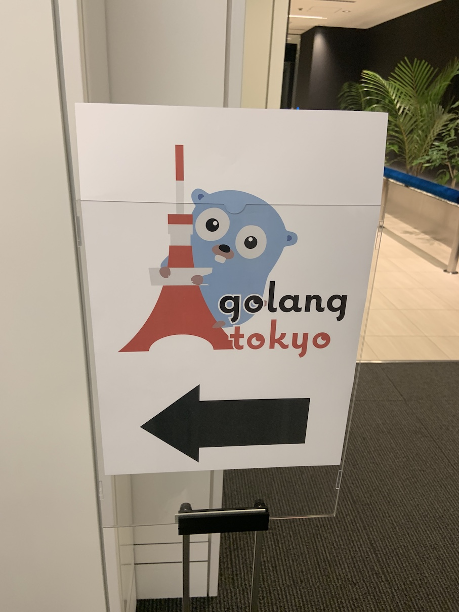
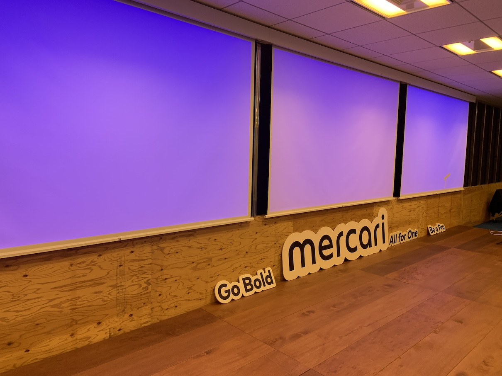
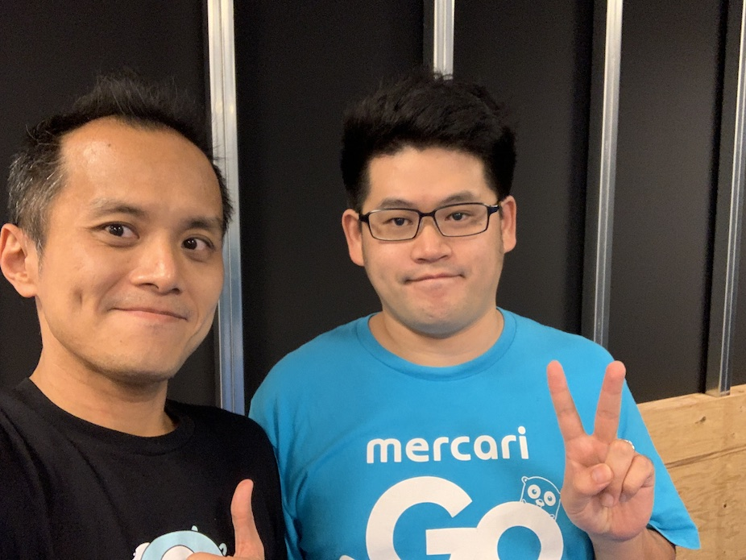
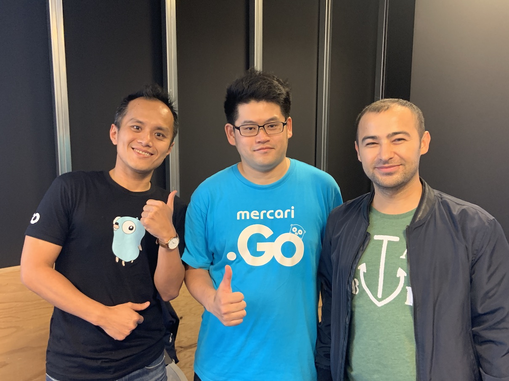
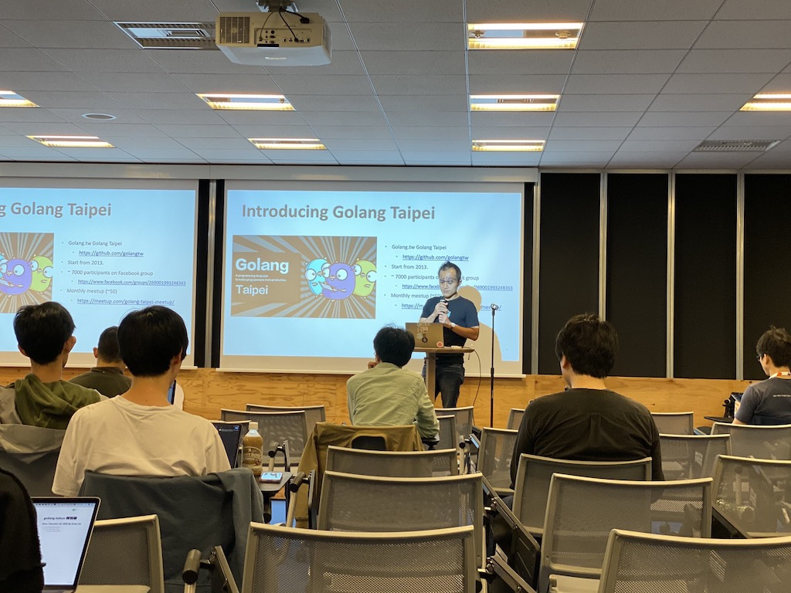
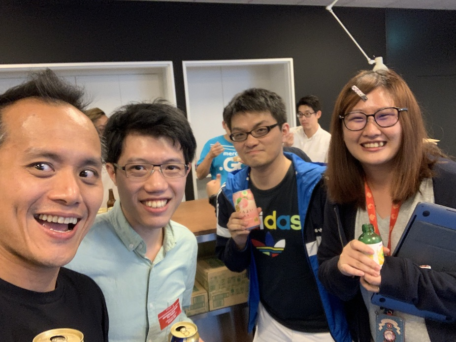
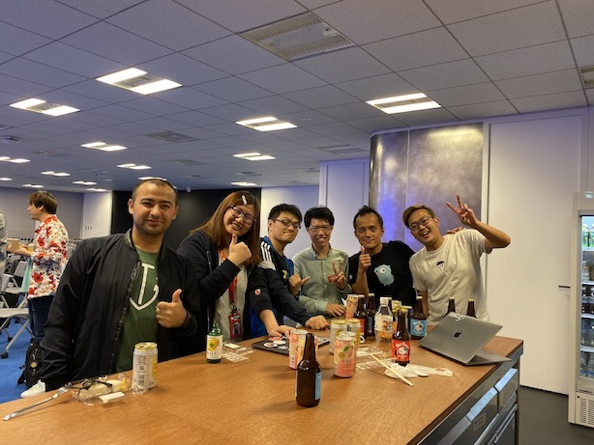

# 前言

大家好，我是 LINE Taiwan 的 Technical Evangelist - Evan Lin。 今年開始負責率領著台灣的工程師團隊到日本受訓的工作，陸陸續續也率領了二大團的台灣工程師到日本東京去受訓。 每次去東京受訓的時候，其實也有思考到究竟要不要去參加看看東京的社群活動，了解一下日本社群的魅力。 

趁著最近剛好當選了 [Google 的 Go GDE](https://www.evanlin.com/gde-go/) ，就想說來去東京社群來會會東京的 [Go GDE - Takuya Ueda](https://developers.google.com/community/experts/directory/profile/profile-takuya_ueda) ，於是就開始在 twitter 上面跟他開始聯絡，試著想要在東京出差的機會來跟當地的社群夥伴見見面，並且分享一下我自己成為 GDE 的經過故事。

必須得說  [Takuya Ueda](https://developers.google.com/community/experts/directory/profile/profile-takuya_ueda)  是一個為人相當和善並且熱心助人的社群人，馬上幫我四處尋找場地來舉辦 meetup 。 最後也將場地定在他所工作的公司位於六本木的 [Mercari](https://www.mercari.com/) 。

(Mercari 位於六本木辦公室的 21F ，有個約莫一百五十人的會議室)

- 社群 Golang  Tokyo： https://golangtokyo.connpass.com/
- 本次活動網頁:  [活動網址](https://golangtokyo.connpass.com/event/150891/)

# 六本木大冒險

必須得說忙碌完一天的會議後，還要逼迫自己來一趟日本東京地鐵大冒險的挑戰實在很大。 就在到達了六本木的辦公室之後，也很順利的見面到東京的 [Go GDE - Takuya Ueda](https://developers.google.com/community/experts/directory/profile/profile-takuya_ueda) -san ，其實 10/25 也是 Google Developer Expert Global Summit 的重大日子，但是我卡著一趟 On-Job-Training 並且週末還有 JSDC 的研討會，只好忍痛放棄，而 Ueda-san 也是因為 10/28 要舉辦 [GopherCon Tokyo Autumn 2019](https://gocon.jp/) 於是他也無法去，不過也因為如此，才能夠讓兩個 Go GDE 在東京的社群聚會碰頭。

(Evan Lin and Takuya Ueda 兩個 Go GDE 難得同台)

# Go 社群大會面與東京的社群魅力

就在拍完照片沒多久，也發生一個有趣的小插曲。  有一位遠從土耳其來的 [Golang Meetup Organizer - Sinan](https://twitter.com/unicod3) 也來跟我們相見歡，一起討論歐洲，日本與台灣的社群舉辦經過。 於是我們也趁了這個機會來了一個三個社群主辦人大合體的照片。

( Golang Taipei - [Evan Lin](https://twitter.com/Evan_Lin) / Golang Tokyo -  [Takuya Ueda](https://twitter.com/tenntenn) / [Golang Izmir](https://twitter.com/IzmirGophers) - [Sinan](https://twitter.com/unicod3))

在日本舉辦社群跟台灣有一些不同的是，台灣會先開放餐飲給來賓們享用。然後第一個講者講完後的休息時間會讓來賓們相互聊天，才會開始第二個講者的議題。 

而東京的社群有一些不同，他們習慣讓講者一口氣將兩個議程都講完，然後開放餐點（與啤酒）給來賓們享用與交流的時間。

接下來就開始了，本次聚會的題目分享。

##  How I become Go GDE / 資深開發技術推廣工程師 Evan Lin

#### [投影片](https://www.slideshare.net/EvansLin/how-i-become-go-gde)

<iframe src="//www.slideshare.net/slideshow/embed_code/key/azNLrHA8SsbXg2" width="595" height="485" frameborder="0" marginwidth="0" marginheight="0" scrolling="no" style="border:1px solid #CCC; border-width:1px; margin-bottom:5px; max-width: 100%;" allowfullscreen> </iframe> 
 <strong> <a href="//www.slideshare.net/EvansLin/how-i-become-go-gde" title="How I become Go GDE" target="_blank">How I become Go GDE</a> </strong> from <strong><a href="https://www.slideshare.net/EvansLin" target="_blank">Evan Lin</a></strong> 

本次的簡報內容雖然圍繞著如何成為 Go GDE (Google Developer Expert) ，但是不少內容其實在敘述一些工作上的經歷過程。 大致上的內容就是經過了十年在多媒體外商軟體公司的工作之後，為了學習新的 Web 程式語言進而嘗試了不少的程式語言之後，最後選擇了 Golang 來鑽研。並且為了深入的學習 Golang ，而啟動了 [Project 52](https://github.com/kkdai/project52) 來作為學習 Golang 的方式，也因此學習了不少的演算法與進階的資料格式的應用方式。當然也因為分享 Golang 與 [Project 52](https://github.com/kkdai/project52) 的原因，因為參與了不少的社群活動與研討會，變成了 Golang Taipei 的主辦人之一，透過持續的分享與社群的經營，我才有幸能夠到 LINE 從事 Developer Relations 的工作與變成了 Go GDE  。 內容大綱跟 2016 的 COSCUP 的主講內容很像，只是經過一些修正跟到目前為止的一些心得分享。 

其實這也是我自己第一次從事英文的社群演講，雖然有做過一些比較短的演講與即席討論之外，但是準備接近一個小時的英文演講也讓我事前擔心了一下， 整場的流程與節奏掌握的也讓自己相當滿意。

# After Party (懇親会)

講完之後就輪到第二位 [Go GDE - Takuya Ueda](https://developers.google.com/community/experts/directory/profile/profile-takuya_ueda)  的演講（似乎沒有投影片），雖然聽不懂日文但是光看投影片還是能感受到講者的深度與能力。

緊接著就是他們的懇親會（也是我們台灣人說的 After party) ，這個時候社群的主辦人就會擺上食物與啤酒來招待所有的來賓，並且歡迎大家邊吃東西，喝啤酒邊聊天。

一開始來找我聊天的就是在日本工作的台灣朋友們，其實整場的聽眾大多也都是外國人與台灣人居多，可能日本人對於使用英文的講題興趣也沒有那麼的高。

(在東京遇見來自台灣工作的朋友)

在社群的討論方面，這裡我也有滿腹的疑問去詢問著東京社群的主辦單位，為什麼要讓餐點與飲料在演講之後上呢？那麼會不會造成聽眾們森氣氣而中途離開呢？

這邊東京的主辦單位也說，雖然也有發生過類似的狀況，但是為了考量讓大家願意聽到最後與跟大家交流，還是決定讓餐點放到最後才放出來。 

此外我們也聊到關於報到率的問題，我好奇的問說：「台灣的免費社群句會報到率大約都是七成左右，不知道東京的報到率如何呢？」

日本的主辦單位表示，這個要看城市而定。如果是大城市（像東京）可能是大家的工作太忙碌，選擇太多，以至於報到率也大概是在七成左右。但是如果是比較偏鄉的區域舉辦社群活動就可以來到八成以上。

在這個時候也與來自土耳其的朋友也一起參與討論，他分享說在土耳其的大城市舉辦社群聚會也是如此。這也讓我會心一笑，原來社群真的全世界都一樣啊。

(與土耳其主辦人，台灣的夥伴，右邊是日本 Mercari 的日本協辦夥伴)

## 活動小結

透過出差日本的機會接觸到日本的社群活動，也跟當地的台灣朋友聊聊東京的工作現況，真的是一個令人難忘的經驗。

立即加入「LINE開發者官方社群」官方帳號，就能收到第一手Meetup活動，或與開發者計畫有關的最新消息的推播通知。▼

「LINE開發者官方社群」官方帳號ID：@line_tw_dev

## 關於「LINE開發社群計畫」

LINE今年年初在台灣啟動「LINE開發社群計畫」，將長期投入人力與資源在台灣舉辦對內對外、線上線下的開發者社群聚會、徵才日、開發者大會等，預計全年將舉辦30場以上的活動。歡迎讀者們能夠持續回來察看最新的狀況。詳情請看 [2019 年LINE 開發社群計畫活動時程表 (持續更新)](https://engineering.linecorp.com/zh-hant/blog/line-taiwan-developer-relations-2019-plan/)https://engineering.linecorp.com/zh-hant/blog/line-taiwan-developer-relations-2019-plan/)