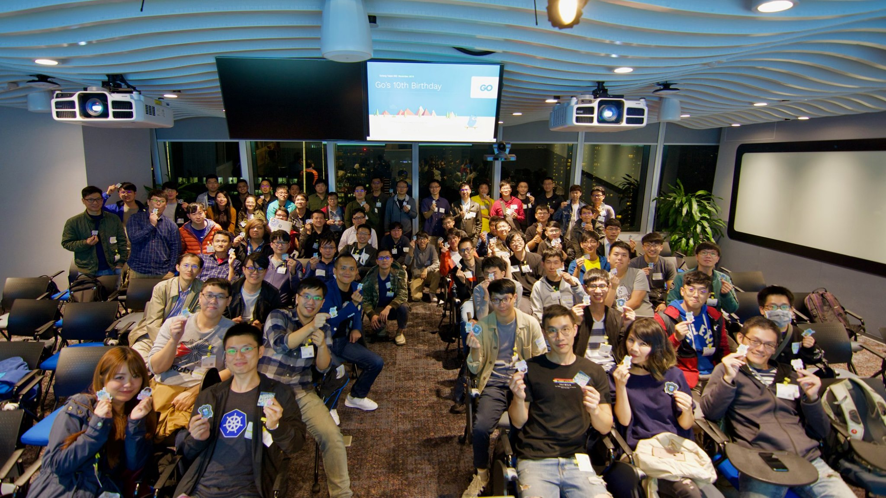
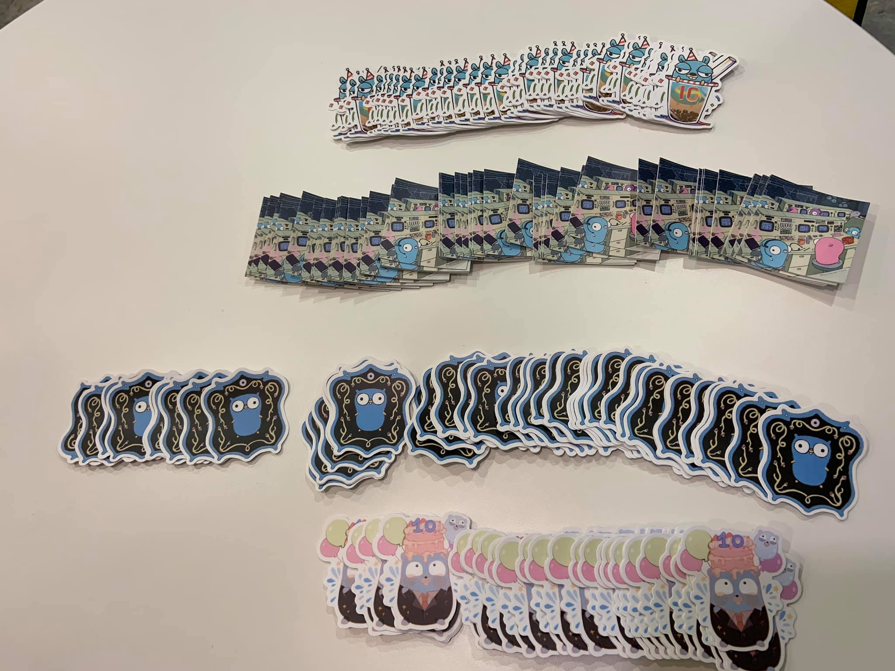
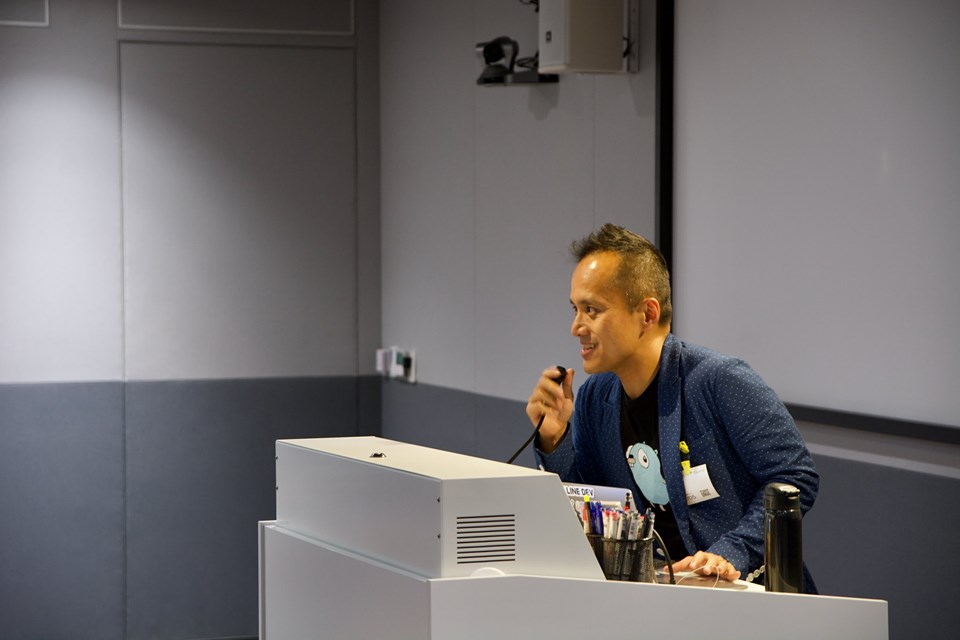
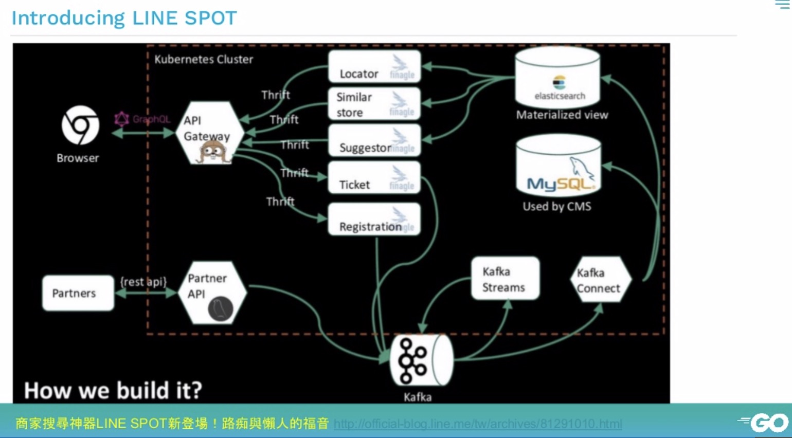
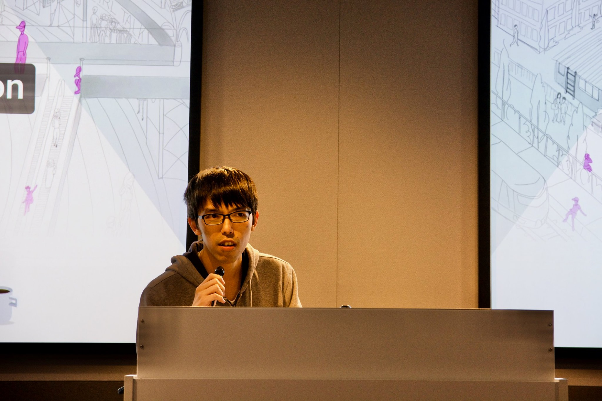

# 前言

大家好，我是 LINE Taiwan 的 Technical Evangelist - Evan Lin。  Golang 是由 Google 在 2009 年的 11 月 10 日開源出來的程式語言，兼具著簡潔與速度的特性。 由於 Docker 與 Kubernetes 的風行而在近幾年成為熱門程式語言。在今年即將邁入第十年了，當然身為 [Golang Taipei](https://www.meetup.com/golang-taipei-meetup) 的共同籌辦人也要來主辦一下十週年的慶生派對。

這一次 [Golang Taipei Gathering 第 45 的聚會](https://www.meetup.com/golang-taipei-meetup/events/264921214/)，很感謝 Google Taipei 贊助 14 樓漂亮的辦公室。並且有企業夥伴贊助貼紙跟食物，這次也有社群夥伴設計的珍珠奶茶 Gopher 貼紙提供給大家領取。

（這一次的貼紙也是有企業夥伴贊助的：最上面跟最下面的貼紙設計來源都是社群夥伴幫助的台灣特別版）

這一次聚會相關資料如下：

- 社群 Golang  Taipei Gathering： <https://www.meetup.com/golang-taipei-meetup>
- 本次活動網頁:  [活動網址](https://www.meetup.com/golang-taipei-meetup/events/264921214/)

## How I become Go GDE / 資深開發技術推廣工程師 Evan Lin

#### [投影片](https://speakerdeck.com/line_developers_tw/golang-taipei-number-45-10th-birthday)

<iframe class="speakerdeck-iframe" frameborder="0" src="https://speakerdeck.com/player/c3951cc31d754884a5439a782363f6db" title="Golang Taipei #45 10th Birthday" allowfullscreen="true" style="border: 0px; background: padding-box padding-box rgba(0, 0, 0, 0.1); margin: 0px; padding: 0px; border-radius: 6px; box-shadow: rgba(0, 0, 0, 0.2) 0px 5px 40px; width: 100%; height: auto; aspect-ratio: 560 / 314;" data-ratio="1.78343949044586"></iframe>

這一次分享的投影片，主軸分成三個：

### 為什麼我會學習 Golang

經過了十年在多媒體外商軟體公司的工作之後，為了學習新的 Web 程式語言進而嘗試了不少的程式語言之後，最後選擇了 Golang 來鑽研。並且為了深入的學習 Golang ，而啟動了 [Project 52](https://github.com/kkdai/project52) 來作為學習 Golang 的方式，也因此學習了不少的演算法與進階的資料格式的應用方式。

### Golang 十年來的紀錄

第二個階段來分享一下 Golang 近幾年的轉變過程，從 2009/11/10 開源以來，每一個大版本的更新紀錄。並且有一些大家需要注意的功能。比如說: Go 1.5 的 Vendoring 跟 Go 1.11 的 Go Modules ，都是希望大家藉由演進的過程一起來了解 Golang 如何透過每一次的版本更新來讓程式語言更友善，讓開發 Golang App 變得更有趣。

### 如何成為 Golang Expert

最後因為分享 Golang 與 [Project 52](https://github.com/kkdai/project52) 的原因，因為參與了不少的社群活動與研討會，變成了 Golang Taipei 的主辦人之一，透過持續的分享與社群的經營，我才有幸能夠到 LINE 從事 Developer Relations 的工作與變成了 Go GDE  。 在此也跟大家分享如何成為 GDE 的小秘訣。

最後工商一下 LINE SPOT 團隊有尋求 Go 工程師 (架構圖在投影片最後兩頁)

如果想要瞭解更多關於 LINE Golang 相關職缺， 歡迎參加 2019/12/04 的招募說明會: [https://linegroup.kktix.cc/events/20191204-10](https://linegroup.kktix.cc/events/20191204-10)

# 相關鏈結

- [GMOM- Go Slide Template - 10th Birthday](https://docs.google.com/presentation/d/1R41dUVJXD4KF5TchbXk2qypg422HTvMvwsYHj72Hl7o/edit?usp=sharing)
- [Go 10 years - Draft Timeline v.0.1](https://docs.google.com/document/d/1Ap_Xhwtwq69ofDBGf1PqEKkhSMOVExrSvxZpUfa9iys/edit?usp=sharing)
- [The State of Go Modules](https://docs.google.com/presentation/d/1wARA15bsEoy1pKl4W9xjWRw_7ytiM_ZJ5ZbsfIY5F-A/edit?usp=sharing)
- [Oh the Places you'll Go! #golang by Carmen Andoh](https://docs.google.com/presentation/d/1XwGfBAdo2wzJHDL4QHCgJtslmx8VUcf3HtKnEyBx82M/edit?usp=sharing)
- [The Go Gopher](https://blog.golang.org/gopher)
- [Community Go 10 years - Draft Timeline](https://docs.google.com/document/d/1Ap_Xhwtwq69ofDBGf1PqEKkhSMOVExrSvxZpUfa9iys/edit?usp=sharing)

# Understanding real world concurrency bugs in go / UmboCV - Kakashi Liu

#### [投影片](https://www.slideshare.net/kakashiliu/understanding-real-world-concurrency-bugs-in-go-191283124)

<iframe src="//www.slideshare.net/slideshow/embed_code/key/zqstqPzCiwSA6H" width="595" height="485" frameborder="0" marginwidth="0" marginheight="0" scrolling="no" style="border:1px solid #CCC; border-width:1px; margin-bottom:5px; max-width: 100%;" allowfullscreen> </iframe> 
 <strong> <a href="//www.slideshare.net/kakashiliu/understanding-real-world-concurrency-bugs-in-go-191283124" title="Understanding real world concurrency bugs in go (fixed)" target="_blank">Understanding real world concurrency bugs in go (fixed)</a> </strong> from <strong><a href="https://www.slideshare.net/kakashiliu" target="_blank">cc liu</a></strong> 

第二位講者，也是 Golang 社群的共同籌辦人之一的 Kakashi 帶來的 Understanding real world concurrency bugs in go。內容來自於 [Understanding real world concurrency bugs in go 的論文](https://songlh.github.io/paper/go-study.pdf) ，主要是透過分析近幾年的一些大型開源專案 (Docker, Kubernetes, etcd ... ) 來分析一下幾個常見的 Golang Concurrency Bugs ，裡面有許多很有趣的案例分享，如果用最簡單的案例可能無法想像怎麼會有人犯下這樣的錯誤，但是許多的錯誤都是有太多的歷史演進的原因造成後來維護的人由於對原來程式碼的了解度不足而犯下的疏忽。

不過裡面的幾個 Concurrency 的錯誤其實也是許多社群夥伴在討論的時候經常有提到的問題，相當歡迎大家好好閱讀這篇論文的內容與裡面的範例。

### 參考資料

- [Understanding real world concurrency bugs in go 的論文](https://songlh.github.io/paper/go-study.pdf)

## 活動小結

很久沒有回到 Golang 社群來一場比較長的介紹，並且也跟每一個夥伴解釋了近幾年的 Golang 發者之外，也希望讓每一位都能夠更了解 Golang 的設計理念。大家一起來推廣 Golang 。

立即加入「LINE開發者官方社群」官方帳號，就能收到第一手Meetup活動，或與開發者計畫有關的最新消息的推播通知。▼

「LINE開發者官方社群」官方帳號ID：@line_tw_dev

## 關於「LINE開發社群計畫」

LINE今年年初在台灣啟動「LINE開發社群計畫」，將長期投入人力與資源在台灣舉辦對內對外、線上線下的開發者社群聚會、徵才日、開發者大會等，預計全年將舉辦30場以上的活動。歡迎讀者們能夠持續回來察看最新的狀況。詳情請看 [2019 年LINE 開發社群計畫活動時程表 (持續更新)](https://engineering.linecorp.com/zh-hant/blog/line-taiwan-developer-relations-2019-plan/)<https://engineering.linecorp.com/zh-hant/blog/line-taiwan-developer-relations-2019-plan/>)
