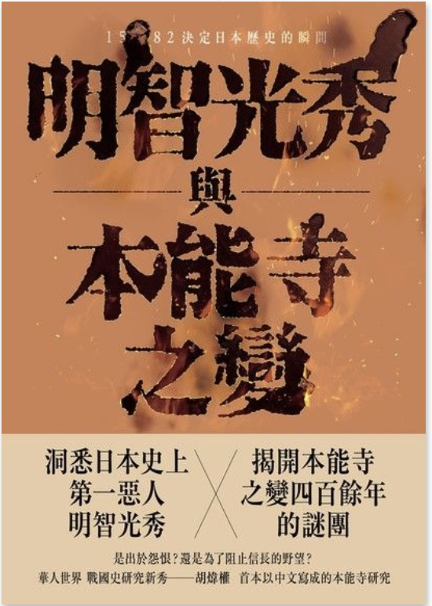

```
明智光秀與本能寺之變 - 1582決定日本歷史的瞬間

作者： 胡煒權  出版社：遠足文化 
出版日期：2017/07/19 
語言：
繁體中文 ISBN: 9789869500647 
字數： 127,468
```

#### 買書推薦網址： http://moo.im/a/1clqPY

# 前言:

講到日本戰國時期你會想到什麼？ 織田信長？ 武田信玄？ 還是豐臣秀吉？ 對於光榮遊戲玩得多的我（太閣立志傳），當然就是織田信長。  如果所有的日本戰國時期的事件中挑一個最讓我不可思議的首選就是本能寺之變，因為眼見信長的天下布武實現的日子就要到了，結果自己就葬身在自己最信任的武將之一 ： 明智光秀的反叛之中。

本書將透過介紹明智光秀的故事，抽絲剝繭來探討到底為什麼會發生「本能寺之變」的可能原因。


# 內容簡介:

```
天正十年六月二日，即西曆一五八二年六月二十一日，在日本京都發生了一宗堪稱影響日本戰國時代，甚至日本歷史發展的事件—「本能寺之變」。當時欲以結束戰國亂世、統一日本的織田信長被他最信任的家臣之一的明智光秀率兵突襲。信長以寡兵抗戰不果，最後在本能寺的烈焰中自殺，享年四十九歲。

本書將透過利用一次史料、其他較可信的軍記小說以及諸位現在活躍於研究戰國史及本能寺之變的學者的論文、著書，試圖解明、追溯明智光秀為什麼、如何發動本能寺之變，並嘗試析論到目前為止，學界、坊間對事變的解釋事變的諸項說法，以及事變與織田政權政策的因果關係。最後，並在最後一章中談談筆者個人見解。
```

(簡介來自於： 讀墨 http://moo.im/a/1clqPY)

本書分成兩個大章節，第一個部分主要敘述著明智光秀的生平事蹟。作為本能寺之變的主要角色，不少的書籍與漫畫反而沒有多加敘述。本書將仔細敘述明智光秀的出身，為何加入織田信長，又是如何在織田家中已相當快速的速度獲得信長的信任，最後到本能之變之前又發生了哪些跟信長不愉快的地方。

第二個部分則是透過許多本能寺之變的研究報告來分析幾個可能的陰謀論，不論是透過史學來分析，還是許多的傳記來分析。這個部分的分析都相當的精彩，也讓本能寺之變的整個經過變得相當的清楚。而其中的陰謀論當然也都相當的有趣，相當吸引人閱讀。


# 心得:

日本的戰國漫畫大概也是我一個相當喜歡的類型，而其中又以織田信長的相關漫畫又是我最喜歡的。不論是池上遼一的「信長」， 長手由佳的「信長」，「信長協奏曲」或是宮下英樹的「戰國天正記」。都是我個人喜歡的類型，裡面也對於本能寺之變有多方的著墨，不論是敘述說可能是豐臣秀吉的陰謀論之外，也有信長不玩了想要離開的奇幻結局。不論如何，如日中天的織田信長被背叛而無法完成統一大業是事實，至於究竟為何會發生。 這本書給予了相當多的想法，不過許多漫畫也對於明智光秀的著墨不多，必須得說可能都是想要塑造他的神祕的原因。

但是這本書反而對於明智光秀有相當多的敘述，作為可能是本能寺之變的主謀。本書對於明智光秀的崛起，成功的過程，到最後可能有許多跟信長的衝突點都有詳細的敘述，使得閱讀的人也更能夠了解整件事情的來龍去脈。整本書敘事方式也相當的有趣，讓閱讀起來一點也不吃力，反而相當的起勁，相當推薦大家來看看。