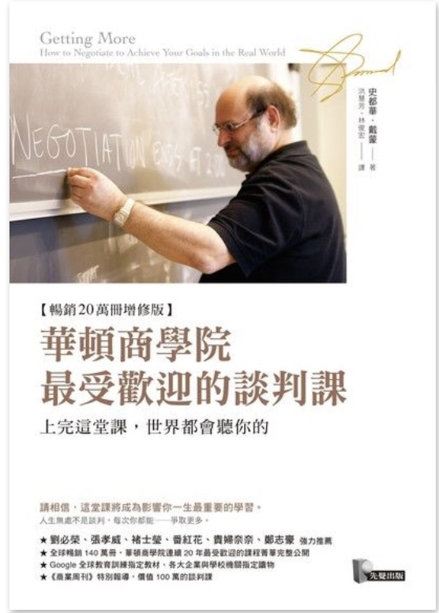

```
華頓商學院最受歡迎的談判課-上完這堂課，世界都會聽你的
Getting More : How to Negotiate to Achieve Your Goals in the Real World

作者： 史都華．戴蒙  
原文作者： Stuart Diamond  
譯者： 洪慧芳、林俊宏  
出版社：先覺出版 
出版日期：2018/01/01 
語言：繁體中文 
ISBN: 9789861343136 
```

#### 買書推薦網址： http://moo.im/a/bcoxWY

# 前言:

之前公司旁邊的同事從事於 BD (Business Developing) 的相關工作。經常聽到他談到如何透過談判的方式來讓雙方達成合作的討論的時候，就覺得談判的手法不論是哪一種工作的從業人員其實都需要好好學習的技巧。

這一本書透過許多個課堂案例的分享，來講解應該如何透過一些談判的技巧來讓談判的雙方能夠透過拉近彼此的距離來達到雙方都能夠接受的最大權益。

# 內容簡介:

```
戴蒙教授強調，無論是要求店家折價100元，還是要求廠商降價1萬元，所使用的談判工具都是一樣的。意思就是，當你學會戴蒙教授的談判技巧，在生活各面向你都能爭取更多！他所教過的3萬個學生都獲得他的真傳，在各行各業如魚得水。

如果你想在商場上取得更好的交易條件、希望在人際關係中獲得更多的主導權、想讓家庭關係與親子關係更融洽，戴蒙教授的談判技巧，將帶給你超乎想像的優勢！
```

內容簡介來自「讀墨」：http://moo.im/a/bcoxWY

本書的講解主要圍繞著以下的一些準則:

- 談判的本質
- 談判失敗的原因
- 回頭來看談判需要的準則
- 如何「動之以情」
- 交換評價不相同的籌碼

接下來，再透過以上學習到的方式應用到各個面向的談判方式：

- 職場談判
- 人際關係談判
- 親子談判
- 公共議題的談判

整本書的脈絡相當的清楚，每一個章節也搭配了許多案例讓閱讀起來不會太吃力。

# 心得:

遇到困難的時候，或是權益受損的時候，該如何正確地透過談判的方式來讓自己獲得最大的權益或是補償？ 談判的時候要如何透過同理心與談判的技巧來拉近與對方的距離，並且達到雙方都能夠接受的最大共識？ 

本書不斷在圍繞著如何拉近談判雙方的距離當作一個起手式，也不斷地透過瞭解對方的需求，進而提出自己的需求來讓雙方能夠在談判上獲得心理層面等價的交換。值得注意的是作者不斷提到需要透過先拉近與談判者的距離再來啟動談判的方式。在不知道談判的底線的時候， 也千萬不要輕易的提出談判的籌碼。

以上一些方式看起來都相當的嚴肅，也好像在談大型商業機會的交換。不過談判可以是跟你的小孩討論該不該做作業，或是跟售票員爭取多五分鐘的售票機會等等。

並且許多的時候雙方對於「等價」的判斷也是不對等的。小孩會認為玩玩具是最重要的價值所在，父母希望小孩子能夠乖乖吃飯（或是寫功課），這些的不對等的對價關係就是談判時候最重要的，也是最需要注意的部分。