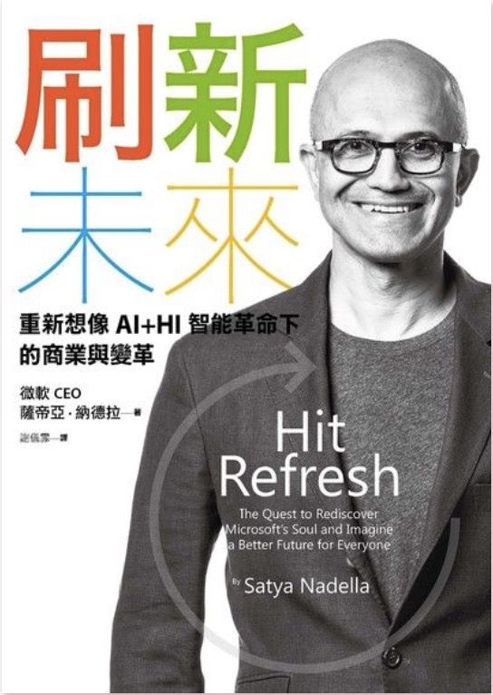

```
刷新未來: 重新想像AI+HI智能革命下的商業與變革
HIT REFRESH : The Quest to Rediscover Microsoft's Soul and Imagine a Better Future for Everyone
作者： 薩帝亞．納德拉  
原文作者： Satya Nadella  
譯者： 謝儀霏  
出版社：天下雜誌出版 
出版日期：2018/01/03 
語言：繁體中文 
ISBN: 9789863983095 
```

#### 買書推薦網址：http://moo.im/a/6ilwLW 

# 前言:

這一系列的書其實是「雙十一： 讀墨三本七五折」 買的， （宅宅的雙十一就是這麼～平淡且枯燥乏味）但是這本真的太有趣了，於是這幾天就讀完了。 加上裡面有一句讓我注意到的話語 「夏天,25歲的我加入微軟,我是Windows NT的*技術傳教士*(evangelist)」。 

也就是因為這一句話，就讓我認真的把這一本書看完了。 對我來說，這本書的寫作方式很像是透過 Developer Relations 的口吻來闡述著身為微軟新任 CEO 對於公司的看法與對於未來的展望。

# 內容簡介:

```
AI超速普及，人類不會被取代的獨有價值是什麼？
雲端之後，下一波關鍵科技是什麼？什麼樣的企業，將主導未來？如何帶領變革？

科技加速顛覆，成功不會長青，未來沒有藍圖。
最大的挑戰不是未知，而是我們是否能更開放的思辨、持續刷新，就能重新啟動、開展未來！
```

內容簡介來自「讀墨」：http://moo.im/a/6ilwLW

整本書的開頭透過被選拔為微軟新任執行長的過程，帶到作者的從印度的成長歷史到微軟近幾年的困境。 就像一部傳記電影般的開頭，讓人會很想認真的看下去。 接下來一幕又緩緩地回到作者剛加入微軟的時光，那時候跟 Bill Gates 和 Steve Ballmer 的會面與學習到的精神，是如何讓作者在往後二十多年的微軟生涯來面對不同的挑戰。

接下來的故事也是敘述著作者在微軟的許多歷程，就像是一本小小的微軟歷史一樣。一開始是最受歡迎的 Windows NT 與客戶相關的部門，後來到了一個新的產品事業部，也就是微軟的雲端事業部門（後來讓大家熟知的 Azure )。透過在新部門的戰戰兢兢的嘗試，挑選出正確的路途來讓業績成長，最後終於被提拔為微軟的新任執行長。

也是因為作者的工作歷程的原因，讓他有著相當正面的思考想法。清晰的判斷也讓近幾年的微軟脫胎換骨，努力結合許多以往的競爭對手，讓微軟的平台到處發光。 也透過擁抱開源來讓微軟的雲事業不是僅僅在於 Windows 系統的架構雲，更是以人工智慧與為客戶導向為主的雲端服務系統。

最後一個階段，就是作者分享他對於近幾年幾個科技趨勢的看法分享。從科技信任，人工智慧到自由化貿易的面向上分享不少個人的意見。


# 心得:

這本書籍的寫作方式如同我一開始提到的，是透過 Developer Relations 的方式來寫。也就是這本書原來就是可以拿來對外宣傳微軟已經脫胎，邁向未來之外。也是可以給微軟員工作為堅定信心，持續努力開創未來的一本書籍。 


內容的說明上，個人相當建議想要了解該如何做一企業科技品牌再造的人要好好閱讀。也因為像我說的文章的鋪成其實是很用心地透過類似電影分鏡的方式來排列，讓閱讀的人會被吸引住的忍不住看完。 不過對於微軟的歷史上面也相當詳細的交接不少階段的成長過程，對於許多學生與科技業的從業人員都可以透過這本書籍來當作是微軟近幾年的成長歷史書籍來看。

如果你不認識微軟新的執行長 - Satya Nadella 這本書相當建議你可以好好閱讀。