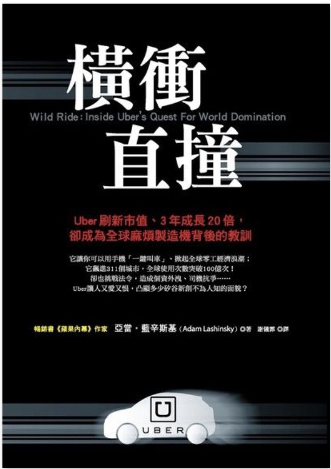

```
刷新未來: 橫衝直撞: Uber刷新市值、3年成長20倍，卻成為全球麻煩製造機背後的教訓(Wild Ride)

作者： 亞當．藍辛斯基  
原文作者： Adam Lashinsky  
譯者： 謝儀霏  
出版社：天下雜誌出版 
出版日期：2018/10/01 
語言：繁體中文 
ISBN: 9789863983590 
```

#### 買書推薦網址：http://moo.im/a/68osHU 

# 前言:

這一系列的書其實是「[雙十一： 讀墨三本七五折](https://readmoo.com/campaign/2019/11/2019nov11/index)」 買的，緊接著在[「刷新未來」](https://www.evanlin.com/reading-hit-refresh/)之後。 不過這本書的內容也相當有趣，也是很讓我閱讀起來欲罷不能。 身為科技宅宅，對於 Uber 除了是他的服務之外，就是他的許多開源專案。不論是 [zap 專案](https://github.com/uber-go/zap)，或是[機器學習平台 Horovod](https://github.com/horovod/horovod) ，都是令我相當喜愛的開源專案。

但是 Uber 在讀者們的心目中是如何地位？ 是一個高科技的公司？ 是一個具有爭議性的公司？ 是一個在許多區域都挑戰當地法律的公司？

這本書將會由前執行長- 卡蘭尼克的創業過程來敘述，讓讀者能夠了解到卡蘭尼克創業過程外，更可以了解 Uber 得成長過程。


# 內容簡介:

```
它讓你用手機「一鍵叫車」、掀起全球零工經濟浪潮；
飆進311個城市，全球使用次數突破100億次
卻也挑戰法令，造成個資外洩、司機抗爭……
Uber讓人又愛又恨，凸顯多少矽谷新創不為人知的面貌？

在全球，Uber平均每天完成1,500萬趟搭車服務，活躍司機超過300萬人；
在台灣，你可以用Uber Eats訂餐，在家也能吃到排隊美食。
即使你沒用過它，但你一定聽過它、罵過它。
```

內容簡介來自「讀墨」：http://moo.im/a/68osHU 

整本書主要圍繞著備受爭議的前執行長 - 卡蘭尼克的故事，一開始從他下台前發生的相關事情開始敘述 Uber 。一個具有一些技術的科技領先公司接連爆出許多新聞。 性騷擾，不遵守法令，偷安裝各種追蹤軟體。 導致卡蘭尼克必須下台的故事，也帶到了想要進攻大陸卻因為法令與競爭者滴滴出行的競爭下，必須要考量另外的出路來讓公司保持競爭力。

接下來鏡頭一轉到了卡蘭尼克的大學時候，開始從頭敘述他是創業的。透過其他人的閑置電腦資源分享檔案與歌曲而開始賺錢創業 Scour ，但是卻因為遇到暗藏心機的金主而導致第一個創業失敗。 接下來透過相關技術他又創立了 Red Swoosh 這次他不積極找資金擴張，反而慢慢地做。 即使做到剩下兩個員工也不斷努力，最後總算被併購之後反而當起來創業顧問。

在雲遊四海的創業顧問生涯，他找到了 Uber 的啟蒙時期。並且加入了 Uber 積極地打造 Uber 的生意，進而成為現在的產業龍頭。

最後一個章節則是展望未來， Uber 如果真的會出現敵人將會是什麼？ 不是 Lyft ，不是 Grab ，而將會是自動駕駛汽車。所以 Uber也跟 Tesla 較勁要發展自動駕駛的技術。相當有趣的一本書。


# 心得:

Uber 的傳奇故事，其實在許多的科技新聞都會提。但是總是對前執行長的著墨可能不夠，無法了解為什麼他們會有這一些取巧與冷酷的做法。但是透過這一本書可以深入的了解前執行長卡蘭尼克的故事。

並且可以了解創業應該注意的事情，也能夠更了解一個成功的企業除了市場的敏銳度之外。該如何讓服務快速迭代的推廣到每一個城市也是很令人欽佩的。

Uber 對於這個有所謂的教戰手冊，清楚地傳授業務推廣單位能夠在一個嶄新的城市中要如何開始新的 Uber 的事業群推廣。也是因為類似的準備才能讓 Uber 在全球擴張的速度令人咋舌。

如果你是一個具有創業精神的人，推薦你看這一本書。如何果你是一個科技人，也推薦你看看這本書，對於創業能夠有更深一層的了解。