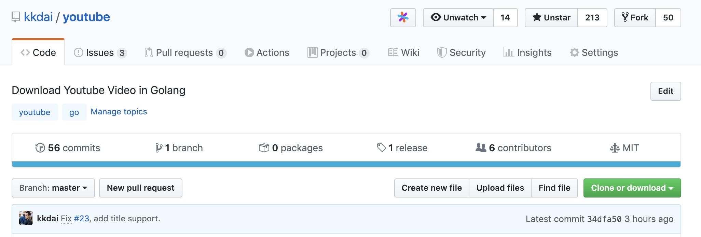

## 前言：

這個專案是之前在開發 [Project 52](https://github.com/kkdai/project52) 所開發出來的，原因是看到一些解析 youtube 影片資訊的內容。透過 Golang 的 channel 跟 goroutine 可以很快速的開發出來一個小工具。 專案完成後，其實也沒有特別維護他。想不到卻受到大家的喜愛，Star 數也破了兩百。 

由於 Youtube 其實對於資料格式也有修改（截至 2019/12/10 當下） ，這裡也針對目前的資訊來探討如何透過 Golang 來抓取相關資訊，並且取得影片標題，作者姓名，甚至是取得下載鏈結的方式。

(更新: 2020/06/02 ) 由於 YouTube 又再一次更新了影片網址的取得方式，個人也認爲相當適合分享。在此整理一下相關更新部分在同一篇文章中。


## 開源專案: [github.com/kkdai/youtube](github.com/kkdai/youtube )


## 投影片:
<script async class="speakerdeck-embed" data-id="a230f4015f8e402b9b734c10e45a9d1d" data-ratio="1.77777777777778" src="//speakerdeck.com/assets/embed.js"></script>


####  Github: https://github.com/kkdai/youtube

```
直接下載使用:
- go install github.com/kkdai/youtube/youtubedr

用法1: （另存檔名為 Campaign Diary.mp4）
youtubedr -o "Campaign Diary".mp4 https://www.youtube.com/watch\?v\=XbNghLqsVwU

用法2: （不指定檔名，而使用影片標題)
youtubedr https://www.youtube.com/watch\?v\=XbNghLqsVwU
```


## 抓取 Youtube 影片資訊 

### 取得 Youtube 影片 ID 與取得資訊:

<iframe width="560" height="315" src="https://www.youtube.com/embed/rFejpH_tAHM" frameborder="0" allow="accelerometer; autoplay; encrypted-media; gyroscope; picture-in-picture" allowfullscreen></iframe>
舉個例子 Rob Pike 在 dotGo 2015 裡面的一個很棒的 talk -  Simplicity is Complicated ，該影片的位置如下：

#### https://www.youtube.com/watch?v=rFejpH_tAHM

這邊簡單的簡介一下，在 Youtube 每一則影片都有一個 ID，這個影片的 ID 則為 `rFejpH_tAHM`。

如果需要取得影片的相關資訊，則需要呼叫 

```
https://youtube.com/get_video_info?video_id={YOUR_VIDEO_ID}
```

來取得，也就是如果要取得這部影片的資訊需要鏈結到 https://youtube.com/get_video_info?video_id=rFejpH_tAHM


### 取得資訊與相關處理程式碼:

接下來依序討論如何尋找影片 title 與資料。首先來詳細查看剛剛取得的相關資料。

<script src="https://gist.github.com/kkdai/5726aec2ac7ec65b88268239c6019175.js"></script>
 因為取得下來的是 URK-encoded query string 的資料，需要透過以下的處理方式。

<script src="https://gist.github.com/kkdai/58e776a1387d3db2c032492269601d58.js"></script>
首先，你需要處理一下錯誤訊息。由於許多的影片是禁止下載分享，如此一來在取得相關資訊的時候則會發生錯誤的 status ，這裡需要處理一下。


### 取得影片標題與影片作者資訊：

這裡得說一下，其實大多數的資料有修改過。跟網路上可以找得到的資訊不同。所以後來花了很多的時間重新搜尋相關資訊，並且整理與轉換。 透過上述的 `parseVideoInfo` 轉換後可以取的 `url.Values` 也就是變數名稱的 `answer`。

處理上可以參考下列的方式，由於發現 ``answer["player_response"]` 裡面有 Map 結構的資料格式，於是透過以下的方式可以取得相關資訊。

<script src="https://gist.github.com/kkdai/e7ad779a3345485ab4be6ec7eb3240b6.js"></script>
這邊有些比較少見的用法，稍微解釋一下。

```
if err := json.Unmarshal([]byte(playResponse[0]), &personMap); err != nil {
		panic(err)
	}
```

這個透過 JSON unmarshal 的方式來將JSON string 轉換成 map 。 轉換成 map 之後就可以尋找與取值，這裡可以使用 `videoDetails` 。

至於讀者可能會好奇這些資料格式是如何知道的，並且知道資料所在的位置。 這也是不斷地透過 iteration 來尋找才找到的。

取得 map 資料取出後，由於資料預設格式都會是 `interface{}` 如果要轉換成 string 輸出的話。可以透過 type assertion 或是直接轉換的方式。


### 下載影片:

來講解一下所有的影片格式搜尋方式，還有如何找到最高解析度的影片。

<script async class="speakerdeck-embed" data-slide="9" data-id="a230f4015f8e402b9b734c10e45a9d1d" data-ratio="1.77777777777778" src="//speakerdeck.com/assets/embed.js"></script>

這邊可以從 `player_response` 去拿出 stream Map 也就一個 Array 的 JSON 資料。 (如同投影片內敘述的）。

<script async class="speakerdeck-embed" data-slide="10" data-id="a230f4015f8e402b9b734c10e45a9d1d" data-ratio="1.77777777777778" src="//speakerdeck.com/assets/embed.js"></script>

這時候需要針對取得的 JSON 資料開始做處理，建議方式如下：

- 先到 JSON Lint 網站去將取得的 JSON raw data 加以轉換成可讀型態。
- 再來複製貼上到 editor 去除掉一些 web css tag 
- 最後將資料貼到 JSON-TO-GO 就可以得到 Go structure

### 看起來可以得到下載鏈結 (but..)

看起來這樣從 ["streamingData"]["formats"][0]["url"] 取得下載網址，但是似乎不是每個影片都有提供這樣的資料。

<script async class="speakerdeck-embed" data-slide="12" data-id="a230f4015f8e402b9b734c10e45a9d1d" data-ratio="1.77777777777778" src="//speakerdeck.com/assets/embed.js"></script>

某個影片去尋找資料的時候，卻發現沒有 `url` 的資料可以找，但是卻多了一個資料 `cipher` ??


## 注意:

1. 並非所有影片都可以下載，如果不提供分享的影片則無法下載。


## 結論：

原本是使用者的建議，希望如果在抓取 MPEG4 的時候可以預設使用影片的標題，而不一定要抓取檔案的一定要輸入檔名。 這樣的追下去才發現資料格式有修改，在此也分享給各位如何搜尋相關的資料。

是說～～好久沒寫扣了。真的心血來潮又是寫到天快亮。 orz


## **Reference:**

- https://github.com/ytdl-org/youtube-dl
- https://github.com/lepidosteus/youtube-dl
- [拆解 Youtube 影片下載位置](http://hkgoldenmra.blogspot.tw/2013/05/youtube.html)