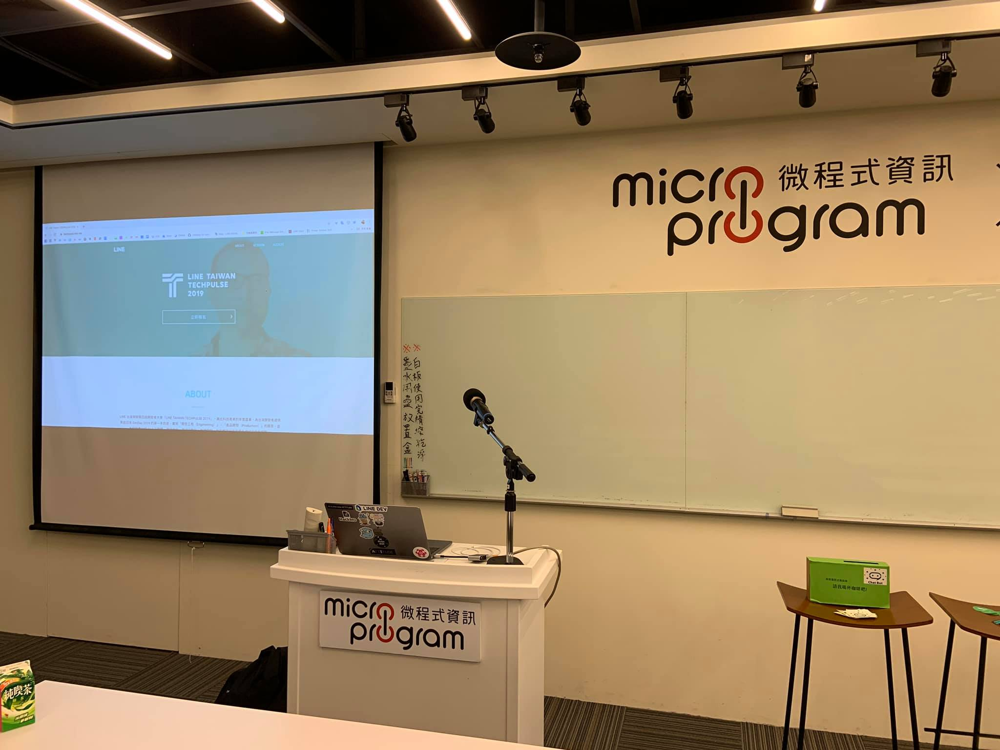
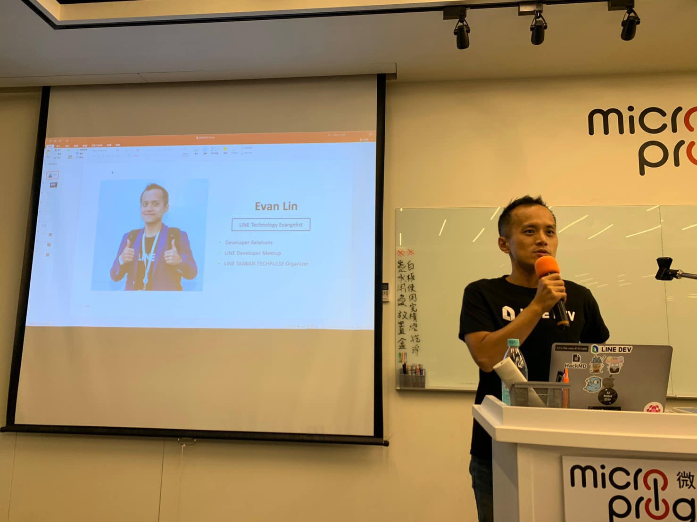
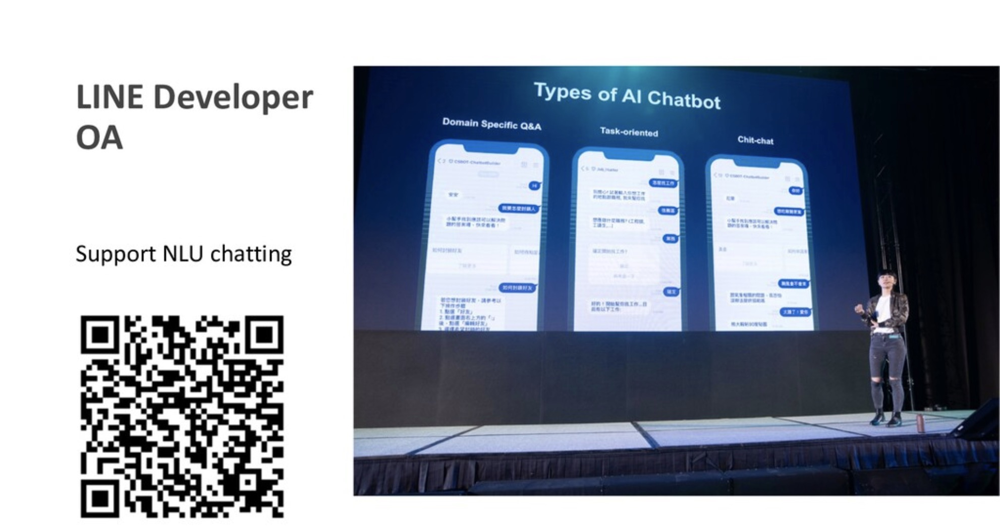
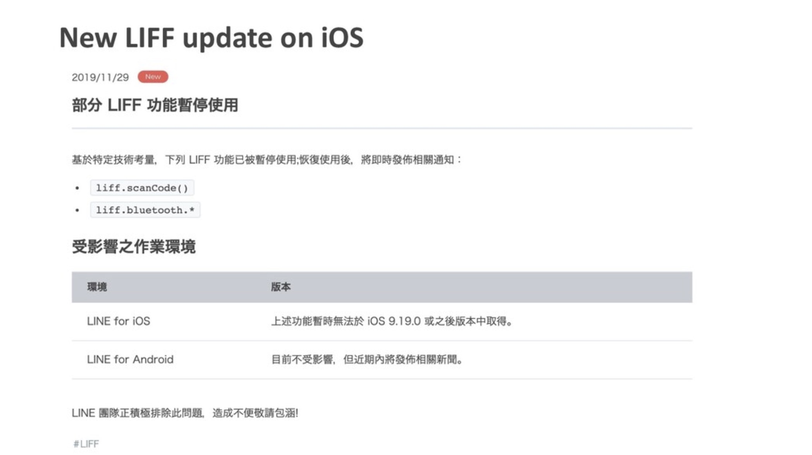

# 前言

大家好，我是 LINE Taiwan 的 Technical Evangelist - Evan Lin。這次很開心受到 chatbot 社群台中分部的邀請，參加了 "[中部人的 Chatbots Meetup 聊天機器人小小聚 #5 @ 台中夢森林](https://chatbots.kktix.cc/events/chatbots-taichung-005)" 的聚會活動，並且分享 LINE API 更新與個人開發的心得。在此也跟各位分享本次參與的心得，並且也希望透過社群分享的力量能夠讓聊天機器人的開發動能更加的盛大。  

- 社群 Chatbots Meetup： https://chatbots.kktix.cc/ 
- 本次活動網頁:  [活動網址](https://chatbots.kktix.cc/events/chatbots-taichung-005)
- 本次活動的共筆紀錄： https://hackmd.io/MA3uyLKtTn24KUx1iBWSzQ?both

由於 Chatbots Meetup 本身屬於社群自主性的活動，裡面也有許多社群朋友所贊助的閃電秀。裡面的所有內容也是相當的難得與有趣。也希望能夠透過本篇文章讓大家稍微了解 Chatbots Meetup 社群閃電秀的魅力。

以下分享一下個人在這場活動參與的心得，想要了解更多也歡迎去查看社群共筆紀錄。 https://hackmd.io/MA3uyLKtTn24KUx1iBWSzQ?both

##  TECHPULSE RECAP and LINE API Update 201912 / 資深開發技術推廣工程師 Evan Lin

#### [TECHPULSE 投影片](https://speakerdeck.com/line_developers_tw/techpulse-2019-line-platform-api-update)

[LINE API Update 201912](https://speakerdeck.com/line_developers_tw/line-developer-oa-update-and-api-update)

### LINE 開發者官方社群 OA 大升級：

就在 12/04 的 LINE TECHPULSE 2019 的大會上，來自韓國的 Jaewon 跟台灣工程師 Penny 有跟大家介紹 [Clova Chatbot builder](https://speakerdeck.com/line_developers_tw/automl-in-clova-chatbot-builder-framework) ，並且我們也跟大家想分享了，其實現在開始在 LINE 開發者官方社群 (ID: line_tw_dev) 也已經將 Clova Chatbot builder 整合進來，希望能讓每一位開發者都能夠清楚了解 LINE 平台的開發相關資料該如何尋找，也歡迎大家看看這一篇介紹文章 - [LINE 開發者官方社群小幫手 – 操作體驗篇](https://engineering.linecorp.com/zh-hant/blog/dev-helper-chatbot/)。

### 部分 LIFF 功能暫停使用

如同之前新聞 「[部分 LIFF 功能暫停使用](https://developers.line.biz/zh-hant/news/2019/11/)」所述，有一些 LIFF 的功能在即將上架的 iOS 9.19.0 之後就會暫停使用。在這個聚會上也跟大家公布一下，也請開發者們等待更近一步的消息公佈。

相關還有更多的新聞，也歡迎大家到投影片裡面查看。

至於 LINE TECHPULSE 2019 的投影片內容部分，也歡迎大家到投影片裡面查看，如果有任何 LIFF 使用上的問題與建議，歡迎大家在社群提問與討論。

### 更多相關內容:

-  [LINE 開發者官方社群小幫手 – 操作體驗篇](https://engineering.linecorp.com/zh-hant/blog/dev-helper-chatbot/)
-  [部分 LIFF 功能暫停使用](https://developers.line.biz/zh-hant/news/2019/11/)

## 如何打造一個好的機器人開發框架 / C.T.Lin

#### [投影片](https://drive.google.com/file/d/1yz38IWwolgv8AQPxIpuQBfNzSaKjGQVU/view)

來自資拓資訊的 CT ，跟大家分享聊天機器人開發框架 [Bottender](https://github.com/Yoctol/bottender) 的開發經歷。 整個內容相當有趣，敘述著當初公司接到案子要開發聊天機器人的那一刻，就想要打造給自己用的聊天機器人框架，透過支援的平台增加，與功能的增加，也開始想要把開發框架開源出來給社群的夥伴一起使用，一起來打造更好的平台生態。

整個內容隨著時間軸來了解 [Bottender](https://github.com/Yoctol/bottender) 框架是如何建立與逐漸成長的過程，也有討論到隨著每個平台不同的架構與支援功能在開發一個框架的時候應該要如何應對。  最後 [Bottender](https://github.com/Yoctol/bottender) 也在日前[正式的宣布 1.0](https://bottender.js.org/blog/2019/12/05/bottender-1) ，歡迎大家來關注並且了解這開源聊天機器人開發框架。

### 更多相關內容:

- [Bottender](https://github.com/Yoctol/bottender) 
- [Bottender 1.0 官方部落格](https://bottender.js.org/blog/2019/12/05/bottender-1)

## 閃電秀

三個講者之後，接下來就是介紹這個社群最有魅力的部分就是閃電秀。所有的閃電秀可以參考這篇共筆文章  [https://beta.hackfoldr.org/chatbot/](https://beta.hackfoldr.org/chatbot/)  ，由於都是五分鐘的閃電秀，主要內容快速用條列介紹給各位：

- **能使用變數的訊息推送小工具 / 戴均民**
  - 	[Slide](https://hackmd.io/@taichunmin/B1rUayhjr?fbclid=IwAR0gj3ZAr2DsT3mD-dMvB05mEKhkGb_5N-eBPKEt5DJTFCRoBfjhbIxnHkM#/)：
  - 	[LINE 訊息推送工具](https://codepen.io/taichunmin/full/zYYMrLb)
  - 	簡介：
     - 	為了解決發送報名成功（或是抽獎成功）的個人客製化訊息的工具，可以解決發送報名成功訊息的工具，並且是支援 FLEX Message ，裡面還可以帶參數參考到 Google Sheet 裡面的變數。
  
- **叩叩蛋—敲開你的心 / 徐弘欣、葉昭甫(與其他組員)**
  - [Slide](https://drive.google.com/file/d/1goeEadZ3oVZzRnhhs3UceH7PwBdXtB19/view) , [ 影片](https://www.youtube.com/watch?v=dHvey20r58k&feature=youtu.be)
  - 簡介：
    - 很有趣的專案，透過機器學習的方式來幫大家打開社交的困難點。讓大家更願意用「真心」的方式來聊天與交友，打破語言尷尬的困難點。還結合寵物養成系統，很期待正式上線的時間。
  
- **伸手拍共享筆記 / 許賀凱、劉羽筑、劉曛綺**
  - 簡介:
    - 第三組一樣是來自於逢甲大學的朋友，裡面有提到這次會有兩組來社群分享是透過老師的推薦。而這個組想要解決的問題就是共筆的問題，在參與社群活動或是上課的時候，或多或少都會做一些心得整理。但是什麼樣能夠有效的整理成一篇文章讓大家相互學習分享呢？ 就是透過照片的相似程度來做判別來讓筆記能夠集合在一起。
  

## 活動小結

這是我第一次到台中參加開發者社群的分享，遇到了許多有創意與熱情的開發者。讓我驚訝的是逢甲大學的學生畢業專題完成度竟然如此的高，希望能有更多有熱情的開發者能加入聊天機器人的開發生態，更希望大家會喜歡在 LINE 平台的開發，有問題歡迎在社群詢問與討論。

社群分享永遠是讓創意激盪的最佳方式，而 Chatbots Meetup 是一個很熱情與充滿創造力的社群組織。也希望有更多有創意的開發者願意加入 LINE Chatbot 的開發行列，更希望能熱情的參與社群的活動與一起來分享。

立即加入「LINE開發者官方社群」官方帳號，就能收到第一手Meetup活動，或與開發者計畫有關的最新消息的推播通知。▼

「LINE開發者官方社群」官方帳號ID：@line_tw_dev

## 關於「LINE開發社群計畫」

LINE今年年初在台灣啟動「LINE開發社群計畫」，將長期投入人力與資源在台灣舉辦對內對外、線上線下的開發者社群聚會、徵才日、開發者大會等，預計全年將舉辦30場以上的活動。歡迎讀者們能夠持續回來察看最新的狀況。詳情請看 [2019 年LINE 開發社群計畫活動時程表 (持續更新)](https://engineering.linecorp.com/zh-hant/blog/line-taiwan-developer-relations-2019-plan/)https://engineering.linecorp.com/zh-hant/blog/line-taiwan-developer-relations-2019-plan/)