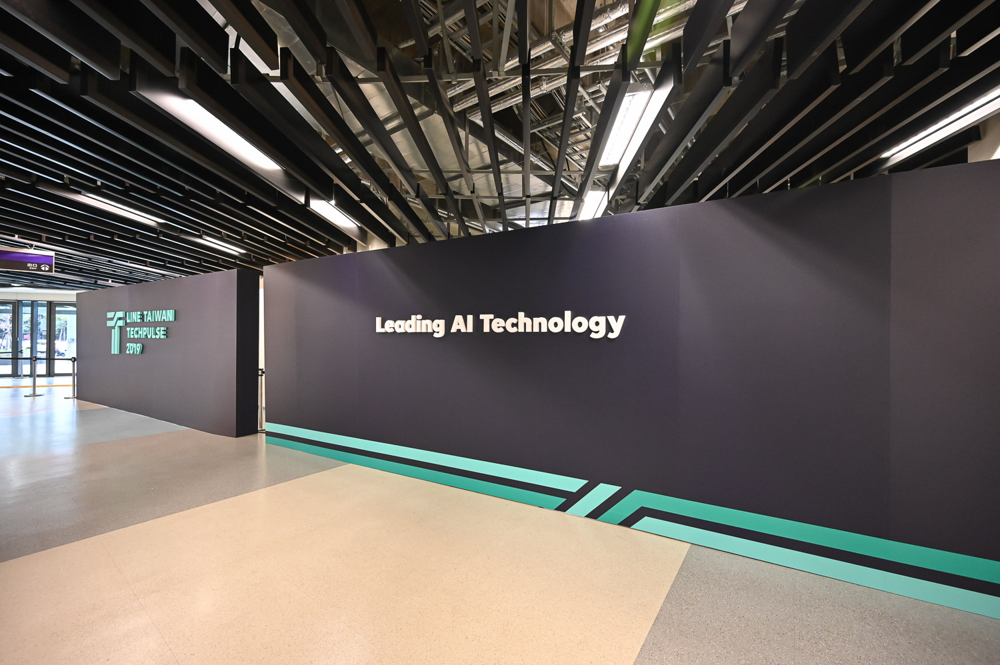

# 前言

大家好，我是 LINE Developer Relations 團隊的資深開發技術推廣工程師 - Evan Lin 。主要的工作項目就是平台技術推廣與技術品牌的建立與溝通。 LINE TAIWAN TECHPULSE 2019 已經在 2019/12/04 在和平籃球館舉辦了，不知道今年各位有沒有參與到這一場精心安排的盛會。 這一篇文章，分享一下身為幕後工作人員在活動裡面想要傳遞的訊息，本篇文章將會專注在主場議程以外的相關訊息，也就是開發者相關的交流區域。希望大家都有觀察到工作人員們的初衷，跟著本篇文章再來體驗這一場知識與社群的饗宴。

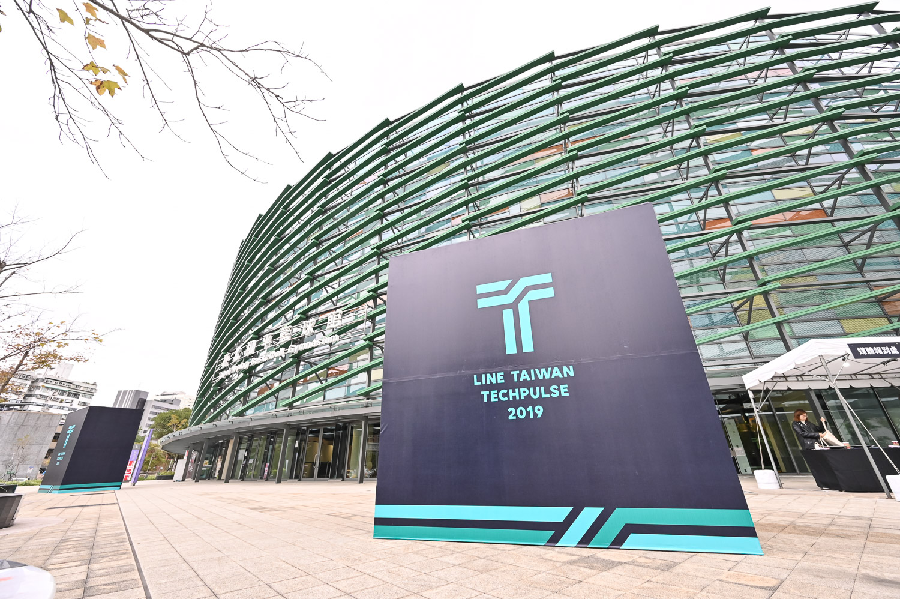

# 回歸初衷，從開發者的本質出發

開發者在參與研討會的時候，最想要的究竟是什麼？ 就是跟人互動， 而 Closing the distance 一直都是 LINE 的宗旨之一，也是本次活動最大的設計目標。 於是本次的活動回歸了開發者社群的本質，參與研討會最想要做的但是由於一些外在條件而無法實現的夢想，大致上條列如下：

- 講者們都好強喔，好希望能在台下跟講者互動跟交流，想聽聽他們對於其他部分的意見討論與問題交流。
- LINE 的強大開發平台上面有哪些社群組織？ 裡面該如何加入呢？
- 什麼是 LAE (LINE API Expert) 這些大大又是哪裡來的？ 可以跟他們交流問問題嗎？
- LINE Pay 該如何申請測試帳號? 該如何分析問題呢？
- LINE 的新星計畫又是什麼？ 可以跟那些參與的新創團隊聊聊嗎？
- 聽說 LINE 資安做得相當好，那有資安社群可以參加嗎？
- 每次看到 LINE 的工程師在各大研討會的分享都好棒，有沒有機會可以跟他們近距離討論呢？
- 有沒有機會能夠透過參與研討會認識更多的同好？ 或是跟同行友人又更多拍照的機會？

這些的問題從去年活動舉辦之後，就有陸陸續續收到來賓們與社群朋友們的意見。 工作團隊仔細思考之後，推出了已開發者為本的活動主軸。

# 互動攤位:  讓你了解大神的機會

首先問了讓每個參與的人都有機會可以跟講者們面對面討論的機會，主辦單位這次提供了互動攤位。並且有五大主題攤位：

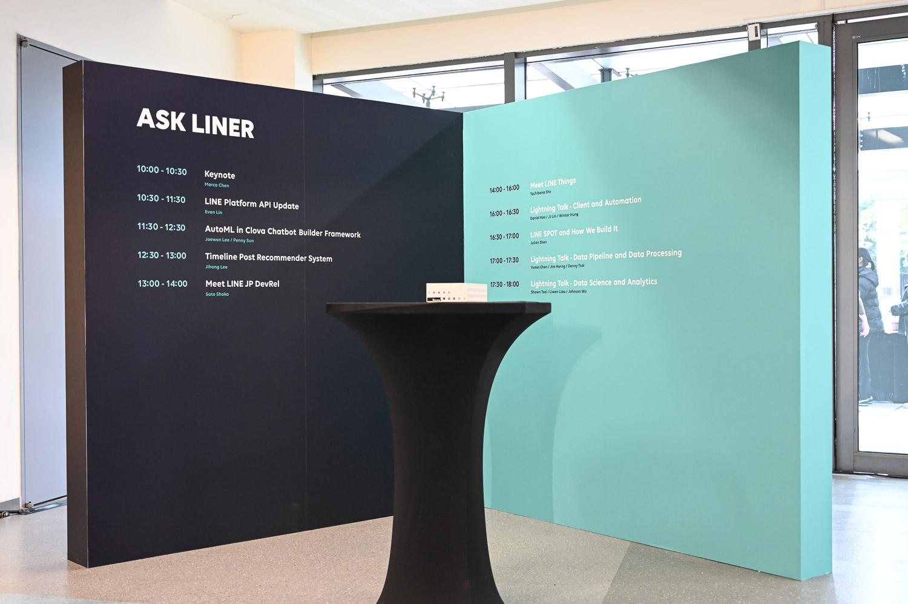

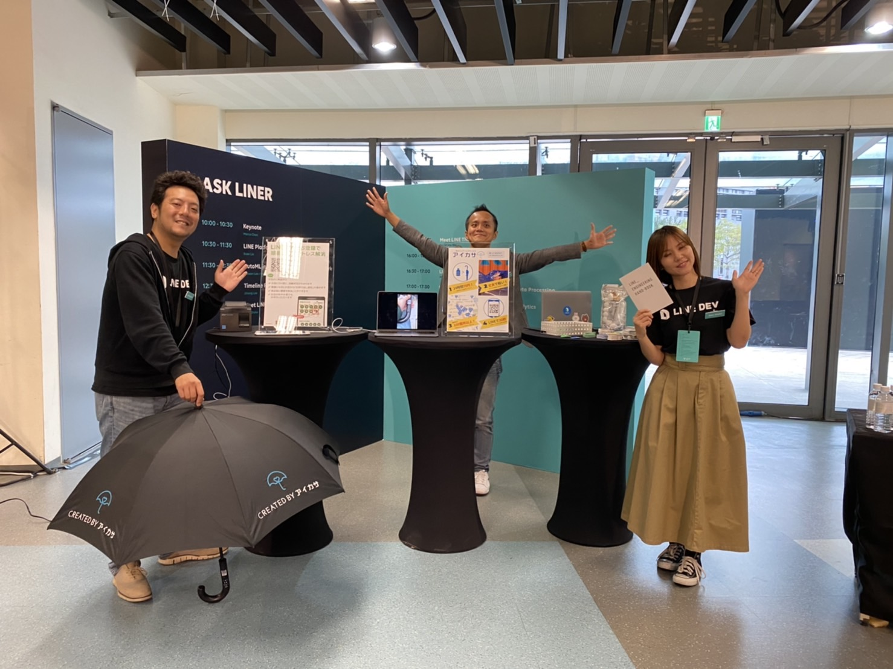

### Ask LINER: 

讓你跟講者，來自日本的 LINE 工程師面對面的交流與討論。台上聽不懂的，台下讓你問。 面板上面還清清楚楚地有著所有講者會待在攤位的時間，千萬不要錯過跟講者面對面的機會。

並且在中午時段還有來自於日本 Developer Relations 團隊的 Shoko Sato 與 Tachibana Sho 來分享日本 Developer Relations 的活動與一些有趣的日本服務。

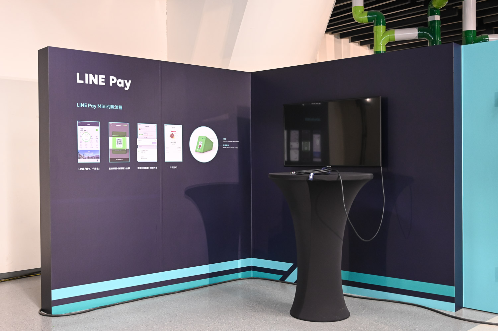

### LINE Pay: 

行動支付已經是一大風潮，想要透過 LINE 官方帳號來創業的夥伴們，都希望可以快速的了解如何串接 LINE Pay ，這個攤位給你一個面對面的討論機會。

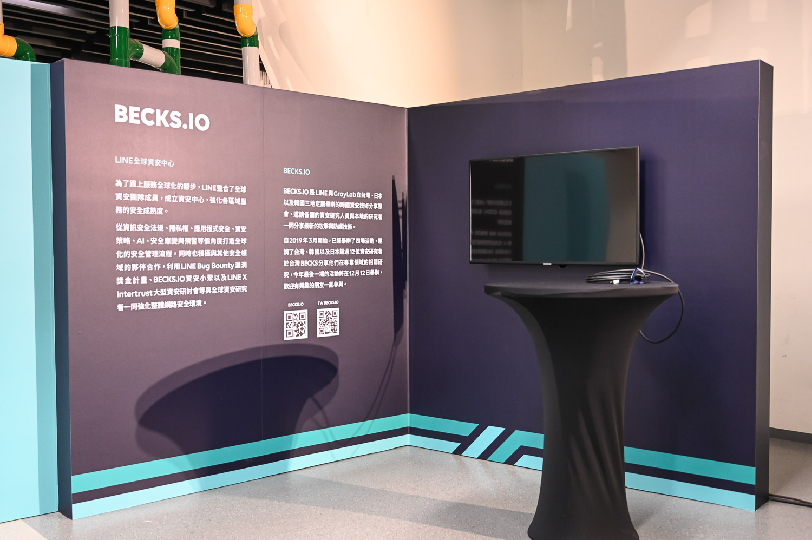

### BECKS.io 社群攤位：

由 LINE 韓國同仁，亞洲傳奇資安大神 Beist 所組織的跨公司的資安社群 BECKS.io 這次也帶著相關資訊在此次的研討會之中擺攤。 其實 BECKS 今年在台灣也舉辦了五次的社群聚會，如果對資訊安全有興趣的朋友，可以追蹤社群活動首頁：  https://becks.kktix.cc/

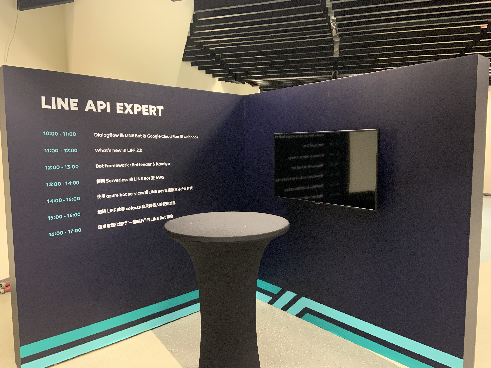

### LAE (LINE API Expert) 互動攤位：

[LAE (LINE API Expert) 自從在 2018 Q1 宣佈以來](https://engineering.linecorp.com/en/blog/announcing-the-line-api-experts-2018-q1/)，台灣目前也有九位 LAE (可以去[以下網址](https://www.line-community.me/contributors)查詢所有的 LAE )。 經常大家都是遠遠地知道有這些 LAE 的存在，卻一直苦無機會能跟他們面對面的交流。 所以這次趁著 LINE TECHPULSE 的機會，也邀請了 LAE 一起來共襄盛舉。  

### LINE PROTOSTAR 互動攤位:

本屆 TECHPUSLE 也邀請到運用 LINE 平台打造應用的10家新創團隊，命題都非常實用有趣，可分為生活助手、娛樂、教育，與金融科技相關的應用。 這邊可以讓各位去一個一個了解每一個新創團隊如何透過 LINE 平台與聊天機器人來發展自己的事業，並且如何透過一些 Messaging API 來讓自己的相關事業能更加活躍。

## 展示架(Poster) :  跟 LINE 台灣服務工程師討論架構

此外，今年一共舉辦了四次的 [LINE Developer Meetup](https://linegroup.kktix.cc/) ，並且有許多次的社群活動邀請到 LINE 台灣產品與工程團隊的開發夥伴來分享。 這些活動之中，也能感受到開發者們對於 LINE 的工程團隊其實充滿著好奇心，想要了解更多，不論是產品服務的架構，還是使用到的相關技術，或是團隊需要的相關技能。

所以我們這次也特定請到工程團隊們製作相關的服務架構或是團隊組成的相關展示架，並且歡迎大家來展示架攤位這裡直接跟工程團隊討論。 

這次一共有十個展示架，其中有五個是產品團隊如下：

- LINE SPOT 
- LINE MUSIC
- LINE Travel
- LINE Shopping
- LINE Today

另外有五個是工程團隊與組織：

- LINE Bank
- LINE QA team
- LINE Data Dev team
- LINE UIT team
- LINE Client team

希望這參與的朋友都當初都有好好的來了解每個團隊，並且也透過跟工程團隊的互動可以有更多的理解。

##相片牆(PhotoWall):  一起留下美好的回憶

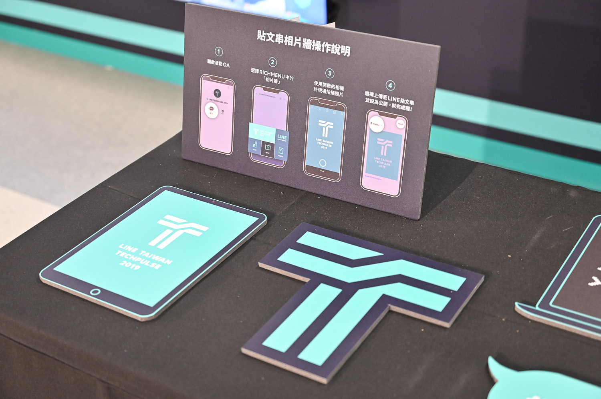

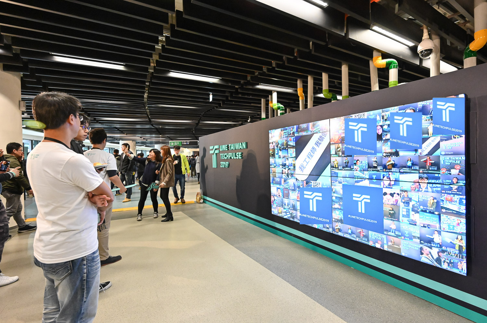

#### 「參與研討會最重要的不一定是議程本身，而是一起參與的開發者」

參與過一些的研討會，我總是這樣的鼓勵著同行友人或是同事們。因為不少的議程都會有投影片釋出，你都有機會可以在事後了解更多，但是研討會參與者也是最吸引人的地方。想想看由於 TECHPULSE 的原因，你是不是跟著某些同事一起來參加？ 是不是遇到很久沒有見的朋友? 還是認識了第一次見面但是一樣從事 LINE Chatbot 的朋友？

相片牆是一個讓大家可以拍照留念的地方，一起來跟夥伴們一起拍照。 透過在官方帳號裡面的 Image Map 裡面的選項，會直接打開你的相機，讓你拍下照片後直接分享在「LINE 貼文串」之中。該照片就會被我們挑出來在大的相片牆上面投射出來。

 活動當中，許多的參與者拉著好久不見得朋友一起來拍照。一起留下許多美好的回憶。

## 贈品與相關限量物品： 讓工程師更潮

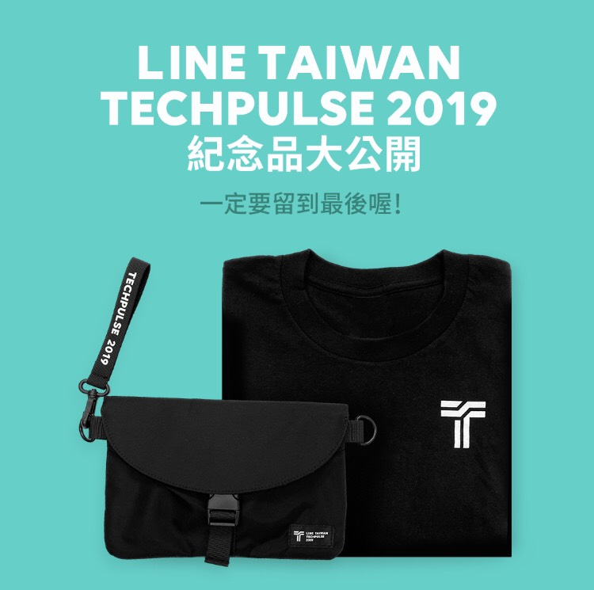

這次的贈品也精心設計，特別找了一個帥氣的小背包讓每個工程師都可以帶去參加各種社群活動。讓各位的帥氣再也不是非主流。 

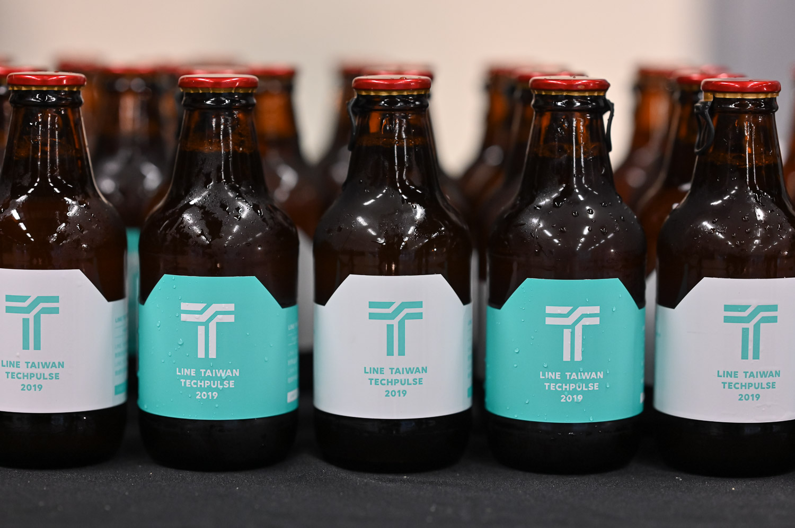

並且下午三點多的餐點時間，主辦單位們也推出了限量（活動限定）特製的 TECHPULSE 啤酒讓每一位參與這可以心靈饗宴之外，也能夠與朋友盡情的享用啤酒。

### LINE Developer Meetup #10：獨特招募場次 

#### 活動網址: https://linegroup.kktix.cc/events/20191204-10

每次的開發者小聚( LINE Developer Meetup ) 經常都會有一個狀況是許多的開發者包圍著 LINE 的工作團隊，想要了解開發團隊裡面所使用的工具，工作狀況，或是面臨的問題。這也是因為許多外部的開發者其實對於參與著 LINE 的工作團隊有著極大的興趣。 所以這次活動裡面，我們舉行了第二次的招募說明會，內容參考了 [「2019 LINE Taiwan Developers Recruitment Day」](https://engineering.linecorp.com/zh-hant/blog/2019-line-taiwan-technical-recruitment-day/)。

這場活動採分開討論與清場，讓每一個參與者可以去深入瞭解自己有興趣的工作團隊內容，並且可以面對面的跟可能是參與的面試主管們討論。

## 投影片集錦:

### Talks 投影片集錦：

最後，大家對於今年的 LINE TECHPULSE 2019 是否意猶未盡？

快來看看相關的投影片，溫習一下許多嶄新的功能吧。

以下先分享主要 Talk 的部分：

1. Keynote by Marco Chen:

https://speakerdeck.com/line_developers_tw/line-techpulse-2019-keynote

2. LINE Platform API Update by Evan Lin

https://speakerdeck.com/line_developers_tw/techpulse-2019-line-platform-api-update

3. AutoML in Clova Chatbot Builder Framework by Jaewon Lee / Penny Su

https://speakerdeck.com/line_developers_tw/automl-in-clova-chatbot-builder-framework

4. How LINE Does Enterprise Security by Beist

https://speakerdeck.com/line_developers_tw/how-line-does-enterprise-security

5. Timeline Post Recommender System by Jihong Lee

https://speakerdeck.com/line_developers_tw/timeline-post-recommender-system

6. Protostar Program Introduction by Kevin Chen

https://speakerdeck.com/line_developers_tw/techpulse-2019-protostar-program-introduction

7. LINE Pay - New Features of LINE Pay by Webber Su / Sabrina Lee

https://speakerdeck.com/line_developers_tw/line-pay-new-features-of-line-pay

8. LINE SPOT and How We Build It by Julian Shen

https://speakerdeck.com/line_developers_tw/techpulse-2019-line-spot-and-how-we-build-it

更多資訊： https://techpulse.line.me/   

### 閃電秀 (Lightning Talks) 投影片集錦：

閃電秀 (Lightning Talk) 一直以來都是技術研討會最精彩的部分之一。

不光是可以在很多的時間內聽到許多有趣的分享，更可以聽到許多精闢的技術分享與摘要。

這次要分享的就是 LINE TECHPULSE 2019 的閃電秀的部分，本次閃電秀分成三大主題，相關投影片依序如下：

1. Lightning Talk - Data Pipeline and Data Processing
   1. https://speakerdeck.com/line_developers_tw/efficient-integrating-data-from-multiple-data-providers Efficient Integrating Data
 from Multiple Data Providers By Yumei Chen 
   2. https://speakerdeck.com/line_developers_tw/how-machine-learning-helps-line-fact-checker How Machine Learning helps LINE Fact Checker BY Jim Horng
   3. https://speakerdeck.com/line_developers_tw/techpulse-2019-go-ing-graphql-in-line-spot-api-gateway-for-microservices Go-ing GraphQL in LINE SPOT API Gateway for Microservices BY Denny Tsai
2. Lightning Talk - Data Science and Analytics
   1. https://speakerdeck.com/line_developers_tw/utilizing-embeddings-in-learning-to-rank-for-search Utilizing Embeddings In Learning To Rank For Search BY Shawn Tsai
   2. https://speakerdeck.com/line_developers_tw/analysis-of-line-music-in-taiwan Analysis of LINE MUSIC in Taiwan By Liwen Liao 
   3. https://speakerdeck.com/line_developers_tw/toward-intelligent-music-service Toward Intelligent Music Service By Johnson Wu
3. Lightning Talk - Client and Automation
   1. https://speakerdeck.com/line_developers_tw/flutter-for-app-development Fast UI/UX Prototyping W/ Flutter For App Development By Daniel Kao
   2. https://speakerdeck.com/line_developers_tw/how-fcu-speeds-up-to-line-shopping-monitor-workload How FCU speeds up to LINE Shopping monitor workload? By Winter Hung
   3. https://speakerdeck.com/line_developers_tw/speed-up-ios-development-with-lldb-code-injection-and-framework-live-preview Speed up iOS Development with LLDB Code Injection and Framework Live Preview By JJ Lin

### 新星計畫新創團隊投影片集錦：

本屆 TECHPUSLE 也邀請到運用 LINE 平台打造應用的10家新創團隊，命題都非常實用有趣，可分為生活助手、娛樂、教育，與金融科技相關的應用。

相關投影片如下：

1. 牙醫小幫手: 
https://drive.google.com/drive/folders/1CK9dab7zB5axMhazZFQtC56Xge30g2Td?usp=sharing
2. 記帳雞:
https://drive.google.com/drive/folders/1JQlCL4nweC2N99w8wefiMMbqph7P-A0u
3. 看牙小鬧鐘:
https://drive.google.com/open?id=1vB0sVXQFLlGQV_SE7x4k0ipl0DYld5AH
4. 途你:
https://drive.google.com/file/d/1CfLK9pw0WzpRk2fER-oCdjZg0Z7jaol7/view?usp=sharing
5. 肚肚:
https://drive.google.com/file/d/1mBO3arUREexmj6HY8gXO3VN4Nzyahhvh/view?usp=sharing
6. 通勤學:
https://drive.google.com/file/d/1msujCVxmRLTCHS1de-oqyUC1ayGX1kg4/view?usp=sharing
7. Montaggio:
https://drive.google.com/drive/folders/1fUT5_7hcetzn0lYeLQnkxyHfK6yIm0za
8. Tiki Poki:
https://drive.google.com/file/d/1ORFz7uejO0iyuSQUV8Hge3NvyFQEF5qg/view?usp=sharing
9. Dr. LINE:
https://drive.google.com/file/d/1DOgHmkJuSJlOE_0dhpE4-C-0SFHdvB7f/view?usp=sharing
10. 優活家:
https://drive.google.com/file/d/1Vs7USy78NfkK_A5SfZkm3tOjKYodoNkg/view?usp=sharing

## 活動小結

本次年度開發者大會與以往的活動內容有許多的不同，因為主辦單位們希望可以讓開發者們與工程團隊有更多的互動。也希望開發者們能有更好的研討會參與體驗，更多的收穫與更多的互動。 畢竟研討會最重要的不是台上的講者，而是每一位參與的開發者。

立即加入「LINE開發者官方社群」官方帳號，就能收到第一手Meetup活動，或與開發者計畫有關的最新消息的推播通知。▼

「LINE開發者官方社群」官方帳號ID：@line_tw_dev

## 關於「LINE開發社群計畫」

LINE今年年初在台灣啟動「LINE開發社群計畫」，將長期投入人力與資源在台灣舉辦對內對外、線上線下的開發者社群聚會、徵才日、開發者大會等，預計全年將舉辦30場以上的活動。歡迎讀者們能夠持續回來察看最新的狀況。詳情請看 [2019 年LINE 開發社群計畫活動時程表 (持續更新)](https://engineering.linecorp.com/zh-hant/blog/line-taiwan-developer-relations-2019-plan/)https://engineering.linecorp.com/zh-hant/blog/line-taiwan-developer-relations-2019-plan/)