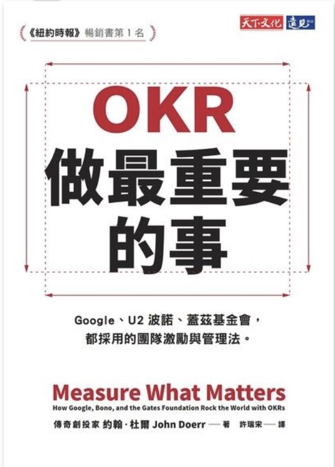

```
OKR：做最重要的事 (Measure What Matters: How Google, Bono, and the Gates : Foundation Rock the World with OKRs)

作者： 約翰．杜爾  
原文作者： John Doerr  
譯者： 許瑞宋  
出版社：天下文化 
出版日期：2019/01/30 
語言：繁體中文 
ISBN: 9789864796335 
```

#### 買書推薦網址：http://moo.im/a/24kwJL 

# 前言:

OKR 這個名詞或許曾經在什麼地方有聽說過，但是到底 OKR 是為何產生的？ 究竟 OKR 跟日常經常聽到的 KPI 又有什麼不同？ 為什麼 Google 跟 Intel 會選擇使用 OKR 而不是我們常見的 KPI ? 辦完了年度開發者盛會 LINE TAIWAN TECHPULSE ，除了活動的收尾活動之外，接下來就是得要開始訂定明年度的計畫，要如何有效地訂定一個「可量化」，「有挑戰性」，「並且能夠符合團隊主要目標」？

於是我挑選了這本書來看，看完之後真的相當的推薦每一個管理專案的人員都應該看看這本書。


# 內容簡介:

```
這是杜爾最成功的投資，他在科技界興起了新的管理方法，造就世界級的執行力。

什麼是OKR？目標與關鍵結果（OKR，Objectives and Key Results），前者代表你想達成「什麼」，後者則是你該「如何」達成。

OKR有4大超能力：
#1：專注投入優先要務
#2：契合與連結，造就團隊合作
#3：追蹤當責
#4：激發潛能，成就突破

OKR帶領Google從40人的新創公司，成長為超過7萬員工的科技巨擘，市值高達7000億美元。
```

簡介來自讀墨： http://moo.im/a/24kwJL

這本書一開始就開宗明義地解釋了 OKR 是 Google 裡面主要作為主要評量每一個團隊目標與工作事項的主要工具。 OKR (Object Key Result) 其中拆開來解釋： 

### OKR 帶來的改善

(Object)： 「目標」就是我們想達成的事，不多也不少。目標必然是重要、具體和行動導向的，最好還能激勵人心。目標設計和運用得當，可以防範模糊不清的思想，以及執行時的含混摸魚。

(Key Result)：「關鍵結果」界定目標的標準，並且監控我們「如何」達成。有效的關鍵結果不僅明確，而且有時限，是進取但又可行的。

接下來這本書就開始透過許多公司使用 OKR 所帶來的轉變過程，其中包括了：

-  Intel
- Remind
- MyFitnessPal
- Google Chrome
- Youtube

雖然每一個案例沒有提到詳細 OKR 的執行方式與細節，但是可以了解到以上的這些公司或是產品透過 OKR 所帶來的快速反應與強大的力量。並且推進著團隊裡面的人往更加有進取性的目標而前進。

### 細究 OKR 的細節與精神

OKR已經使形式上的年度目標變得毫無必要，我們需要一種工具，可以徹底革新過時的績效管理系統。簡而言之，工作的新世界需要一種新的人力資源模式。這種取代年度績效考核的系統，就是持續性績效管理，執行工具是CFR，如下所列： CFR (Conversation, Feedback, Recognition)  三者所組成，是一種相當有時效性，反饋性與進步性的改善工具。

如果 OKR 讓每一個目標變得積極與可衡量性， CFR 讓團隊績效考量上變得經常性地溝通 (C)，並且適時的透過反饋 (F) 來讓每個工作往著正軌運行，並且透過誇獎 (R) 讓增強團隊成員對於正確執行的效果。

年度考量是許多公司的噩夢，由於發生的區段相當的長（一年做兩次或是一次）使得許多主管都無法詳細記錄下來評量的方式，往往透過依稀的記憶來填寫著相當戎長的文書報告，來做與薪資相關的績效評量。 並且績效考量都會跟著薪資掛勾，讓許多高績效的人才往往厭惡做績效評量而得到低下的評分，善於做報告的人往往可以拿到高校評量。  讓整個績效考核制度變得相當的失敗，並且往往就是流失人才的主因。

接下來的章節討論著如何透過 OKR 來取代年度績效的評量。分享了 Adobe 的案例，也分享了 Zuma Pizza 的故事，透過這些故事可以清楚讓人暸解。 透過 ORK 的精神可以讓績效評量變得能更精確，更實際並且更能反映每一個員工的努力程度。


# 心得:

這本書的整個編排讓我相當的驚艷，其實從第一頁到最後一頁，作者都沒有清清楚楚的寫明該如何做 OKR ，但是透過許多案例的分享，讀起來其實可以從心裡面去了解 OKR 的許多真理，比如說「目標的制定」，應該要由上而下，應該要遵循著整個組織的使命與最重要的目標來訂定。在訂定目標的時候也一定要與每一個成員坦承與公開的討論，讓整個團隊的目標能夠依照這個來展開成每個小部門的目標，來規劃出每一個成員的「關鍵結果」。


並且第二個章節也討論了績效評量與 OKR 跟 CFR 的差異，透過經常性地討論，反饋與誇張。讓許多績效評量變得更加有效過，讓成員在完成每一個工作之後馬上地得到誇獎，每一個值得討論的時候迅速的反饋。如此一來就能回歸績效評量的核心宗旨，希望每一個成員能夠持續不斷努力，讓組織逐漸地向前進步（並且是快速的）。


這本書相當建議大家好好閱讀，不論你是不是有從事專案管理或是人員組織管理的相關工作．都應該好好的了解整本書的精髓，讓你的組織能夠向上提升。