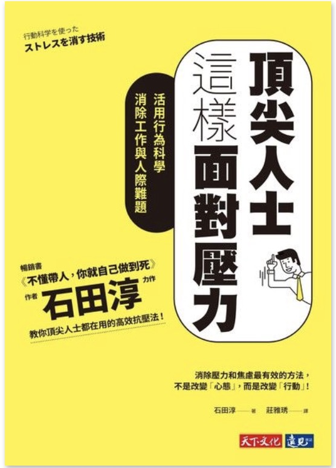

```
頂尖人士這樣面對壓力 - 活用行為科學消除工作與人際難題
(行動科学を使ったストレスを消す技術)
作者： 石田淳  
譯者： 莊雅琇  
出版社：天下文化 
出版日期：2019/08/30 
```

#### 買書推薦網址：http://moo.im/a/2dhilM

# 前言:

常常有人說能做事的人，往往不一定是好的主管。而這本書就是敘述這個狀況，書名雖然看起來很斷水流大師兄，但是裡面札札實實是管理的書籍。算是對於管理層面不錯的書籍，當初就是看到內容簡介就忍不住買了下來（電子版）。


# 內容簡介:

```
日本行為科學第一人石田淳表示：「能改變人的，不是模稜兩可的話語和概念，而是具體的行動。想要提高成果、消除工作壓力，只需增加有助於展現成果的行動！」例如：

・對同事常常忍不住發火，不是告訴自己要心胸開闊，而是要記錄你的憤怒履歷，從中找出固定模式即可預防。

・對突如其來的工作感到焦躁、煩悶、不安，不是要自己樂觀面對，而是要坦然接受它的存在，擬定行動步驟。

・對合不來的人感到不耐與壓力時，不是努力改善雙方契合度，而是要聚焦行動，直接列出一個月要和對方聯繫的次數和時間表。

・對管不動、叫不動的部屬感到憤怒時，不是只指出對方毛病，而是要提供改善的具體建議。

長年研究行動科學的作者石田淳認為，要減少壓力和焦慮最有效的方法不是改變「心」，而是改變「行動」，因為練心不是人人都做得到，而改變行為不用堅強的意志力，只要按部就班，就能立即看見成效。
```

簡介來自讀墨：http://moo.im/a/2dhilM

首先先來解決所謂的壓力感（也就是讓許多人感受到焦躁的感受），先清楚地來分析分析焦躁的成因與不可避性，所以焦躁的壓力感的產生是必然的，只好想一些方式來分散焦躁的壓力感。

接下來書上建議了一些方式來避免掉焦躁感，不論是離開當場，深呼吸，透過拍打桌子來分散注意力。並且透過自我讚美與記錄下來一些美好的事物來避免自己不段的在焦躁感受中掙扎。

接下來就來講解有工作能力的人經常遇到的問題：變成主管後就相當的暴躁。 暴躁的原因不外如下： 「為什麼他會問這種問題？」「為什麼他沒有那樣自己處理的能力？」「為什麼這件事情感受不到他的熱忱？」

類似的問題可能都出現在許多有能力的人剛變成管理階層的人的時候，而這一系列的疑問也是造就一些有能力的工作者焦躁的原因。 接下來也是這本書想要解釋的，首先對於合不來的同仁（或是夥伴）我們要關注的並不是他這個人的態度，而是關注到他的產出與行動，而不要關注整體的契合度。因為不同的人有著不同的處理方式，無法要求每個夥伴都能依照你的要求來完成你的指令。（依照著你心目中的速度與熱忱），那麼我們就應該要看成果能不能夠完成，針對成果來評論。

接下來需要對「熱忱」有著明確的定義，這也讓我思考到一個朋友給予的建議「當一個人對於事物有 responsibility (責任心)，的時候他部會去問什麼該做，什麼不該做？」需要跟你的夥伴不斷地強調著你對於「熱忱」的定義，讓他能夠充分的了解。

對於提升夥伴的工作能力部分，這本書也給予四個面向的建議：

- 對於進度報告給予獎賞（誇獎）
- 認真的聆聽進度報告
- 收到壞消息，不要責備夥伴
- 具體指示進度報告的內容

針對這四個方向，進一步地讓夥伴能夠了解進度報告是重要的，並且也鼓勵夥伴的進度報告。

最後一個部分就是針對一些能力強的員工晉升主管後最容易犯的一些錯誤：

- 把夥伴丟到第一線
- 針對夥伴的「特性」怒罵
- 「不守信用」跟「濫用職權」
- 偏心
- 對夥伴貼標籤
- 處處比較
- 忍不住打斷夥伴說話

以上就是這本書的內容摘要整理。


# 心得:

現在當主管跟以前當主管不一樣，記得經常聽到主管們這樣的討論事情。以前自己如何被訓練，如何被要求的狀況現在似乎也無法直接對員工來要求。 現在的員工需要更多的鼓勵，更多的耐心與更多的指導。

更不能因為自己能嚴以律己就也同樣的嚴以律人，畢竟許多的員工是需要更多的時間與方式來慢慢適應許多事情的變化。

這本書籍透過能力強的員工晉升主管之後容易有的心態作為出發點，經常有些話語能夠打到人心，也道出有能力的員工晉升主管職之後往往有許多壓力是來自與員工而不是原本工作的挑戰。相當值得深思與學習。