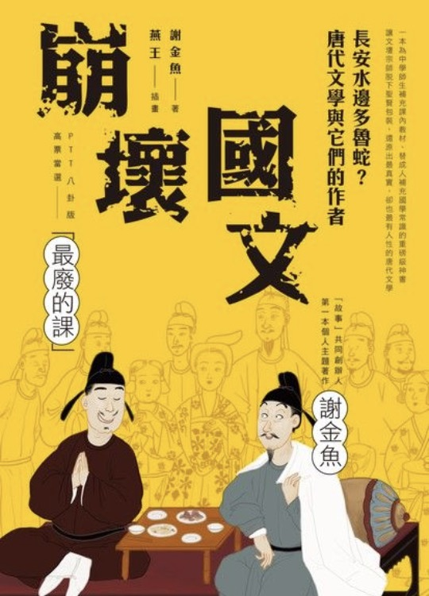

```
崩壞國文：長安水邊多魯蛇？唐代文學與它們的作者
作者： 謝金魚  
插畫： 燕王WF  
出版社：圓神出版 
出版日期：2017/11/01 
ISBN: 9789861336367 
```

#### 買書推薦網址：http://moo.im/a/1szKQS

# 前言:

（2020 第一本書）

小時候因為很愛打電動，被家人強迫必須要讀完唐詩三百首的一首才能打電動。一開始的五言絕句還算簡單，到後期的樂府的實在朗誦到很辛苦。 看到這本書裡面有許多耳熟能詳的唐代詩人故事，就好奇真正的唐代詩人究竟是如何能夠想出那麼優美的詩句？ 這本書生動的筆觸與有趣的文字將會讓你一讀就忍不住想把它都念完。

最近實在蠻愛念這一系列有趣的休閒書籍，除了本身對於詩詞與歷史故事的喜愛之外。這些作者都能透過生動而有趣的敘事方式來讓讀者更有興趣的了解這些國文與歷史故事。真的是看到一本就買一本。 XDDD


# 內容簡介:

```
我們從小在國文課本上看到的一代文壇宗師、傑出的詩人、宰相、書法家，他們若不是道貌岸然，就是憂國懷鄉，似乎生來就負有崇高的使命，連他們的挫折失意，都是為了更長遠的理想所做出的犧牲或伏筆。

但，真的是如此嗎？

事實上───
有一種留名青史，叫古人的廢文玻璃心

唐代的名人宗師跟你想的差很大！
他們除了有才，生活上或酸、或魯、或廢、或憨，
比我們也好不到哪裡去！
```

簡介來自讀墨：http://moo.im/a/1szKQS

這本書透過相當有趣的書名「長安水邊多魯蛇？」來讓你顛覆對於這些詩詞大師的刻板印象。在這邊開始列出相關的一些詩人：

- 韓愈的生猛海鮮宴
- 柳宗元的檳榔
- 白居易的廢文人生
- 元稹的酒

先列出前面四個章節就能了解到作者的筆觸下似乎把心目中的唐代大詩人，全部都變成了魯蛇。 柳宗元由於被放逐到南部地方，於是就愛上當地的貴族食物（檳榔），細節在書裡面都有詳細敘述，這一些的敘述除了相當的有趣之外，還相當的有學習價值。


# 心得:

能夠再次的品味每一個詩詞後面原來是有那麼多的歷史背景，讓這些詩詞也馬上得活在我的腦海裡。真的相當有趣的章節編排。

並且最後一些章節還有談到安祿山與史思明的故事，更是讓我心中有一段老是被不起來的唐代歷史又活化在我面前。並且知道了安祿山的種族歷史故事之後，也就能充分了解「安史之亂」的緣由。

相當推薦大家來看看這一本書，相信腦海中的生硬的詩詞與歷史故事都會變成有血有肉的真實人物。