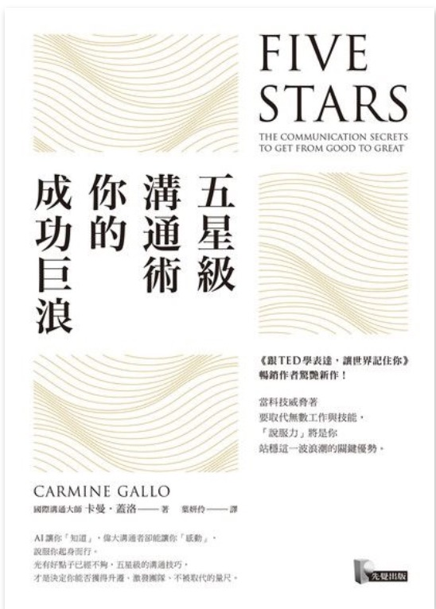

```
五星級溝通術，你的成功巨浪
Five Stars : The Communication Secrets to Get From Good to Great
   
作者： 卡曼．蓋洛  
原文作者： Carmine Gallo  
譯者： 葉妍伶  
出版社：先覺出版 
出版日期：2018/10/01 
```

#### 買書推薦網址：http://moo.im/a/lmwCEX

# 前言:

（2020 第二本書）

這一本其實是跟著「[跟TED 學表達，讓世界記住你](http://www.evanlin.com/ted-1/) 」一起購買的，因為作者就是同一位。而這一本是比較新的，不過因為先把其他兩本先看完而這一本也花得比較久的時間來慢慢品味。 最近有把這一本拿回來繼續看，發現有不少的東西其實可以繼續的學習與加強在前一本裡面的許多概念。整本書閱讀起來更加的有深度與實用。


# 內容簡介:

```
★《跟TED 學表達，讓世界記住你》暢銷作者卡曼‧蓋洛驚艷新作！★
當科技威脅著要取代無數工作與技能，
「說服力」將是你站穩這一波浪潮的關鍵優勢。

AI讓你「知道」，偉大溝通者卻能讓你「感動」，說服你起身而行。
光有好點子已經不夠，五星級的溝通技巧，
才是決定你能否獲得升遷、激發團隊、不被取代的量尺。

發揮口才並不是在操控人心，不學習溝通說服術才可恥！
```

簡介來自讀墨：http://moo.im/a/lmwCEX

「構想」指的是透過有條理，組織化的方式來將你想要表達，想要傳遞的資訊加以整理過。利用故事化，敘事化的方式來有效地傳遞給需要的。

### 第一部 為什麼優秀的溝通者無可取代？

內容章節的鋪成上，首先先讓人了解優秀的溝通者的重要性。頂尖的科學家，經濟學家，歷史學家與企業領導者都在這個相信「構想」是相當重要的。早在兩千三百年前亞里斯多德主張人類是語言的動物，而「修辭」──也就是說服的能力──既是一門科學也是一門藝術。

### 第二部 向高手們看齊

透過一些高手們來學習如何有效地組織你的想法：

科學家 - 尼爾 德葛拉斯 泰森，每個月收到兩百場演講邀請，卻只講四場。透過比較酷的內容來宣傳科學的有趣之處。「如果足球是太陽在五十碼線上面，地球在十五碼線上，那麼冥王星就在四分之一英里以外，別再想啦」。透過有趣的比喻來讓科學常識更容易被人了解。

接下來在其他的案例中也舉出了創業家，專業人士的許多案例來表示：「説服力」不僅僅能夠幫助你表達意見給對方，更是讓你在公司內，在企業上的重要兵器。 

### 第三部 從Ａ晉升Ａ＋的五星級溝通術

這邊的內容也是從「[跟TED 學表達，讓世界記住你](http://www.evanlin.com/ted-1/) 」的內容開始延伸，講述著講故事能力的重要，並且透過「感情訴求」，「故事結構」來提升你說故事的能力。

# 心得:

這一本書透過循序漸進的方式來講解「溝通的重要」，「怎麼樣是一個好的溝通？」，並且也建構出一個「好的溝通的公式」，最後應該「透過故事來取得彼此的同理心」，最後也不斷地強調一個好的故事該如何的建構與該如何鋪成出一個好的故事。

一個好的故事的重點在於重點清楚，詞彙簡單，透過比喻的方式來被人們所接受與吸收。這樣的話語就像是金恩博士不斷修整的演講稿，「I have a dream ... 」， 也像是林肯總統在上台前不斷地將演講稿修改，希望的就是能透過簡單的詞彙，來讓聽眾更容易記住，更容易理解，更容易吸收。

這是一本很建議多讀兩三次的書籍，並且也建議每隔一段時間就要回過頭來再讀一次。裡面講的方法與建議真的不少～只要能吸收一兩個項目就會是一個很棒的演講者。但是要真正融會貫通，就需要時間來淬煉。