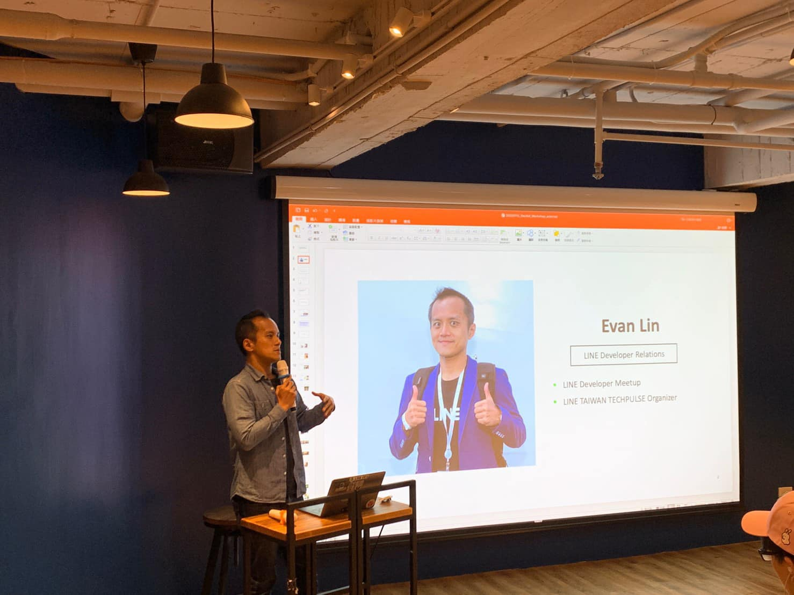
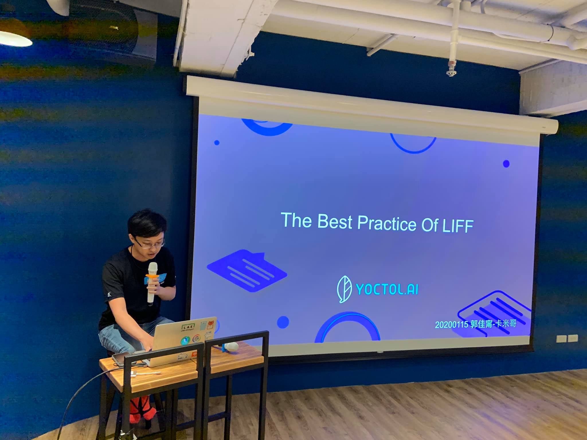

# 前言

大家好，我是 LINE Taiwan 的 Technical Evangelist - Evan Lin。這次很開心受到 chatbot 社群的邀請，參加了 "[Chatbot meetup 聊天機器人小小聚 16 @ Dcard](https://chatbots.kktix.cc/events/meetup-016)" 的聚會活動，並且分享 LINE API 更新與個人開發的心得。在此也跟各位分享本次參與的心得，並且也希望透過社群分享的力量能夠讓聊天機器人的開發動能更加的盛大。  

- 社群 Chatbots Meetup： https://chatbots.kktix.cc/ 
- 本次活動網頁:  [活動網址](https://chatbots.kktix.cc/events/meetup-016)
- 本次活動的共筆紀錄： https://hackmd.io/@chatbot-tw/meetups-016

由於 Chatbots Meetup 本身屬於社群自主性的活動，裡面也有許多社群朋友所贊助的閃電秀。裡面的所有內容也是相當的難得與有趣。也希望能夠透過本篇文章讓大家稍微了解 Chatbots Meetup 社群閃電秀的魅力。

這次場地感謝 [Dcard](https://www.dcard.tw/f)  贊助在  [Dcard](https://www.dcard.tw/f) 的 14 樓辦公室，有一個專門提供給技術社群分享的空間。相當的不錯，也希望有更多的社群來這裡分享。

##  LINE Platform Update 202001 / 資深開發技術推廣工程師 Evan Lin

#### [投影片](https://speakerdeck.com/line_developers_tw/line-api-introduction-20200115)

本次的分享主要是跟大家分享一下近期平台的相關更新，希望能讓大家第一時間的收到最新的相關消息。

### iOS 9.19.0 之後 scanCode 與 BLE 相關功能暫時關閉

在去年十一月的時候就有做過相關的宣傳，但是 iOS LINE 9.19.0 一直到了 2020/01/06 才正式上線。所以在這裡也要跟開發者們再三勸說，因為 iOS LINE 新的版本 App 由於技術問題將 `scanCode()` 與 BLE 相關功能都暫時移除掉，所以也建議開發者們在撰寫相關的技術的時候需要做相關的 error handing ，才能確保不論是在 iOS 還是在 Android 都能有完美的使用者體驗。

**相關鏈結：**

- [如使用已中止的 LIFF SDK API，請調整程式碼](https://developers.line.biz/zh-hant/news/#liff-sdk-api-2020-01-14)
- [部分 LIFF 功能暫停使用](https://developers.line.biz/zh-hant/news/2019/11/29/#liff-2019-11-29)

### 透過  Messaging API 的 LINE 官方帳號，將於用戶資料下方顯示開發者註冊的 provider 名稱

為了讓使用者更清楚辨別官方帳號的正確性，Provider 名稱預計在 **2020/01/16** 要顯示在 Messaging API 的官方帳號上。 請確認您所開發的聊天機器人的 Provider 名稱。

#### 相關鏈結：

- [[Updated] 請確認 provider 名稱正確](https://developers.line.biz/zh-hant/news/#updated-provider-2020-01-08)

#  LINE Developer Relations 2019 Update / 資深開發技術推廣工程師 Evan Lin

第二部分帶來了 LINE Developer Relations 2019 相關貢獻的整理， 2019 年在 LINE 是一個開發者社群的一年。並且在 2019 年初在台灣啟動「LINE開發社群計畫」，將長期投入人力與資源在台灣舉辦對內對外、線上線下的開發者社群聚會、徵才日、開發者大會等，預計全年將舉辦30場以上的活動。更有更多部分可以參考[這篇文章](https://engineering.linecorp.com/zh-hant/blog/line-taiwan-developer-relations-2019/)。

#### 相關鏈結：

- [投影片：  LINE Developer Relations 2019 Update](https://speakerdeck.com/line_developers_tw/line-taiwan-developer-relations-2019-update)

- [LINE Taiwan Developer Relations 2019 回顧與 2019 開發社群計畫報告](https://engineering.linecorp.com/zh-hant/blog/line-taiwan-developer-relations-2019/)

## The Best Practice Of LIFF  / 郭佳甯(etrex)

#### [投影片](https://docs.google.com/presentation/d/1T8muJA2tZgUfBgRLd2K_Eurek_vtJXekcq5bc_96kfU/edit?usp=sharing)

#### [投影片](https://docs.google.com/presentation/d/1T8muJA2tZgUfBgRLd2K_Eurek_vtJXekcq5bc_96kfU/edit?usp=sharing)

#### [相關介紹文章](https://medium.com/@EtrexKuo/the-best-practice-of-liff-fd89f2e612fc)

由 LAE (LINE API Expert) 郭佳甯所帶來的分享，則是針對 2019 十月所更新的 LIFF 2.0 的相關新功能在實戰上面需要注意的地方做一些整理：

- LIFF 應用面
- LIFF 1.0 介紹
- LIFF 2.0 介紹
- LIFF 1.0 跟 2.0 差異
- Live Demo

抓幾個重要的章節在這裡跟大家分享:

### 關於 LIFF 的應用

#### 大型表單的填寫

透過 LIFF 可以在聊天機器人中協助使用者做大型表單的填寫，使用者可以不需要離開（透過 LIFF 開啟 50% 或是 80% 顯示方式）來讓使用者可以快速，有效，並經精確的填寫大型表單，並寫在填寫完的時候可以直接帶入 LINE 的使用者帳號。

#### 協助用戶發送特殊訊息

一般來說使用者（指的是非 Chatbot）是無法發送 Flex Message 的，但是透過 `liff.sendMessages()`  就可以幫使用者將資訊整理成 Flex Message 來分享給使用者的好友。

#### 群組內私密訊息傳遞

群組內經常有人想要做出個別私聊的功能，透過 LIFF 就可以很輕鬆的開發出個別聊天的功能。讓聊天可以公開跟個人聊天分開來。

應用可以是： 在群組聊天裡面做桌遊，結果在群組內公佈出來，但是桌遊過程可以透過 LIFF 來相互溝通。

#### 第三方服務綁定

可以透過 LIFF 來輕鬆的綁定其他的服務，因為 LIFF 頁面裡面帶有使用者 LINE 資訊，可以輕鬆綁定相關功能。

#### QRCode 掃描

可以透過 LIFF 2.0 功能的掃描 QRCode 來開啟相機掃描 QRCode （請注意： iOS 在 9.19.0 之後已經暫停此功能， Android 目前維持不變）。

### LIFF 1.0 跟 LIFF 2.0 混搭

最後講者也分享一個相當有用的表格，就是透過混搭的方式讓 LIFF 1.0 跟 2.0 的混用會如何？

可以參考這個表格:

#### 表格網址： https://docs.google.com/spreadsheets/d/1pfTUvDLSVFxLq4z_NYq7xgHXEafeZICztw2mSuKPY-4/edit?usp=sharing

## 閃電秀

三個講者之後，接下來就是介紹這個社群最有魅力的部分就是閃電秀。所有的閃電秀可以參考這篇共筆文章  [https://beta.hackfoldr.org/chatbot/](https://beta.hackfoldr.org/chatbot/)  ，由於都是五分鐘的閃電秀，主要內容快速用條列介紹給各位：

- **詞庫小妍，不限領域的LINE閒聊機器人 / 馬偉雲**
  - 	簡介：
     - 	講者為中研院的詞庫相關研究的負責人，跟大家分享中研院開發的不限領域閒聊的聊天機器人 - 詞庫小妍。
- **家用電話的語音AI / Teeker**
  - [投影片](https://drive.google.com/file/d/1hobz1_TwT3Ag04xC_ifWxFg2rrQ6kkFd/view)
  - 即時互動之文字內容－https://www.qztap.com/#Chatbot
  - 簡介：
    - 透過家用電話就可以提供語音 AI 的服務？ 不需要網路軟體的協助？ 蠻有趣的一個展示。
- **LINE Chatbot 區塊鍊民調 / Dairan**
  - [Github](https://github.com/luckscylla/block-poll)
  - [投影片](https://drive.google.com/file/d/1K9FIzHnxuiKeUCCK1XNCB1ScBzHVM9o4/view)
  - 簡介:
    - 透過 LINE 來實現不會被人串改，不會被有意灌票的機制？ 透過區塊鏈民調的方式可以來呈現。
- **運用深度學習打造一個聊天機器人 / Ed**
  - [投影片](https://docs.google.com/presentation/d/1vyuf5wUbPJUjKr79wi0QgWxlURvlNEO-jEaBByMUjak/edit?usp=sharing)
  - 簡介：
    - 謎因怪獸是一個透過 ptt 鄉民聊天詞庫打造的深度學習聊天機器人，歡迎大家來玩玩看。
- **Flex Message 的封裝與可能性 / C.T.Lin**
  - [Github](https://github.com/chentsulin/line-flex-ui)
  - 簡介：
    - 分享一個透過 FLEX 的封裝流程來討論是否可以加入在開發通用聊天機器人套件中來封裝？ 因為 FLEX Message 是 LINE 特有的功能，但是要如何讓開發套件可以整合呢？ 這是一門學問。

## 活動小結

社群分享永遠是讓創意激盪的最佳方式，而 Chatbots Meetup 是一個很熱情與充滿創造力的社群組織。也希望有更多有創意的開發者願意加入 LINE Chatbot 的開發行列，更希望能熱情的參與社群的活動與一起來分享。

立即加入「LINE開發者官方社群」官方帳號，就能收到第一手Meetup活動，或與開發者計畫有關的最新消息的推播通知。▼

「LINE開發者官方社群」官方帳號ID：@line_tw_dev

## 關於「LINE開發社群計畫」

LINE今年年初在台灣啟動「LINE開發社群計畫」，將長期投入人力與資源在台灣舉辦對內對外、線上線下的開發者社群聚會、徵才日、開發者大會等，已經舉辦30場以上的活動。歡迎讀者們能夠持續回來察看最新的狀況。詳情請看:

- [2019 年LINE 開發社群計畫活動時程表](https://engineering.linecorp.com/zh-hant/blog/line-taiwan-developer-relations-2019-plan/)
- [LINE Taiwan Developer Relations 2019 回顧與 2019 開發社群計畫報告](https://engineering.linecorp.com/zh-hant/blog/line-taiwan-developer-relations-2019/)
- [2020 年LINE 開發社群計畫活動時程表](https://engineering.linecorp.com/zh-hant/blog/2020-line-tw-devrel/)

