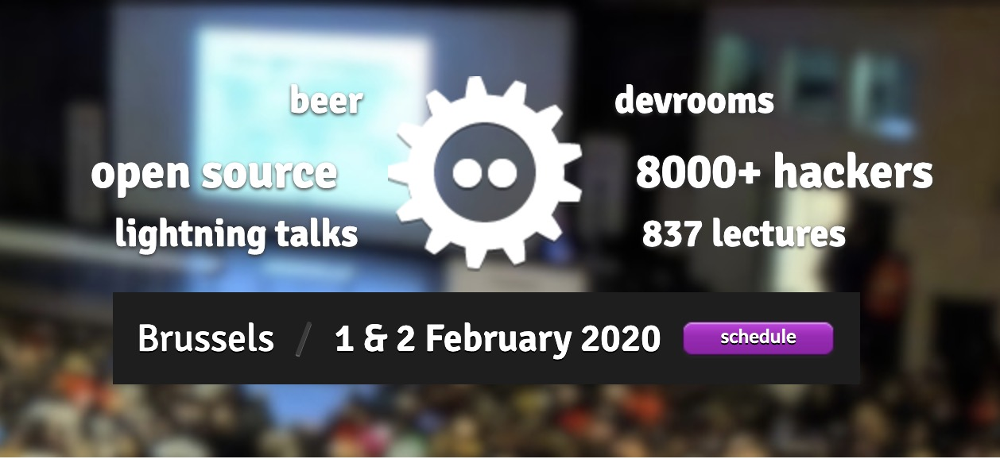

# 前提

日前 2020/02/01 ~ 02/02 (FOSDEM: Free and Open source Software Developers' European Meeting ) 
也就是歐洲最大的開源開發者大會（可以解釋成歐洲版本的 COSCUP 嗎？）
裡面有一個專門的 Go DevRoom ，所有的投影片跟影片都有公開出來。
歡迎大家來裡面挖寶!!

#### 投影片與影片鏈結： https://fosdem.org/2020/schedule/track/go/ 

# Advanced debugging techniques of Go code / [Andrii Soldatenko](https://fosdem.org/2020/schedule/speaker/andrii_soldatenko/)

#### 投影片與影片: [link](https://fosdem.org/2020/schedule/event/advanceddebugginggo/) 

除了 "The state of Go" 這種 keynote 類型的主題之外，第一個讓我想要了解的就是這篇。在 Golang 上面的進階除錯技巧部分。 裡面提到的 debugging skill 主要是透過 https://github.com/go-delve/delve 所提供的相關技巧。相關的技巧包括了：

- 如何 attach by delve
- 如何設定 conditional breakpoint
- 如何透過 delve 來跑 unit test ，就是透過 delve 來跑 test function 
  - 我個人很愛用這個，也很常使用。
- 甚至可以使用 Goland 裡面的 eval 來快速查詢相關數值

最後介紹的技巧就是透過 delve 來 remote debugging docker container ，透過了 docker port expose 將 web app 的 port 轉給 delve (e.g. port 40000) 使用。然後就可以透過 port 40000 來 attach delve debugger 。

- 參考:
  - [link1](https://blog.jetbrains.com/go/2018/04/30/debugging-containerized-go-applications/)
  - [link2](https://medium.com/@kaperys/delve-into-docker-d6c92be2f823)

最後當然你也會好奇，這些不是 GDB 就可以了嗎？但是其實 GDB 有一些小問題:

- GDB MacOSX 需要 codesign 
- 如果再 MacOSX 10.13 使用 GDB 舊的版本 8.0.1 才能正常 attach Go app
- 由於 Golang 在 MacOSX 上面有使用 `compress dwarf` 這樣會使得 debugging info 無法正確在 GDB 上面顯示出來。 需要再 compiler 的時候加上以下參數。` go build -ldflags=-compressdwarf=false -gcflags=all` 才能讓 GDB 看到 symbol 
  - 參考：
    - [link1](https://github.com/golang/go/issues/11799)
    - [link2](https://github.com/golang/go/issues/27918)

這一場 talk 真的滿實用的，很推薦大家聽聽。

