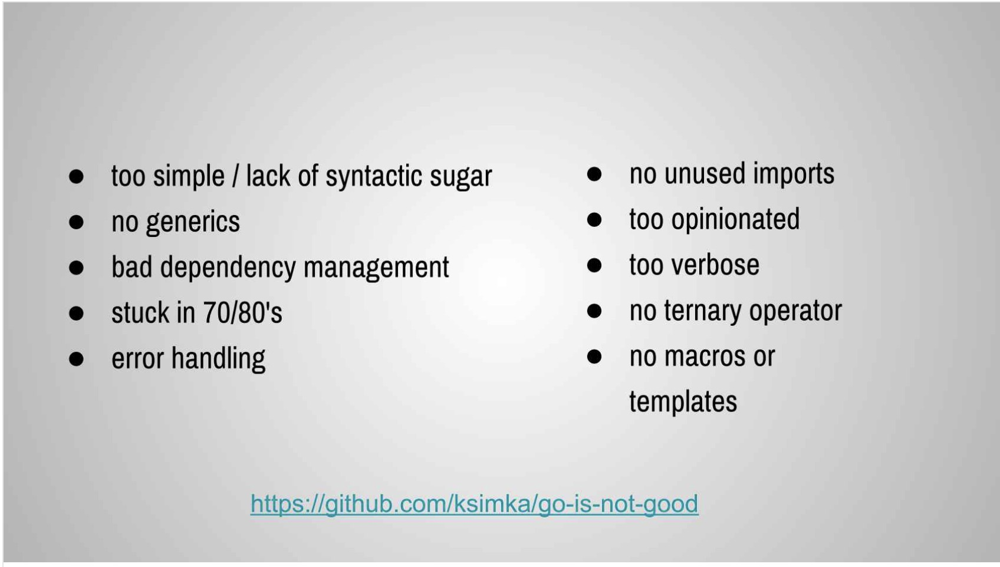
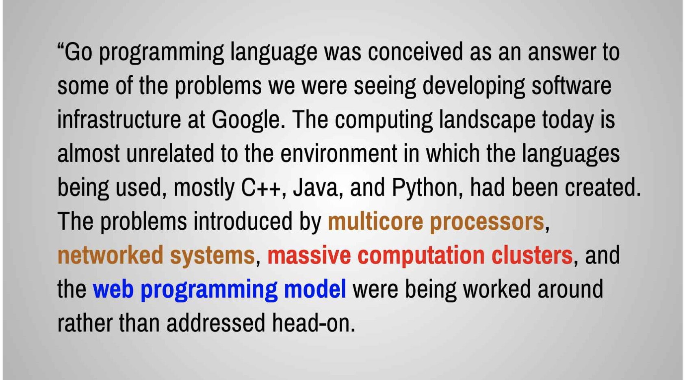
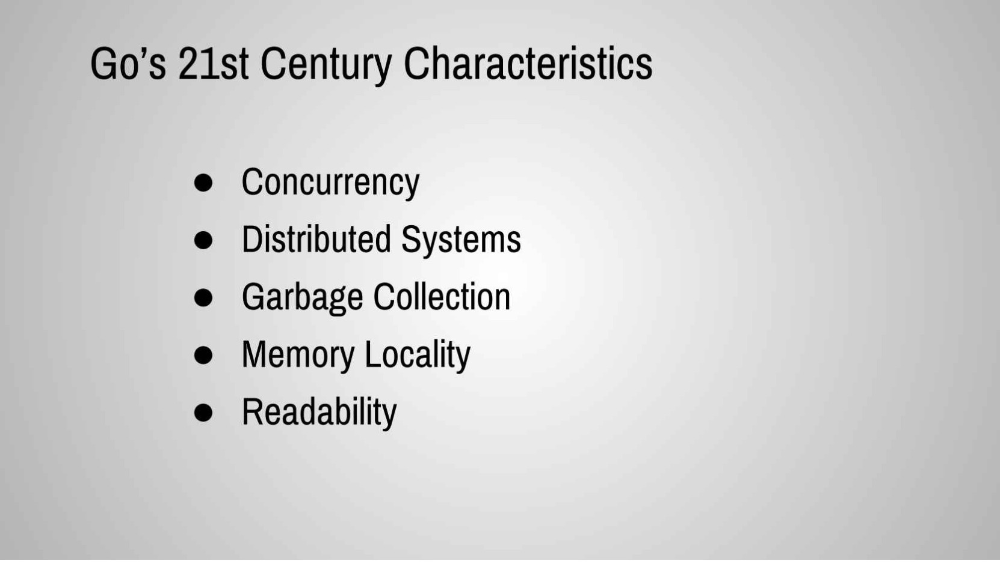

# 前提

為什麼要學 Go(lang)?  Go 有很多缺點說: 沒有 Generic，error handling 很麻煩， Dependency Management .. 種種問題經常被討論。 但是，各位有沒有想過 Go 帶來的優點會是什麼？ 當初我們喜歡上 Go(lang) 又是什麼？ 

Carmen Andoh 在 2017 的 QCon 的這篇演講非常的棒，當時的他還在 Travis CI 任職。這篇演講包含了許多的語言層面的整理與效能評比的數據分析。 最近一次我遇到她是在 Golang Meetup Organizers 聚會上，他代表 Google Go 團隊一起跟大家討論著 Go 十週年慶祝活動的討論。

歡迎各位好好閱讀這篇:

https://www.infoq.com/presentations/go-concurrency-gc/


# QCon2017: Carmen Andoh - The Why of Go

[網址](https://www.infoq.com/presentations/go-concurrency-gc/)

講者一開始先就語言層面敘述了程式語言的開發演進，每個語言都有人認為可以演進的部分，所以有著不同語言的演進過程。 到了 2009 年 Go 語言的發展也是如此，一開始 Go 語言經常被抱怨的項目如下：



(參考網址: https://github.com/ksimka/go-is-not-good)

- 缺少語法糖: 相較於其他語言， Golang 並不存在語法糖。

- No generics (沒有泛型) : 這就不解釋了

- error handling:

  - 被抱怨的就是會寫太多的 

  ```
  err := foo()
  if err != nil {
      ......
  }
  ```

- No macros or templates 

更多部分可以看這篇 https://github.com/ksimka/go-is-not-good




這一頁提到了，現今的環境已經跟三十年前不同了，需要有更適合的程式語言，並且專注解決以下的相關文題：

- Multicore processor: 多處理器執行緒
- Networked systems: 網路相關處理系統
- Massive computation clusters: 大型運算的執行叢集。
- Web programming model: 網頁程式的模型。



這邊列出了 Go 對於 21 世紀需要的部分所增強的部分，這也是這一篇演講最希望專注的幾個特點。

- **Concurrency**: 指的是 goroutine 與 channel 
- **Distributed Systems**: 對於分散式系統中，需要的 cross compile 。很適合在分散式系統裡面作為 micro-service 部署之用。
- **Garbage Collection:**  這邊就不解釋了。
- **Code Readibility:** 


最後這張截圖～來自於 Dave Cheney 在研討會裡面的一句話，個人相當喜歡這句話。 裡面是說「工程師應該是被雇用來解決商業上的問題，而不是再試著維護某些人的程式碼」。

但是經常我們會聽到「通靈工程師」（代表由於交接，或是文件的不足，造就維護人家的程式碼就像是需要通靈一樣）的説法，這些都是 code readibility 的問題。 

由於 Golang 本身沒有複雜的「語言糖」，對於代碼的維護上也能夠相對的簡單許多。


這篇演講相當不錯，很適合大家好好專研一下。

# Refer:

- [https://github.com/ksimka/go-is-not-good](https://github.com/ksimka/go-is-not-good)

  
  


