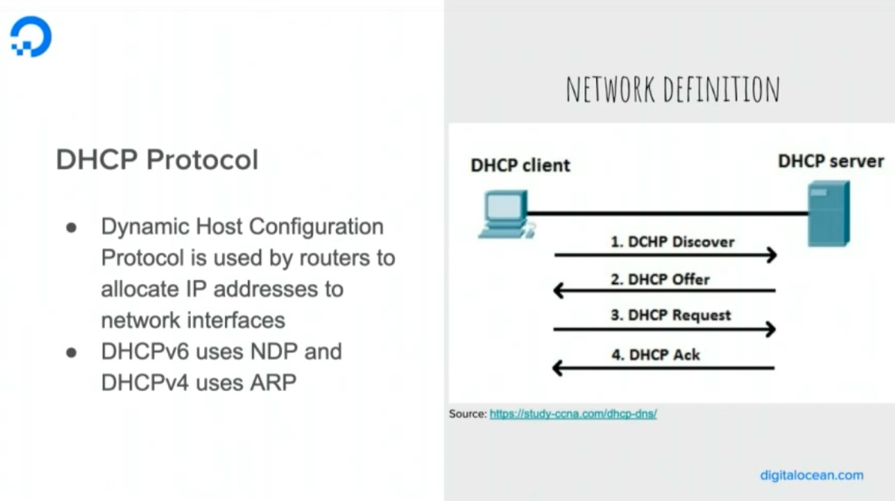

# 前提

聽 Podcast 是我一個培養聽力跟學習的管道之一，而 [Software Engineering Daily](https://softwareengineeringdaily.com/) 更是我相當喜愛的 Podcast 頻道。 這一次我聽到一個蠻有趣的議題，就是「[Go Networking with Sneha Inguva](https://softwareengineeringdaily.com/2020/02/18/go-networking-with-sneha-inguva/)」，內容就是來自 Digital Ocean 的工程師來分享為何 Digital Ocean 要透過 Golang 來打造他們 Networking Team 網路相關的工具。

而這一篇文章主要是以 Sneha Inguva 在 Stange Loop 這個研討會的錄影內容為主，而 [Software Engineering Daily 的 Podcast](https://softwareengineeringdaily.com/2020/02/18/go-networking-with-sneha-inguva/) 為輔。  希望能幫大家整理一下相關的內容。

#### 影片鏈結： [https://www.youtube.com/watch?v=XqKvgzXCoXc](https://www.youtube.com/watch?v=XqKvgzXCoXc)

#### Podcast 相關內容: [Go Networking with Sneha Inguva](https://softwareengineeringdaily.com/2020/02/18/go-networking-with-sneha-inguva/)

# "Networking and Go: An Engineer's Journey" by Sneha Inguva

<iframe width="560" height="315" src="https://www.youtube.com/embed/XqKvgzXCoXc" frameborder="0" allow="accelerometer; autoplay; encrypted-media; gyroscope; picture-in-picture" allowfullscreen></iframe>

<iframe src="//www.slideshare.net/slideshow/embed_code/key/t8ZbvjLJ6CEYv3" width="595" height="485" frameborder="0" marginwidth="0" marginheight="0" scrolling="no" style="border:1px solid #CCC; border-width:1px; margin-bottom:5px; max-width: 100%;" allowfullscreen> </iframe> 
 <strong> <a href="//www.slideshare.net/SnehaInguva/networking-and-go-an-engineers-journey-strangeloop-2019" title="Networking and Go: An Engineer&#x27;s Journey (Strangeloop 2019)" target="_blank">Networking and Go: An Engineer&#x27;s Journey (Strangeloop 2019)</a> </strong> from <strong><a href="https://www.slideshare.net/SnehaInguva" target="_blank">Sneha Inguva</a></strong> 

#### 投影片與影片: [link](https://fosdem.org/2020/schedule/event/advanceddebugginggo/) 

介紹主要分成幾個主軸，作為說明為何 Digital Ocean 使用 Golang 作為 Networking programming 的程式語言。

## When to use Go

這裡講者總結了一些 Golang 的優點，這邊不詳細介紹了。

- Concurrency
- Server-side
- Great for CLI tools
- Easy-To Fuzz-test
- Easy to write REST/RPC services

 

上圖解釋了 Digital Ocean 如何 golang 來打造相關的工具。

## The network stack

這邊介紹 OSI 的七層架構跟 TCP/IP 的五層架構。這邊就不詳述基本常識的部分。

 **延伸閱讀：** 

- [Wiki: OSI model](https://en.wikipedia.org/wiki/OSI_model)
- [TCP/IP v.s. OSI Model](https://www.guru99.com/difference-tcp-ip-vs-osi-model.html)

## Networking primitives

接下來就開始介紹如何用 Golang 來打造一些網路原生的工具。 

## 先以 Layer 7 的 Load Balancer 來介紹：

- Use HTTP protocol.
- Accept client-side connections.
- Pass client-side request to one of backends.
- Return server-response back to client.

**介紹到套件:**

- `net/http`

這邊算是蠻基礎的，也就是透過讀取 HTTP request connections 內容後，去後方找一台 backend (這邊有挑選的方式，或是更多細節可以實作) 連接，也就是透過發送另外一個 HTTP request 得到回覆後，將結果回傳給 client side。

這邊可以看到收到 http.request 之後，馬上透過亂數挑選出 backend ，然後將需求往後端來傳送。

## 接下來講解，如何開發 Layer 4 的 Load Balancer:

下一個階段，就開始開發一個 Layer 4 也就是 TCP 的 Load Balancer: （並且是支援 streaming socket)

- Use TCP protocol
- Accept client-side connection
- Open backend connection
- One gorutine to shuttle packet from client-side to backend.
- Another one gorutine to shuttle from backend to client-side.

因為 TCP 需要有 SYN, SYN/ACK 跟 ACK 三個階段，所以需要透過兩個 gorutine 來持續服務完成整個流程的資料傳遞。

**介紹到套件:**

- `net`

這邊 listen 部分要改用 `net.Listen()` 這樣才能收到 TCP packet 。

這邊就是開啟往 backend 的連線。

這邊將兩端的 connection 拆分成兩個 gorutine :

- client --> backend
- Backend --> client

這一個部分則是一簡單地將資料從一端複製到另外一端。

## 打造 DHCP Server 

從 Layer7 到 Layer4 之後，講者接下來分享如何透過 Golang 來開發 DHCP 上面的相關應用。當然大家也都是知道 DHCP (Dynamic Host Configuration Protocol) 其實是架構在 Layer7 上面的，但是講者分享一個可能會需要使用到 Layer2 API 的部分，就是他們需要檢查發訊息的 MAC Address 是否就是登記的資訊是同一個人。

**介紹到套件:**

- `syscall`
- `os`
- `golang.org/x/sys/unix`
- `github.com/mdlayher/raw` https://github.com/mdlayher/raw

這幾個套件主要用來：

- `unix`套件用來解析 Socket 用來讀取 IP address。
- `raw` 用來 ListenPacket  ，可以針對 IPv4 或是 IPv16 。講者解釋主要都是先使用 IPV4 的部分。
- `syscall` 作為系統 Error Code 偵測。

這一段就是講者提到透過 dhcp4 套件來將請求的來源 MAC Address 跟需要 binding 的 MAC Address 做比對。確認請求的人跟他的內容一致，才會發送 IP 給他。

# 總結

講者主要分享自己在 Digital Ocean 工作上使用 Golang 的經驗，並且也舉了一些例子希望讓聽眾能了解， Golang 除了能做系統小工具之外，要做比較複雜（或使底層）的網路操作其實也是可以的，並且效率也都是游刃有餘。這一篇演講相當的有趣，因為除了了解了 Golang 也可以做一些底層網路操作外，講者也很清楚的做了一些基本的科普，讓聽眾可以從沒有太深入的網路架構概念到瞭解能透過 Golang 開發一些小工具。