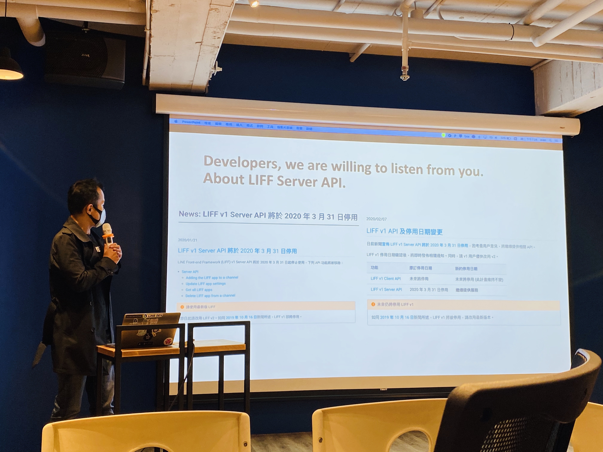
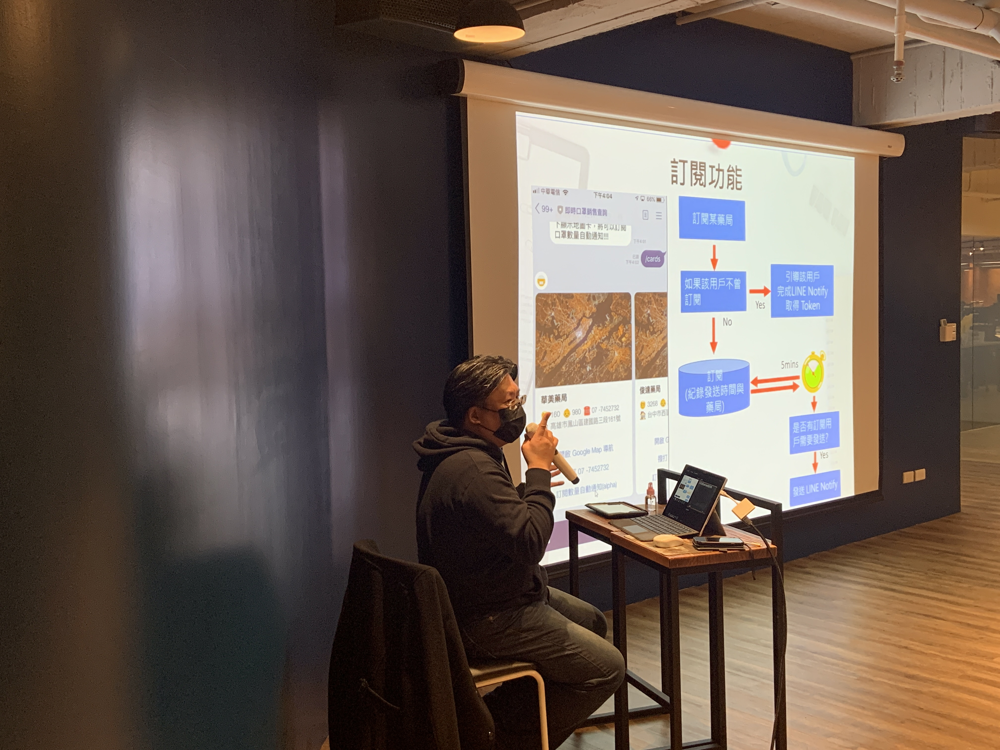
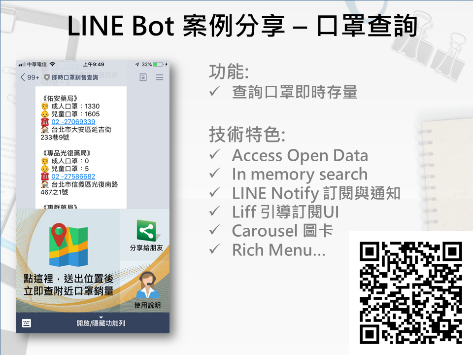

# 前言

大家好，我是 LINE Taiwan 的 Technical Evangelist - Evan Lin。這次很開心受到 chatbot 社群的邀請，參加了 "[Chatbot meetup 聊天機器人小小聚 17 @ Dcard](https://chatbots.kktix.cc/events/meetup-017)" 的聚會活動，並且分享 LINE API 更新與個人開發的心得。在此也跟各位分享本次參與的心得，並且也希望透過社群分享的力量能夠讓聊天機器人的開發動能更加的盛大。  

- 社群 Chatbots Meetup： [https://chatbots.kktix.cc/](https://chatbots.kktix.cc/ ) 
- 本次活動網頁:  [活動網址](https://chatbots.kktix.cc/events/meetup-016)
- 本次活動的共筆紀錄： [https://hackmd.io/@chatbot-tw/meetups-017]( https://hackmd.io/@chatbot-tw/meetups-017)

由於 Chatbots Meetup 本身屬於社群自主性的活動，裡面也有許多社群朋友所贊助的閃電秀。裡面的所有內容也是相當的難得與有趣。也希望能夠透過本篇文章讓大家稍微了解 Chatbots Meetup 社群閃電秀的魅力。

這次場地感謝 [Dcard](https://www.dcard.tw/f)  贊助在  [Dcard](https://www.dcard.tw/f) 的 14 樓辦公室，有一個專門提供給技術社群分享的空間。相當的不錯，也希望有更多的社群來這裡分享。

由於防疫的要求，這也是我第一次參與到全程配戴口找的線下實體活動。感謝主辦單位準備完善的酒精消毒與口罩配戴叮嚀，讓參與的人與工作人員都能夠受到良好的保護。

##  LINE Platform Update 202003 / 資深開發技術推廣工程師 Evan Lin

<iframe width="560" height="315" src="https://www.youtube.com/embed/BB8wGlaNs4Y?start=721" frameborder="0" allow="accelerometer; autoplay; encrypted-media; gyroscope; picture-in-picture" allowfullscreen></iframe>

### 傾聽開發者反饋，以 LIFF Server API 為例:

LINE 對於開發者的反饋是相當重視的，歡迎每一位開發者與我們共同成長，互信與互惠的經營著這個平台。在 [2020/01/21 的時候曾經在網站上宣布著 LIFF Server API](2020/01/21 的時候曾經在網站上宣布著 LIFF Server API) 即將在三月底停止功能之後，收到了許多開發者的回覆，對於與客戶之間的合作方式將會因為 LIFF Server API 的停用而造成莫大的困擾。

DevRel 團隊蒐集到相關的案例與討論後與總部的開發團隊討論之後，也很開心的獲得了計畫團隊的了解。將時程停止了，[更多訊息可以參考  LIFF v1 API 及停用日期變更。](https://developers.line.biz/zh-hant/news/2020/02/07/liff-server-api-update/)

### 更好用，讀取更快速的 LINE Developer 網站

[2020/01/27 我們曾經宣布開發者網站 (LINE Developer) 有了大幅度的改版](2020/01/27 我們曾經宣布開發者網站 (LINE Developer) 有了大幅度的改版)，變得更快！更好用！最近有一篇更詳細的文章敘述，他們如何從 Middleman 轉換到 VuePress 的過程，歡迎觀看。

#### 相關文章:

- [LINE Developers site: From Middleman to VuePress](https://engineering.linecorp.com/en/blog/line-developers-site-from-middleman-to-vuepress/)

### 更有效地分眾訊息 -  Narrowcast 與 Custom 

“我們不是不喜歡廣告……我們只是不喜歡與我們無關的廣告。” 同事 Tan 在文章「[透過 Narrowcast API 在 LINE Chatbot 上發送”精準”且”討喜”的訊息](https://engineering.linecorp.com/zh-hant/blog/narrowcast-api-on-line-chatbot/)」裡面有介紹到這個事實。 使用者們並不討厭廣告，但是討厭被跟自己無關，自己不在意的廣告騷擾。經常出現無關的廣告訊息會增加使用者的好友封鎖率。

因此， LINE 在一月底推出了分眾管理的相關 API ，透過主要提供的三種分眾方式:

- **人口資料挑選方法：**
- 透果使用者的統計資訊來分眾，年齡，性別，甚至是地區，都是可以讓開發者可以根據來分群的方式。
- **點擊再行銷：**
- 根據發送過的訊息內網頁鏈結的點擊用戶，針對該用戶再來做相關的行銷。
- **曝光再行銷：**
  - 根據發送過的訊息有收到並且已讀的用戶，針對該用戶再來做相關的行銷。

針對以上所以的三種方式還可以做相關的運算比對( OR, AND ) 的方式，更可以讓商家可以找出想要針對的客戶：

- 九十天前加入的好友，並且為男性的年輕人
- 點擊過鞋子類商品鏈結的女性好友

這些都是相當好用的範例，更多的範例可以看由廣告與商業部門同仁提供的[「LINE 生活圈」官方粉絲團的相關介紹影片](https://www.facebook.com/lineattw/videos/2524056117700883/)。

**相關資訊:**

- [「LINE 生活圈」官方粉絲團的相關介紹影片](https://www.facebook.com/lineattw/videos/2524056117700883/)。
- [透過 Narrowcast API 在 LINE Chatbot 上發送”精準”且”討喜”的訊息](https://engineering.linecorp.com/zh-hant/blog/narrowcast-api-on-line-chatbot/)
- [Messaging API narrowcast 英文技術文件正式上線](https://developers.line.biz/zh-hant/news/2020/02/19/release-narrowcast-en/)

###  新的 LIFF App 將不在支援 LINE Things 中的 BLE (藍芽)通訊功能

LINE Things Developer Trial 已停止提供 LIFF app BLE 新功能，且未來將不會恢復提供; 目前僅提供自動通訊功能 (automatic communication)。

2020 年 2 月 10 日之後建立的新 app 將無法於 LINE Things Developer Trial 中使用 LIFF app BLE 新功能。

**相關鏈結：**

- [LINE Things 停止為新 app 提供 LIFF app BLE 新功能](https://developers.line.biz/zh-hant/news/2020/02/17/terminate-to-provide-liff-ble-feature/)

### LIFF: Share Target Picker

自 LIFF v1 時代以來透過 **`liff.sendMessages（）`** 將消息發送回聊天室（以用戶的名義）或的功能，僅打開該LIFF的聊天室。

不少開發者建議 LINE 增加 LIFF 與朋友或群組分享消息的能力。這就是 **`liff.shareTargetPicker（）`**。

#### 開發前需要了解的五件事

- **從 10.3.0 版開始**，LINE App 將支持 “Share Target Picker” **。** (註解： 如果在外部瀏覽器，則不需要等待 LINE App 更新）
- “Share Target Picker” 僅在 **LIFF v2 中**可用。
- 來自 “Share Target Picker” 的消息將**代表用戶**發送**。**（就像我們向朋友發送消息一樣）
- **純文字**，**圖像**，**視頻**，**音頻**，**位置**，**Template Message（僅URI操作）**和**Flex消息**是可以通過 “Share Target Picker” 發送的消息。
- 可以在**外部瀏覽器**中使用 “Share Target Picker” ，但必須先使用**LINE Login** 進行身份驗證

#### 關於 Share Target Picker 的版本支援部分:

- LINE 裡面打開網頁 -> IAB (In-App-Browser) ，依賴於 LINE App  版本。 iOS 需要 10.3.0 (目前還沒上架）
- 外部瀏覽器打開網頁 -> External Browser 不依賴 LINE App 版本。

所以建議大家可以把 LIFF v2 開發在各位的電商網站之中....

#### 相關展示：

- 大家可以加入這個中文化過後的範例: [https://evan-share-liff2.herokuapp.com/](https://evan-share-liff2.herokuapp.com/)

或是觀看以下的展示影片：

<iframe width="560" height="315" src="https://www.youtube.com/embed/0T2bdndARdo" frameborder="0" allow="accelerometer; autoplay; encrypted-media; gyroscope; picture-in-picture" allowfullscreen></iframe>

**相關資訊:**

- [Share Target Picker 已經公開，透過 LIFF 來分享訊息將更加的便利](https://engineering.linecorp.com/zh-hant/blog/liff-share-target-picker/)

- [Share Target Picker: LIFF（LINE Frontend Framework）中的新功能](https://engineering.linecorp.com/zh-hant/blog/share-target-picker-liff/)

## LINE Bot 案例分享 - 口罩查詢 / David 董大偉

#### [投影片](http://arock.blob.core.windows.net/blogdata202003/20200317 chatbot meetup-ppp.pdf)

<iframe width="560" height="315" src="https://www.youtube.com/embed/BB8wGlaNs4Y?start=2783" frameborder="0" allow="accelerometer; autoplay; encrypted-media; gyroscope; picture-in-picture" allowfullscreen></iframe>

最近由於新冠病毒的盛行，全國都一起在忙碌著防疫。董老師也不落人後，透過製作一個口罩查詢機器人來教導大家關於快速部署一些心法。

#### 相關的開發過程：

- **資料轉換:** 衛福部的資訊是 csv ，需要轉換成資料為 JSON 。
- **方便查詢:** 透過 LINQ 來對資料做相關的查詢。
- **如何定期更新資料:** 由於資料剛上線的前幾天，資料查詢需求爆量。需要保存一次資料在 local storage，避免資料因為查詢不到而無法顯示。 並且透過外在服務去測試服務是否還在線上（方式就是 Refresh 相關資料）。

#### 除了開發之外，其實部署跟維運的流程也相當重要：

- **需要能夠負擔大量用戶**：打造具有 HA (High Availability) 的架構，能夠自動水平擴展（Auto-Scale) 。
- **部署的穩定度：** 自動更新版本（自動上版），藍綠部署（Canary Release: 也就是將新功能部署給某一些用戶，可以了解是否有問題發生，避免因為大量部署造成停用的問題）。
- **服務的可量測性(Measurability) **： 透過外在服務 Azure AppInsights 來幫助量測服務的健康度。

#### 如何 LINE Notify 來主動通知使用者(免費的方式):

LINE Notify 是 LINE 提供具有訂閱的免費服務，許多的開發者除了拿來做訂閱服務外，更可以拿來通知使用者。但是要如何讓使用者能夠「主動訂閱」 LINE Notify 呢？

其實是可以透過 Action Button 來訂閱，但是有一些需要注意的部分:

- 訂閱服務畫面，拉到最下方需要同意使用者條款。並且確定訂閱。
- 使用者經常不小心把 LINE Notify 的 OA 封鎖，造成無法訂閱其他資訊。

## 閃電秀

三個講者之後，接下來就是介紹這個社群最有魅力的部分就是閃電秀。所有的閃電秀可以參考這篇共筆文章  [https://hackmd.io/@chatbot-tw/meetups-017](https://hackmd.io/@chatbot-tw/meetups-017)，由於都是五分鐘的閃電秀，主要內容快速用條列介紹給各位：

- **防疫駭客松，4小時創作「尋找口罩」LINE Bot！/ 陳佳新**
  - 	[投影片](https://www.slideshare.net/jarsing/20200317-findingmask-linebot/)
  - 	簡介：
     - 	講者介紹如何在四個小時內透過最快速的方式來打造出一隻「尋找口罩」的聊天機器人。
- **跨群組尬聊一波！/ 卡米哥**
  - [投影片](https://docs.google.com/presentation/d/1YrrEwwvdDFbNbG2flmdUQK_ML88yBt_fjrPOm3yT_9k/edit?usp=sharing)
  - 簡介：
    - 透過一個 LINE Chatbot 結合 LINE Notify 的服務來打造跨聊天室的聊天機器人。不同群組裡的對話都會透過 LINE Notify 來相互轉傳。相當有趣的創意！！
- **用 LINE 玩桌遊 - 殺手遊戲 / Dairan**
  - [投影片](https://drive.google.com/file/d/1pYrdVZtoKwTalOFGcnRs3R4emf3dwaZs/view)
  - 簡介:
    - 透過 LIFF 與聊天機器人來打造一個線上殺手遊戲（一個類似狼人殺的遊戲），遊戲過程相當的有趣。
- **LINE 防翻群機器人 / Dairan**
  - [投影片](https://drive.google.com/file/d/1ek4Vpsa3p856zdkWKPiHZEmA6r226PoU/view)
  - 簡介：
    - 講者在開發殺手遊戲的同時所激發的靈感，一樣是透過 LIFF 與 Chatbot 來讓使用者可以在被翻群機器人翻出的時候，收到加回群的鏈結。

## 活動小結

社群分享永遠是讓創意激盪的最佳方式，而 Chatbots Meetup 是一個很熱情與充滿創造力的社群組織。也希望有更多有創意的開發者願意加入 LINE Chatbot 的開發行列，更希望能熱情的參與社群的活動與一起來分享。

立即加入「LINE開發者官方社群」官方帳號，就能收到第一手Meetup活動，或與開發者計畫有關的最新消息的推播通知。▼

「LINE開發者官方社群」官方帳號ID：@line_tw_dev

## 關於「LINE開發社群計畫」

LINE今年年初在台灣啟動「LINE開發社群計畫」，將長期投入人力與資源在台灣舉辦對內對外、線上線下的開發者社群聚會、徵才日、開發者大會等，已經舉辦30場以上的活動。歡迎讀者們能夠持續回來察看最新的狀況。詳情請看:

- [2019 年LINE 開發社群計畫活動時程表](https://engineering.linecorp.com/zh-hant/blog/line-taiwan-developer-relations-2019-plan/)
- [LINE Taiwan Developer Relations 2019 回顧與 2019 開發社群計畫報告](https://engineering.linecorp.com/zh-hant/blog/line-taiwan-developer-relations-2019/)
- [2020 年LINE 開發社群計畫活動時程表](https://engineering.linecorp.com/zh-hant/blog/2020-line-tw-devrel/)

