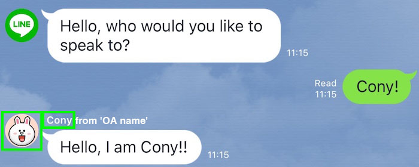
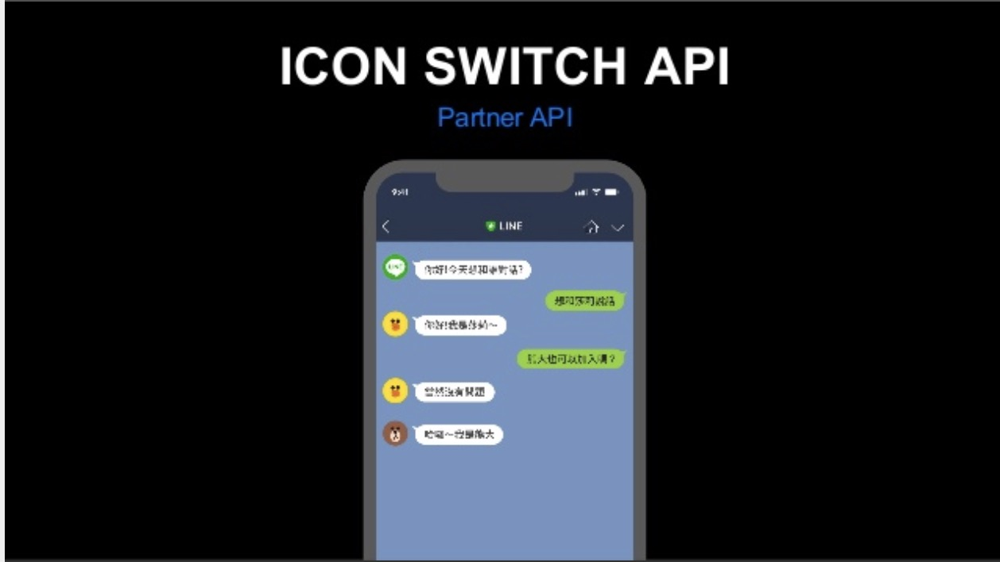
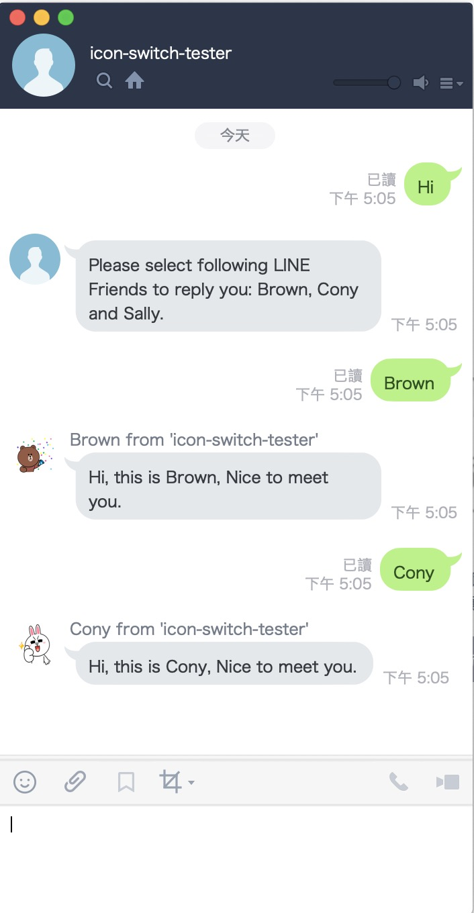

(圖片來自: [LINE Developer News](https://developers.line.biz/zh-hant/news/2020/03/17/icon-nickname-switch/) )


# 前言



曾經在 [TECHPULSE 2018 的演講](https://www.slideshare.net/linecorp/line-platform-api-update-chatbot)上有出現過的 Icon Switch 功能，當時受到相當多開發者的詢問。但是由於當時 Icon Switch API 仍然算是 Partner API (指的是需要透過跟 LINE 申請合作的開發廠商，才能使用的功能)，所以能使用的開發者並不多。

很開心的這樣的功能總算開放給所有的開發者來使用，本篇文章就是透過一個簡單的範例來讓開發者們了解該如何使用這樣的功能。


# 範例程式碼

#### [https://github.com/kkdai/line-bot-icon-switch](https://github.com/kkdai/line-bot-icon-switch)


# 如何部署範例程式碼:

- 到 [LINE Developer Console](https://developers.line.biz/console/) 建立相關的 Provider 跟 Channel

- 到 [LINE Developer Console](https://developers.line.biz/console) 建立一個 LINE Messaging API Channel 並且打開 Message API 的功能，並且將以下兩個資訊記住:

  - Channel Secret
  - Channel Token

- 到 [https://github.com/kkdai/line-bot-icon-switch](https://github.com/kkdai/line-bot-icon-switch)  按下  Heroku Deploy ，建立該帳號並且部署該服務。這時候會要輸入三個資訊:

  - CHANNEL_SECRET
  - CHANNEL_TOKEN

- 記得把 `https://test-api-1234.herokuapp.com/callback` 加到 LINE chatbot web hook 才能正確地啟動聊天機器人。


# 實際跑一個範例 (demo)

- 先 Deploy  該範例專案，或是直接加入測試機器人 @656gvdsu (也可以掃描以下 QR Code)

  

- 輸入任何字，聊天機器人會提示你要可以選擇回覆的人「Brown」，「Cony」或是 「Sally」。

- 輸入「Brown」，「Cony」或是 「Sally」 就會看到機器人更換他的圖示與暱稱來回覆你。



# 程式碼解釋

(註：  相關程式碼展示透過 Go)

```
{
    "type": "text",
    "text": "Hello, I am Cony!!",
    "sender": {
        "name": "Cony",
        "iconUrl": "https://line.me/conyprof"
    }
}
```

這段由 [Icon Switch 的文件](https://developers.line.biz/zh-hant/reference/messaging-api/#icon-nickname-switch)上面擷取的範例，可以了解 Message Object 新增了一個 `sendeer` 的物件，裡面包含了兩個資料:

- `name`:  修改的暱稱，但是請注意“避免混淆使用者”，所以全名會是 `"暱稱 from OA 名稱"` 這樣的全名顯示方式，可以確定發言的是官方帳號（不是某個真人），不容易讓使用者混淆。
- `iconUrl`: 圖示的修改，圖片的來源必須是 HTTPS 。

### 找出 LINE Friends 的圖示

<script src="https://gist.github.com/kkdai/11001a7d0784c619688f1d618143e574.js"></script>


相關的圖示來源可以參考這個 [LINE Sticker 文件]( https://developers.line.biz/media/messaging-api/sticker_list.pdf) ，在這份文件可以找出公開且免費使用的貼圖（請注意，除了這些開放的，其他都需要驗證與購買才能在 LINE 視窗內看到)。

### 發送修改暱稱

<script src="https://gist.github.com/kkdai/4bc54cfe0557adc35ce21008c2e224ee.js"></script>

這段範例程式碼該如何如何使用 Icon Switch 的功能，最重要的就是以下這段:

```
linebot.NewTextMessage("Hi, this is "+message.Text+", Nice to meet you.").WithSender(sendr)
```

也就是每次送訊息得時候，需要指定發送者的相關資訊 `WithSender()` 即可。


# 如何使用 Icon Switch 來推廣你的官方帳號

接下來這邊開始介紹幾個可能很適合使用 Icon Switch 功能的應用場景。

### 客服業可以透過 Icon Swtich 讓使用者有更好體驗

比如說銀行的客服官方帳號，可以如果使用者在聊天過程中希望有「真人客服」可以幫忙協助的話，可以透過 Icon Switch 來切換圖示代表轉換到真人客服。


### LINE 官方帳號活動或遊戲透過 Icon Switch

有一些人透過 LINE Bot 來玩一些網路遊戲的想法，透過 Icon Switch 可以讓使用者更容易了解跟誰在對談。或是這時候是的遊戲狀況。

比如說： 狼人殺類型遊戲，桌遊等等相關類型。

此外，透過 Icon Switch 也可以來做一些活動公告，讓使用這更有親切的感覺：

- 透過嫦娥來發送中秋節優惠
- 透過年獸來發送過年活動訊息


# 總結

Icon Switch 是一個免費，並且可以讓使用者相當有感的功能。希望開發者們能夠一起來發揮創意，來開發出有創意的 LINE Bot 吧。

『Create WoW for the world!」


# 參考

- [https://developers.line.biz/zh-hant/reference/messaging-api/#icon-nickname-switch](https://developers.line.biz/zh-hant/reference/messaging-api/#icon-nickname-switch)
- [2020/03/17 New: Icon and display name for LINE Official Account can be changed](https://developers.line.biz/zh-hant/news/2020/03/17/icon-nickname-switch/)
