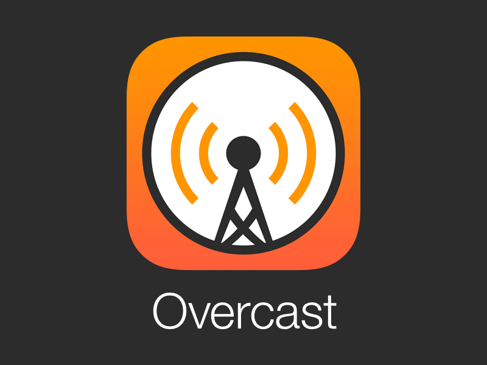

## 前言:

聽 Podcast 大概是我好幾年的興趣之一，除了可以幫助我在通勤的開車時間學習一些新的事物。最近有一些有趣的議題也會讓我在通勤開車時間笑個不停。

但是最近發現 iOS 內建的 Podcast  實在沒那麼好用，加上 MacOSX 的版本（說好不提 iTunes) 更是不好用。只好看看有沒有其他的 Podcast 軟體可以更換。

## 最近換了 Podcast 的軟體: Overcast

<blockquote class="twitter-tweet">
自從我發現其他 podcast app 之後就再也沒用過 Apple 自帶的了 <a href="https://t.co/pJrdLUYmIw">https://t.co/pJrdLUYmIw</a>
&mdash; Nelson (@NelsonT) <a href="https://twitter.com/NelsonT/status/1244460877710909440?ref_src=twsrc%5Etfw">March 30, 2020</a></blockquote> 

主要是因為這個 [tweet](https://twitter.com/NelsonT/status/1244544543430606848) 的討論，讓我知道了 [Overcast](https://overcast.fm/podcasts) 的功能（已知用火？）。裡面有兩個功能我蠻推薦的：

- **Smart speed:** 自動移除掉靜音的部分，讓整個播放速度會智慧的調整。
- **Voice Boost:**  聲音也會變大聲一點，試了幾天下來蠻清楚的。

比較一下跟 iOS 內建的 Podcast 比較：

-  [Overcast](https://overcast.fm/podcasts)  也是可以在網路上聆聽，讓你在 MacOS 上面也是可以同步目前的聽的狀況。
- iOS Podcast 的 short note 顯示有被人強力的批評，完全不依照原來的格式。
- iOS 會自動全部下載最新的， [Overcast](https://overcast.fm/podcasts)   預設下載最新的，需要更大空間需要付費會員。

## 推薦的 Podcast

其實來聽 Podcast 最大的問題應該是「如何尋求喜歡的頻道？」 ，這個其實蠻推薦可以試試看 [Castbox](https://castbox.fm/) 。裡面有不少的推薦頻道。

#### 國外推薦 Podcast

- [Go time](https://changelog.com/gotime): 關於 Golang 的矽谷 Podcast ，有許多資深或是很厲害工程師採訪。
- [Google Cloud Platform podcast](https://www.gcppodcast.com/): 主要內容是 GCP 推廣，但是不少有用的內容
- [Kubernetes Podcast from Google](https://kubernetespodcast.com/):  K8S 官方 Podcast 有近期相關新聞跟一些功能介紹與採訪。

#### 國內推薦 Podcast

- [頂樓加蓋](https://podcast.overbuild.io/):  由 Affe 跟 Denny 兩人組成的 podcast ，有很多有趣的內容。也很好笑。
- [weak self](https://weakself.dev/):  三個 iOS 工程師的內容，也有一些動森跟其他工程師會聊的，蠻有趣的。
- [冒牌者症候群の下班時間](https://baduhuang.xyz/category/podcast/):由 Badu Huang 開台的內容，內容也蠻多元的。30 歲，結婚生子或是換領域都有。
- [三宅一聲](https://open.spotify.com/show/1Jaz5B07uwv6NkjPLUJZX9)： 三位業界 KOL 經營的內容，可以聽聽。

## **Reference:**

- [為什麼你應該從今天開始收聽Podcast？](https://weilincheng.com/2020/01/05/why-podcast/)
- [收聽 Podcast 的正確姿勢：8 個絕佳 app 推薦](https://medium.com/starrocket/for-those-podcast-lovers-we-recommend-these-8-apps-bf67d44c6919)
- [Castbox App](https://castbox.fm/)