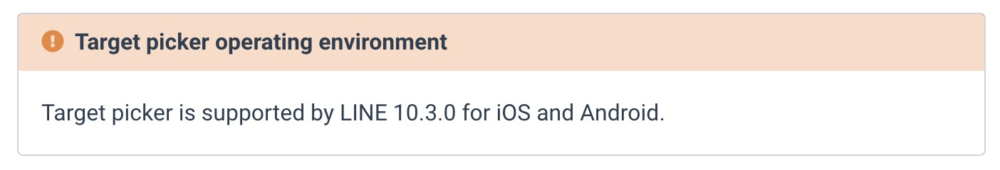

<iframe width="560" height="315" src="https://www.youtube.com/embed/0T2bdndARdo" frameborder="0" allow="accelerometer; autoplay; encrypted-media; gyroscope; picture-in-picture" allowfullscreen></iframe>

([LIFF ShareTargetPickder](https://developers.line.biz/en/reference/liff/#share-target-picker) 功能展示)

## 前言

[LIFF ShareTargetPickder](https://developers.line.biz/en/reference/liff/#share-target-picker) 是一個相當強大的功能，不僅僅可以在 LINE 裡面讓使用者更方便地分享資訊給好朋友，更可以讓使用者透過外部瀏覽器來分享資訊給好朋友或是聊天群組。

但是這樣的功能在 LINE 上面的支援程度必須要再 10.3.0 之後的版本才能支援，如果使用者的手機 LINE App 版本不是更新到最新版本的話。那麼有可能無法正常執行這個功能。

今天這篇文章就要介紹一個新的 API 功能 `liff.isApiAvailable()` 功能，如何透過這個 API 讓各位新的 [LIFF ShareTargetPickder](https://developers.line.biz/en/reference/liff/#share-target-picker)  可以在使用舊版本 LINE 的使用者上運行，並且提供給各位一段範例程式碼與展示的影片。

## 範例程式碼

#### [https://github.com/kkdai/liff-template-go](https://github.com/kkdai/liff-template-go)

## 實際跑一個範例 (demo)

開啟這個 LIFF App 

如果你是在 iOS 手機並且透過舊版本的LINE App (<10.2.0) 中打開，你會出現一個警告訊息，並且幫你打開外在瀏覽器來開啟這個 LIFF 網址。

 可以看以下影片的展示：

<iframe width="560" height="315" src="https://www.youtube.com/embed/73ip6gSJ3Zo" frameborder="0" allow="accelerometer; autoplay; encrypted-media; gyroscope; picture-in-picture" allowfullscreen></iframe>

## 程式碼解釋

(完整程式碼可以查看： [https://github.com/kkdai/liff-template-go/blob/master/liff.html]( https://github.com/kkdai/liff-template-go/blob/master/liff.html))

這邊做一些簡單的解釋：

- `if (liff.isApiAvailable('shareTargetPicker'))` 透過這個方式來檢查目前是否支援這個 API

  - 如果在 LINE App 呼叫，會根據不同 LINE App 回覆不同回答：	
    - 版本小於 10.3.0 回傳 False.
    - 版本大於或是等於 10.3.0 會回傳 True.
  - 如果是在外部瀏覽器呼叫，將會永遠回傳 True.

- 如果版本不支援，直接往 `13` 跑，首先先跑出警告視窗顯示： "你的 LINE App 暫時不支援 Share Target Picker ，將開始外部瀏覽器。" 

- 然後透過 `liff.openWindow` 來開啟外部瀏覽器（透過 `external: true` ），讓使用者透過別的方式來使用這個功能。

  

## 總結

透過  `liff.isApiAvailable()  ` 可以讓需要使用 [LIFF ShareTargetPickder](https://developers.line.biz/en/reference/liff/#share-target-picker) 的開發者，讓有一些使用者也能夠正常的體驗  [LIFF ShareTargetPickder](https://developers.line.biz/en/reference/liff/#share-target-picker)  的威力。

但是隨著 LIFF 的功能逐漸增加，或許以後也會有更多令人驚喜的功能，讓我們一起期待吧？

## 參考

- [https://github.com/kkdai/liff-template-go](https://github.com/kkdai/liff-template-go)
- [LIFF  ShareTargetPickder API Reference](https://developers.line.biz/en/reference/liff/#share-target-picker) 

