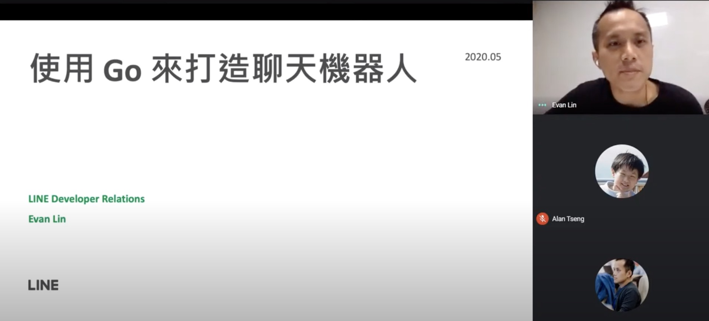

# 前言

大家好，我是 LINE Taiwan 的 Technical Evangelist - Evan Lin。 感謝 DSC (Google Developer Student Clubs) 的邀請，在線上給予學生們基本的課程。 內容將有 Golang 的基本介紹，並且透過打造一個簡單的 LINE Bot 來跟各位展示 Golang 的一些優點。

這次有來自於四間大學(中興大學，台北大學，臺北科技大學以及銘傳大學)的 DSC 社團同學 ，全程也開放網路直播，希望可以讓更多對於 LINE Bot 有興趣的初學者一個良好的教材。

# Build LINE Bot with Go / 資深開發技術推廣工程師 Evan Lin

<iframe width="560" height="315" src="https://www.youtube.com/embed/60icDO767G8" frameborder="0" allow="accelerometer; autoplay; encrypted-media; gyroscope; picture-in-picture" allowfullscreen></iframe>

#### [投影片](https://speakerdeck.com/line_developers_tw/build-line-bot-with-go)

這一次分享的投影片，主軸分成三個：

### 為什麼我會學習 Golang ，什麼是 Golang

經過了十年在多媒體外商軟體公司的工作之後，為了學習新的 Web 程式語言進而嘗試了不少的程式語言之後，最後選擇了 Golang 來鑽研。並且為了深入的學習 Golang ，而啟動了 [Project 52](https://github.com/kkdai/project52) 來作為學習 Golang 的方式，也因此學習了不少的演算法與進階的資料格式的應用方式。

這裡也介紹了一些 Golang 的基本優點：

- **Gofmt / goimport：** 幫助你可以讓你的程式碼風格一致並且避免遺漏某一些需要使用的套件。
- **Go test：** 幫助你快速準備好測試的方式，撰寫測試程式碼再也不困難。並且可以相當快速的做好效能調校的工作。
- **GoDoc：**做文件一直是讓開發人員很困擾的事情，不是因為開發人員不願意寫。往往是輸出到文件需要有一些相關的轉換，或是需要許多額外的資料在程式碼之中。 使用 `GoDoc` 只要開發者的程式碼已經寫好了，就可以直接在網路上找到（舉例： [https://pkg.go.dev/github.com/line/line-bot-sdk-go/linebot](https://pkg.go.dev/github.com/line/line-bot-sdk-go/linebot)  就是直接將 [https://github.com/line/line-bot-sdk-go/linebot](https://github.com/line/line-bot-sdk-go/linebot) 轉換成文件的網站。
- **GoRoutine：**做 multiple routine programming 在許多語言其實都有一些困難跟繁瑣。除了多線程模型本身就需要有相當多需要注意的東西之外，要建置這樣的所需的程式碼其實也很複雜。使用 `goroutine` 相當的輕量，並且相當的容易。開發者可以把心力全部放在如何處理多線程的相關控制上。

#### 如何學習 Golang ： 

由於這次主要的聽眾都還是大學的學生（部分還是大一的學生），所以許多的操作範例都是直接在 Golang Playground 來進行操作。可以省去許多程式初學者經常遇到的環境設置的問題。

- [Golang Playground](https://play.golang.org/)

同時也建議初學者可以把出現問題的程式碼透過 [Golang Playground](https://play.golang.org/) 來，分享出來在各種社群媒體來詢問。這樣一來也容易察覺問題與解決問題。

同時也建議同學們可以透過 [Golang Tour](https://tour.golang.org/list) 來一步一步的學習相關的知識，每一頁都有程式碼可以使用，可以線上編輯與執行。也可以透過邊練習，邊了解的方式更快速能夠加深印象。

### 什麼是 LINE Bot ，如何透過 Golang 快速打造出一個 LINE Bot

### 如何成為 Golang Expert

最後因為分享 Golang 與 [Project 52](https://github.com/kkdai/project52) 的原因，因為參與了不少的社群活動與研討會，變成了 Golang Taipei 的主辦人之一，透過持續的分享與社群的經營，我才有幸能夠到 LINE 從事 Developer Relations 的工作與變成了 Go GDE  。 在此也跟大家分享如何成為 GDE 的小秘訣。

# 相關鏈結:

- [GMOM- Go Slide Template - 10th Birthday](https://docs.google.com/presentation/d/1R41dUVJXD4KF5TchbXk2qypg422HTvMvwsYHj72Hl7o/edit?usp=sharing)
- [Go 10 years - Draft Timeline v.0.1](https://docs.google.com/document/d/1Ap_Xhwtwq69ofDBGf1PqEKkhSMOVExrSvxZpUfa9iys/edit?usp=sharing)
- [Golang Playground](https://play.golang.org/)
- [Golang Tour](https://tour.golang.org/list) 

## 活動小結

很開心跟學生們分享 Golang 與 LINE Bot 的結合，記得上一次講到相關的介紹內容的時候，已經是四年前的事情了。 所以許多的素材與原始碼都需要相當程度的翻新。 所以

立即加入「LINE開發者官方社群」官方帳號，就能收到第一手Meetup活動，或與開發者計畫有關的最新消息的推播通知。▼

「LINE開發者官方社群」官方帳號ID：[@line_tw_dev](https://lin.ee/s5RsZHo)

## 關於「LINE開發社群計畫」

LINE今年年初在台灣啟動「LINE開發社群計畫」，將長期投入人力與資源在台灣舉辦對內對外、線上線下的開發者社群聚會、徵才日、開發者大會等，已經舉辦30場以上的活動。歡迎讀者們能夠持續回來察看最新的狀況。詳情請看:

- [2019 年LINE 開發社群計畫活動時程表](https://engineering.linecorp.com/zh-hant/blog/line-taiwan-developer-relations-2019-plan/)
- [LINE Taiwan Developer Relations 2019 回顧與 2019 開發社群計畫報告](https://engineering.linecorp.com/zh-hant/blog/line-taiwan-developer-relations-2019/)
- [2020 年LINE 開發社群計畫活動時程表](https://engineering.linecorp.com/zh-hant/blog/2020-line-tw-devrel/)

