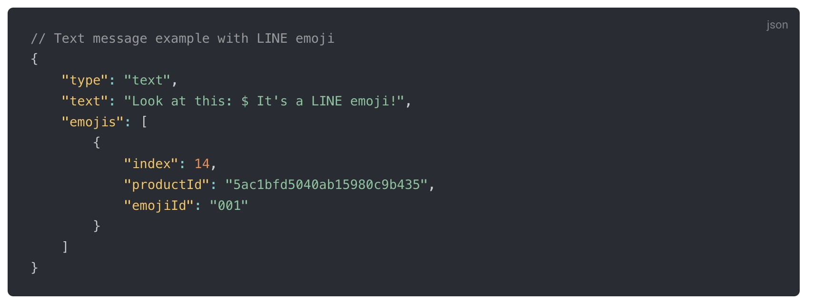
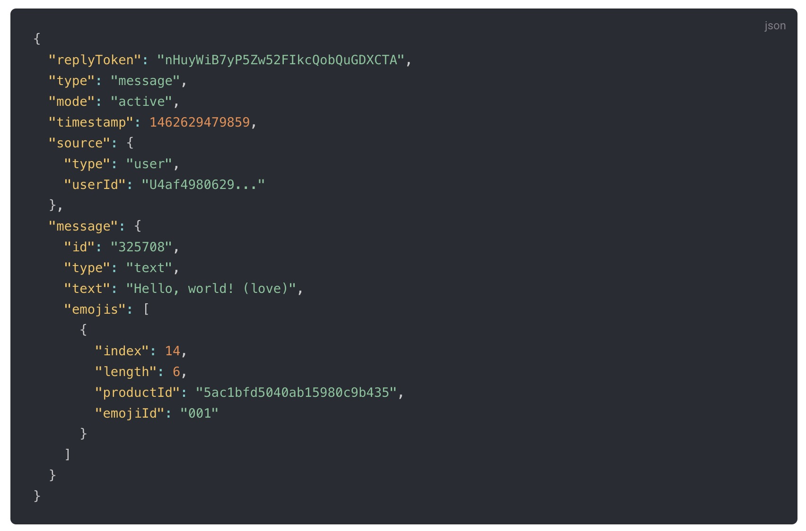
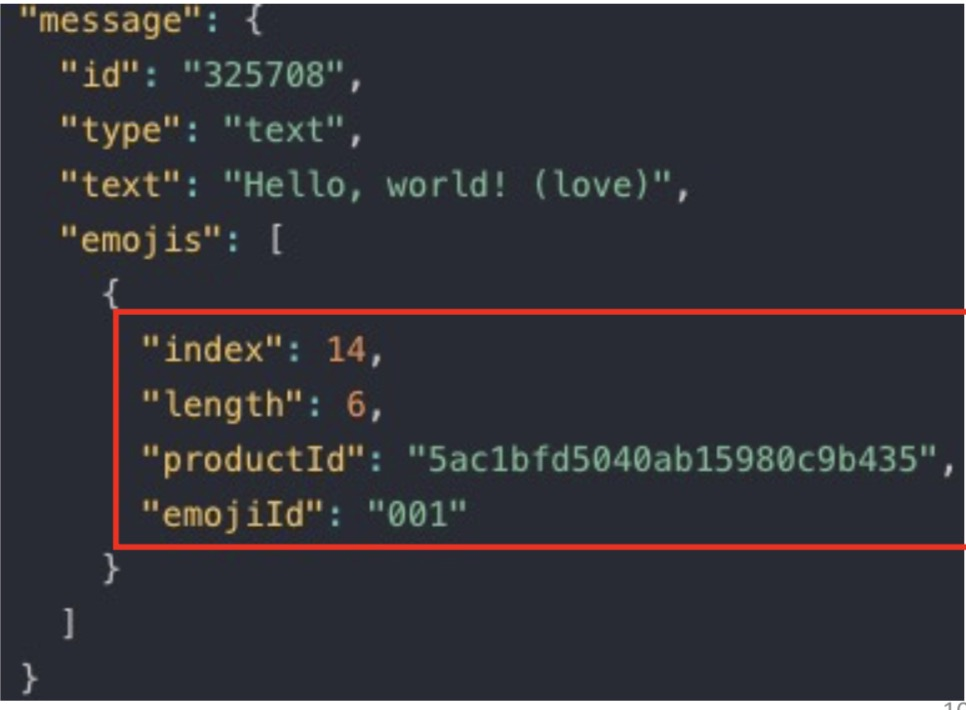
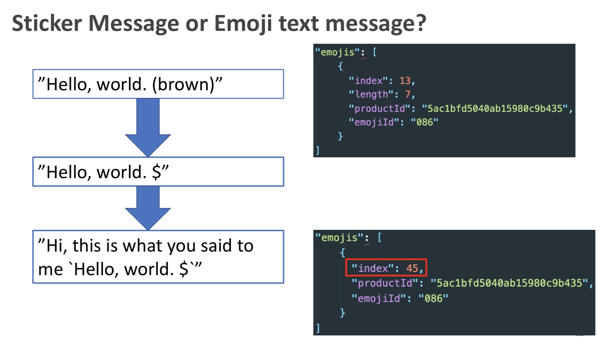

## 前言

LINE Emoji 是指在 LINE App 中可以使用的 LINE 表情集，其中有分為通用的（免費）與付費的表情集。 使用 LINE Emoji 在訊息當中可以讓使用者閱讀的時候更有感覺。 但是身為開發者該如何正確地發送與接受處理這些 LINE Emoji 呢？

這一篇文章將透過 Golang 的範例程式碼，指引該如何正確地發送與接受 LINE 表情集 (LINE Emoji) 。

## 範例程式碼

#### [https://github.com/kkdai/linebot-emoji](https://github.com/kkdai/linebot-emoji)

## 實際跑一個範例 (demo)

- 加入這個官方帳號：

- 隨便傳送一個表情符號，會看到聊天機器人用三種方式回覆你。 分別是：	
  - 舊的 Emoji 傳遞方式來發送
  - 新的 Emoji 傳遞方式來發送
  - 加上使用者的 Emoji 並且透過新的 Emoji 來發送

## 新的 API 說明:

### Use LINE emoji in messages (2020/April)

現在開始要在文字訊息裡面發送 LINE emoji 不需要自行做 unicode 轉換。可以直接在 API 中加上相關的 LINE emoji 編號就可以達成了，開發上變得更方便，也更有彈性。

可以參考新的 API :  [Text message](https://developers.line.biz/en/reference/messaging-api/#text-message) 或是參考新的公告：[[Updated\] Messaging API update for April 2020](https://developers.line.biz/en/news/2020/04/14/messaging-api-update-april-2020/)

### Getting LINE emoji information from the text object of a webhook event (2020/May)

在四月提供了新的發送 API 之後，五月的 Webhook 也提供了新的 Webhook 資訊可以讓聊天機器人有效的處理 LINE Emoji 。  透過 `emojis` 可以取得所有訊息中出現的 LINE Emoji 詳細資訊如下：

可以參考新的 API :  [Text message webhook](https://developers.line.biz/en/reference/messaging-api/#wh-text) 或是參考新的公告：[Messaging API update for May 2020](https://developers.line.biz/en/news/2020/05/12/messaging-api-update-may-2020/)。

## 使用 Golang 開發一個 LINE Emoji Echo Bot:

接下來的會使用 Golang ，根據 [https://github.com/line/line-bot-sdk-go]( https://github.com/line/line-bot-sdk-go) 提供的功能來開發 Echo Bot 。也就是一個會依照使用者講的文字來回覆的聊天機器人。 但是不同於一般 Echo Chatbot ，這個 Echo Bot 將會回傳使用者傳過來的 LINE Emoji ，所以需要具有以下幾個功能：

- 擷取 Webhook text Message 中的 `emojis` 資訊 。
- 將原先文字中的 `(xxx)` (作為表示表情符號的意思，舉例來說 (heart) 是愛心)，替換成 `$`。
- 組合需要回覆使用者的文字與表情，需要注意的事情有兩件：
  - 將使用者回覆的文字加上 `emoji` 資訊，裡面需要注意，相關的 `index` 資訊需要調整。
  - 傳送 `emoji` 前要注意，是否是存在於`可發送的表情清單(sendable LINE Emoji list)`。 由於某一些表情包是需要付費的，只有免費且是 LINE 官方提供使用的可以透過聊天機器人來傳送。 詳情請看： [LINE Sendable LINE Emoji List](https://d.line-scdn.net/r/devcenter/sendable_line_emoji_list.pdf) 。

接下來將透過原始碼的說明來解釋相關的流程：

### 擷取 Webhook text Message 中的 `emojis` 資訊 :

收到 text message 的 webhook 之後，會多了一個資料可以讀取 `msg.Emojis` 的 array structure 。 每一格資料可能是類似一下的資料格式：

根據以上收到的資料可以發現以下資訊：

- `text`: 為 `Hello, world! (love)`，其中 Emoji 也會轉成文字在原先的 text 之中為 `(love)`。
- `emojis`: 為出現的所有 Emoji ，並且提供起始的 `index` 跟 `length` 。其中 `index` 為 zero-based ， `length` 包括了 `()`。

根據以上的資訊，如果你需要將表情符號去掉來做 Language Understanding (語意分析)的話。需要透過以下步驟：

- `Hello, world! (love)` 參考 `Emojis` 資料將 `(love)`去除，並且重新組合為  `Hello, world!`。

### 透過新的 LINE Emoji API 來發送表情符號：

根據以上的範例程式碼，可以知道要發送的資料格式如下：

- `text`: `"$%s 你好 \n , 這是新的傳送 Emoji 的方式。"` 其中 `$` 為你要傳 LINE Emoji 的位子，而 `%s` 是要跟使用者傳來的訊息組合成的訊息。
- `AddEmoji`: 就是你要傳遞的 LINE Emoji ，其中有 `ProductID` 與 `EmojiID` 需要去 [LINE Sendable LINE Emoji List](https://d.line-scdn.net/r/devcenter/sendable_line_emoji_list.pdf) 查詢。 本段範例為 熊大的範例 (`ProdctID=5ac1bfd5040ab15980c9b435`, `EmojiID=086`)

根據這樣的方式所完成的 Echo Bot 只能夠完整的傳遞使用者的文字，但是使用者傳送的 LINE Emoji 無法正確被顯示。 （會顯示為 `(love)` 或是 `(heart)` ）。

### 完整回傳使用者傳來的 LINE Emoji 訊息

那麼要如何完整的回傳呢？ 需要透過以下三個大步驟：

- 讀取原先使用者傳來問自訊息，並且開始解析 LINE Emoji
- 將原先有 `(brown)` 的訊息，替換成 `$` 。作為之後需要傳送的時候使用。
- 將原先使用者傳送的文字，夾帶成聊天機器人要傳送的文字之中。並且將 `Emojis` ˋ中所有的 `index `做位置上的修改（ `index`的位置因為機器人一些其他文字而改變)。

接下來，會稍微分享一下相關的轉換方式：

這部分主要功用是將使用者傳來具有 LINE Emoji 的訊息，轉換為 `$` 。 (e.g. `Hello, world! (love)` --> `Hello, world! $`) 。  裡面主要用到字串的拆解方式，也就是 `string(msgArray[:index]), "$", string(msgArray[index+v.Length:]` 來拆解文字並且重新組合。

#### 撰寫相關文字轉換的測試案例：

因為可能會遇到的種類相當的多（e.g. `hi`, `_(brown)_`, `yo (love) (love)` )，所以為了怕可能遇到的問題。我們也準備好相當多的測試程式碼。在此先附上部分的，完整的測試範例建議到 [https://github.com/kkdai/LineBot-emoji/blob/master/tool_test.go]( https://github.com/kkdai/LineBot-emoji/blob/master/tool_test.go) 查看。

本段測試程式碼，僅僅對於整段文字裡面出現一個或是沒有的測試案例。 透過撰寫足夠完善的測試案例，可以讓整個 chatbot 的穩定度更好，也不需要透過部署就能夠把一些預先可見的錯誤找出來。

### 檢查是否是“可傳送的表情服務”：

 由於某一些表情包是需要付費的，只有免費且是 LINE 官方提供使用的可以透過聊天機器人來傳送。 詳情請看： [LINE Sendable LINE Emoji List](https://d.line-scdn.net/r/devcenter/sendable_line_emoji_list.pdf) 。

如果傳送非免費的 LINE Emoji 資料給伺服器，則會收到錯誤訊息。所以這段是透過整理出來的資料來做檢查。

### 完整的轉換與檢查流程：

快速講解一下，相關應用程式碼：

- (5) `workMsg := ReplaceEmoji(msg.Text, msg.Emojis)`: 將收到的使用者文字取代為 `$` 。
- (17)`lastLength = lastLength + v.Length`: 這邊值得分享的是計算轉換後的 `$` 位址，需要透過原本 Emoji 的長度來計算出來。 這樣才能算出每一個表情符號取代文字 `$` 應該出現的 `index` 。 

## 總結與展望未來 (Summary and Future Work)

透過 LINE Emoji 的 API ，讓開發者在傳送表情符號的處理上變得更加的直覺與簡單。也讓聊天機器人跟使用者之之間的互動變得更沒有距離。 不過如果需要將使用者傳過來的文字（加上表情符號）回傳回去的話，就需要有許多額外的處理。

之後可能針對這些部分可以有以下的相關處理：

- **自然語言前處理：** 如果想要針對使用者回覆的文字來做語意分析（Language Understanding) 那麼勢必要定義對於 LINE Emoji 的處理方式。開發者可以選擇全部忽略，或是將其放入分析器中。
- **針對表情符號來互動：** 使用者會使用表情符號，都會是有相對意義的。某些狀況下，可以透過表情符號（emoji) 來判斷使用者的情緒。 這也是一門相當大的學問才是。

## 參考

- [https://developers.line.biz/en/news/2020/05/12/messaging-api-update-may-2020/](https://developers.line.biz/en/news/2020/05/12/messaging-api-update-may-2020/)
- [https://developers.line.biz/en/news/2020/04/14/messaging-api-update-april-2020/](https://developers.line.biz/en/news/2020/04/14/messaging-api-update-april-2020/)
- [https://developers.line.biz/en/reference/messaging-api/#text-message](https://developers.line.biz/en/reference/messaging-api/#text-message)
- [https://github.com/kkdai/linebot-emoji](https://github.com/kkdai/linebot-emoji)
