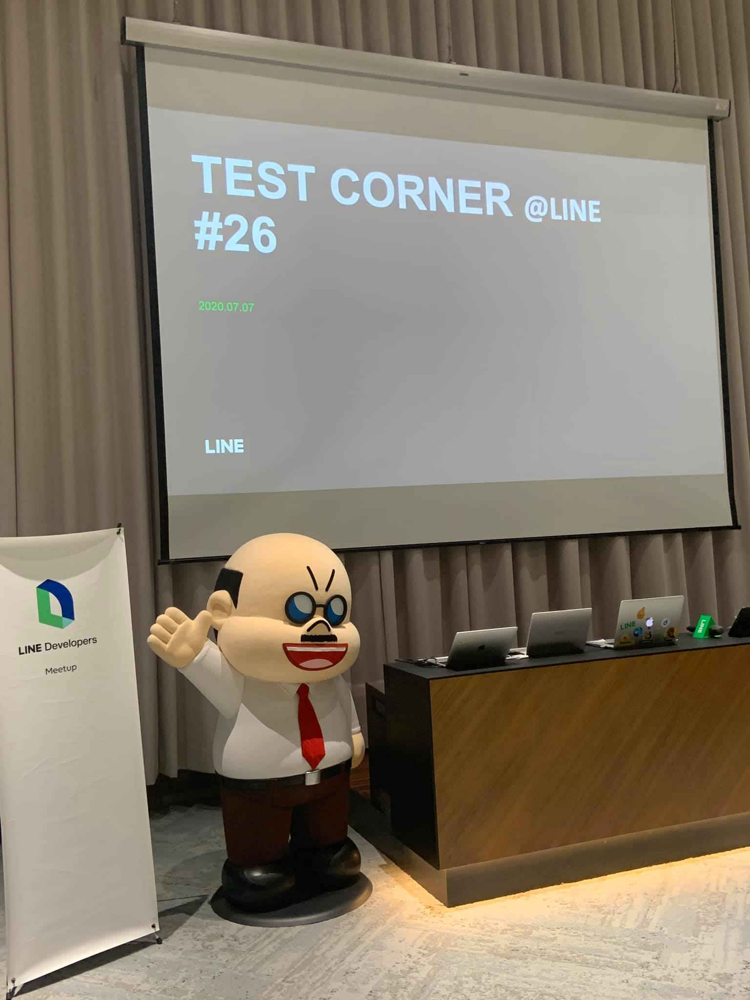

大家好，我是 LINE Tech Evangelist - Evan Lin 。LINE 致力於舉辦對內的技術交流、教育訓練，以及對外的社群聚會、校園演講、開發者徵才日與開發者大會等各式各樣的活動。我們希望創造更多技術分享與跨國交流的機會，同時持續招募優秀人才加入 LINE 台灣開發工程團隊! 

今晚我參加了充滿創新精神的 Test Corner meetup，和與會者一起探索測試的奧義，本次聚會的各種巧思令人耳目一新，充滿社群活力的氛圍更讓我跟著熱血起來，一起來感受本次聚會的魅力吧!

KKTIX 活動網頁: [活動網址](https://testcorner.kktix.cc/events/testcorner26)

今晚的 Test Corner meetup 特別由甜美可愛的主持人 – Sherry 幽默（很像是空姐幫各位展示周遭環境）的開場，他也介紹了什麼事 LINE TECH FRESH 校園新星人才計劃。什麼是 LINE TECH FRESH ? LINE 台灣工程團隊每年透過 [LINE TECH FRESH – 技術新星人才計劃](https://career.linecorp.com/linecorp/career/detail/20000111/704/5570?classId=&locationCd=TW&page=)，招募資訊科技相關科系，或對此領域有所涉略的大學生 / 研究生加入 LINE 團隊進行長期實習 (一年期)，讓同學們能在國際級科技公司中觀摩學習。

更多內容，可以參考這篇文章： [LINE TECH FRESH – 技術新星人才計劃，實習經驗大公開](https://engineering.linecorp.com/zh-hant/blog/tech-fresh-2020/)

## **LINE SPOT 口罩地圖 - Vince Chen**

LINE SPOT 是串接實體商家與生活服務的平台，讓使用者可秒查所在地點附近的優惠與服務。而 LINE SPOT 便是把這些服務放在一起、深化線上/線下生態圈的連結。而如此便利的服務，在開發過程中自然也面臨不少挑戰，包括整合眾多不同的服務、頻繁的搬移服務，以及支援系統的大流量。

而身為 Automation Engineer 在這個團隊的主要工作內容分為 (1) API 的驗證，確認資料的正確性。  (2) 系統的效能調校與優化。 

口罩地圖當初上線的時候的流量，比起當初預想中的超過了 30 倍以上。那麼 LINE SPOT 的要如何做類似的相關測試呢？

首先 LINE SPOT 團隊透過 k6.io 這套工具，搭配著 Jenkins pipeline 的流程。 每次有修改上線後，就會部署到測試機器，並且透過 k6.io 來做 load testing 跟 performance testing 。 每次結果都會預設丟到 InfluxDB 儲存，透過 Grafana 可以視覺化整個測試的效能報告。 讓測試人員與開發人員可以一目了然整個結果。

當然，為了這麼大的流量，整個服務也做了不少的效能調校的部分。 

- 針對 API Gateway 有 Query Efficiency check ，檢查每個呼叫是正確並且確保查詢效能。
- 針對 ElasticSearch 更有 Connection Pool Tuning ，對於查詢的資源使用也更有保障（不會過分開查詢連線）。
- 也有針對 API Gateway 做 cache 與 call monitor 來監控是否效能有受到影響。

### Lesson learned from 口罩地圖

LINE SPOT 團隊在經歷了開發與營運「口罩地圖」的相關功能後，學習到以下的相關事項：

- 監控與效能管理對於 Micro-services 是相當的重要
- 隨時要關心效能優化與調整過後的變化
- 透過一些客製化小工具可以讓團隊在經營與管理上更加的方便。

## **LINE 訊息查證 - Hank Chen and Johnson Wu**

本段分享由 Hank Chen 與 Johnson Wu 所帶來，分成兩個部分，第一個部分為 Hank 帶來的 LINE 訊息查證的測試流程與如何做好 Test content 與 Test Case。 
第二部分則由 Johnson Wu 所帶來的訊息查證的資料處理的流程與資料處理平臺。

### 第一部分： LINE 訊息查證的測試流程

開發出「LINE 訊息查證」平台服務。「LINE 訊息查證」平台在去年七月份正式上線，不僅有官方網站，更串聯 LINE 官方帳號，用戶只需把在聊天室中收到的訊息「轉傳」至「LINE 訊息查證」官方帳號。如過去已有查核報導在資料庫中，查證小幫手會自動判斷其真偽，系統將即時提供查證結果；如訊息尚未查核，將提報給專業查核單位，待釐清後再盡快回傳正確資訊給予用戶，提供最即時的訊息辨別服務，協助用戶辨識可疑訊息真偽，降低假訊息再次散播的機會。

而訊息查證的 Agile 的測試流程如下：

- Planning Refinement:
- Acceptance Criteria:
- Functional Test:
- Regression Test:
- Exploratory Test:
- Release Retrospective:

整個 Agile 流程中，每天都有 15 分鐘的 standup meeting 確保專案的成員都能在相同的共識下開始工作。

而針對偵測內容的建立（Test Case 建立)，目標是希望流程清楚，並且敘述清楚。可以具有相同技能的同仁能夠快速接續繼續測試。 整體測試平台分為手動測試與自動測試，其中自動測試使用的是 Postman 平台。

#### CICD 發布流程:

使用 Drone 跟 git 接續，一有相關的 code submit 之後，就會透過 argo 來部署到 Kubernetes 上面。

#### 訊息查證小幫手新功能

- 可以查詢有問題的官方帳號
- 可以快速查核有問題的網址

有興趣的讀者，歡迎加入 LINE 訊息查證小幫手官方帳號

### 第二部分：「LINE 訊息查證」中如何做資料處理與分析

首先機器學習要如何幫助做訊息查證呢？主要的方式如下:

- 透過近似文章搜尋 (Near-Duplication) 來找出類似的假消息，直接回覆使用者。
- 並且透過文章分類 (Classification) 的方式來將相似的假消息做一個分類。

其中 Near-Duplication 透過就是將收到的訊息與已知的假消息做 Near-Duplication 來計算出兩者是否相似。如果確定相似，或是部分相似。代表著為假消息的機率也會提高。

而完整的流程，會先透過 Ner-Duplication 做比對，來找出可能近似的假消息給使用者確認。 如果確認之後，就會將使用者查詢的消息也歸類在該假消息的類別。

其中整個系統更是包含了管控機器運算模型流程的 mlFlow ， 作為資料處理流程控管的 airFlow 。受到訓練的字串與標記(label) 透過訓練流程，使用 airFlow 排程與訓練的先後順序，再透過 GPU 來加速訓練結果。 透過 mlFlow ，可以將計算好的模型部署到 Predictor Server 作為查詢之用。

最後，講者也分享了相關得專案成果數據：

- 46% 使用者有辨識出假的新聞
- 其中有 33% 使用者是相當主動在檢查
- 更有 25% 會將結果分享給好友

這樣真的才能讓假消息儘早杜絕掉，不要讓你我都成為假消息的幫兇。

## 活動小結

隔了一年又能夠邀請 Test Corner 來到 LINE 辦公室。很開心看到許多學生朋友對於 LINE 的產品測試有高度的興趣。 LINE 秉持著高度自我約束與社會責任的一份子，除了要讓更多使用者可以透過 LINE SPOT 取得最即時與最在地的資訊外，更希望透過「訊息查證」可以讓每一個使用者儘早辨別訊息的真偽，避免成為幫兇。

立即加入「LINE開發者官方社群」官方帳號，就能收到第一手Meetup活動，或與開發者計畫有關的最新消息的推播通知。▼

「LINE開發者官方社群」官方帳號ID：[@line_tw_dev](https://lin.ee/s5RsZHo)

## 關於「LINE開發社群計畫」

LINE今年年初在台灣啟動「LINE開發社群計畫」，將長期投入人力與資源在台灣舉辦對內對外、線上線下的開發者社群聚會、徵才日、開發者大會等，已經舉辦30場以上的活動。歡迎讀者們能夠持續回來察看最新的狀況。詳情請看:

- [2019 年LINE 開發社群計畫活動時程表](https://engineering.linecorp.com/zh-hant/blog/line-taiwan-developer-relations-2019-plan/)
- [LINE Taiwan Developer Relations 2019 回顧與 2019 開發社群計畫報告](https://engineering.linecorp.com/zh-hant/blog/line-taiwan-developer-relations-2019/)
- [2020 年LINE 開發社群計畫活動時程表](https://engineering.linecorp.com/zh-hant/blog/2020-line-tw-devrel/)

### 徵才訊息
《LINE 強力徵才中!》與我們一起 Close the Distance 串聯智慧新世界 >> [詳細職缺訊息](https://career.linecorp.com/linecorp/career/list?classId=&locationCd=TW)
