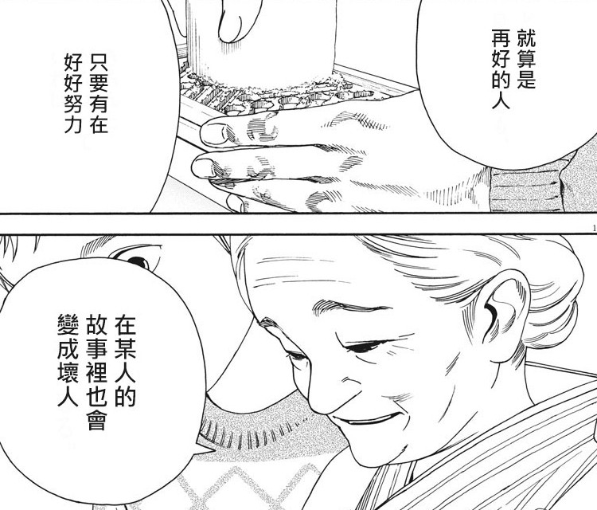

```
改變一生的賽事結束數十年後，強尼和丹尼爾在《小子難纏》系列電影的續作中再次激烈交鋒。
```

(圖片與介紹來自: [NETFLIX 眼鏡蛇道館介紹頁面](https://www.netflix.com/tw/title/81002370))

<iframe width="560" height="315" src="https://www.youtube.com/embed/207l5RBzxtE" frameborder="0" allow="accelerometer; autoplay; encrypted-media; gyroscope; picture-in-picture" allowfullscreen></iframe>

```
就算是再好的人，只要有在好好努力，在某人的故事裡也會變成壞人。
																								【貓之寺的知恩姊】
```

## 劇情簡介：

[小子難纏](https://en.wikipedia.org/wiki/The_Karate_Kid) 是一部發生在 35 年前 (1984) 的電影（我也是很小的時候看重播的 XD) ，裡面身為學校裡面剛搬過來的主角 Daniel ，被學校裡面的風雲人物 Johnny 所欺負， 而 Johnny 就是在眼鏡蛇道館裡面學空手道。 結果 Daniel 認識了日本的空手道師父宮城先生，開始一連串的鍛鍊（洗車，擦玻璃，整理花圃）。一開始 Daniel 還相當生氣，為什麼這些會跟空手道有關係。結果在宮田先生的指導下，這些訓練逐漸發生效果，最後 Daniel 擊敗了當時學校的惡霸 Johnny 也抱得美人歸。

<iframe width="560" height="315" src="https://www.youtube.com/embed/xlnm0NtPoVs" frameborder="0" allow="accelerometer; autoplay; encrypted-media; gyroscope; picture-in-picture" allowfullscreen></iframe>

（當年 1984 Karate Kid 的預告片）

35 年後...  當年金髮碧眼意氣風發的校園風雲人物 Johny 因為在空手道總決賽輸給 Daniel 之後，人生過得相當的悲慘。他自怨自艾，並且也有了一個失敗的婚姻，有了一個失去聯絡的兒子，整天跟酒渾渾噩噩的過日子。  有一天在超商遇到一個可憐的外來移民高中生 Miguel 被小混混欺負，於是使用了以前空手道的功夫教訓了小混混們，並且受到  Miguel 的影響，開始重新開設眼鏡蛇空手道館，想要讓這些被欺負的宅男們保護自己。 

相反的 Daniel 在打敗 Johnny 人生過得相當順遂，開設了汽車行賣車子。並且用空手道作為廣告宣傳獲得相當不錯的業績。 跟高中女友分手後，娶了美女老婆也有可愛的高中女兒 Samantha 跟一個兒子。 劇情就在這裡展開了。


## 令人驚喜的劇情部分

劇情部分就不幫各位暴雷，就先提幾個我覺得劇情裡面很有趣，也是設計巧思的部分分享一下。


#### 好壞並不是絕對

如同敘述的，本部影集的主角是以前的惡霸 Johnny ，而不是 Daniel 。 並且故事中的他也相當的可憐。 就他的說法， Daniel 來了以後，搶了他的女友，並且在決賽打敗他，讓他在學校變得被人嘲笑。整個人生也變得相當的悲慘。

而 Daniel 雖然是電影版的壞人，但是從小受到眼鏡蛇道館欺負的他。看到 Johnny 又開設道館後就反應過度，千方百計阻礙 Johnny 並且透過各種手法打擊他。 （ 484 很像壞人？）

這部影集中， Johnny 想要改邪歸正。逐漸從自我放棄人生中走出來。而 Daniel 過分想要保護家人而顯得有些不擇手段。

於是也讓人想到:  「就算是再好的人，只要有在好好努力，在某人的故事裡也會變成壞人。」 這句台詞。


#### 某些相同的巧合

經過劇情發展， Daniel 跟 Johnny 各自有了新的徒弟，並且在最後比賽碰頭。 並且兩個徒弟都愛上同一個可愛女孩（也就是 Daniel 的女兒 Samantha ) 。 許多影集的劇情也有「致敬」電影版的許多相對應之處，除了感受到設計巧思外，也讓人回顧了時空？


#### 全民女友 - Elisabeth Shue


這時候又發現原來 35 年前的重要角色，兩位男主角爭奪的女主角也是當時的全民女友 [Elisabeth Shue](https://en.wikipedia.org/wiki/Elisabeth_Shue) 。不僅僅有演小子難纏擔任女主角，也是回到未來系列的女主角。當然最近比較讓我了解的就是他也有演 CSI 。


#### 令人懷念的 宮城師傅 (Pat Morita)


[Pat Morita](https://en.wikipedia.org/wiki/Pat_Morita) 也就是在系列電影中的神祕日本宮城師傅，在電影中也講出了許多至理名言。

```
「輸給對手，沒有關係。輸給恐懼，不可以。」
```

本來很好奇宮城師傅怎麼了，裡面也有一集專門紀念他，他本人（演員）也於 2005 年過世了。


## 結語

滿滿的回憶之作，但是裡面有許多故事鋪成算是精心地打造。讓原來的壞人 Johnny 變成了主角，並且深入敘述他內心的轉變。 裡面也不斷的從 Johnny 的角度來看事情的過程。 許多欺負人在他心中可能只是一個小是，但是被當初的主角 Daniel 打敗，搶走女友卻一直無法忘懷。 真的也是呼應到了～  「就算是再好的人，只要有在好好努力，在某人的故事裡也會變成壞人。」。



